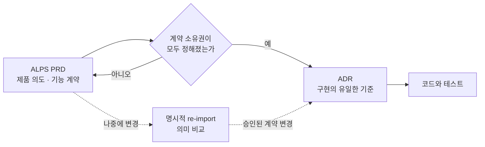
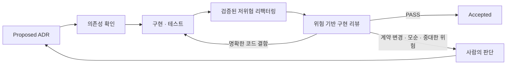

## TL;DR

- ALPS는 handoff 전 제품 의도와 기능 계약을 소유한다.
- 완전한 handoff 뒤에는 ADR만 구현의 기준으로 남는다.
- Agent는 구현과 검증을 닫고 사람은 계약 변경과 예외를 판단한다.

## 시작하며

내 영어 학습 서비스 EncBird에 Office Raid라는 퀴즈 모드를 붙일 때 621줄짜리 PRD를 쓴 적이 있다.

게임 규칙만 쓴 것이 아니었다. 변수 선언, 파일 경로와 12단계 구현 순서까지 적었다.

당시에는 자세할수록 Agent가 실수하지 않을 거라고 생각했다.

그런데 구현하면서 상수를 추출하고 모듈을 나누고 작업 순서가 바뀌자 며칠 만에 PRD가 코드와 어긋났다. 코드를 고친 뒤 문서도 다시 고쳐야 했고, 한 번 놓치면 다음 Agent가 오래된 구현 계획을 읽었다.

반면 ADR에 남긴 한 문장은 오래 유지됐다.

> 많이 공부한 사용자가 오히려 플레이할 수 없게 만드는 방식은 쓰지 않는다.

조회 쿼리와 파일 구조가 바뀌어도 이 요구사항은 그대로였다.

두 문서의 차이는 얼마나 자세히 썼느냐가 아니었다. **코드가 바뀌어도 다시 판단할 기준인지, 현재 구현에만 필요한 설명인지**가 달랐다.

처음에는 이 경험을 PRD, ADR, 코드에 서로 다른 내용을 적는 문제로 생각했다. 지금은 한 단계 더 나아가, **구현을 시작할 때 누가 계약을 소유하는지 분명히 하는 문제**라고 생각한다.

이 기준을 반복해서 적용하려고 만든 도구가 [ALPS Writer Plugins](https://github.com/haandol/alps-writer-plugins)다.[^1] 이 글에서는 현재 구현을 기준으로 ALPS의 계약이 ADR로 넘어가고, Agent가 그 계약을 구현하는 흐름을 정리한다.

## 1. 한 번에 한 레이어만 읽게 만든다

PRD, ADR, 코드는 같은 시스템을 서로 다른 해상도로 설명한다.

| 위치 | 답해야 하는 질문 | 넣지 않는 내용 |
| --- | --- | --- |
| ALPS PRD | 누구의 문제를 어떤 경험으로 풀 것인가 | 파일 경로와 함수 |
| ADR | 구현이 어떤 계약과 경계를 지켜야 하는가 | 교체 가능한 라이브러리와 세부 튜닝값 |
| 코드와 테스트 | 현재 계약을 어떻게 실행하고 검증하는가 | 상위 문서의 설명을 복제한 주석 |

각 레이어는 자기 질문에 혼자 답할 수 있어야 한다.

제품의 범위를 확인하려고 코드를 읽어야 한다면 PRD가 부족하다. 구현 계약을 확인하려고 오래된 PRD와 ADR을 함께 대조해야 한다면 권위가 나뉘어 있다. 함수 이름을 확인하려고 ADR을 읽어야 한다면 구현 세부가 너무 위로 올라갔다.

Office Raid의 PRD가 빨리 낡은 이유도 여기에 있었다. 제품 요구사항과 함께 파일 경로, 변수와 작업 순서를 소유했기 때문에 코드 리팩터링이 곧 PRD 변경이 됐다.

ALPS Writer에는 문서 경계와 함께 계약의 권위를 옮기는 규칙이 있다.

handoff 전에는 ALPS PRD가 제품 의도와 재현 가능한 기능 계약을 소유한다. handoff가 완전히 끝난 뒤에는 ADR이 구현 계약의 유일한 기준이 된다. 코드와 테스트는 그 계약의 현재 실행 결과를 소유한다.

이렇게 권위를 한곳에 두면 Agent도 질문에 맞는 레이어 하나부터 읽을 수 있다.

이 구분은 도메인 규칙을 구현 기술에서 떼어내는 헥사고날 아키텍처의 경계와도 닮아 있다.[^4]

## 2. ALPS는 handoff 전 기능 계약까지 소유한다

PRD를 제품의 가설만 적는 문서로 두면 Agent가 구현 전에 빈칸을 다시 채워야 한다.

현재 ALPS는 제품 맥락과 성공 기준뿐 아니라, 사용자가 관찰할 행동과 오류 처리, 권한, 상태 변화 같은 기능 계약까지 담는다.

형식은 9개 섹션으로 고정되어 있다. Architecture에는 C4 Context와 Container까지만 두고, Feature는 UI에서 API와 데이터까지 이어지는 vertical slice로 작성한다. 각 Feature의 Acceptance Criteria 끝에는 전체 데모에서 무엇을 보여줄지도 남긴다.

이 정도의 구체성은 구현 계획과 다르다.

`응답은 최신순이어야 한다`, `동일 요청은 한 번만 처리한다`, `권한이 없으면 저장하지 않는다`는 구현이 바뀌어도 재현되어야 할 계약이다. 반면 어느 모듈에서 정렬하고 어떤 캐시 라이브러리를 쓸지는 코드가 결정할 내용이다.

ALPS 작성 과정에서도 이 경계를 지키려고 한다.

Agent가 의존 순서에 따라 질문하고, 사람은 섹션별 승인 요약에서 값과 규칙을 확인한다. 기본 승인 단위는 섹션 하나이며, 한꺼번에 받은 요구사항도 Feature별 계약은 따로 확인하고 저장한다.

문서의 길이보다 **handoff할 때 다시 해석하지 않아도 될 만큼 제품과 기능 계약이 분명한가**를 기준으로 삼는다.

## 3. handoff는 복사가 아니라 소유권 이전이다

`/feature-to-adr`는 PRD를 요약해서 ADR 몇 개를 만드는 명령이 아니다.

먼저 PRD의 구현 관련 내용을 네 가지로 분류한다.

- ADR이 계속 소유해야 할 계약과 결정
- Agent가 코드에서 선택할 구현 재량
- 제품을 시작할 때만 필요했던 배경
- 아직 어느 쪽에도 둘 수 없는 미해결 항목

미해결 항목이 남거나 계약 값과 규칙의 소유 ADR을 찾지 못하면 handoff는 끝나지 않는다.

하나의 Feature가 언제나 하나의 ADR이 되는 것도 아니다.

기능 계약 전체를 소유하는 ADR이 최소 하나는 있어야 하지만, 독립적으로 오래 유지할 데이터 경계나 보안 결정이 있다면 여러 ADR로 나눈다. 반대로 라이브러리, SDK, 모듈 배치처럼 교체 가능한 수단은 ADR로 올리지 않는다.

handoff가 완료되면 구현의 권위는 ADR로 완전히 넘어간다.

PRD는 제품을 어떻게 계획했는지 보여주는 legacy planning document로 남지만, 평소의 구현과 리뷰는 PRD를 다시 읽지 않는다. 두 문서가 동시에 현재 계약처럼 동작하면 어느 쪽이 맞는지 매번 사람이 판단해야 하기 때문이다.





handoff 뒤 PRD를 수정해도 ADR이 자동으로 바뀌지는 않는다.

명시적으로 re-import해야 하고, 의미가 같은 변경은 아무 일도 하지 않는다. 새 계약과 변경된 계약은 제안으로 올라가며, PRD에서 항목을 지웠다는 이유만으로 현재 ADR의 계약을 자동으로 약화하지 않는다.

이 제약은 번거롭게 보이지만 의도한 동작이다. 구현의 기준을 옮겼다면, 이전 문서를 고치는 것만으로 현재 계약이 몰래 바뀌어서는 안 된다.

## 4. ADR에는 계약과 오래가는 결정을 남긴다

ADR은 기술 선택의 일기를 넘어 **다음 구현이 지켜야 할 계약의 소유자**가 된다.

EncBird의 사전 기능을 예로 들면 다음처럼 나뉜다.

| ADR이 소유할 내용 | 코드에서 선택할 내용 |
| --- | --- |
| 유효하지 않은 입력을 결정적으로 판정한다 | 판정 함수의 이름과 위치 |
| 동일 입력 재시도에 LLM을 다시 호출하지 않는다 | 캐시 자료구조와 내부 키 형식 |
| 많이 공부한 사용자가 플레이 불가에 빠지지 않는다 | 표현을 조회하는 쿼리 |

외부에 공개된 계약, 저장 데이터의 의미, 보안 경계, consistency model과 장기적인 trade-off는 ADR에 남긴다. 특정 provider나 model, fallback 정책처럼 교체가 시스템 동작을 바꾸는 결정도 마찬가지다.

알고리즘은 이름만 보고 위치를 정할 수 없다.

정렬 결과만 계약이고 알고리즘은 바꿔도 된다면 코드의 선택이다. 반대로 특정 알고리즘의 성질과 trade-off를 장기적으로 채택한 결정이라면 ADR이 소유한다.

수치만 계약인 것도 아니다.

허용 상태, 권한, 처리 순서, 중복 허용 여부, 단위와 실패 보장처럼 숫자가 아닌 규칙도 ADR에 남겨야 한다. 검증 방법은 특정 함수나 테스트 파일이 아니라 외부에서 관찰할 수 있는 증거로 쓴다.

같은 결정이 바뀌었다고 ADR을 계속 추가하지도 않는다. 기존 결정의 질문이 같다면 현재 ADR을 갱신하고 중요한 전환은 `decision-log.md`에 남긴다. 독립된 질문이 생겼을 때만 새 ADR을 만든다.

## 5. 구현과 리뷰는 한 사이클로 닫는다

전체 PRD-first 흐름은 `/alps-init` → `/feature-to-adr` → `/adr-impl` → 자동 리팩터링 → 구현 리뷰 → `Accepted`다.

handoff 이후 `/adr-impl` 안에서는 다음 순서로 진행한다.





`/adr-impl`은 `.mapping.json`에서 선행 ADR을 확인하고 의존 순서대로 구현한다. ADR에 코드 경로를 저장해두는 대신 현재 저장소를 검색해 관련 코드를 찾는다.

테스트가 통과하면 끝내지 않는다.

먼저 동작을 바꾸지 않는 범위에서 복잡도, 중복과 결합도를 다시 보고, 전후 테스트로 확인할 수 있는 저위험 리팩터링만 바로 적용한다. 그 다음 ADR의 각 계약을 어떤 증거로 만족했는지 검토한다.

이때 만드는 Evidence Package에는 계약별 상태와 증거, 구현 중 선택한 중요한 내용, 남은 위험이 들어간다. 하지만 이것도 새 기준 문서는 아니다. 완료 리뷰를 위한 읽기 전용 요약이며 작업이 끝나면 역할을 다한다.

명확한 코드나 테스트 결함은 Agent가 수정하고 다시 검증한다. 계약이 새로 필요하거나 기존 결정과 모순되거나 확인하지 못한 위험이 큰 경우에만 사람에게 올린다.

문제가 없으면 별도의 반복 승인 없이 ADR 상태를 `Proposed`에서 `Accepted`로 바꾼다.

사람이 구현 후에도 모든 diff를 다시 승인하는 구조라면 Agent가 구현과 검증을 맡아도 병목은 그대로 남는다. 그래서 나는 사람의 승인을 없애기보다, **구현 전에 계약을 승인하고 완료 뒤에는 예외만 판단하는 방식**이 맞다고 생각한다.[^5]

## 6. 모든 작업을 ALPS에서 시작하지 않는다

내가 사용하는 기준은 다음과 같다.

- 새 제품이고 사용자, 문제와 성공 기준이 불명확하면 ALPS에서 시작한다.
- 운영 중인 제품에 계속 유지할 계약이나 아키텍처 결정이 필요하면 ADR에서 시작한다.
- 기존 계약 안의 국소적인 구현과 리팩터링이면 코드와 테스트만 고친다.

성경길은 새 제품의 방향부터 정해야 했기 때문에 ALPS로 시작했다.[^3]

반면 Office Raid는 이미 운영 중인 EncBird의 기능이었다. 다시 작성한다면 제품 전체 PRD보다 기능 계약을 소유할 ADR에서 시작할 것이다.

RFTCR에서는 Requirement, Feature, Task, Code, Reflect를 각각 남기는 흐름을 제안했다.[^2] 지금은 Task와 구현 계획을 오래 보관할 필요가 거의 없다고 생각한다.

Agent는 ADR과 현재 코드를 읽고 그 시점에 맞는 계획을 다시 만들 수 있다. 계획, 검색 결과, 코드 범위와 Evidence Package까지 모두 영속화하면 다음 Agent가 읽어야 할 오래된 상태만 늘어난다.

오래 남기는 것은 현재의 권위뿐이면 된다.

- handoff 전에는 ALPS PRD가 제품 의도와 기능 계약을 소유한다.
- handoff 뒤에는 ADR이 현재 결정과 구현 계약을 소유한다.
- 코드와 테스트는 현재 동작과 실행 가능한 증거를 소유한다.
- `decision-log.md`는 결정이 크게 바뀐 이력만 남긴다.

## 마치며

Office Raid의 621줄 PRD는 Agent에게 친절한 문서를 만들려다 현재 코드를 한 번 더 적어놓은 결과였다.

구현 계획이 바뀔 때마다 함께 수정해야 했고, 놓친 순간부터는 도움이 아니라 오래된 컨텍스트가 됐다.

지금은 문서의 목적을 **다음 단계가 혼자 읽고 판단할 수 있는 권위를 남기는 것**으로 두고 있다.

ALPS는 handoff 전 제품 의도와 재현 가능한 기능 계약을 만든다. `/feature-to-adr`는 그 계약의 소유권을 빠짐없이 옮긴다. ADR은 구현의 현재 기준이 되고, Agent는 구현, 테스트, 리팩터링과 리뷰를 한 사이클 안에서 끝낸다.

사람은 구현 계획을 대신 작성하지 않는다.

제품과 계약을 승인하고, 오래 유지할 결정을 내리고, Agent가 자동으로 닫을 수 없는 모순과 위험을 판단한다. 정상적인 완료 경로마다 같은 승인을 반복하지 않는다.

내가 줄이려는 것은 문서의 양만이 아니다. **현재 기준이 여러 곳에 남아 생기는 재해석과 반복 승인**을 줄이려는 것이다.

---

[^1]: [ALPS Writer Plugins](https://github.com/haandol/alps-writer-plugins) — ALPS 작성, ADR handoff와 ADR 기반 구현 사이클을 제공하는 Codex·Claude Code 플러그인. ADR 형식의 원전은 [Documenting Architecture Decisions](https://cognitect.com/blog/2011/11/15/documenting-architecture-decisions)이다.

[^2]: [RFTCR - 에이전트 주도 소프트웨어 개발을 위한 새로운 SDLC 프레임워크](/2025/05/11/rftcr-framework-for-agentic-dev.html) — 단계별 입출력을 남기던 이전 제안. 이 글에서는 Task 문서에 대한 현재 생각을 정리했다.

[^3]: [성경길 Bible Atlas](https://bible-atlas.encbird.com) — ALPS 문서를 먼저 쓰고 시작한 사이드 프로젝트.

[^4]: [쉽게 설명한 클린 / 헥사고날 아키텍쳐](/2022/02/13/demystifying-hexgagonal-architecture.html) — 도메인 규칙과 구현 기술의 경계를 나누는 방식을 설명한 이전 글.

[^5]: [AI로 코드는 빨리 만들었는데 왜 리뷰는 더 힘들까](/2026/08/18/ai-coding-review-cognitive-load.html) — 계약과 검증 결과를 먼저 보고 필요한 부분만 코드로 내려가는 리뷰 방식을 다룬다.
