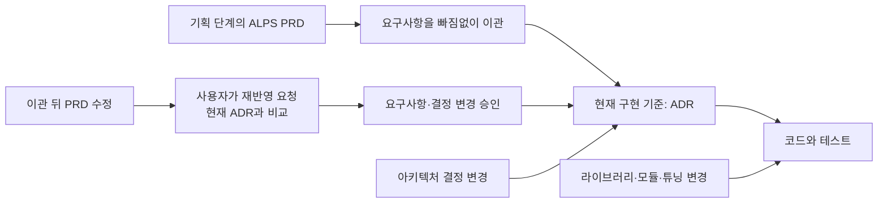

## TL;DR

- PRD·ADR·코드는 같은 시스템에 관한 서로 다른 질문에 답한다.
- 요구사항을 ADR로 이관한 뒤에는 ADR을 구현 기준으로 삼는다.
- 계층 분리는 변경 전파와 사람이 검토할 범위를 줄인다.

## 시작하며

ALPS Writer Plugins에서 문서와 코드가 서로 어긋나는 문제를 줄이려고, 각 문서에 무엇을 남길지 정리했다.

제품 요구사항 문서(PRD), 아키텍처 결정 기록(ADR), 코드를 **같은 시스템을 서로 다른 해상도로 본 결과**로 구분하는 방식이다. 저장소의 `AGENTS.md`에도 이 원칙을 적어뒀다.[^1]

여기서 해상도는 얼마나 구체적으로 설명하느냐를 뜻한다. PRD에는 사용자가 얻을 결과를, ADR에는 구현이 지켜야 할 결정과 요구사항을, 코드에는 실제 동작을 담는다. 이 글에서 말하는 계약은 허용할 상태와 권한, 정확한 제한값처럼 구현을 바꿔도 지켜야 할 요구사항이다.

직접 적용해보니 문서 정리 외에도 체감한 변화가 있었다.

Agent가 작업마다 모든 문서를 읽지 않아도 됐다. 코드 리팩터링이 상위 문서 수정으로 번지지 않았고, 구현 방법을 미리 고정하지 않으면서도 사람은 계약과 위험을 검토할 수 있었다.

이 글에서는 현재 ALPS Writer Plugins의 설계를 기준으로, 추상화 계층을 구별하면 실제로 무엇이 좋아지는지 정리한다.

## 1. 같은 시스템을 세 가지 해상도로 본다

C4 모델은 시스템과 외부의 관계(Context), 내부 애플리케이션과 데이터 저장소(Container), 그 안의 구성 요소(Component)를 차례로 확대해 보여준다. PRD, ADR과 코드도 이와 비슷하게, 같은 시스템을 서로 다른 상세 수준에서 설명한다고 볼 수 있다.

이 그림은 각 문서에 담을 정보의 상세 수준을 Clean Architecture의 동심원 형태로 표현한 개념도다. 실제 호출 순서나 모든 단계에서 PRD를 다시 읽어야 한다는 뜻은 아니다.

가장 안쪽의 ALPS PRD에는 기획 단계의 사용자 문제, 제품 의도와 기능 계약을 담는다. 파일 경로나 기술 목록, 상세 구현 계획은 넣지 않는다.

그 바깥의 ADR은 선택 근거, 대안, 정확한 요구사항과 시스템 경계를 담는다. SDK, 함수 시그니처, 내부 호출 흐름과 튜닝값은 더 바깥의 코드와 테스트에 남긴다.

기획을 구현으로 넘길 때는 필요한 요구사항을 ADR에 빠짐없이 옮긴다. **이관 이후에는 ADR이 구현 기준이며, PRD는 당시의 기획을 남긴 기록이다.** 코드는 ADR의 요구사항을 지켜야 하고, PRD를 나중에 고쳤다고 구현 기준이 자동으로 바뀌지는 않는다.

시스템과 외부의 관계를 묻는 그림에 클래스까지 넣으면 자세해지기는 하지만, 필요한 관계를 찾기는 어려워진다. 문서도 마찬가지다. 자기 수준의 질문에 답하는 데 필요 없는 내용은 아래 계층에 남겨두는 편이 낫다.

ALPS Writer에서는 이를 문서 하나만 읽어보는 검사(`single-level read test`)로 확인한다.

> 이 계층 하나만 읽고 자신의 질문에 답할 수 있는가? 아래 계층의 내용이 섞이지 않았고, 다른 어느 곳에도 없는 계약이 빠지지 않았는가?

## 2. Agent가 문서와 코드를 오가며 작업한다

Clean Architecture의 Use Case나 Hexagonal Architecture의 Application Service는 요청을 받아 업무 규칙을 실행하고, 필요한 데이터를 읽거나 저장하는 작업을 조율한다.[^2] 이때 특정 데이터베이스 제품에 직접 맞추기보다, 저장이나 조회에 필요한 동작을 약속한 인터페이스에 의존하게 만든다. 그러면 데이터베이스를 연결하는 코드를 바꿔도 업무 규칙은 유지할 수 있다.

ALPS Writer에서는 Agent가 비슷한 역할을 맡는다.

Agent는 기획을 넘기는 단계에서 PRD를 읽고, 오래 유지할 결정과 요구사항을 ADR에 옮기며 나머지는 구현자가 고를 수 있는 선택으로 구분한다. 이후 구현할 때는 ADR을 기준으로 현재 코드를 찾는다. 작업 지침인 Skill과 외부 도구를 연결하는 MCP, 명령줄 도구(CLI)를 사용해 코드를 수정하고 테스트한 뒤 검토할 결과를 남긴다.

타겟 그림에서 Agent를 원 안에 넣지 않은 이유도 여기에 있다. Agent는 세 계층을 가로질러 작업하지만 어느 계층의 내용을 영속적으로 소유하지 않는다.

작업을 조율한다는 점은 비슷하지만, Use Case나 Application Service는 코드로 남고 Agent가 만든 작업 계획은 그 실행을 위해 쓰인다. Agent의 계획을 PRD·ADR·코드와 별개의 구현 기준으로 계속 관리하지는 않는다.

끝난 작업의 계획, 검색 결과, 보조 Agent 구성과 중간 검토 자료를 다음 구현의 기준으로 삼지 않는다. 기획의 출발점은 PRD에, 이관한 제품 의도와 요구사항을 포함한 현재 결정은 ADR에, 실제 동작은 코드와 테스트에 남는다. 아직 진행 중인 작업을 이어가기 위한 기록은 그 용도가 끝날 때까지 필요할 수 있다.

다음 실행의 Agent는 현재 ADR과 코드를 읽고 작업 순서를 다시 구성한다. 이전 Agent의 내부 상태나 별도 등록 정보를 복구해야만 요구사항을 알 수 있는 구조는 피한다.

나는 이를 개발 과정에 의존성 역전 원칙을 적용한 것으로 볼 수 있다고 생각한다. 문서를 이해하기 위해 특정 Agent나 플러그인의 내부 상태가 필요한 것이 아니라, 교체 가능한 Agent가 문서에 적힌 요구사항을 읽고 일하기 때문이다.

그래서 plugin을 제거하거나 model을 바꿔도 PRD, ADR과 코드는 그대로 읽을 수 있다. Agent의 실행 방식은 바뀌어도 계약과 검증 결과를 지키면 된다.

Clean Architecture에서 추상화 계층이 복잡도를 추가하듯이 이 구조도 분류 비용이 생긴다. 작은 프로젝트에서는 PRD, ADR과 코드 전체를 나눠 얻는 이득이 크지 않을 수 있다.

## 3. 질문 하나에 문서 하나만 읽는다

사용자 가입을 왜 만들어야 하는지 알고 싶다면 PRD를 읽으면 된다.

예를 들어 로그인 상태를 이어가는 데 쓰는 갱신 토큰(refresh token)의 유효기간을 왜 7일로 정했는지 알고 싶다면 ADR을 읽는다. 토큰을 실제로 교체하는 로직이나 캐시에 저장할 때 쓰는 키가 궁금할 때만 코드로 내려간다.

각 문서가 자기 질문에 혼자 답하면 Agent도 작업에 필요한 계층만 읽고 멈출 수 있다.

ALPS Writer의 `/feature-to-adr`는 PRD의 구현 관련 요구사항을 ADR로 이관하는 작업이다. 이관이 끝난 뒤의 일반 구현과 리뷰는 PRD를 다시 읽지 않는다. ADR 목록인 `.mapping.json`에는 각 ADR의 경로, 상태, 요약과 먼저 충족해야 할 다른 ADR의 요구사항 관계만 기록한다. PRD 경로나 코드 경로는 저장하지 않는다.

ADR 본문에도 PRD의 Section 번호, Feature ID, 함수와 파일 경로를 넣지 않는다. 관련 코드는 ADR을 읽은 Agent가 현재 저장소에서 다시 찾는다.

경로를 미리 저장하면 당장은 편하지만 rename과 refactoring 뒤에는 오래된 링크가 된다. 그때부터 Agent는 문서와 검색 결과 중 어느 쪽이 맞는지 다시 판단해야 한다.

반대로 필요한 순간에 검색하면 현재 코드를 기준으로 찾을 수 있다. 읽는 컨텍스트가 줄고, 오래된 하위 계층의 정보가 상위 판단에 끼어드는 일도 줄어든다.

## 4. 변경이 필요한 계층에서 멈춘다

세 계층의 변경 빈도는 같지 않다.

함수와 모듈은 자주 바뀌고, 아키텍처 결정은 가끔 바뀌며, 사용자 문제와 제품 목표는 상대적으로 오래간다. ALPS Writer의 `Code >> ADR >> PRD`는 기획 단계에서 이렇게 변경 빈도가 다르다는 뜻이다. 이관 이후의 구현은 코드와 ADR을 기준으로 진행하며, PRD 수정은 명시적으로 다시 가져올 때만 검토한다.

계층이 잘 나뉘면 구현만 바꾼 일이 제품 문서 수정까지 번지지 않는다. 반대로 요구사항이 바뀌면 그에 맞춰 코드를 고쳐야 한다.





Full ALPS의 아키텍처 설명에는 시스템과 외부의 관계, 내부 애플리케이션과 데이터 저장소, 재구현 뒤에도 유지할 제약을 남긴다. 내부 구성 요소와 프레임워크, 개발 도구 묶음(SDK), 데이터베이스 연결 라이브러리나 배포 도구는 코드에서 다시 찾을 수 있으므로 PRD에 올리지 않는다.

ADR로 남길 결정에도 기준을 둔다. 요구사항 계약, 데이터·보안 경계, 외부 서비스 제공자와 장애 시 대체 경로, 여러 구현을 계속 제약하는 선택의 장단점이 대상이다. 같은 계약을 유지한 채 바꿀 수 있는 라이브러리, 인증 정보를 연결하는 구현과 모듈 구조는 코드에 둔다.

이렇게 하면 SDK 교체나 파일 이동이 ADR 수정을 끌고 가지 않는다. 프레임워크를 바꿔도 제품의 시스템 경계가 그대로라면 PRD를 고칠 이유가 없다.

같은 결정의 대안이 바뀌었을 때도 새 ADR을 계속 만들지 않는다. ADR 본문은 현재 결정만 보여주고, 중요한 변화의 이력은 `decision-log.md`, 문장 단위의 전체 변경은 Git이 맡는다.

현재 상태, 중요한 전환과 전체 diff를 한 문서에 쌓지 않으므로 결정의 변경 횟수만큼 ADR이 늘어나지 않는다.

사용자가 수정한 PRD를 다시 반영해달라고 요청해도 문장 순서와 표현만 달라졌다면 아무것도 바꾸지 않는다. 실제 계약이나 경계가 달라졌을 때만 ADR 변경을 제안하며, 기존 요구사항을 없애는 변경도 자동으로 적용하지 않는다.

결과적으로 문서 변경량이 코드 변경량을 따라 폭증하지 않는다.

## 5. 계약은 완전하게, 구현은 열어둔다

추상화 계층을 나누면 Agent에게 구현 재량을 더 줄 수 있다.

ALPS Writer에서는 ADR의 내용을 확인할 때, 코드를 전부 지우더라도 같은 요구사항과 경계를 지키는 구현을 다시 만들 수 있는지 묻는다. 이를 `regeneration test`라고 부른다. 파일이나 함수까지 예전과 똑같이 만들 필요는 없다.

예를 들어 `갱신 토큰은 7일 동안 유효하다`가 정해진 보안 정책이라면 정확한 7일과 그 근거를 ADR에 남긴다.

반면 그 정책을 어떤 SDK, 함수, 캐시 자료구조와 모듈로 구현할지는 코드의 선택이다. 다음 Agent가 현재 저장소의 관례와 도구에 맞는 방식을 고를 수 있다.

7일이라는 값은 ADR과 코드 양쪽에 있지만 맡은 역할은 다르다. ADR은 바꾸려면 다시 결정해야 하는 요구사항과 그 근거를 담고, 코드는 이를 실제로 적용한다.

코드만 보면 현재 값이 7일이라는 사실은 알 수 있어도, 개발자가 자유롭게 바꿀 수 있는 튜닝값인지 제품 계약인지는 알기 어렵다.

그래서 요구사항 값, 허용 상태와 권한, 반드시 지킬 순서와 실패 시 동작은 ADR에 남긴다. 구현 내부의 이름과 데이터를 저장하는 형태는 코드에 둔다.

이 상태를 **계약은 완전하고 구현은 열려 있는 상태**라고 볼 수 있다.

계약을 지키는 한 Agent는 리팩터링하고, 더 적합한 라이브러리를 고르고, 내부 구조를 바꿀 수 있다. 사람이 구현 계획을 미리 작성하지 않아도 자율성의 경계는 남는다.

## 6. 사람이 판단할 범위가 줄어든다

계층을 구별하면 리뷰도 코드 전체에서 시작하지 않아도 된다.

ALPS Writer의 ADR은 요구사항을 독립적인 행으로 나누고, 특정 테스트 파일이나 함수 대신 구현과 무관하게 관찰할 수 있는 증거를 함께 적는다.

Agent는 이 계약을 기준으로 구현과 테스트를 진행한 뒤, 계약별 상태와 증거, 구현 중 선택한 내용과 남은 위험을 구현 검토 보고서(`Evidence Package`)로 만든다.

이 보고서는 새로운 권위 문서가 아니라 ADR과 코드에서 파생한 일시적인 검토 자료다. 다음 구현의 기준으로 쌓지 않는다.

사람은 먼저 아래 내용을 본다.

- 승인한 계약이 모두 검증됐는가
- Agent가 계약 밖에서 선택한 구현 재량은 무엇인가
- 새 계약이나 사람의 판단이 필요한 위험이 남았는가

증거가 부족하거나 보안, 결제와 데이터 변경처럼 구현 방식 자체가 위험한 부분만 코드로 내려가면 된다.

모든 코드를 읽지 않는다는 뜻은 아니다. **어디부터 읽고, 어느 부분까지 내려갈지를 계약과 위험으로 정할 수 있다는 뜻**이다.[^3]

이 경계가 없으면 Agent가 구현에서 줄인 시간을 사람이 전체 diff를 이해하는 데 다시 쓴다. 경계가 있으면 반복적인 구현 계획 승인을 줄이고, 사람의 판단을 계약 변경, 모순과 검증하지 못한 위험에 집중할 수 있다.

## 7. 계층을 나눌 때 쓰는 세 가지 질문

ALPS Writer에서는 정보를 어느 계층에 둘지 아래 순서로 확인한다.

1. **이 내용이 사라지면 다시 만든 코드가 요구사항을 위반할 수 있는가?**

   그렇다면 요구사항을 맡는 PRD나 ADR에 남긴다. 정확한 제한값, 허용 상태, 권한, 순서와 실패 보장이 여기에 해당한다.

2. **요구사항이 아니라면 코드를 읽거나 도구를 실행해 다시 확인할 수 있는가?**

   그렇다면 코드와 테스트에 둔다. 라이브러리, SDK, 함수의 입력·출력 형식, 모듈 배치와 튜닝값은 보통 여기서 끝난다.

3. **코드만으로는 선택 이유를 알 수 없고, 바꾸면 오래 유지할 결정이 달라지는가?**

   그렇다면 ADR에 선택 근거, 대안, 각 선택의 장단점과 경계를 남긴다.

같은 기술 이름도 답이 달라질 수 있다.

예를 들어 AI 모델을 제공받을 외부 서비스로 Amazon Bedrock을 선택하고, 장애 시 어느 서비스로 전환할지 정하는 일은 ADR 대상이 될 수 있다. 그 결정을 구현하는 SDK와 인증 정보를 읽거나 요청에 서명하는 코드는 같은 요구사항을 지키는 한 구현자가 고를 수 있다.

기술 이름이 들어갔는지가 아니라, 그 선택이 어떤 계약과 경계를 고정하는지를 봐야 한다.

마지막에는 다시 single-level read test를 적용한다. 문서 하나가 자기 질문에 답하지 못하거나, 아래 계층이 바뀔 때마다 함께 고쳐야 한다면 경계를 다시 봐야 한다.

## 마치며

지금은 코드 리팩터링이 ADR 수정을 요구하면 먼저 ADR의 해상도가 너무 낮은지 확인한다. 구현을 시작할 때 PRD를 다시 읽어야 한다면 handoff에서 계약이 빠졌는지 본다. 코드의 값이 계약인지 우연한 선택인지 구분할 수 없다면 ADR에 근거가 부족한지 확인한다.

이렇게 점검하니 **한 번에 읽을 범위와 변경이 번질 범위가 줄었다.** 문서를 나눌 때도 각 문서가 혼자 답해야 할 질문부터 정하는 편이 도움이 된다고 생각한다.

---

[^1]: [ALPS Writer Plugins](https://github.com/haandol/alps-writer-plugins)의 현재 설계 원칙은 [AGENTS.md](https://github.com/haandol/alps-writer-plugins/blob/main/AGENTS.md), [ADR concepts](https://github.com/haandol/alps-writer-plugins/blob/main/plugins/adr-writer/templates/adr/concepts.md), [Dependency model](https://github.com/haandol/alps-writer-plugins/blob/main/docs/dependency-model.md)에 정리되어 있다.

[^2]: [쉽게 설명한 클린 / 헥사고날 아키텍쳐](/2022/02/13/demystifying-hexgagonal-architecture.html) — 추상화 계층으로 의존성을 줄이는 방식과 그에 따른 복잡도를 설명한 이전 글.

[^3]: [AI로 코드는 빨리 만들었는데 왜 리뷰는 더 힘들까](/2026/08/18/ai-coding-review-cognitive-load.html) — 계약과 검증 결과를 먼저 보고 위험한 부분만 코드로 내려가는 리뷰 방식을 다룬다.
