## TL;DR

- C4 모델처럼 PRD·ADR·코드가 담을 정보 수준을 제약한다.
- 목표는 필요할 때 그 레이어 문서만 읽어도 되는 상태다.
- 요구사항이 ADR 레이어로 다 내려가면 PRD는 지운다.

## 시작하며

최근 모델이 좋아지면서 에이전틱 개발에 필요했던 human in the loop의 많은 부분이 모델과 도구 안으로 흡수되고 있다.[^2] 개인적으로 이 방향을 가장 빠르게 밀어붙이는 곳은 Anthropic이라고 생각한다.

이 글은 계속 써온 렌즈 위에 있다. **소프트웨어 개발은 비즈니스 요구사항을 코드로 바꾸는 컴파일 과정이고, 에이전틱 엔지니어링은 그 과정에서 사람을 덜어내는 방향이다.**[^7]

이 렌즈를 쓰면 문서의 역할이 자동으로 정해진다. 컴파일러에게 필요한 건 입력, 즉 요구사항이다. 출력인 코드를 문서에 옮겨 적는 일은 컴파일러를 두 번 돌리는 것과 같다.

그래서 나는 세 가지 원칙을 중요하게 본다. **저장소에 남는 모든 텍스트는 일급 컨텍스트이며 항상 최신이어야 한다. 비즈니스·기능·비기능 요구사항은 source of truth이고, 코드는 그 결과물이어야 한다. 요약과 태스크 같은 구현 중간 산출물은 저장하지 않고 세션 안에서 휘발시켜야 한다.**

문제는 요구사항과 코드의 추상화 수준이 너무 다르다는 데 있다. 요구사항에서 코드로 의존성은 흐르되 둘이 서로 직접 참조하면 안 되고, 그 사이의 매핑은 코딩 에이전트가 매번 동적으로 수행해야 코드베이스가 깨끗하게 남는다.

그래서 요구사항 문서를 두 종류로 나눈다. **PRD는 제품 전체의 요구사항을 담아 Explore 단계의 가설 검증에 쓰고, ADR은 기능 하나의 요구사항을 담아 구현된 코드를 판정하는 데 쓴다.** 범위와 용도가 다르다.

이 원칙을 실제 프로젝트에 적용하려고 만든 도구가 [ALPS Writer](https://github.com/haandol/alps-writer-plugins)[^3]와 `adr-writer`다.

### 이 도구의 목표

먼저 목표를 분명히 해두는 게 좋겠다. 이 두 플러그인이 하는 일은 두 가지다.

**하나, 모델에게 생각하는 관점을 준다.** 문서를 예쁘게 뽑아주는 생성기가 아니다. "지금 너는 제품 전체의 가설을 다루는 중이다", "지금은 기능 하나의 판정 기준을 쓰는 중이다"라는 시점을 템플릿과 질문 프로토콜로 강제한다. 모델이 어느 레이어에 서 있는지 알면, 무엇을 쓰지 않을지도 알게 된다.

**둘, C4 모델처럼 각 문서가 담는 정보의 수준을 추상화 레벨별로 제약한다.**[^4] C4가 Context·Container·Component·Code로 층을 나누고 각 층에서 보여줄 것과 보여주지 않을 것을 정해두는 것처럼, PRD(ALPS)·ADR·코드도 각자 담을 정보의 수준이 다르다. 상위 레이어는 하위 레이어의 세부를 담지 않고, 하위 레이어는 상위 레이어를 역참조하지 않는다.

이 제약이 만드는 결과가 목표다. **필요할 때 원하는 문서만 보면 된다.** 제품 방향이 궁금하면 PRD만, 이 기능이 지켜야 할 요구사항이 궁금하면 해당 ADR만, 지금 어떻게 동작하는지가 궁금하면 코드만 읽는다. 한 질문에 답하려고 세 레이어를 다 펼쳐야 한다면 층 나누기가 실패한 것이다.

이 관점이 왜 필요하고 그것이 포맷과 워크플로우에 어떻게 내려왔는지, PRD와 ADR을 서로 다른 레이어로 갈라두는 이유부터 실제 사용법까지 차례로 살펴본다.[^1]

## 1. 컨텍스트에도 레이어가 있다

먼저 그림 하나로 시작하자. 요구사항 문서라고 뭉쳐 불렀지만, 그 안에도 레이어가 나뉜다.



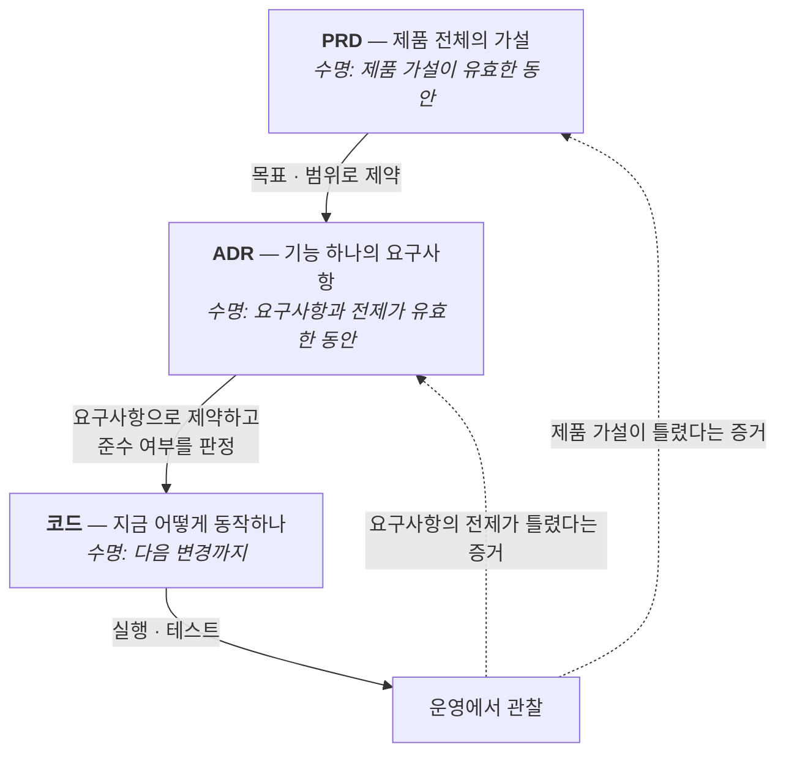



레이어를 어디서 자를지는 **변하는 속도**가 정한다. 제품 전체의 요구사항은 몇 달에 한 번 바뀌고, 기능 하나의 요구사항은 몇 주에 한 번 바뀌고, 코드는 매일 바뀐다.

달력의 숫자보다 중요한 건 **무엇이 바뀔 때 함께 고쳐야 하는가**다. 내가 구분하는 세 레이어의 수명은 다음과 같다.

| 레이어 | 범위 | 담는 질문 | 보통의 수명 | 넣지 않는 것 |
| --- | --- | --- | --- | --- |
| PRD | 제품 전체 | 무엇을 왜 만들고, 성공은 무엇인가 | 제품 가설·범위가 유효한 동안(대개 몇 달) | 파일 경로, 함수, 구현 순서 |
| ADR | 기능 하나 | 이 기능이 지켜야 할 요구사항은 무엇인가 | 요구사항과 그 전제가 유효한 동안(대개 몇 주~몇 달) | 코드로 바로 알 수 있는 구조·상수 |
| 코드 | 구현 | 지금 시스템은 어떻게 동작하는가 | 다음 구현 변경까지(몇 시간~며칠) | PRD·ADR 번호의 역참조 |

이 표에서 진짜 중요한 칸은 오른쪽 두 개다. **"담는 질문"과 "넣지 않는 것"이 각 레이어가 담을 정보의 수준을 제약한다.** C4 모델에서 Container 다이어그램에 클래스 이름을 그리지 않는 것과 같은 종류의 규칙이다.

그리고 이 제약이 지켜지면 각 질문에 답할 문서가 하나로 정해진다. 세 레이어를 다 펼쳐놓고 어디에 답이 있는지 찾는 대신, 질문의 추상화 수준을 보고 그 레이어만 열면 된다.

여기서 긴 수명은 문서를 고정한다는 뜻이 아니다. 운영에서 제품 가설이나 결정의 전제가 틀렸다는 증거가 나오면 해당 레이어를 갱신한다. 반대로 함수명이나 파일 배치만 달라졌다면 PRD와 ADR은 손대지 않고 그대로 유효해야 한다.

그래서 논리적 의존 방향은 한 방향이어야 한다. 요구사항이 결정을 제약하고, 결정이 코드를 제약한다. 반대로 매일 바뀌는 코드가 상위 문서에 영향을 주면 몇 달에 한 번 바뀌어야 할 문서를 매일 고쳐야 한다.

**헥사고날 아키텍처가 도메인을 어댑터로부터 지키는 이유와 같다.**[^8] 도메인이 ORM 클래스를 직접 참조하면 DB를 바꿀 때 비즈니스 규칙이 흔들린다. 그래서 도메인 쪽이 포트를 정의하고, 어댑터가 그 포트를 구현하게 만든다.

문서도 똑같다. **PRD가 코드를 참조하면, 리팩터링 한 번에 PRD가 틀린 문서가 된다.** 코드 역시 PRD나 ADR의 파일명·번호를 직접 참조하지 않는다.

헥사고날의 용어로 옮기면 각 레이어의 역할이 이렇게 대응한다.

| 헥사고날 | 이 구조 | 하는 일 |
| --- | --- | --- |
| 도메인 | 비즈니스 요구사항 (PRD의 가설) | 아무것도 참조하지 않는다 |
| 포트 (계약) | **ADR** | 지켜야 할 것을 정의하고 준수를 판정한다 |
| 애플리케이션 서비스 | **코딩 에이전트** | 포트를 구현하고, 코드가 만족할 형태를 정한다 |
| 어댑터 | 코드 · 툴 · 테스트 | 교체 가능하다 |

여기서 **ADR이 포트**라는 점이 핵심이다. 포트는 계약이지 구현이 아니다. "무엇을 지켜야 하는가"만 있고 "어떻게"는 없다. 뒤에서 ADR을 설계도가 아니라 채점표라고 부르는 것과 같은 얘기다.

그리고 **코딩 에이전트가 애플리케이션 서비스 자리**다. 처음에는 이게 어색했다. 서비스는 보통 오래 사는 구성요소인데 에이전트는 세션마다 새로 도니까.

그런데 헥사고날에서 서비스가 안쪽인 이유는 수명이 길어서가 아니라 **포트를 소유해서**다. 서비스는 인바운드 포트를 구현하고, 자기가 필요한 것을 아웃바운드 포트로 정의한다. 의존성 역전이 일어나는 자리가 정확히 여기다.

에이전트가 하는 일이 그렇다. ADR을 읽어 "이 요구사항을 만족하려면 이런 함수와 이런 테스트가 필요하다"를 정하고, 코드가 그걸 구현한다. 코드가 에이전트에게 인터페이스를 요구하지 않는다. 방향이 한쪽이다.

그림으로 그리면 이렇게 된다.


여기서 헥사고날과 다른 게 하나 있다. 헥사고날에서는 어댑터가 포트 인터페이스를 **코드로** import한다. 컴파일러가 그 방향을 검사해준다.

문서에는 그런 컴파일러가 없다. 그래서 화살표를 아예 긋지 않는 쪽을 택했다. **코드는 ADR을 모르고, ADR은 PRD의 파일명을 모른다.**

대신 그 자리를 에이전트가 맡는다. 요구사항과 코드를 함께 읽고 둘 사이의 매핑을 그때그때 복원한다. 저장해둔 매핑이 없으니 stale해질 것도 없다.

그리고 사람은 틀린 문서를 고치지 않는다. 그냥 안 본다.

### 내가 실제로 침범한 사례

내 영어 학습 서비스(EncBird)에 Office Raid라는 퀴즈 게임 모드를 붙일 때 쓴 PRD가 그랬다. 규칙은 흔한 형태다. **목숨이 몇 개 주어지고, 틀리면 하나 줄고, 연속으로 맞히면 보너스가 붙는다.** 문제로 나오는 표현은 그 사용자가 공부해둔 표현 중에서 뽑는다.

이 정도만 알면 아래 내용은 다 따라올 수 있다. 서비스 사정이나 학습 이론은 몰라도 된다.

PRD는 621줄이었고, 게임 규칙까지는 멀쩡했는데 중간부터 이런 게 들어갔다.

```
## 프론트엔드 상태 저장소 (`stores/officeRaid.ts`)

const coffee = ref(3)            // 남은 목숨
const flow = ref(0)              // 연속 정답 수
const questionPool = ref<RaidQuestion[]>([])
```

```
## 구현 순서 (권장)

| 1 | 타입 정의 (`office-raid.ts`) | 없음 |
| 2 | 상태 저장소 (`officeRaid.ts`) + composable | 타입 |
| 3 | 타이틀 화면 (학습 데이터 조회) | 상태 저장소 |
...
| 12 | 모바일 최적화 (터치, 반응형) | 전체 완성 후 |
```

프레임워크 문법은 중요하지 않다. 요점은 **"목숨은 3개"라는 규칙이 요구사항 문장이 아니라 변수 선언으로 적혔다**는 것이다. 여기에 파일 경로와 12단계 태스크 목록까지 붙었다. 쓸 때는 친절한 문서라고 생각했다.

그런데 이 세 종류는 모두 리팩터링 한 번에 바뀌는 것들이다.

- `const coffee = ref(3)`은 상수를 하나 추출하는 순간 이름과 위치가 달라진다.
- 파일 경로는 폴더 구조를 정리하면 달라진다.
- 태스크 목록은 실제 구현 순서가 조금만 바뀌어도 달라진다.

그리고 실제로 다 바뀌었다. 목숨 개수는 `MAX_LIFE` 형태의 상수로 빠졌고, 로직 일부는 별도 모듈로 분리됐고, 구현 순서는 3번째 커밋쯤에서 이미 표와 달라졌다.



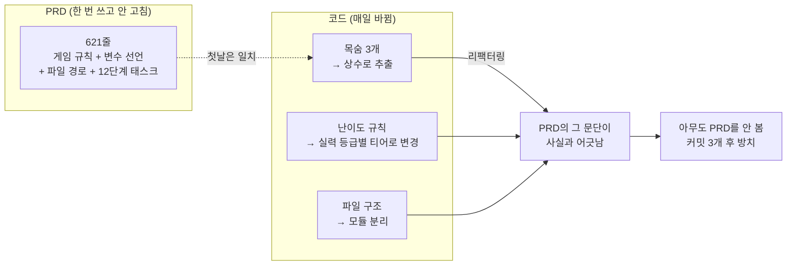



가장 아팠던 건 난이도 규칙이다. 구현하면서 **사용자의 영어 실력 등급에 따라 문제 난이도 티어를 나누는 방식**을 새로 도입했는데, 이건 PRD에 없던 개념이다. PRD가 정한 난이도 문단은 그냥 틀린 문단이 됐다.

문제는 그걸 고칠 자리가 없었다는 점이다. PRD의 그 부분은 이미 "코드가 이렇게 생겼다"를 적는 문서였고, 코드가 앞서 나가버렸으니 고치려면 코드를 다시 옮겨 적어야 했다. 그건 컴파일러를 두 번 돌리는 일이다.

같은 기능의 ADR은 반대였다. 142줄이고, 변수 선언도 파일 경로도 없다. 대신 검토한 대안 6개와, 그중 3개가 "초기 채택 후 폐기"된 이유가 적혀 있다.

```
| 복습 예정일 기준으로 문제 표현 조회 | 기각 (초기 채택 후 폐기) | "많이 공부할수록 플레이 불가" 역설 발생 |
| 보유 표현 15개 미만이면 진입 차단  | 기각 (초기 채택 후 폐기) | 신규 사용자 차단, 기본 표현으로 대체 |
```

첫 줄만 풀어보면 이렇다. 원래는 **"복습할 때가 된 표현"만 문제로 뽑았다.** 그러자 성실한 사용자일수록 복습을 다 끝내둔 상태가 되어 뽑을 표현이 없고, 결국 게임에 못 들어가는 역설이 생겼다. 그래서 그 방식을 버렸다.

이런 문장은 **코드를 아무리 리팩터링해도 사실과 어긋나지 않는다.** 조회 쿼리를 어떻게 다시 쓰든 "그 방식은 이 역설 때문에 기각했다"는 기록은 그대로 참이다.

그래서 두 달 뒤 후속 결정을 추가할 때도 그 ADR 옆에 새 ADR을 놓는 것으로 끝났다. PRD는 손대지 않았다.

**PRD는 방치되고 ADR은 계속 쓰이게 된 차이는 성실함이 아니라 그 문서가 어느 레이어에 머물렀느냐였다.**

RFTCR 글에서 C4 모델을 예로 들며 "단계별 입출력의 추상화 수준을 명확히 정의해야 한다"고 썼는데[^4], 그때는 그게 프로세스 표준화 얘기라고 생각했다. 지금은 **문서의 수명과 읽는 범위를 결정하는 문제**라고 본다.

Office Raid PRD를 열면 게임 규칙도 나오고 변수 선언도 나온다. 그래서 어떤 질문을 들고 가도 621줄 전체를 훑어야 했다. 반대로 ADR은 142줄 안에서 그 기능의 판정 기준만 다루기 때문에 필요할 때 그것만 열면 됐다.

ALPS Writer는 여기서 출발했다. PRD 작성을 편하게 해주는 생성기가 필요해서가 아니라, **각 문서가 담을 정보의 수준을 제약해서 요구사항을 코드의 변화로부터 지키고, 에이전트가 필요한 레이어만 읽어도 되게 만들기 위해서**였다.

## 2. PRD는 가설을 검증하는 문서다

먼저 이 문서가 무엇을 담는지부터 정하자. **PRD는 프로젝트 전체에 대한 비즈니스 요구사항과 기능·비기능 요구사항의 상세다.** 개별 기능이 아니라 제품 하나를 통째로 놓고 본다.

그래서 PRD가 가장 유용한 지점은 **Explore 단계**다. 켄트 벡의 3X에서 수익 곡선이 아직 평평한 구간, 가치 있는 아이디어를 싸고 빠른 실험으로 찾는 시기다.[^6]

이 단계에서 제품은 전부 가설이다. 누가 쓸지, 무엇이 성공인지, 무엇을 만들지 않을지가 모두 검증 대상이다. 이 가설들을 한 문서에 모아 서로 앞뒤가 맞는지 확인하는 것이 PRD의 일이다.

**중요한 건 이게 구현 지시서가 아니라는 점이다.** 가설을 세우고 검증하는 도구이므로, 파일 경로나 변수 선언이 들어갈 자리가 없다. 그런 게 들어가면 가설 문서가 아니라 코드 설명서가 된다.

Office Raid PRD가 정확히 그렇게 변했다.

### 재현의 대상은 코드가 아니다

이 지점에서 ALPS 프로세스 전체의 목표를 분명히 해둘 필요가 있다. 같은 문서로 프로세스를 여러 번 돌렸을 때 **알고리즘까지 똑같은 코드가 나오는 것이 목표가 아니다.**

오히려 알고리즘이나 자료구조 같은 구현 디테일은 매번 달라도 된다. 목표는 나온 코드가 **내가 준 비즈니스 요구사항과 기능·비기능 요구사항을 준수하는 것**이다.

이 차이가 문서에 무엇을 적을지를 결정한다.

| 재현하려는 것 | 문서에 적어야 하는 것 | 결과 |
| --- | --- | --- |
| 같은 코드 | 알고리즘, 상수, 파일 배치까지 | 코드를 두 벌 쓴다. 한 벌은 반드시 낡는다 |
| 같은 요구사항 준수 | 지켜야 할 것과 그 판정 기준 | 구현은 자유롭고 문서는 오래 유효하다 |

정렬을 예로 들면, "응답은 최신순이어야 한다"는 요구사항이고 "quicksort를 쓴다"는 구현이다. 후자를 적어두면 나중에 정렬 방식을 바꿀 때 문서가 틀리지만, 전자는 그대로 유효하다.

모델이 좋아질수록 이 방향이 유리해진다. 구현을 지정해줄 필요가 줄어들고, **무엇을 지켜야 하는지만 정확히 주는 쪽이 더 나은 결과를 낸다.**

그럼 PRD를 어떻게 자기 레이어에 머물게 하면서 에이전트가 읽기 좋은 source of truth로 만들 수 있을까. ALPS Writer는 여기에 두 가지로 답한다. 포맷을 고정하는 것, 그리고 작성 책임을 뒤집는 것이다.

PRD가 어긋나기 시작하는 지점은 보통 두 군데다.

**첫째, 포맷이 매번 새로 발명된다.** 팀마다, 문서마다 PRD 모양이 다르다. 섹션 이름도 다르고 상세 수준도 다르다.

에이전트는 이 문서가 무엇을 주장하는 문서인지부터 추측해야 한다. 사람도 내용을 쓰기 전에 형식을 다시 결정하느라 시간을 쓴다.

**둘째, 품질이 작성자 역량에 묶인다.** 경험 많은 PO가 쓴 PRD는 에이전트의 자유도를 적당히 조여주고, 그렇지 않은 PRD는 과잉 해석할 여지를 남긴다.

같은 제품인데 누가 문서를 썼느냐에 따라 생성된 코드가 달라진다.

ALPS(Agentic Lean Product Spec)는 이 둘을 각각 다르게 공격한다. 포맷은 **고정**해서 매번 결정하지 않게 하고, 작성 루프는 **뒤집어서** 완결성을 사람이 아니라 에이전트가 책임지게 한다. 앞에서 말한 관점이 각각 템플릿과 대화 프로토콜이라는 도구의 기능으로 내려온 셈이다.

### 고정된 포맷 — 9개 섹션

ALPS는 MVP 하나를 기술하는 데 필요한 것을 9개 섹션으로 고정한다.

| #   | 섹션                        | 담는 것                                   |
| --- | --------------------------- | ----------------------------------------- |
| 1   | Overview                    | 제품 맥락, 타깃 사용자, 핵심 문제         |
| 2   | MVP Goals and Key Metrics   | 성공의 측정 가능한 정의                   |
| 3   | Demo Scenario               | 나머지 문서를 붙잡아주는 구체적 시나리오  |
| 4   | High-Level Architecture     | 시스템 형태 — 구성요소, 경계, 데이터 흐름 |
| 5   | Design Specification        | 화면·플로우·에러 상태                     |
| 6   | Requirements Summary        | 기능·비기능 요구사항 종합                 |
| 7   | Feature-Level Specification | 기능별 vertical slice (UI → API → Data)   |
| 8   | MVP Metrics                 | Section 2 목표에 대응하는 계측            |
| 9   | Out of Scope                | 의도적으로 만들지 않을 것                 |

9개 섹션은 목차로만 나열된 게 아니라 서로를 검증한다. 목표는 시나리오와 요구사항으로 내려가고, 구현 가능한 기능은 다시 같은 목표를 측정하는 지표로 돌아와야 한다.



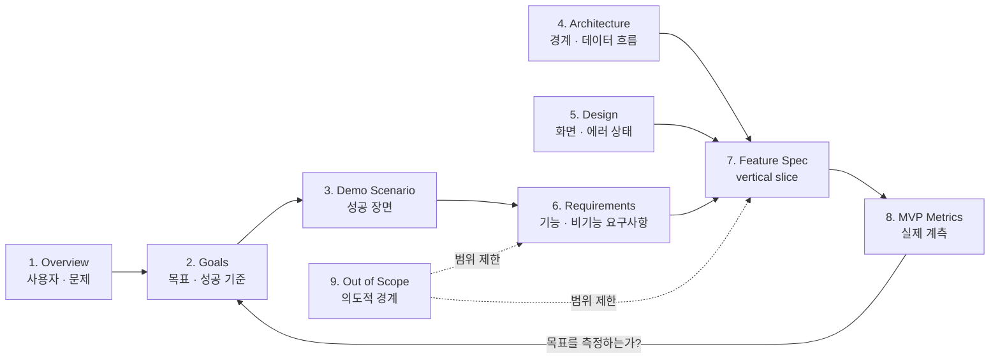



섹션을 나눈 방식에 세 가지 원칙이 깔려 있다.

**하나, 추상화 수준을 섞지 않는다.** 비즈니스 요구사항과 설계와 기술 요구사항이 각각 다른 섹션에 산다. "사용자가 즐거움을 느끼게"와 "POST /api/orders는 멱등키를 받는다"가 한 문단에 섞이지 않는다.

이게 PRD 안쪽에도 층을 두는 이유다. 문서 사이의 레이어 규칙을 문서 안에서도 한 번 더 적용해서, 성공 기준이 궁금한 사람은 2절만, 에러 상태가 궁금한 사람은 5절만 읽게 만든다.

**둘, 기능을 vertical slice로 자른다.** Section 7의 각 기능은 UI에서 API를 거쳐 데이터까지 관통한다. 그래야 기능 하나가 독립적으로 구현·테스트·배포된다.

**셋, 하지 않을 것을 일급으로 둔다.** Section 9(Out of Scope)는 각주가 아니다. 에이전트가 **하지 말아야** 할 일을 명시적으로 적어두지 않으면, 팀이 일부러 미뤄둔 영역까지 코드가 번져나간다.

### 질문하는 쪽을 뒤집는다

포맷보다 더 중요한 게 작성 방식이라고 생각한다.

보통 우리가 AI로 문서를 쓸 때는 **사람이 묻고 AI가 답한다.** 이 구조에서는 사람이 무엇을 물어야 하는지 아는 만큼만 문서가 채워진다. 문서 품질의 상한이 작성자의 질문 실력이 된다.

ALPS Writer는 이걸 반대로 돌린다.



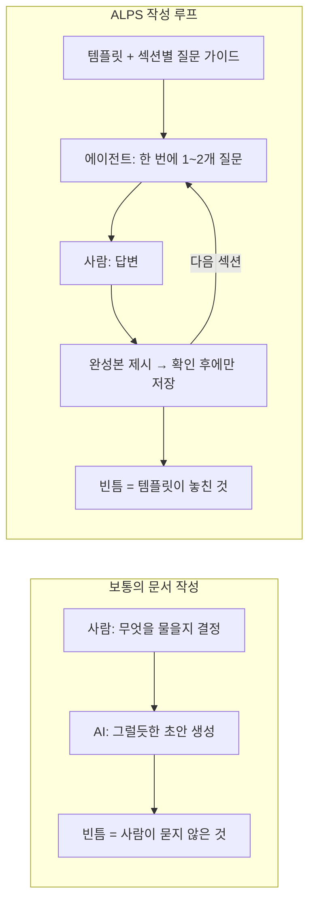



- **에이전트가 묻고 사람이 답한다.** 9개 섹션을 순서대로 돌면서 한 턴에 1~2개씩 좁은 질문을 던진다.
- **에이전트가 섹션을 임의로 생성하지 않는다.** 완성본을 보여주고 사람이 확인해야 저장된다.
- **섹션별 대화 가이드가 도구 안에 들어 있다.** 프로젝트가 바뀌어도 질문 흐름이 같다.

이러면 문서 품질의 상한이 **작성자의 PRD 실력**에서 **템플릿과 질문 프로토콜**로 옮겨간다. 도구를 개선하면 다음 프로젝트의 문서가 같이 좋아진다는 뜻이라, 나는 이게 이 도구의 핵심 설계라고 생각한다.

앞에서 말한 "모델에게 관점을 준다"가 구체적으로 이 부분이다. 섹션별 질문 가이드는 모델에게 **지금 어느 추상화 수준에서 묻고 있는지**를 알려주는 장치다. Section 2를 쓰는 중이면 성공의 정의를 묻고, 파일 배치는 묻지 않는다. 질문의 층이 정해지면 답의 층도 정해진다.

부수 효과로 문서 작성이 인터뷰가 된다. 백지 앞에서 "아키텍처 뭐 쓰지"를 고민하는 것보다, "지도 타일은 어디서 받아오실 건가요"에 답하는 게 훨씬 쉽다.

### 실제로 돌려보면

설치는 플러그인 두 개를 넣는 것으로 끝난다. npm이나 빌드 단계가 없다.

```
/plugin marketplace add haandol/alps-writer-plugins
/plugin install alps-writer@alps-writer   # PRD 작성 (MCP 서버 + /alps-init)
/plugin install adr-writer@alps-writer    # ADR 사이클 (/adr-new, /adr-impl, hook)
```

Codex를 쓴다면 `codex plugin add alps-writer@alps-writer` 형태로 같은 두 플러그인을 설치하고, 스킬을 `$alps-init`으로 부른다.

`/alps-init`을 치면 대화가 시작된다. [성경길](https://bible-atlas.encbird.com)[^5]이라는 사이드 프로젝트를 이걸로 시작했는데, 실제 흐름은 이랬다.

```
> /alps-init

## Section 1. Overview
이 섹션은 제품이 왜 존재하는지와 누구를 위한 것인지를 고정합니다.

먼저 이 프로젝트의 주된 목적이 무엇인가요?

> 성경을 장 단위로 읽는 걸 핵심 경험으로 하는 웹 서비스. 한 장 읽고
> 다음 장으로 넘기면 통독표에 자동으로 기록되게 하고 싶다.

좋습니다. 그럼 이 서비스를 가장 필요로 하는 사용자는 누구인가요?

> 통독에 도전하지만 꾸준히 이어가기 어려운 일반 신자.
> 지명이나 시대 배경이 낯설어서 맥락을 놓치는 사람들.
```

한 번에 하나씩 묻고, 하위 섹션이 다 채워지면 완성본을 보여준 뒤 확인을 받는다. 확인 전에는 파일에 아무것도 쓰지 않는다.

여기서 눈여겨볼 건 문서 순서와 **질문 순서가 다르다**는 점이다. 최종 문서는 1→9 번호 순이지만, 질문은 `1 → 2 → 3 → 4 → 6 → 5 → 7 → 8 → 9` 순으로 진행된다.

Section 5(Design)가 Section 6.1에서 정의한 Feature ID를 재사용하기 때문에, 요구사항을 먼저 확정하고 설계를 묻는다.

Section 6.1에서 기능 목록에 ID가 붙고, 6.3에서 그 기능들 사이의 의존성을 Mermaid로 그린다. 성경길에서 실제로 저장된 그래프는 이렇다.



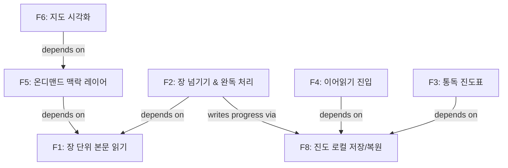



이 그래프가 나중에 **구현 순서**를 강제한다. 그림 하나 그려놓고 끝나지 않는다는 점이 중요한데, 뒤에서 다시 나온다.

그리고 여기 절제 규칙이 하나 있다. **Section 7은 "무엇"만 적고 "왜 그렇게 골랐는지"는 적지 않는다.** 라이브러리 선택, 알고리즘, 컬럼 목록, 튜닝 상수는 여기 들어가지 않는다.

판별 기준은 단순하다. *DB를 바꿔도 여전히 참인 문장*이면 PRD에 남고, *선택을 정당화하는 문장*이면 ADR로 간다.

Office Raid PRD가 어긴 게 정확히 이 규칙이다. "목숨은 3개"는 DB를 바꿔도 참이지만, 그걸 `const coffee = ref(3)`으로 적은 문장은 상수 하나만 추출해도 사실과 어긋난다.

## 3. ADR은 판정 기준이다

여기서부터 뒷부분이다. ADR(Architecture Decision Record)은 이름이 거창한데 실물은 단순하다. **기능 하나의 요구사항을 기록한 마크다운 파일 하나**다.

PRD가 제품 전체를 놓고 봤다면, ADR은 **개별 기능** 단위로 비즈니스 요구사항과 기능·비기능 요구사항을 담는다. 담는 내용의 종류는 같고 범위가 다르다.

앞서 말한 "같은 코드가 아니라 같은 요구사항 준수를 재현한다"는 목표가 가장 직접적으로 적용되는 문서가 이것이다. 구현 방법은 여러 개여도 되고, **구현의 세부는 개발하는 과정에 맡긴다.** 캐시를 Redis로 하든 메모리로 하든 요구사항을 지키면 통과다.

그래서 ADR의 실제 용도는 **구현된 결과가 비즈니스 요구사항과 기능·비기능 요구사항을 준수하는지 판단하는 기준**이다. 설계도가 아니라 채점표에 가깝다.

이 한 문장이 ADR의 거의 모든 규칙을 설명한다.

그런데 이게 왜 추상화인가. 추상화는 세부를 숨기고 계약만 남기는 일이다. 인터페이스가 구현 클래스를 숨기고 시그니처만 남기는 것처럼.

**ADR이 숨기는 것은 구현이고, 남기는 것은 지켜야 할 요구사항과 그것을 고른 이유다.**

EncBird의 사전 기능을 예로 들면 이렇게 갈린다.

| ADR에 남는 요구사항 | 구현에 맡기는 것 |
| --- | --- |
| 유효하지 않은 입력의 판정은 결정론적이어야 한다 | 판정 함수의 이름과 위치 |
| 동일 입력 재시도에 LLM을 다시 호출하지 않는다 | 캐시 키 포맷, TTL 값, 자료구조 |
| 많이 공부한 사용자가 플레이 불가에 빠지지 않는다 | 표현을 골라오는 조회 쿼리 |

왼쪽은 캐시를 Redis에서 메모리로 바꿔도 그대로 지켜야 하는 것이다. 오른쪽은 리팩터링 한 번에 바뀐다.

그리고 왼쪽은 구현이 끝난 뒤 **검사할 수 있는 문장**이다. 세 번째 항목을 예로 들면, 앞에서 본 "복습 예정일이 된 표현만 뽑는" 방식은 성실한 사용자를 플레이 불가에 빠뜨리므로 이 요구사항을 위반한다. 그래서 기각됐다. 코드가 어떻게 생겼든 이 판정은 그대로 작동한다.

이 분리가 만드는 효과가 하나 더 있다. 요구사항과 코드가 서로를 직접 참조하지 않아도 된다. 요구사항에서 코드로 향하는 의존 방향은 유지되지만, 둘 사이의 구체적인 매핑은 저장해두지 않는다. 에이전트가 ADR의 결정과 현재 코드를 함께 읽어 그때그때 복원한다.

막상 쓰려고 하면 "무엇까지 적어야 하나"에서 막힌다. 판단 기준은 두 개다.



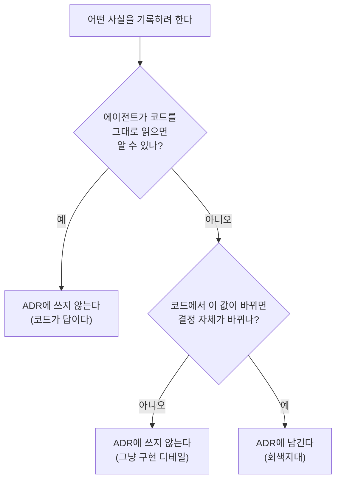



두 질문을 차례로 통과한 것만 남긴다. 이걸 `adr-writer`는 **두 단계 필터**라고 부른다.

한 질문만 쓰면 안 되는 이유가 있다. 두 번째 질문만 적용하면 "코드 읽으면 아는 결정 사실"까지 ADR에 들어와서, 코드를 고칠 때마다 ADR을 고쳐야 한다. 첫 질문으로 먼저 걸러야 한다.

이 필터를 통과하는 영역을 **회색지대**라고 부른다. 비즈니스 요구사항과 코드 사이에 떠 있는, 어느 쪽을 읽어도 안 나오는 것들이다.

두 단계 필터가 하는 일이 결국 **ADR이 담을 정보의 수준을 기계적으로 제약하는 것**이다. 위로는 PRD가 다루는 제품 단위 가설을 다시 적지 않고, 아래로는 코드를 읽으면 아는 것을 적지 않는다. 그래서 ADR 하나를 열면 그 기능의 판정 기준만 남고, 다른 층을 궁금해하지 않아도 된다.



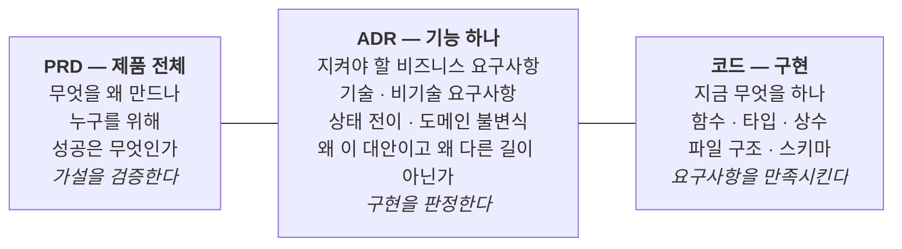



세 칸에 적힌 목록이 곧 각 레이어가 담을 정보의 수준이다. 왼쪽 칸을 알고 싶으면 PRD를, 가운데 칸을 알고 싶으면 ADR을, 오른쪽 칸을 알고 싶으면 코드를 읽는다.

구체적으로 ADR에 **넣지 않는** 것들이 규칙으로 정해져 있다. 실전에서 제일 자주 어기는 항목들이라 그대로 옮겨둔다.

전부 "같은 코드를 재현하려는 시도"라는 공통점이 있다.

| 금지                                  | 대신                         |
| ------------------------------------- | ---------------------------- |
| 파일 경로 (`app/components/Card.vue`) | 폴더 단위까지만              |
| 코드 스니펫 (Go struct, TS interface) | 코드 자체가 정답             |
| 함수/클래스 책임 분담                 | 코드와 docstring             |
| 구현 상수 (`MAX_RETRY = 3`)           | 개념만 ("재시도는 유한하다") |
| 환경 변수 이름·설정 키                | 설정 문서                    |
| 알고리즘 의사코드                     | 함수 본문                    |

그리고 **코드는 ADR 번호를 인용하지 않는다.** 이게 처음엔 이상하게 느껴졌다. 트레이서빌리티를 포기하는 것 같으니까.

이유는 방향 문제다. 코드 주석에 `// ADR dictionary/0012` 가 들어가면, ADR을 정비할 때(번호 재정렬, 통합, 분할) 코드를 고쳐야 한다. **점선이 실선이 된다.**

```
Bad  (코드 안):     // ADR dictionary/0012: invalid 입력은 마커 캐시로 차단한다
Good (코드 안):     // invalid 입력은 결정론적이므로 캐시해 동일 입력 재시도 시 LLM 호출을 회피한다
Good (커밋 메시지): feat(dictionary): cache invalid phrase result (ADR dictionary/0012)
```

추적은 git이 한다. 코드가 궁금하면 `git blame` → 커밋 메시지 → ADR로 올라간다. 화살표가 여전히 한 방향이다.

## 4. 경계를 지키는 장치들

원칙만으로는 경계가 안 지켜진다. 나도 Office Raid PRD를 쓸 때 "PRD는 무엇만 적는다"는 걸 몰랐던 게 아니다. 쓰다 보니 넘어간 거다.

레이어를 나누는 규칙은 지켜질 때만 의미가 있다. 한 번 섞이면 "이 질문은 이 문서만 보면 된다"는 보장이 깨지고, 결국 다시 전부 읽어야 한다.

그래서 `adr-writer`에는 사람의 의지에 의존하지 않는 장치가 몇 개 있다.

### 한 방향으로만 흐르는 import

PRD에서 ADR로 넘어갈 때 `/feature-to-adr`를 실행한다. Section 7의 기능들을 ADR 초안으로 옮기는 단계다.

이 명령이 하는 일은 얇다. 기능 이름에서 카테고리 키를 뽑고(`장 단위 본문 읽기` → `chapter-reading`), 6.3 그래프를 위상 순서로 정렬하고, ADR 작성 자체는 `/adr-new`에 넘긴다.

여기 반드시 짚어야 할 규칙이 하나 있다. **이 import는 일회성이다.**



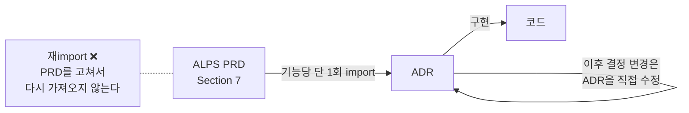



기능 하나를 ADR로 옮기고 나면, 그 기능의 요구사항을 소유하는 쪽은 ADR이다. PRD가 나중에 바뀌면 다시 import하지 않고 해당 ADR을 직접 고친다.

재import를 허용하면 안정적인 레이어(PRD)가 변덕스러운 레이어(코드)를 끌고 다니게 된다. Office Raid PRD가 방치된 것과 같은 경로다.

성경길의 지금 상태를 보면 이 규칙이 어떻게 작동했는지 보인다. 처음 import된 8개 카테고리가 지금은 **15개 카테고리 19개 ADR**로 늘어났다.

늘어난 7개는 PRD를 고쳐서 다시 가져온 게 아니다. 만들면서 새로 생긴 결정들이다 — 앱 전역 키보드 제어, 테마 선호, URL로 진도 넘기기, 옛말 풀이, 도량형 환산.

전부 `/adr-new`로 ADR 레벨에서 직접 추가됐다. ALPS 문서는 import 이후 한 줄도 수정하지 않았고, 결국 저장소에서 지웠다.

**PRD는 출발점이고 종착점이 아니다.** 이 도구를 쓰면서 제일 늦게 이해한 부분이다.

### 의존성이 구현 순서를 강제한다

6.3에서 그린 그래프는 `.mapping.json`의 `dependsOn` 필드로 옮겨간다.

```json
"chapter-turn": {
  "feature": "장 넘기기 & 완독 처리",
  "adrs": [{ "path": "docs/adr/chapter-turn/0001-chapter-turn-completion.md",
             "status": "Accepted (2026-07-13)", "summary": "..." }],
  "dependsOn": ["chapter-reading", "progress-storage"]
}
```

`/adr-impl chapter-turn`을 실행하면 에이전트가 먼저 이걸 확인한다.



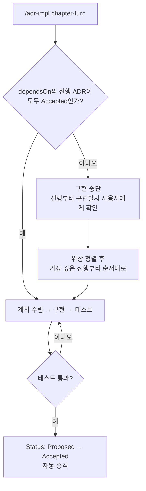



`chapter-reading`과 `progress-storage`가 아직 `Proposed`(미구현)면 **거기부터 구현한다.** 사용자가 입력한 순서보다 의존 순서가 우선한다.

Section 6.3에 그린 화살표가 구현 순서를 강제하는 조건이 되는 것이다. 다이어그램이 장식이 아니라 실행되는 제약이 됐다는 점이 이 연결의 핵심이라고 생각한다.

Status도 의도 표명이 아니다. `Accepted`는 "구현하고 테스트가 통과했다"는 사실이고, 테스트가 실패하면 승격되지 않는다.

### 매 턴마다 다시 주입한다

경계는 시간이 지나면 잊힌다. 특히 세션이 길어지고 컨텍스트가 압축되면 에이전트가 "ADR 먼저"라는 규칙을 잊는다.

그래서 `adr-writer`에는 `UserPromptSubmit` 훅이 하나 있다. 사용자가 메시지를 보낼 때마다 ADR 인덱스 스냅샷과 "동작을 바꾸기 전에 관련 ADR을 먼저 읽거나 작성하라"는 지시를 다시 주입한다.

이 훅은 편집을 막지 않는다. 그냥 매 턴 다시 말해준다. 사람이 잊는 것도 문제지만 에이전트가 잊는 게 더 자주 일어나기 때문이다.

### 사람의 판단이 필요 없는 검사는 기계가 한다

ADR 형식이 맞는지, 대안이 2개 이상 있는지, 본문 Status와 인덱스의 status가 일치하는지, 코드에 ADR 역참조가 새로 생기지 않았는지 — 이런 건 판단이 필요 없다.

그래서 LLM이 아니라 스크립트가 검사한다.

```bash
node <plugin>/scripts/adr-structure-lint.mjs [category]   # 구조 + 불변식
bash <plugin>/scripts/adr-invariants.sh                   # 역참조 검사만
```

특히 두 번째 스크립트가 하는 일이 이 글의 주제다. **코드가 ADR을 인용하는지, ADR이 PRD를 인용하는지** 검사한다. 역방향 화살표가 생기면 실패한다.

1절에서 말한 "문서에는 컴파일러가 없다"의 대안이 이것이다. 헥사고날에서는 어댑터가 포트를 잘못 참조하면 빌드가 깨지지만, 문서에서는 그 방향이 깨져도 아무 일이 일어나지 않는다. 그래서 그 검사를 스크립트로 만들어 붙였다.

한 방향 의존을 원칙이 아니라 **깨질 수 있는 검사**로 만들어두는 것. 이게 사람의 성실함에 의존하지 않는 유일한 방법이라고 생각한다.

## 5. 태스크는 휘발되고 있다

여기서 예전 글을 하나 정정해야 한다.

RFTCR에서 나는 다섯 단계를 제안했다. Requirement → Feature → Task → Code → Reflect.[^4] 그중 Task 단계에 대해 "TaskMaster 같은 도구로 세부 작업을 뽑고 의존 순서를 관리하라"고 썼다.

**지금은 그 단계가 문서로 남을 필요가 거의 없다고 생각한다.**



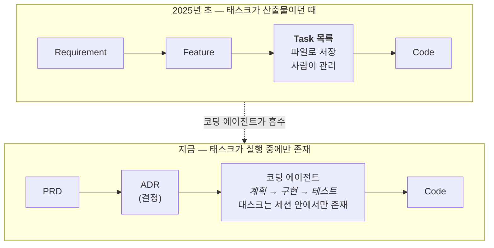



이유는 단순하다. 태스크 분해에서 사람이 하던 일 대부분을 코딩 에이전트가 세션 안에서 처리하게 됐다.

`/adr-impl` 하나를 실행하면 에이전트가 ADR을 읽고, vertical slice를 뽑고, 관련 코드를 찾고, 변경 계획을 세워 보여주고, 승인받고, 구현하고, 테스트를 돌린다. 이 과정에서 태스크는 확실히 존재한다. **다만 파일로 남지 않는다.**

그게 나쁜 게 아니라 오히려 맞는 방향이라고 생각한다. 태스크는 원래 가장 빨리 변하는 레이어였다. 파일로 남기는 순간 아무도 안 보는 문서가 하나 더 생긴다.

Office Raid PRD의 12단계 태스크 표가 정확히 그랬다. 그 표는 실제 구현 순서와 며칠 만에 어긋났고, 이후 아무도 안 봤다. **PRD의 수명을 태스크의 수명으로 끌어내린 것이다.**

지금 남겨야 하는 건 태스크나 코드 요약본이 아니라 **태스크를 다시 만들어낼 수 있는 상위 정보**다. 요약본은 생성되는 순간부터 stale해지고 원문과 drift할 가능성이 생긴다. 최신 모델은 요구사항과 코드를 직접 읽고 둘을 매핑할 능력이 충분하므로, 별도의 지속 컨텍스트로 복제해둘 실익이 작다.

| 남기는 것       | 변화 속도 | 왜                      |
| --------------- | ---- | ---------------------------- |
| PRD             | 느림 | 무엇을 왜 만드나             |
| ADR             | 중간 | 왜 그 대안인가, 도메인 규칙  |
| 의존성 그래프   | 중간 | 구현 순서를 매번 재계산 가능 |
| ~~태스크 목록~~ | 빠름 | 에이전트가 매번 다시 뽑는다  |

그래서 이 글의 도구들에는 태스크 파일을 만드는 명령이 없다. `dependsOn` 그래프만 남기고, 순서는 실행할 때마다 다시 계산한다.

RFTCR의 다섯 단계 중 T가 문서에서 사라지고 실행으로 녹아든 것. 이건 프레임워크가 틀렸다기보다 그 자리를 도구가 채운 결과라고 본다.

## 6. 요구사항이 아래 레이어로 내려가면 위 레이어는 지운다

플러그인이 두 개로 쪼개져 있는 이유도 경계 때문이다. `adr-writer`는 ALPS를 전혀 모르고, 결합은 `/feature-to-adr` 한 방향뿐이다.



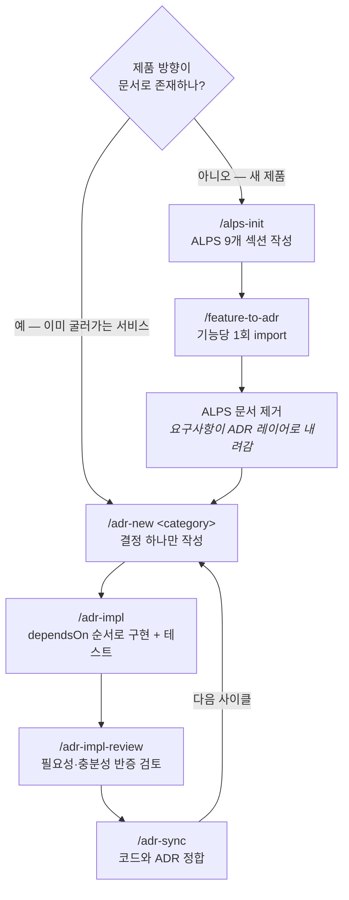



내 프로젝트들의 지금 상태는 이렇다.

| 프로젝트           | 첫 커밋 | ALPS 문서 | ADR 현황                            |
| ------------------ | ------- | --------- | ----------------------------------- |
| 성경길             | 2026-07 | 없음      | 15 카테고리 / 19 ADR (약 1,200줄)   |
| PixelBank          | 2025-09 | 없음      | 10 카테고리 / 약 60 ADR (약 5,200줄) |
| EncBird            | 2023-02 | 없음      | 20 카테고리 / 약 130 ADR (약 17,000줄) |
| ALPS/adr-writer    | 2026-03 | 없음      | 없음 (도구 저장소)                  |
| **합계**           |         |           | **약 210 ADR / 약 23,000줄**        |

제품 세 곳 다 PRD부터 썼는데, **지금은 어디에도 ALPS 문서가 없다.** `/feature-to-adr`로 기능을 다 넘긴 뒤 지웠다.

도구 저장소인 ALPS Writer와 `adr-writer`에는 애초에 둘 다 없다. 여기서 결정은 `docs/`의 설계 문서로 관리한다. 남의 프로젝트에 ADR을 쓰게 하는 도구라고 해서 자기 저장소에도 같은 구조를 강요할 이유는 없다고 봤다.

PRD를 처음 지울 때는 아까웠다. 공들여 쓴 9개 섹션인데.

그런데 남겨둘 이유를 찾지 못했다. 두 문서의 역할이 다르기 때문이다.

PRD는 Explore 단계에서 가설을 세우고 검증하는 문서다. 기능이 ADR로 다 넘어간 시점은 그 가설들이 이미 검증을 통과했다는 뜻이고, 검증이 끝난 가설은 더 이상 가설이 아니다.

그리고 구현된 코드를 판정하는 일은 PRD가 하지 않는다. 그건 기능 단위 요구사항을 담은 ADR의 일이다. 결정이 바뀔 때마다 고친 쪽도 ADR이었다.

즉 **PRD가 담고 있던 내용은 전부 아래 레이어로 내려간 상태다.** 제품 단위 가설은 검증 결과로, 기능 단위 요구사항은 ADR로. 그런데도 위 레이어에 파일을 남겨두면 같은 내용을 두 추상화 수준에서 이중으로 관리하게 되고, 실제로 갱신되는 쪽은 아래뿐이다. 위는 import 시점의 스냅샷으로 굳어서 읽으면 오히려 현재와 어긋난 정보를 준다.

같은 질문에 두 문서가 서로 다른 답을 주기 시작하면 **필요한 문서만 읽는다는 목표가 깨진다.** 어느 쪽이 맞는지 확인하려고 둘 다 읽어야 하니까. 그래서 층이 비면 그 층의 파일을 지운다.

이게 앞서 말한 "저장소에 남는 텍스트는 모두 최신이어야 한다"는 원칙의 결론이기도 하다. 최신으로 유지할 수 없는 문서라면 최신으로 유지하는 대신 지우는 선택지가 있다.

Office Raid PRD의 실패도 다시 보면 같은 얘기다. 그건 새 제품의 PRD가 아니라 **3년 된 시스템의 한 기능에 대한 PRD**였다. 애초에 ADR 레이어에서 다뤄야 할 범위를 PRD 레이어에 올려놓고, 그마저 정리하지 않았다.

그래서 지금은 이렇게 쓴다. **제품 방향이 머릿속에만 있으면 PRD부터, 이미 글로 있으면 결정부터. 어느 쪽이든 ADR로 넘어간 뒤에는 PRD를 남기지 않는다.**

ADR 개수 차이는 그냥 프로젝트 나이 차이다. 개수 자체가 목표는 아니고, 요구사항이 코드보다 먼저 글로 남았는지가 중요하다고 본다.

길이도 나이를 따라간다. ADR 평균이 성경길 62줄, PixelBank 88줄, EncBird 129줄이다. 결정이 쌓이면서 지켜야 할 요구사항과 기각된 대안이 함께 늘기 때문인데, 이게 좋은 신호인지는 아직 판단이 안 선다.

## 마치며

지금까지 쓴 내용은 정답이 아니다. **내가 생각한 방식대로 동작하는 시스템을 만들다 보니 이런 형태가 나온 것**에 가깝다.

두 플러그인이 하려는 일은 처음에 말한 두 가지뿐이다. 모델에게 지금 어느 레이어에 서 있는지 알려주는 관점을 주는 것, 그리고 C4 모델처럼 PRD·ADR·코드가 담을 정보의 수준을 제약해서 **필요할 때 그 레이어 문서만 읽으면 되는 상태**를 만드는 것. 이 글의 규칙들은 대부분 그 두 목표에서 따라 나온 결과다.

요구사항이 ADR 레이어로 내려가면 PRD를 지운다는 결론도, 태스크를 파일로 남기지 않는다는 선택도, 내 프로젝트들과 내 작업 방식에서 나왔다. 다른 제약을 가진 사람은 다른 답에 도달할 것이다.

애초에 에이전틱 엔지니어링에서는 자유도가 거의 무한하다고 생각한다. **비즈니스 요구사항을 만족하는 코드만 나오면 어떤 방식이든 되기 때문이다.** 이 글에서 ADR의 목표를 "같은 코드가 아니라 같은 요구사항을 지키는 코드"라고 했는데, 그 기준은 만드는 방식 자체에도 똑같이 적용된다.

그래서 이 글의 내용도 하나의 실험 결과로 읽어주시면 좋겠다. 여러 방식을 직접 돌려보고 각자의 인사이트를 실험해보는 시간이 되었으면 한다.

무엇을 시도하든, 요구사항 하나가 코드보다 먼저 글로 남는 것에서 시작하면 된다.

---

[^1]: [EncBird에 하네스를 한 겹씩 씌워온 과정](/2026/06/16/harness-engineering-in-practice.html) — PRD·ADR을 다른 모든 자동화의 기준점으로 놓는 이유와 PRD → ADR → 코드 단방향 의존성을 다룬다.

[^2]: [에이전틱 엔지니어링과 과도기적 기술들](/2026/05/11/direction-of-agentic-engineering.html) — human in the loop이 모델과 도구로 흡수되는 방향에 대한 이전 글.

[^3]: [ALPS Writer Plugins](https://github.com/haandol/alps-writer-plugins) — 마켓플레이스, 사용 가이드, 의존성 모델 문서. ADR 형식 자체의 원전은 [Documenting Architecture Decisions](https://cognitect.com/blog/2011/11/15/documenting-architecture-decisions).

[^4]: [RFTCR - 에이전트 주도 소프트웨어 개발을 위한 새로운 SDLC 프레임워크](/2025/05/11/rftcr-framework-for-agentic-dev.html) — 단계별 입출력의 추상화 수준을 C4 모델처럼 고정해야 한다는 논지. 이 글의 5절은 그중 Task 단계에 대한 정정이다.

[^5]: [성경길 Bible Atlas](https://bible-atlas.encbird.com) — ALPS 문서를 먼저 쓰고 시작한 사이드 프로젝트. 지금은 ADR만 남아 있다.

[^6]: 켄트 벡의 [The Product Development Triathlon](https://medium.com/@kentbeck_7670/the-product-development-triathlon-6464e2763c46) (2016) — Explore·Expand·Extract 세 단계로 나누는 3X 모델. 이 모델을 조직 관점으로 확장한 내용은 [조직의 AI 도입을 보는 렌즈](/2026/06/15/organizational-ai-adoption-3s.html) 참고.

[^7]: [현상을 해석하는 렌즈, 그리고 에이전틱 엔지니어링](/2026/06/12/lens-for-agentic-engineering.html) — 소프트웨어 개발을 비즈니스 요구사항의 컴파일 과정으로 보는 렌즈. 이 글의 문서 구분은 그 렌즈에서 따라 나온 결과다. 컴파일러 비유의 출발점은 [에이전틱 엔지니어링과 과도기적 기술들](/2026/05/11/direction-of-agentic-engineering.html).

[^8]: [쉽게 설명한 클린 / 헥사고날 아키텍쳐](/2022/02/13/demystifying-hexgagonal-architecture.html) — 포트와 어댑터, 의존성 역전이 실제로 어디서 일어나는지 정리한 이전 글. 원전은 앨리스터 코번의 [Hexagonal architecture](https://alistair.cockburn.us/hexagonal-architecture/).
