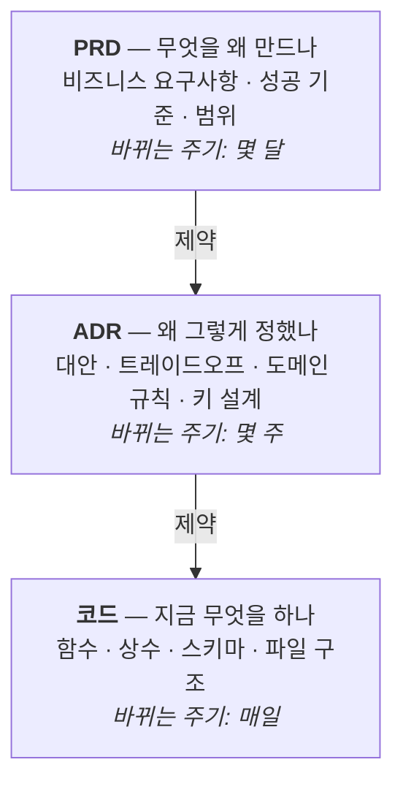
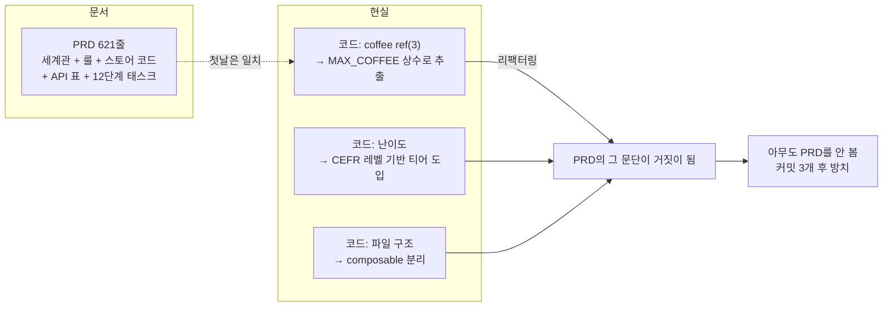
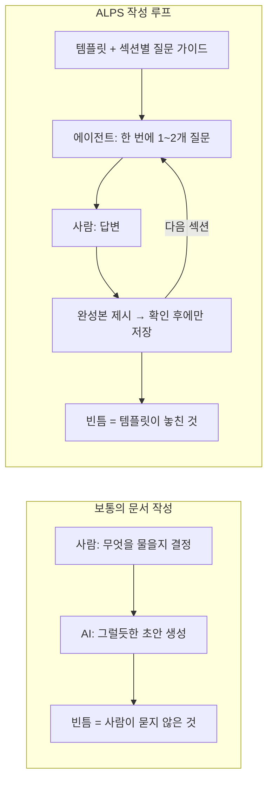
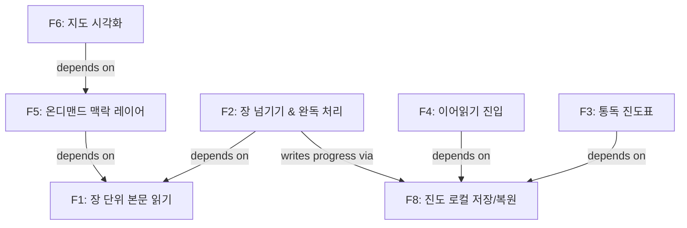
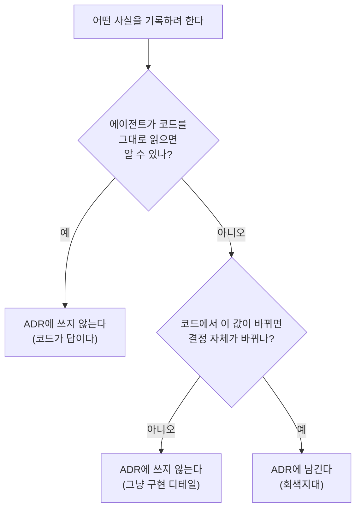
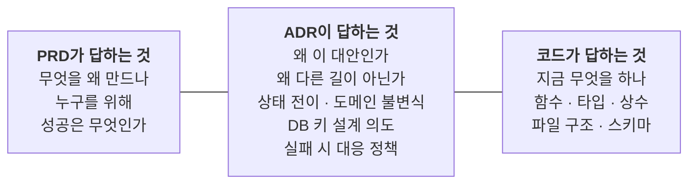
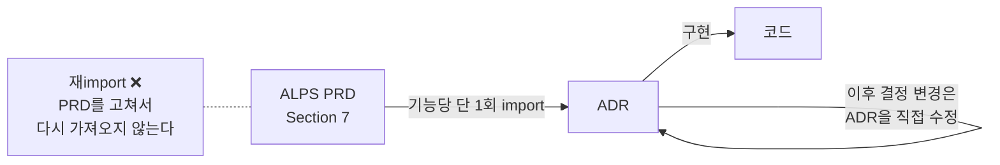
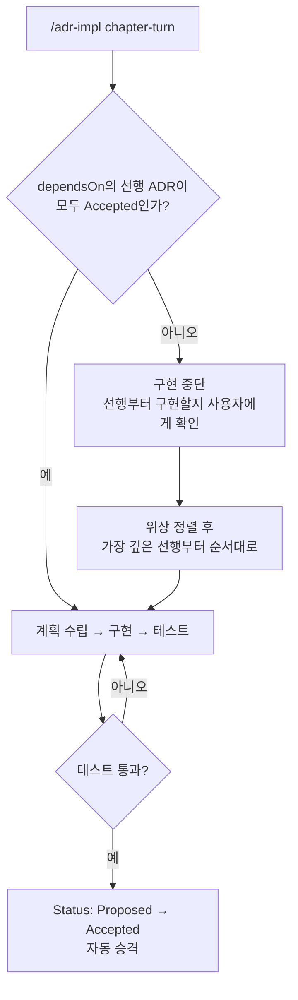
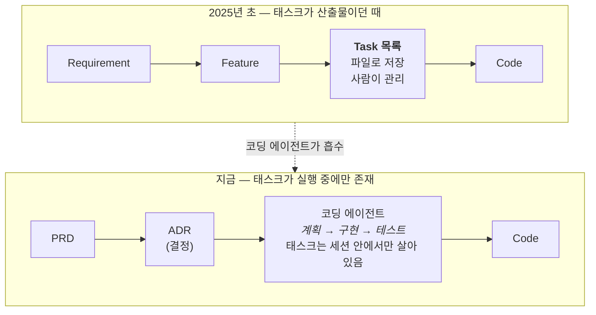
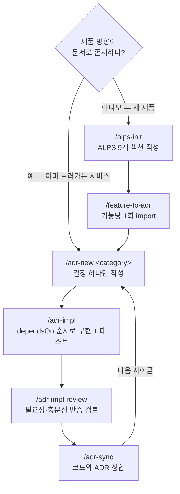

## TL;DR

- 저장소의 모든 텍스트는 최신 컨텍스트여야 한다.
- 요구사항과 코드는 ADR과 에이전트로 분리한다.
- 요약과 태스크는 세션 안에서만 휘발시킨다.

## 시작하며

최근 모델이 좋아지면서 에이전틱 개발에 필요했던 human in the loop의 많은 부분이 모델과 도구 안으로 흡수되고 있다.[^2] 개인적으로 이 방향을 가장 빠르게 밀어붙이는 곳은 Anthropic이라고 생각한다.

이 흐름에서 나는 세 가지 원칙을 중요하게 본다. **저장소에 남는 모든 텍스트는 일급 컨텍스트이며 항상 최신이어야 한다. 비즈니스·기술 요구사항은 source of truth이고, 코드는 그 결과물이어야 한다. 요약과 태스크 같은 구현 중간 산출물은 저장하지 않고 세션 안에서 휘발시켜야 한다.**

문제는 요구사항과 코드의 추상화 수준이 너무 다르다는 데 있다. 요구사항에서 코드로 의존성은 흐르되 둘이 서로 직접 참조하면 안 되고, 그 사이의 매핑은 코딩 에이전트가 매번 동적으로 수행해야 코드베이스가 깨끗하게 남는다.

그래서 실제 프로젝트에서 이 경계를 관리하는 [ALPS Writer](https://github.com/haandol/alps-writer-plugins)[^3]와 `adr-writer`를 만들어 쓰고 있다. 오늘은 PRD와 ADR을 하네스의 **0층**으로 두고, 비즈니스와 기술 컨텍스트를 어떻게 오래 살아 있게 만드는지 이야기해보려고 한다.[^1]

## 1. 0층 안에도 층이 있다

먼저 그림 하나로 시작하자. 0층이라고 뭉쳐 불렀지만, 그 안에도 층이 나뉜다.







층마다 **변하는 속도가 다르다.** 이게 층을 나누는 유일한 이유다.

비즈니스 요구사항은 몇 달에 한 번 바뀌고, 결정은 몇 주에 한 번 바뀌고, 코드는 매일 바뀐다.

그래서 논리적 의존 방향은 한 방향이어야 한다. 요구사항이 결정을 제약하고, 결정이 코드를 제약한다. 반대로 매일 바뀌는 코드가 상위 문서에 영향을 주면 몇 달에 한 번 바뀌어야 할 문서를 매일 고쳐야 한다.

**클린 아키텍처가 도메인을 프레임워크로부터 지키는 이유와 같다.** 도메인 로직이 ORM 클래스를 직접 참조하면 DB를 바꿀 때 비즈니스 규칙이 흔들린다. 그래서 화살표를 안쪽으로만 향하게 만든다.

문서도 똑같다. **PRD가 코드를 참조하면, 리팩터링 한 번에 PRD가 거짓이 된다.** 코드 역시 PRD나 ADR의 파일명·번호를 직접 참조하지 않는다. 실무에서 두 층을 잇는 일은 코딩 에이전트가 현재의 요구사항과 현재의 코드를 함께 읽고 동적으로 수행한다.

그리고 사람은 거짓이 된 문서를 고치지 않는다. 그냥 안 본다.

### 내가 실제로 침범한 사례

EncBird에 Office Raid라는 게임 모드를 붙일 때 쓴 PRD가 그랬다. 621줄이었고, 세계관과 게임 룰까지는 멀쩡했는데 중간부터 이런 게 들어갔다.

```
## Pinia 스토어 (`stores/officeRaid.ts`)

const coffee = ref(3)            // ☕ 남은 커피
const flow = ref(0)              // 연속 정답
const questionPool = ref<RaidQuestion[]>([])
```

```
## 구현 순서 (권장)

| 1 | 타입 정의 (`office-raid.ts`) | 없음 |
| 2 | Pinia 스토어 (`officeRaid.ts`) + composable | 타입 |
| 3 | 타이틀 화면 (flashcards/stats fetch) | 스토어 |
...
| 12 | 모바일 최적화 (터치, 반응형) | 전체 완성 후 |
```

PRD 안에 **변수 선언과 파일 경로와 12단계 태스크 목록**이 들어갔다. 쓸 때는 친절한 문서라고 생각했다.

결과는 이랬다.







실제로 지금 코드의 난이도 체계는 사용자의 CEFR 레벨로 티어를 나눈다. **PRD에는 CEFR이라는 단어가 한 번도 안 나온다.** 구현하면서 생긴 결정인데, PRD를 고칠 방법이 없었다. 그 문서는 이미 코드를 설명하는 문서가 되어 있었고, 코드가 앞서 나가버렸으니까.

같은 기능의 ADR은 반대였다. 142줄이고, 스토어 변수도 파일 경로도 없다. 대신 대안 6개와 그중 3개가 "초기 채택 후 폐기"된 이유가 적혀 있다.

```
| SRS due date 기반 표현 조회 | 기각 (초기 채택 후 폐기) | "많이 공부할수록 플레이 불가" 역설 발생 |
| Expression Gate (15개 미만 차단) | 기각 (초기 채택 후 폐기) | 신규 사용자 차단, 기본 표현으로 대체 |
```

이 문장들은 **코드를 아무리 리팩터링해도 거짓이 되지 않는다.** 그래서 두 달 뒤 후속 결정(무료 플레이, 게임 종료 후 표현 추천)을 추가할 때도 그 ADR 옆에 새 ADR을 놓는 것으로 끝났다. PRD는 손대지 않았다.

**PRD가 죽고 ADR이 살아남은 차이는 성실함이 아니라 그 문서가 어느 층에 머물렀느냐였다.**

RFTCR 글에서 C4 모델을 예로 들며 "단계별 입출력의 추상화 수준을 명확히 정의해야 한다"고 썼는데[^4], 그때는 그게 프로세스 표준화 얘기라고 생각했다. 지금은 **문서의 수명을 결정하는 문제**라고 본다.

## 2. ALPS로 PRD를 쓰는 이유

그럼 PRD는 어떻게 자기 층에 머물게 하나. 여기서 두 가지가 필요하다. 포맷을 고정하는 것, 그리고 작성 책임을 뒤집는 것.

PRD가 무너지는 지점은 보통 두 군데다.

**첫째, 포맷이 매번 새로 발명된다.** 팀마다, 문서마다 PRD 모양이 다르다. 섹션 이름도 다르고 상세 수준도 다르다.

에이전트는 이 문서가 무엇을 주장하는 문서인지부터 추측해야 한다. 사람도 내용을 쓰기 전에 형식을 다시 결정하느라 시간을 쓴다.

**둘째, 품질이 작성자 역량에 묶인다.** 경험 많은 PO가 쓴 PRD는 에이전트의 자유도를 적당히 조여주고, 그렇지 않은 PRD는 과잉 해석할 여지를 남긴다.

같은 제품인데 누가 문서를 썼느냐에 따라 생성된 코드가 달라진다.

ALPS(Agentic Lean Product Spec)는 이 둘을 각각 다르게 공격한다. 포맷은 **고정**해서 매번 결정하지 않게 하고, 작성 루프는 **뒤집어서** 완결성을 사람이 아니라 에이전트가 책임지게 한다.

### 고정된 포맷 — 9개 섹션

ALPS는 MVP 하나를 기술하는 데 필요한 것을 9개 섹션으로 못박는다.

| #   | 섹션                        | 담는 것                                   |
| --- | --------------------------- | ----------------------------------------- |
| 1   | Overview                    | 제품 맥락, 타깃 사용자, 핵심 문제         |
| 2   | MVP Goals and Key Metrics   | 성공의 측정 가능한 정의                   |
| 3   | Demo Scenario               | 나머지 문서를 붙잡아주는 구체적 시나리오  |
| 4   | High-Level Architecture     | 시스템 형태 — 구성요소, 경계, 데이터 흐름 |
| 5   | Design Specification        | 화면·플로우·에러 상태                     |
| 6   | Requirements Summary        | 기능·비기능 요구사항 종합                 |
| 7   | Feature-Level Specification | 기능별 vertical slice (UI → API → Data)   |
| 8   | MVP Metrics                 | Section 2 목표에 대응하는 계측            |
| 9   | Out of Scope                | 의도적으로 만들지 않을 것                 |

섹션을 나눈 방식에 세 가지 원칙이 깔려 있다.

**하나, 추상화 수준을 섞지 않는다.** 비즈니스 요구사항과 설계와 기술 요구사항이 각각 다른 섹션에 산다. "사용자가 즐거움을 느끼게"와 "POST /api/orders는 멱등키를 받는다"가 한 문단에 섞이지 않는다.

**둘, 기능을 vertical slice로 자른다.** Section 7의 각 기능은 UI에서 API를 거쳐 데이터까지 관통한다. 그래야 기능 하나가 독립적으로 구현·테스트·배포된다.

**셋, 하지 않을 것을 일급으로 둔다.** Section 9(Out of Scope)는 각주가 아니다. 에이전트가 **하지 말아야** 할 일을 명시적으로 적어두지 않으면, 팀이 일부러 미뤄둔 영역까지 코드가 번져나간다.

### 질문하는 쪽을 뒤집는다

포맷보다 더 중요한 게 작성 방식이라고 생각한다.

보통 우리가 AI로 문서를 쓸 때는 **사람이 묻고 AI가 답한다.** 이 구조에서는 사람이 무엇을 물어야 하는지 아는 만큼만 문서가 채워진다. 문서 품질의 상한이 작성자의 질문 실력이 된다.

ALPS Writer는 이걸 반대로 돌린다.







- **에이전트가 묻고 사람이 답한다.** 9개 섹션을 순서대로 돌면서 한 턴에 1~2개씩 좁은 질문을 던진다.
- **에이전트가 섹션을 임의로 생성하지 않는다.** 완성본을 보여주고 사람이 확인해야 저장된다.
- **섹션별 대화 가이드가 도구 안에 들어 있다.** 프로젝트가 바뀌어도 질문 흐름이 같다.

이러면 문서 품질의 상한이 **작성자의 PRD 실력**에서 **템플릿과 질문 프로토콜**로 옮겨간다. 도구를 개선하면 다음 프로젝트의 문서가 같이 좋아진다는 뜻이라, 나는 이게 이 도구의 핵심 설계라고 생각한다.

부수 효과로 문서 작성이 인터뷰가 된다. 백지 앞에서 "아키텍처 뭐 쓰지"를 고민하는 것보다, "지도 타일은 어디서 받아오실 건가요"에 답하는 게 훨씬 쉽다.

### 실제로 돌려보면

설치는 플러그인 두 개를 넣는 것으로 끝난다. npm이나 빌드 단계가 없다.

```
/plugin marketplace add haandol/alps-writer-plugins
/plugin install alps-writer@alps-writer   # PRD 작성 (MCP 서버 + /alps-init)
/plugin install adr-writer@alps-writer    # ADR 사이클 (/adr-new, /adr-impl, hook)
```

Codex를 쓴다면 `codex plugin add alps-writer@alps-writer` 형태로 같은 두 플러그인을 설치하고, 스킬을 `$alps-init`으로 부른다.

`/alps-init`을 치면 대화가 시작된다. [성경길](https://bible-atlas.encbird.com)[^5]이라는 사이드 프로젝트를 이걸로 시작했는데, 실제 흐름은 이랬다.

```
> /alps-init

## Section 1. Overview
이 섹션은 제품이 왜 존재하는지와 누구를 위한 것인지를 고정합니다.

먼저 이 프로젝트의 주된 목적이 무엇인가요?

> 성경을 장 단위로 읽는 걸 핵심 경험으로 하는 웹 서비스. 한 장 읽고
> 다음 장으로 넘기면 통독표에 자동으로 기록되게 하고 싶다.

좋습니다. 그럼 이 서비스를 가장 필요로 하는 사용자는 누구인가요?

> 통독에 도전하지만 꾸준히 이어가기 어려운 일반 신자.
> 지명이나 시대 배경이 낯설어서 맥락을 놓치는 사람들.
```

한 번에 하나씩 묻고, 하위 섹션이 다 채워지면 완성본을 보여준 뒤 확인을 받는다. 확인 전에는 파일에 아무것도 쓰지 않는다.

여기서 눈여겨볼 건 문서 순서와 **질문 순서가 다르다**는 점이다. 최종 문서는 1→9 번호 순이지만, 질문은 `1 → 2 → 3 → 4 → 6 → 5 → 7 → 8 → 9` 순으로 진행된다.

Section 5(Design)가 Section 6.1에서 정의한 Feature ID를 재사용하기 때문에, 요구사항을 먼저 확정하고 설계를 묻는다.

Section 6.1에서 기능 목록에 ID가 붙고, 6.3에서 그 기능들 사이의 의존성을 Mermaid로 그린다. 성경길에서 실제로 저장된 그래프는 이렇다.







이 그래프가 나중에 **구현 순서**를 강제한다. 그림 하나 그려놓고 끝나지 않는다는 점이 중요한데, 뒤에서 다시 나온다.

그리고 여기 절제 규칙이 하나 있다. **Section 7은 "무엇"만 적고 "왜 그렇게 골랐는지"는 적지 않는다.** 라이브러리 선택, 알고리즘, 컬럼 목록, 튜닝 상수는 여기 들어가지 않는다.

판별 기준은 단순하다. *DB를 바꿔도 여전히 참인 문장*이면 PRD에 남고, *선택을 정당화하는 문장*이면 ADR로 간다.

Office Raid PRD가 어긴 게 정확히 이 규칙이다. `coffee = ref(3)`은 DB를 바꾸면 거짓이 될 수도 있는 문장이었다.

## 3. ADR이 뭔가

여기서부터 뒷부분이다. ADR(Architecture Decision Record)은 이름이 거창한데 실물은 단순하다. **결정 하나를 기록한 마크다운 파일 하나**다.

ADR은 요구사항과 코드를 서로 참조시키지 않고도 둘 사이의 차이를 건널 수 있게 하는 추상화다. 요구사항에서 코드로 향하는 의존성은 유지하되, 실제 매핑은 에이전트가 ADR의 결정과 코드 자체를 읽어 그때그때 복원한다.

주니어 입장에서 제일 헷갈리는 건 "이건 코드 주석이랑 뭐가 다른가"일 텐데, 이렇게 생각하면 쉽다.







두 질문을 차례로 통과한 것만 남긴다. 이걸 `adr-writer`는 **두 단계 필터**라고 부른다.

한 질문만 쓰면 안 되는 이유가 있다. 두 번째 질문만 적용하면 "코드 읽으면 아는 결정 사실"까지 ADR에 들어와서, 코드를 고칠 때마다 ADR을 고쳐야 한다. 첫 질문으로 먼저 걸러야 한다.

이 필터를 통과하는 영역을 **회색지대**라고 부른다. 비즈니스 요구사항과 코드 사이에 떠 있는, 어느 쪽을 읽어도 안 나오는 것들이다.







구체적으로 ADR에 **넣지 않는** 것들이 규칙으로 박혀 있다. 실전에서 제일 자주 어기는 항목들이라 그대로 옮겨둔다.

| 금지                                  | 대신                         |
| ------------------------------------- | ---------------------------- |
| 파일 경로 (`app/components/Card.vue`) | 폴더 단위까지만              |
| 코드 스니펫 (Go struct, TS interface) | 코드 자체가 정답             |
| 함수/클래스 책임 분담                 | 코드와 docstring             |
| 구현 상수 (`MAX_RETRY = 3`)           | 개념만 ("재시도는 유한하다") |
| 환경 변수 이름·설정 키                | 설정 문서                    |
| 알고리즘 의사코드                     | 함수 본문                    |

그리고 **코드는 ADR 번호를 인용하지 않는다.** 이게 처음엔 이상하게 느껴졌다. 트레이서빌리티를 포기하는 것 같으니까.

이유는 방향 문제다. 코드 주석에 `// ADR dictionary/0012` 가 박히면, ADR을 정비할 때(번호 재정렬, 통합, 분할) 코드를 고쳐야 한다. **점선이 실선이 된다.**

```
Bad  (코드 안):     // ADR dictionary/0012: invalid 입력은 마커 캐시로 차단한다
Good (코드 안):     // invalid 입력은 결정론적이므로 캐시해 동일 입력 재시도 시 LLM 호출을 회피한다
Good (커밋 메시지): feat(dictionary): cache invalid phrase result (ADR dictionary/0012)
```

추적은 git이 한다. 코드가 궁금하면 `git blame` → 커밋 메시지 → ADR로 올라간다. 화살표가 여전히 한 방향이다.

## 4. 경계를 지키는 장치들

원칙만으로는 경계가 안 지켜진다. 나도 Office Raid PRD를 쓸 때 "PRD는 무엇만 적는다"는 걸 몰랐던 게 아니다. 쓰다 보니 넘어간 거다.

그래서 `adr-writer`에는 사람의 의지에 의존하지 않는 장치가 몇 개 있다.

### 한 방향으로만 흐르는 import

PRD에서 ADR로 넘어갈 때 `/feature-to-adr`를 실행한다. Section 7의 기능들을 ADR 초안으로 옮기는 단계다.

이 명령이 하는 일은 얇다. 기능 이름에서 카테고리 키를 뽑고(`장 단위 본문 읽기` → `chapter-reading`), 6.3 그래프를 위상 순서로 정렬하고, ADR 작성 자체는 `/adr-new`에 넘긴다.

여기 반드시 짚어야 할 규칙이 하나 있다. **이 import는 일회성이다.**







기능 하나를 ADR로 옮기고 나면, 그 결정의 주인은 ADR이다. PRD가 나중에 바뀌면 다시 import하지 않고 해당 ADR을 직접 고친다.

재import를 허용하면 안정적인 층(PRD)이 변덕스러운 층(코드)을 끌고 다니게 된다. Office Raid PRD가 죽은 것과 같은 경로다.

성경길의 지금 상태를 보면 이 규칙이 어떻게 작동했는지 보인다. 처음 import된 8개 카테고리가 지금은 **15개 카테고리 19개 ADR**로 늘어났다.

늘어난 7개는 PRD를 고쳐서 다시 가져온 게 아니다. 만들면서 새로 생긴 결정들이다 — 앱 전역 키보드 제어, 테마 선호, URL로 진도 넘기기, 옛말 풀이, 도량형 환산.

전부 `/adr-new`로 ADR 레벨에서 직접 추가됐고, ALPS 문서는 첫 커밋 이후 한 번도 수정하지 않았다.

**PRD는 출발점이고 종착점이 아니다.** 이 도구를 쓰면서 제일 늦게 이해한 부분이다.

### 의존성이 구현 순서를 강제한다

6.3에서 그린 그래프는 `.mapping.json`의 `dependsOn` 필드로 옮겨간다.

```json
"chapter-turn": {
  "feature": "장 넘기기 & 완독 처리",
  "adrs": [{ "path": "docs/adr/chapter-turn/0001-chapter-turn-completion.md",
             "status": "Accepted (2026-07-13)", "summary": "..." }],
  "dependsOn": ["chapter-reading", "progress-storage"]
}
```

`/adr-impl chapter-turn`을 실행하면 에이전트가 먼저 이걸 확인한다.







`chapter-reading`과 `progress-storage`가 아직 `Proposed`(미구현)면 **거기부터 구현한다.** 사용자가 입력한 순서보다 의존 순서가 우선한다.

Section 6.3에 그린 화살표가 구현 순서를 강제하는 조건이 되는 것이다. 다이어그램이 장식이 아니라 실행되는 제약이 됐다는 점이 이 연결의 핵심이라고 생각한다.

Status도 의도 표명이 아니다. `Accepted`는 "구현하고 테스트가 통과했다"는 사실이고, 테스트가 실패하면 승격되지 않는다.

### 매 턴마다 다시 주입한다

경계는 시간이 지나면 잊힌다. 특히 세션이 길어지고 컨텍스트가 압축되면 에이전트가 "ADR 먼저"라는 규칙을 잊는다.

그래서 `adr-writer`에는 `UserPromptSubmit` 훅이 하나 있다. 사용자가 메시지를 보낼 때마다 ADR 인덱스 스냅샷과 "동작을 바꾸기 전에 관련 ADR을 먼저 읽거나 작성하라"는 지시를 다시 주입한다.

이 훅은 편집을 막지 않는다. 그냥 매 턴 다시 말해준다. 사람이 잊는 것도 문제지만 에이전트가 잊는 게 더 자주 일어나기 때문이다.

### 사람의 판단이 필요 없는 검사는 기계가 한다

ADR 형식이 맞는지, 대안이 2개 이상 있는지, 본문 Status와 인덱스의 status가 일치하는지, 코드에 ADR 역참조가 새로 생기지 않았는지 — 이런 건 판단이 필요 없다.

그래서 LLM이 아니라 스크립트가 검사한다.

```bash
node <plugin>/scripts/adr-structure-lint.mjs [category]   # 구조 + 불변식
bash <plugin>/scripts/adr-invariants.sh                   # 역참조 검사만
```

특히 두 번째 스크립트가 하는 일이 이 글의 주제다. **코드가 ADR을 인용하는지, ADR이 PRD를 인용하는지** 검사한다. 역방향 화살표가 생기면 실패한다.

한 방향 의존을 원칙이 아니라 **깨질 수 있는 검사**로 만들어두는 것. 이게 사람의 성실함에 의존하지 않는 유일한 방법이라고 생각한다.

## 5. 태스크는 휘발되고 있다

여기서 예전 글을 하나 정정해야 한다.

RFTCR에서 나는 다섯 단계를 제안했다. Requirement → Feature → Task → Code → Reflect.[^4] 그중 Task 단계에 대해 "TaskMaster 같은 도구로 세부 작업을 뽑고 의존 순서를 관리하라"고 썼다.

**지금은 그 단계가 문서로 남을 필요가 거의 없다고 생각한다.**







이유는 단순하다. 태스크 분해에서 사람이 하던 일 대부분을 코딩 에이전트가 세션 안에서 처리하게 됐다.

`/adr-impl` 하나를 실행하면 에이전트가 ADR을 읽고, vertical slice를 뽑고, 관련 코드를 찾고, 변경 계획을 세워 보여주고, 승인받고, 구현하고, 테스트를 돌린다. 이 과정에서 태스크는 확실히 존재한다. **다만 파일로 남지 않는다.**

그게 나쁜 게 아니라 오히려 맞는 방향이라고 생각한다. 태스크는 원래 층이 가장 낮고 가장 빨리 변하는 것이었다. 파일로 남기는 순간 아무도 안 보는 문서가 하나 더 생긴다.

Office Raid PRD의 12단계 태스크 표가 정확히 그랬다. 그 표는 실제 구현 순서와 며칠 만에 어긋났고, 이후 아무도 안 봤다. **PRD의 수명을 태스크의 수명으로 끌어내린 것이다.**

지금 남겨야 하는 건 태스크나 코드 요약본이 아니라 **태스크를 다시 만들어낼 수 있는 상위 정보**다. 요약본은 생성되는 순간부터 stale해지고 원문과 drift할 가능성이 생긴다. 최신 모델은 요구사항과 코드를 직접 읽고 둘을 매핑할 능력이 충분하므로, 별도의 지속 컨텍스트로 복제해둘 실익이 작다.

| 남기는 것       | 층   | 왜                           |
| --------------- | ---- | ---------------------------- |
| PRD             | 느림 | 무엇을 왜 만드나             |
| ADR             | 중간 | 왜 그 대안인가, 도메인 규칙  |
| 의존성 그래프   | 중간 | 구현 순서를 매번 재계산 가능 |
| ~~태스크 목록~~ | 빠름 | 에이전트가 매번 다시 뽑는다  |

그래서 이 글의 도구들에는 태스크 파일을 만드는 명령이 없다. `dependsOn` 그래프만 남기고, 순서는 실행할 때마다 다시 계산한다.

RFTCR의 다섯 단계 중 T가 문서에서 사라지고 실행으로 녹아든 것. 이건 프레임워크가 틀렸다기보다 그 자리를 도구가 채운 결과라고 본다.

## 6. 그래서 언제 PRD를 쓰고 언제 건너뛰나

플러그인이 두 개로 쪼개져 있는 이유도 경계 때문이다. `adr-writer`는 ALPS를 전혀 모르고, 결합은 `/feature-to-adr` 한 방향뿐이다.







내 프로젝트들이 실제로 이 두 경로에 갈려 있다.

| 프로젝트  | 첫 커밋 | ALPS 문서                  | ADR 현황              | 진입 경로 |
| --------- | ------- | -------------------------- | --------------------- | --------- |
| 성경길    | 2026-07 | 있음 (9섹션·기능 8개)      | 15 카테고리 / 19 ADR  | PRD-first |
| PixelBank | 2025-09 | 없음                       | 10 카테고리 / 57 ADR  | ADR-only  |
| EncBird   | 2023-02 | 없음 (죽은 게임모드 PRD만) | 20 카테고리 / 132 ADR | ADR-only  |

성경길은 아무것도 없는 상태에서 시작했으니 PRD부터 썼다. 무엇을 만들지가 내 머릿속에만 있었기 때문이다.

PixelBank와 EncBird는 이미 굴러가고 있던 서비스라 PRD를 소급해서 쓰지 않았다. PixelBank의 `docs/adr/WORKFLOW.md`에는 아예 이렇게 적어뒀다.

```
> 이 리포는 ALPS(PRD) 문서를 두지 않는다. 결정은 ADR 레벨에서 직접 관리한다.
```

이미 코드가 있는 프로젝트에 PRD를 소급 작성하면, 그 PRD는 코드를 설명하는 문서가 된다. 그러면 방향이 뒤집혀 PRD가 코드에 종속되고, 결국 아무도 안 보는 문서가 된다.

Office Raid PRD가 실패한 진짜 이유도 이거였다. 그건 새 제품의 PRD가 아니라 **3년 된 시스템의 한 기능에 대한 PRD**였다. 그 자리에 필요했던 건 PRD가 아니라 ADR이었다.

그래서 나는 이렇게 나눠 쓰고 있다. **제품이 없을 때는 PRD부터, 제품이 있을 때는 결정부터.**

ADR 개수 차이는 그냥 프로젝트 나이 차이다. 개수 자체가 목표는 아니고, 결정이 코드보다 먼저 글로 남았는지가 중요하다고 본다.

## 마치며

프로덕션에서 하네스 0층을 유지한다는 건 문서를 많이 쓰는 게 아니었다. **각 문서가 자기 층에 머무르게 만드는 일**이었다.

저장소에 남기는 텍스트는 모두 에이전트가 읽을 일급 컨텍스트로 취급하고 최신으로 유지해야 한다. 그 비용을 감당할 가치가 없는 태스크와 요약은 애초에 남기지 않는 편이 낫다.

클린 아키텍처가 도메인을 프레임워크로부터 지키고, DDD가 바운디드 컨텍스트 경계를 지키는 이유와 같다. 빠르게 변하는 것이 느리게 변하는 것을 오염시키지 못하게 막는 것.

그리고 그 경계는 원칙으로는 안 지켜진다. Office Raid PRD를 쓸 때 나도 원칙은 알고 있었다.

지켜지게 만드는 건 장치다. 한 방향으로만 흐르는 import, 매 턴 다시 주입되는 훅, 역참조를 잡아내는 검사 스크립트, 판단 없이 돌아가는 lint.

이게 위층 하네스와 똑같은 패턴이라는 점이 흥미롭다. 사람이 매번 메우던 빈틈을 찾아서, 그 자리에 파일 한 겹을 덧대는 것.[^1] 0층도 결국 같은 방식으로 버틴다.

동시에 층 하나는 사라지는 중이다. 태스크와 구현 요약은 이제 파일이 아니라 에이전트 세션 안에서만 존재한다. 남겨야 할 건 중간 산출물이 아니라 그것을 다시 뽑아낼 수 있는 요구사항과 결정이다.

이미 돌아가는 시스템에 0층을 깔고 싶다면, PRD를 소급 작성하지 말고 다음에 손댈 기능 하나에 `/adr-new`부터 써보시길 권한다.

결정 하나가 코드보다 먼저 글로 남는 것, 거기서 시작하면 된다.

---

[^1]: [EncBird에 하네스를 한 겹씩 씌워온 과정](/2026/06/16/harness-engineering-in-practice.html) — PRD·ADR을 하네스의 0층으로 놓는 이유와 PRD → ADR → 코드 단방향 의존성을 다룬다. 하네스 개념 자체는 [쉽게 설명한 하네스 엔지니어링](/2026/03/15/harness-engineering-beyond-context-engineering.html) 참고.

[^2]: [에이전틱 엔지니어링과 과도기적 기술들](/2026/05/11/direction-of-agentic-engineering.html) — human in the loop이 모델과 도구로 흡수되는 방향에 대한 이전 글.

[^3]: [ALPS Writer Plugins](https://github.com/haandol/alps-writer-plugins) — 마켓플레이스, 사용 가이드, 의존성 모델 문서. ADR 형식 자체의 원전은 [Documenting Architecture Decisions](https://cognitect.com/blog/2011/11/15/documenting-architecture-decisions).

[^4]: [RFTCR - 에이전트 주도 소프트웨어 개발을 위한 새로운 SDLC 프레임워크](/2025/05/11/rftcr-framework-for-agentic-dev.html) — 단계별 입출력의 추상화 수준을 C4 모델처럼 고정해야 한다는 논지. 이 글의 5절은 그중 Task 단계에 대한 정정이다.

[^5]: [성경길 Bible Atlas](https://bible-atlas.encbird.com) — ALPS 문서를 먼저 쓰고 시작한 사이드 프로젝트.
