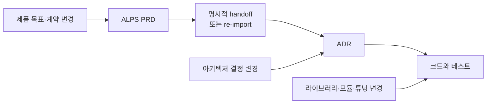

## TL;DR

- PRD, ADR과 코드는 같은 시스템의 서로 다른 해상도다.
- Agent는 세 계층을 연결하는 일시적인 오케스트레이션 계층이다.
- 계층 분리는 변경 전파와 사람이 검토할 범위를 줄인다.

## 시작하며

ALPS Writer Plugins 저장소의 `AGENTS.md` 첫 부분에는 저장소 전체를 관통하는 설계 원칙이 하나 적혀 있다.

PRD, ADR과 코드는 **같은 시스템을 서로 다른 해상도로 본 결과**라는 원칙이다.[^1]

이 원칙을 실제 규칙으로 옮기면서 몇 가지 제약이 생겼다.

PRD의 Architecture에는 C4 Context와 Container까지만 둔다. ADR에는 라이브러리, SDK와 파일 경로를 넣지 않는다. ADR과 코드, PRD와 ADR 사이의 경로도 문서 본문에 저장하지 않는다.

처음에는 이런 규칙을 문서 drift를 막기 위한 정리 방법 정도로 생각했다.

직접 적용해보니 문서 drift보다 더 크게 체감한 변화가 있었다.

Agent가 작업마다 모든 문서를 읽지 않아도 됐다. 코드 리팩터링이 상위 문서 수정으로 번지지 않았고, 구현 방법을 미리 고정하지 않으면서도 사람은 계약과 위험을 검토할 수 있었다.

이 글에서는 현재 ALPS Writer Plugins의 설계를 기준으로, 추상화 계층을 구별하면 실제로 무엇이 좋아지는지 정리한다.

## 1. 같은 시스템을 세 가지 해상도로 본다

C4 모델이 하나의 시스템을 Context, Container와 Component로 확대해 보여주듯이, PRD, ADR과 코드도 같은 시스템을 확대하면서 본다.

이 그림은 실제 호출 순서가 아니라 정보의 해상도, 지속성과 의존 방향을 Clean Architecture의 타겟 형태로 단순화한 개념도다.

가장 안쪽에는 사용자 문제, 제품 의도와 기능 계약을 담은 ALPS PRD가 있다. 가장 오래 유지되어야 하며, 파일 경로나 기술 목록과 구현 계획은 넣지 않는다.

그 바깥의 ADR은 선택 근거, 대안, 정확한 요구사항과 시스템 경계를 담는다. SDK, 함수 시그니처, 내부 호출 흐름과 튜닝값은 더 바깥의 코드와 테스트에 남긴다.

의존성은 바깥에서 안쪽의 계약을 향한다. 반대로 변경 빈도는 바깥쪽으로 갈수록 높아진다.

Context 다이어그램에 클래스까지 그리면 더 자세해지기는 하지만, Context 수준의 질문에는 오히려 답하기 어려워진다. 각 원의 해상도도 넣지 않는 내용으로 분명해진다.

ALPS Writer에서는 이를 `single-level read test`로 확인한다.

> 이 계층 하나만 읽고 자신의 질문에 답할 수 있는가? 아래 계층의 내용이 섞이지 않았고, 다른 어느 곳에도 없는 계약이 빠지지 않았는가?

## 2. Agent가 계층 사이를 오케스트레이션한다

Clean Architecture의 Use Case나 Hexagonal Architecture의 Application Service는 비즈니스 흐름을 오케스트레이션한다.[^2]

입력 Adapter에서 요청을 받고, Domain Model을 호출하고, Port를 통해 외부 Adapter와 통신한다. 구체적인 DB client나 web framework에 직접 의존하지 않고, Port라는 계약에 의존하도록 만들어 의존성을 역전한다.

ALPS Writer에서는 Agent가 비슷한 역할을 맡는다.

Agent는 PRD에서 제품 의도와 기능 계약을 읽고, ADR 해상도에서 오래 유지할 결정과 구현 재량을 분리한다. 구현할 때는 ADR을 기준으로 현재 코드를 찾고, Skill·MCP·CLI를 사용해 코드를 수정하고 테스트한 뒤 검토 증거를 만든다.

타겟 그림에서 Agent를 원 안에 넣지 않은 이유도 여기에 있다. Agent는 세 계층을 가로질러 작업하지만 어느 계층의 내용을 영속적으로 소유하지 않는다.

둘은 같은 역할을 하지만 구조까지 같지는 않다. Use Case나 Application Service는 코드로 남지만, Agent가 만든 오케스트레이션 계획은 일시적이다.

Agent는 네 번째 권위 문서가 아니다.

작업 계획, 검색 결과, sub-agent 구성과 중간 검토 자료는 실행 중에만 필요하다. 작업이 끝나면 제품 의도는 PRD, 결정과 계약은 ADR, 현재 동작은 코드와 테스트에 남는다.

다음 실행의 Agent는 이 문서들을 읽고 오케스트레이션을 다시 구성한다. 이전 Agent의 내부 상태나 숨은 registry를 복구할 필요가 없다.

나는 이를 개발 워크플로우 수준의 Dependency Inversion으로 볼 수 있다고 생각한다. 지속되는 문서가 특정 Agent, model이나 plugin 내부 상태에 의존하지 않고, 교체 가능한 Agent가 문서의 계약에 의존하기 때문이다.

그래서 plugin을 제거하거나 model을 바꿔도 PRD, ADR과 코드는 그대로 읽을 수 있다. Agent의 실행 방식은 바뀌어도 계약과 검증 결과를 지키면 된다.

Clean Architecture에서 추상화 계층이 복잡도를 추가하듯이 이 구조도 분류 비용이 생긴다. 작은 프로젝트에서는 PRD, ADR과 코드 전체를 나눠 얻는 이득이 크지 않을 수 있다.

## 3. 질문 하나에 문서 하나만 읽는다

사용자 가입을 왜 만들어야 하는지 알고 싶다면 PRD를 읽으면 된다.

Refresh token의 유효기간을 왜 7일로 정했는지 알고 싶다면 ADR을 읽는다. 실제 rotation 로직과 캐시 키가 궁금할 때만 코드로 내려간다.

각 문서가 자기 질문에 혼자 답하면 Agent도 작업에 필요한 계층만 읽고 멈출 수 있다.

ALPS Writer는 이 이득을 꽤 강하게 밀어붙인다.

`/feature-to-adr` handoff가 끝난 뒤의 일반 구현과 리뷰는 PRD를 다시 읽지 않는다. `.mapping.json`에는 ADR의 경로, 상태, 요약과 실제 선행 계약만 기록하고, PRD 경로나 코드 경로는 저장하지 않는다.

ADR 본문에도 PRD의 Section 번호, Feature ID, 함수와 파일 경로를 넣지 않는다. 관련 코드는 ADR을 읽은 Agent가 현재 저장소에서 다시 찾는다.

경로를 미리 저장하면 당장은 편하지만 rename과 refactoring 뒤에는 오래된 링크가 된다. 그때부터 Agent는 문서와 검색 결과 중 어느 쪽이 맞는지 다시 판단해야 한다.

반대로 필요한 순간에 검색하면 현재 코드를 기준으로 찾을 수 있다. 읽는 컨텍스트가 줄고, 오래된 하위 계층의 정보가 상위 판단에 끼어드는 일도 줄어든다.

## 4. 변경이 필요한 계층에서 멈춘다

세 계층의 변경 빈도는 같지 않다.

함수와 모듈은 자주 바뀌고, 아키텍처 결정은 가끔 바뀌며, 사용자 문제와 제품 목표는 상대적으로 오래간다. ALPS Writer에서는 이를 `Code >> ADR >> PRD`라는 stability gradient로 본다.

계층이 잘 나뉘면 변경은 자신의 해상도에서 멈춘다.





저장소의 PRD Architecture ADR은 C4 Context와 Container, 그리고 재구현 뒤에도 유지할 제약만 허용한다. Component 구조, 프레임워크, SDK, ORM과 내부 배포 도구는 코드에서 다시 찾을 수 있으므로 PRD에 올리지 않는다.

ADR도 `admission gate`를 통과한 결정만 만든다. 요구사항 계약, 데이터·보안 경계, 외부 provider와 fallback, 여러 구현을 계속 제약하는 trade-off가 대상이다. 같은 계약을 유지한 채 바꿀 수 있는 라이브러리, credential plumbing과 모듈 구조는 코드에 둔다.

이렇게 하면 SDK 교체나 파일 이동이 ADR 수정을 끌고 가지 않는다. 프레임워크를 바꿔도 제품의 시스템 경계가 그대로라면 PRD를 고칠 이유가 없다.

같은 결정의 대안이 바뀌었을 때도 새 ADR을 계속 만들지 않는다. ADR 본문은 현재 결정만 보여주고, 중요한 변화의 이력은 `decision-log.md`, 문장 단위의 전체 변경은 Git이 맡는다.

현재 상태, 중요한 전환과 전체 diff를 한 문서에 쌓지 않으므로 결정의 변경 횟수만큼 ADR이 늘어나지 않는다.

PRD를 다시 import할 때도 문장 순서와 표현만 달라졌다면 아무것도 바꾸지 않는다. 실제 계약이나 경계가 달라졌을 때만 ADR 변경 제안이 생긴다.

결과적으로 문서 변경량이 코드 변경량을 따라 폭증하지 않는다.

## 5. 계약은 완전하게, 구현은 열어둔다

추상화 계층을 나누면 Agent에게 구현 재량을 더 줄 수 있다.

ALPS Writer의 regeneration test는 같은 코드를 다시 만들 수 있는지를 묻지 않는다. 코드를 전부 지우더라도 같은 요구사항과 경계를 지키는 다른 구현을 만들 수 있는지를 묻는다.

예를 들어 `refresh token은 7일 동안 유효하다`가 가격이나 보안 정책이라면 정확한 7일과 그 근거를 ADR에 남긴다.

반면 그 정책을 어떤 SDK, 함수, 캐시 자료구조와 모듈로 구현할지는 코드의 선택이다. 다음 Agent가 현재 저장소의 관례와 도구에 맞는 방식을 고를 수 있다.

7일이라는 값이 ADR과 코드 양쪽에 존재하는 것은 중복이 아니다. ADR은 바꾸면 안 되는 계약과 근거를 담고, 코드는 그 계약을 실제로 강제한다.

코드만 보면 현재 값이 7일이라는 사실은 알 수 있어도, 개발자가 자유롭게 바꿀 수 있는 튜닝값인지 제품 계약인지는 알기 어렵다.

그래서 요구사항 값, 상태, 권한, 순서와 실패 보장은 ADR에 남기고, identifier와 representation은 코드에 둔다.

이 상태를 **계약은 완전하고 구현은 열려 있는 상태**라고 볼 수 있다.

계약을 지키는 한 Agent는 리팩터링하고, 더 적합한 라이브러리를 고르고, 내부 구조를 바꿀 수 있다. 사람이 구현 계획을 미리 작성하지 않아도 자율성의 경계는 남는다.

## 6. 사람이 판단할 범위가 줄어든다

계층을 구별하면 리뷰도 코드 전체에서 시작하지 않아도 된다.

ALPS Writer의 ADR은 요구사항을 독립적인 행으로 나누고, 특정 테스트 파일이나 함수 대신 구현과 무관하게 관찰할 수 있는 증거를 함께 적는다.

Agent는 이 계약을 기준으로 구현과 테스트를 진행한 뒤, 계약별 상태와 증거, 구현 중 선택한 내용과 남은 위험을 구현 검토 보고서(`Evidence Package`)로 만든다.

이 보고서는 새로운 권위 문서가 아니라 ADR과 코드에서 파생한 일시적인 검토 자료다. 다음 구현의 기준으로 쌓지 않는다.

사람은 먼저 아래 내용을 본다.

- 승인한 계약이 모두 검증됐는가
- Agent가 계약 밖에서 선택한 구현 재량은 무엇인가
- 새 계약이나 사람의 판단이 필요한 위험이 남았는가

증거가 부족하거나 보안, 결제와 데이터 변경처럼 구현 방식 자체가 위험한 부분만 코드로 내려가면 된다.

모든 코드를 읽지 않는다는 뜻은 아니다. **어디부터 읽고, 어느 부분까지 내려갈지를 계약과 위험으로 정할 수 있다는 뜻**이다.[^3]

이 경계가 없으면 Agent가 구현에서 줄인 시간을 사람이 전체 diff를 이해하는 데 다시 쓴다. 경계가 있으면 반복적인 구현 계획 승인을 줄이고, 사람의 판단을 계약 변경, 모순과 검증하지 못한 위험에 집중할 수 있다.

## 7. 계층을 나눌 때 쓰는 세 가지 질문

ALPS Writer에서는 정보를 어느 계층에 둘지 아래 순서로 확인한다.

1. **이 내용이 사라지면 다시 만든 코드가 요구사항을 위반할 수 있는가?**

   그렇다면 요구사항을 맡는 PRD나 ADR에 남긴다. 정확한 제한값, 허용 상태, 권한, 순서와 실패 보장이 여기에 해당한다.

2. **요구사항이 아니라면 코드나 결정적 도구로 다시 찾을 수 있는가?**

   그렇다면 코드와 테스트에 둔다. 라이브러리, SDK, 시그니처, 모듈 배치와 튜닝값은 보통 여기서 끝난다.

3. **코드만으로는 선택 이유를 알 수 없고, 바꾸면 오래 유지할 결정이 달라지는가?**

   그렇다면 ADR에 선택 근거, 대안, trade-off와 경계를 남긴다.

같은 기술 이름도 답이 달라질 수 있다.

Amazon Bedrock을 외부 model provider 경계로 채택하고 fallback 정책을 정하는 일은 ADR 대상이 될 수 있다. 그 결정을 구현하는 SDK, credential provider chain과 signer는 같은 경계를 유지하는 한 코드 수준이다.

기술 이름이 들어갔는지가 아니라, 그 선택이 어떤 계약과 경계를 고정하는지를 봐야 한다.

마지막에는 다시 single-level read test를 적용한다. 문서 하나가 자기 질문에 답하지 못하거나, 아래 계층이 바뀔 때마다 함께 고쳐야 한다면 경계를 다시 봐야 한다.

## 마치며

ALPS Writer Plugins에서 추상화 계층을 나눈 뒤 체감한 변화는 실행 쪽에 있었다.

Agent가 질문에 필요한 계층만 읽을 수 있게 됐다. 라이브러리와 파일 구조를 바꿔도 ADR과 PRD는 그대로 남았고, 계약을 고정하면서 구현 방법은 열어둘 수 있었다.

리뷰에서도 사람이 모든 구현을 다시 구성하기보다 계약, 증거와 예외부터 확인할 수 있게 됐다.

Agent는 세 계층을 오가며 작업을 오케스트레이션하지만, 어느 계층의 권위를 대신하거나 자신의 실행 상태를 다음 작업의 전제로 남기지 않는다.

지금은 코드 리팩터링이 ADR 수정을 요구하면 먼저 ADR의 해상도가 너무 낮은지 확인한다. 구현을 시작할 때 PRD를 다시 읽어야 한다면 handoff에서 계약이 빠졌는지 본다. 코드의 값이 계약인지 우연한 선택인지 구분할 수 없다면 ADR에 근거가 부족한지 확인한다.

추상화 계층을 잘 나누면 **한 번에 읽을 범위와 변경이 번질 범위가 줄어든다.** 그 경계 안에서 Agent와 사람이 판단할 내용도 나눌 수 있다.

---

[^1]: [ALPS Writer Plugins](https://github.com/haandol/alps-writer-plugins)의 현재 설계 원칙은 [AGENTS.md](https://github.com/haandol/alps-writer-plugins/blob/main/AGENTS.md), [ADR concepts](https://github.com/haandol/alps-writer-plugins/blob/main/plugins/adr-writer/templates/adr/concepts.md), [Dependency model](https://github.com/haandol/alps-writer-plugins/blob/main/docs/dependency-model.md)에 정리되어 있다.

[^2]: [쉽게 설명한 클린 / 헥사고날 아키텍쳐](/2022/02/13/demystifying-hexgagonal-architecture.html) — 추상화 계층으로 의존성을 줄이는 방식과 그에 따른 복잡도를 설명한 이전 글.

[^3]: [AI로 코드는 빨리 만들었는데 왜 리뷰는 더 힘들까](/2026/08/18/ai-coding-review-cognitive-load.html) — 계약과 검증 결과를 먼저 보고 위험한 부분만 코드로 내려가는 리뷰 방식을 다룬다.
