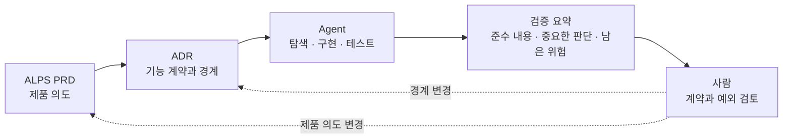

## TL;DR

- 구현 세부를 담은 PRD는 코드가 바뀔 때마다 함께 낡는다.
- PRD에는 제품 의도를, ADR에는 구현이 지킬 경계를 남긴다.
- 사람은 계약과 예외를 보고 Agent는 구현과 검증을 맡는다.

## 시작하며

내 영어 학습 서비스 EncBird에 Office Raid라는 퀴즈 모드를 붙일 때 621줄짜리 PRD를 쓴 적이 있다.

게임 규칙만 쓴 것이 아니었다. 변수 선언, 파일 경로와 12단계 구현 순서까지 적었다.

당시에는 자세할수록 Agent가 실수하지 않을 거라고 생각했다.

그런데 구현하면서 상수를 추출하고 모듈을 나누고 작업 순서가 바뀌자 며칠 만에 PRD가 코드와 어긋났다. 코드를 고친 뒤 문서도 다시 고쳐야 했고, 한 번 놓치면 다음 Agent가 오래된 구현 계획을 읽었다.

반면 ADR에 남긴 한 문장은 오래 유지됐다.

> 많이 공부한 사용자가 오히려 플레이할 수 없게 만드는 방식은 쓰지 않는다.

조회 쿼리와 파일 구조가 바뀌어도 이 요구사항은 그대로였다.

두 문서의 차이는 얼마나 자세히 썼느냐가 아니었다. **코드가 바뀌어도 다시 판단할 기준인지, 현재 구현에만 필요한 설명인지**가 달랐다.

그 뒤로 제품 의도는 PRD에, 구현이 계속 지켜야 할 경계는 ADR에, 현재 동작은 코드와 테스트에 남기려고 한다.

이 기준을 반복해서 적용하려고 만든 도구가 [ALPS Writer](https://github.com/haandol/alps-writer-plugins)와 `adr-writer`다.[^1] 이 글에서는 도구 사용법보다 왜 문서를 이렇게 나누게 됐는지 정리해본다.

## 1. 문서는 함께 바뀌는 정보끼리 나눈다

문서를 나누는 기준으로는 이름보다 **변하는 이유**가 유용했다.

제품이 해결하려는 문제와 성공 기준은 제품 방향이 바뀔 때 수정한다. 기능이 반드시 지켜야 할 동작과 아키텍처 경계는 계약이 바뀔 때 수정한다. 파일과 함수는 구현이 바뀔 때마다 달라진다.

| 위치 | 답해야 하는 질문 | 넣지 않는 내용 |
| --- | --- | --- |
| PRD | 누구의 어떤 문제를 왜 푸는가 | 파일 경로, 함수, 구현 순서 |
| ADR | 결과가 무엇을 지켜야 하는가 | 교체 가능한 자료구조와 세부 튜닝값 |
| 코드와 테스트 | 지금 어떻게 동작하는가 | 상위 문서의 설명을 복제한 주석 |

이 경계를 넘으면 문서 수명이 코드에 묶인다.

PRD에 클래스 이름을 적으면 리팩터링할 때 PRD도 바꿔야 한다. ADR에 특정 캐시 자료구조를 박아두면 같은 요구사항을 다른 방식으로 구현할 수 없게 된다.

반대로 코드에 PRD와 ADR의 내용을 길게 복사하면 어느 쪽이 현재 기준인지 다시 확인해야 한다.

그래서 나는 PRD와 ADR에 파일 경로나 함수 이름을 가능하면 넣지 않는다. 코드에도 ADR 내용을 그대로 옮긴 주석을 남기기보다, Agent가 작업할 때 ADR과 현재 코드를 함께 읽게 한다.

이 방식은 헥사고날 아키텍처에서 도메인 규칙을 구현 기술과 분리하는 생각과 닮아 있다.[^4] 상위 문서는 구현을 설명하는 대신 구현이 넘지 말아야 할 경계를 정한다.

구현을 시작한 뒤 기능 계약의 현재 기준은 ADR로 옮긴다. PRD는 제품을 왜 시작했고 무엇을 검증하려 했는지 보여주고, ADR은 지금 구현과 리뷰에서 지켜야 할 내용을 담는다.

## 2. PRD에는 제품의 가설을 남긴다

PRD는 제품 하나를 놓고 아래 질문에 답하는 문서라고 생각한다.

| 질문 | 남길 내용 |
| --- | --- |
| 누구의 어떤 문제인가 | 제품 맥락과 사용자 |
| 어떤 경험을 제공할 것인가 | 사용자가 관찰할 행동 |
| 무엇을 지켜야 하는가 | 시스템 경계와 비기능 요구사항 |
| 어디까지 만들 것인가 | 성공 기준과 하지 않을 일 |

여기에 파일 배치와 알고리즘이 들어가기 시작하면 제품 가설과 구현 계획이 섞인다.

예를 들어 `응답은 최신순이어야 한다`는 요구사항은 구현이 바뀌어도 남는다. `quicksort를 사용한다`는 내용은 현재 구현의 선택이다.

같은 PRD로 매번 같은 코드를 만드는 것이 목표는 아니다. 알고리즘과 파일 구조가 달라도 사용자 행동과 시스템 경계를 만족하면 된다.

ALPS는 이 범위를 놓치지 않게 PRD의 질문 순서를 고정한다.

사람이 백지에서 AI에게 무엇을 물을지 정하는 대신, Agent가 사용자, 문제, 성공 기준과 하지 않을 일을 차례로 묻는다. 사람은 답변하고, 완성된 섹션을 확인한 뒤 저장한다.

이 방식이 좋은 이유는 문서를 길게 만들어서가 아니다.

Agent가 제품 문제를 묻는 단계에서 파일 배치로 내려가지 않고, 성공 기준을 묻는 단계에서 구현 계획을 대신 쓰지 않게 해준다. 질문의 범위가 문서의 추상화 수준을 지킨다.

다만 ALPS가 모든 변경의 시작점일 필요는 없다.

사용자와 문제부터 정해야 하는 새 제품에는 유용하지만, 운영 중인 서비스의 작은 기능까지 매번 제품 전체 PRD에서 시작하면 오히려 읽어야 할 문서만 늘어난다.

## 3. ADR에는 다음 구현도 지킬 판단을 남긴다

ADR은 특정 코드를 지시하는 문서보다 **다음 구현에서도 유지해야 할 판단을 남기는 문서**로 쓰고 있다.

EncBird의 사전 기능을 예로 들면 다음처럼 나뉜다.

| ADR에 남길 판단 | Agent에게 맡길 구현 |
| --- | --- |
| 유효하지 않은 입력은 결정적으로 판정한다 | 판정 함수의 이름과 위치 |
| 동일 입력 재시도에 LLM을 다시 호출하지 않는다 | 캐시 자료구조와 내부 키 형식 |
| 많이 공부한 사용자가 플레이 불가에 빠지지 않는다 | 표현을 조회하는 쿼리 |

왼쪽은 코드를 다시 만들어도 지켜야 한다. 오른쪽은 같은 결과를 만족하는 범위에서 달라져도 된다.

무엇을 ADR에 올릴지 애매할 때는 두 가지를 묻는다.

> 이 내용이 빠지면 다음 구현이 요구사항이나 아키텍처 경계를 위반할 수 있는가?

> 다른 구현으로 바뀌어도 의도가 유지된다면 Agent에게 맡겨도 되는가?

자료구조, 함수 분리와 내부 라이브러리처럼 되돌리기 쉬운 선택은 대체로 코드에 남는다.

반대로 외부에 공개된 계약, 저장된 데이터의 의미와 보안 경계처럼 다음 구현에서도 유지되어야 하는 판단은 ADR에 남긴다. Agent가 구현 중 이런 결정을 새로 발견하면 바로 확정하지 않고 사람에게 알리게 한다.

이렇게 쓰면 ADR은 과거에 왜 기술을 골랐는지 기록하는 데서 끝나지 않는다. 다음 코드를 만들 때의 입력이 되고, 결과를 리뷰할 때의 기준도 된다.

## 4. 구현 계획과 검증 요약은 오래 보관하지 않는다

실제로는 아래 흐름으로 사용한다.





새 제품은 `/alps-init`으로 제품 의도를 정리하고, `/feature-to-adr`로 기능 계약을 ADR에 넘긴다. 구현 단계에서는 `/adr-impl`이 현재 저장소를 읽고 계획을 만든 뒤 구현과 테스트를 수행한다.

마지막에 Agent는 요구사항을 어떻게 만족했고, 어떤 중요한 판단을 했으며, 아직 무엇을 확인하지 못했는지 요약한다.

도구에서는 이 결과를 Evidence Package라고 부르지만 새로운 기준 문서는 아니다. 이번 리뷰를 위해 전체 diff보다 계약과 예외를 먼저 볼 수 있게 만든 임시 자료에 가깝다.

리뷰도 요구사항과 테스트를 먼저 보고, 근거가 부족하거나 위험도가 높은 부분만 코드로 내려가는 순서가 현실적이라고 생각한다.[^5]

예전에 RFTCR에서는 Requirement, Feature, Task, Code, Reflect를 각각 남기는 흐름을 제안했다.[^2] 지금은 Task를 별도 문서로 오래 보관할 필요가 거의 없다고 생각한다.

Agent는 ADR과 현재 코드를 읽고 그 시점에 맞는 구현 계획을 다시 만들 수 있다. 세부 계획을 저장하면 코드가 바뀔 때 함께 관리해야 할 문서가 하나 더 생긴다.

내가 지금 오래 남기는 것은 세 가지다.

- PRD에는 제품의 가설과 성공 기준을 남긴다.
- ADR에는 다음 구현도 지켜야 할 계약과 경계를 남긴다.
- 코드와 테스트에는 현재 동작과 실행 가능한 증거를 남긴다.

구현 계획과 검증 요약은 작업과 리뷰가 끝나면 역할을 다한다. 모든 실행 흔적을 영속화하는 것보다 다음에 같은 판단을 내릴 때 필요한 기준만 남기는 편이 낫다.

## 5. 모든 작업을 ALPS에서 시작하지 않는다

내가 사용하는 기준은 다음과 같다.

- 새 제품이고 사용자, 문제와 성공 기준이 불명확하면 ALPS에서 시작한다.
- 운영 중인 제품에 계속 유지할 기능 계약이나 아키텍처 경계가 필요하면 ADR에서 시작한다.
- 기존 계약 안의 국소적인 구현 변경이면 코드와 테스트만 고친다.

성경길은 새 제품의 방향부터 정해야 했기 때문에 ALPS로 시작했다.[^3]

반면 Office Raid는 이미 운영 중인 EncBird의 기능이었다. 다시 작성한다면 제품 전체 PRD보다 기능 계약을 담는 ADR에서 시작할 것이다.

문서가 많을수록 Agent에게 컨텍스트를 많이 줄 수는 있다. 하지만 현재 코드와 어긋난 문서가 섞이면 오히려 잘못된 방향을 더 확신 있게 따라갈 수 있다.

그래서 문서를 추가하기 전에 이 판단이 다음 구현에서도 필요한지부터 묻는 편이 낫다.

## 마치며

Office Raid의 621줄 PRD는 Agent에게 친절한 문서를 만들려다 현재 코드를 한 번 더 적어놓은 결과였다.

구현 계획이 바뀔 때마다 함께 수정해야 했고, 놓친 순간부터는 도움이 아니라 오래된 컨텍스트가 됐다.

지금은 문서의 목적을 코드 설명이 아니라 **다음에도 다시 사용할 판단을 남기는 것**으로 두고 있다.

제품의 가설과 성공 기준은 PRD에 남긴다. 구현이 계속 지켜야 할 계약과 경계는 ADR에 남긴다. 그 안에서 어떤 알고리즘과 파일 구조를 선택할지는 현재 코드베이스를 읽은 Agent에게 맡긴다.

사람의 역할도 구현 계획을 미리 작성하는 것보다 의도와 경계를 정하고, Agent가 계약 밖의 중요한 결정을 내렸는지 확인하는 쪽에 가깝다고 생각한다.

모든 구현 세부를 문서에서 없애자는 뜻은 아니다. 외부 계약, 데이터의 의미와 보안처럼 구현 방식이 장기적인 위험을 바꾸는 내용은 계속 사람이 판단하고 ADR에 남겨야 한다.

내가 줄이려는 것은 문서의 양이 아니라, 코드가 바뀔 때마다 함께 낡는 설명이다.

---

[^1]: [ALPS Writer Plugins](https://github.com/haandol/alps-writer-plugins) — ALPS Writer와 `adr-writer`의 사용 가이드. ADR 형식의 원전은 [Documenting Architecture Decisions](https://cognitect.com/blog/2011/11/15/documenting-architecture-decisions)이다.

[^2]: [RFTCR - 에이전트 주도 소프트웨어 개발을 위한 새로운 SDLC 프레임워크](/2025/05/11/rftcr-framework-for-agentic-dev.html) — 단계별 입출력을 남기던 이전 제안. 이 글에서는 Task 문서에 대한 현재 생각을 정리했다.

[^3]: [성경길 Bible Atlas](https://bible-atlas.encbird.com) — ALPS 문서를 먼저 쓰고 시작한 사이드 프로젝트.

[^4]: [쉽게 설명한 클린 / 헥사고날 아키텍쳐](/2022/02/13/demystifying-hexgagonal-architecture.html) — 도메인 규칙과 구현 기술의 경계를 나누는 방식을 설명한 이전 글.

[^5]: [AI로 코드는 빨리 만들었는데 왜 리뷰는 더 힘들까](/2026/08/18/ai-coding-review-cognitive-load.html) — 계약과 검증 결과를 먼저 보고 필요한 부분만 코드로 내려가는 리뷰 방식을 다룬다.
