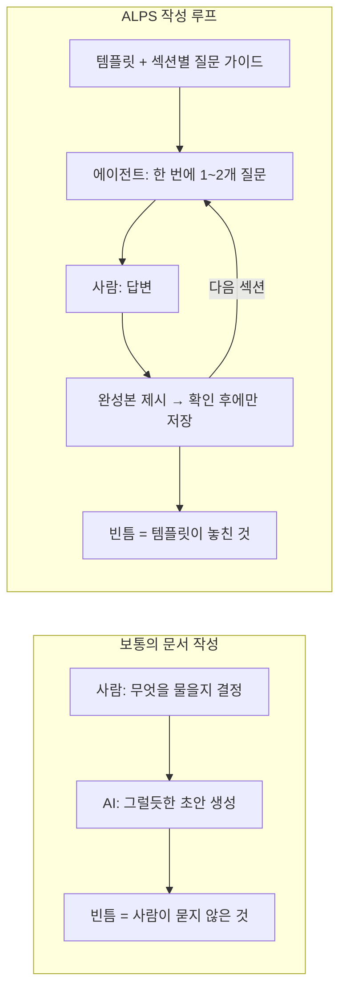
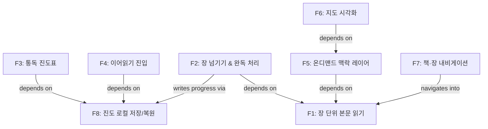
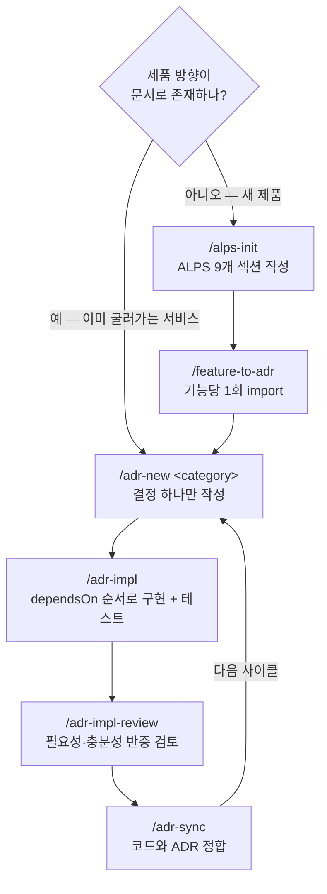

## TL;DR

- PRD 품질은 작성자 역량에 좌우된다.
- ALPS는 포맷을 고정하고 질문 방향을 뒤집는다.
- PRD는 ADR로 한 번만 넘기고, 그 뒤는 ADR이 주인이다.

## 시작하며

이전 글에서 하네스를 한 겹씩 쌓아온 과정을 이야기하면서, 0층으로 PRD와 ADR을 꼽았다.[^1]

에이전트에게 코드를 시키기 **전에** 방향을 글로 적어두는 단계다. 거기서 [ALPS Writer](https://github.com/haandol/alps-writer-plugins)[^2]라는 도구를 잠깐 언급했는데, 정작 그게 뭔지는 두 문단으로 지나갔다.

그 뒤로 "ALPS가 뭔가요", "그래서 실제로 뭘 어떻게 입력하면 되나요" 같은 질문을 여러 번 받았다.

그래서 이번 글에서는 ALPS가 **왜** 그런 모양인지, 그리고 내가 실제로 그걸로 사이드 프로젝트를 하나 시작한 과정을 그대로 보여주려고 한다.

예제로 쓸 프로젝트는 [성경길(Bible Atlas)](https://bible-atlas.encbird.com)[^3]이다. 성경을 장 단위로 읽으면 통독표에 진도가 자동으로 쌓이고, 낯선 지명을 누르면 지도가 열리는 웹 서비스다.

이 프로젝트는 첫 커밋부터 ALPS 문서를 먼저 쓰고 시작했기 때문에, PRD가 ADR이 되고 코드가 되는 과정이 git 히스토리에 그대로 남아 있다.

## 1. PRD가 무너지는 두 지점

에이전트에게 규모 있는 기능을 맡겨보면 결과물이 들쭉날쭉하다. 나는 그 원인의 상당 부분이 모델이 아니라 **입력 문서**에 있다고 생각한다.[^4]

반복해서 관찰한 지점은 두 가지다.

**첫째, 포맷이 매번 새로 발명된다.** 팀마다, 아니 문서마다 PRD 모양이 다르다. 섹션 이름도 다르고 상세 수준도 다르다.

에이전트는 이 문서가 무엇을 주장하는 문서인지부터 추측해야 한다. 사람도 내용을 쓰기 전에 형식을 다시 결정하느라 시간을 쓴다.

**둘째, 품질이 작성자 역량에 묶인다.** 경험 많은 PO가 쓴 PRD는 에이전트의 자유도를 적당히 조여주고, 그렇지 않은 PRD는 에이전트가 과잉 해석할 여지를 남긴다.

같은 제품인데 누가 문서를 썼느냐에 따라 생성된 코드가 달라진다.

ALPS(Agentic Lean Product Spec)는 이 두 지점을 각각 다르게 공격한다. 포맷은 **고정**해서 매번 결정하지 않게 하고, 작성 루프는 **뒤집어서** 완결성을 사람이 아니라 에이전트가 책임지게 한다.

## 2. 고정된 포맷 — 9개 섹션과 세 가지 원칙

ALPS는 MVP 하나를 기술하는 데 필요한 것을 9개 섹션으로 못박는다.

| # | 섹션 | 담는 것 |
|---|---|---|
| 1 | Overview | 제품 맥락, 타깃 사용자, 핵심 문제 |
| 2 | MVP Goals and Key Metrics | 성공의 측정 가능한 정의 |
| 3 | Demo Scenario | 나머지 문서를 붙잡아주는 구체적 시나리오 |
| 4 | High-Level Architecture | 시스템 형태 — 구성요소, 경계, 데이터 흐름 |
| 5 | Design Specification | 화면·플로우·에러 상태 |
| 6 | Requirements Summary | 기능·비기능 요구사항 종합 |
| 7 | Feature-Level Specification | 기능별 vertical slice (UI → API → Data) |
| 8 | MVP Metrics | Section 2 목표에 대응하는 계측 |
| 9 | Out of Scope | 의도적으로 만들지 않을 것 |

섹션을 나눈 방식에 세 가지 원칙이 깔려 있다.

**하나, 추상화 수준을 섞지 않는다.** 비즈니스 요구사항과 설계와 기술 요구사항이 각각 다른 섹션에 산다. "사용자가 즐거움을 느끼게"와 "POST /api/orders는 멱등키를 받는다"가 한 문단에 섞이지 않는다.

**둘, 기능을 vertical slice로 자른다.** Section 7의 각 기능은 UI에서 API를 거쳐 데이터까지 관통한다. 그래야 기능 하나가 독립적으로 구현·테스트·배포된다.

이건 에이전트가 실제로 일하는 방식과 맞아떨어진다. 검증 가능한 작은 단위를 쌓아 올리는 것.

**셋, 하지 않을 것을 일급으로 둔다.** Section 9(Out of Scope)는 각주가 아니다. 에이전트가 **하지 말아야** 할 일을 명시적으로 적어두지 않으면, 팀이 일부러 미뤄둔 영역까지 코드가 번져나간다.

성경길의 Section 9에는 이런 것들이 들어갔다.

```
| 기능 | 보류 이유 | 목표 단계 |
| 로그인 & 계정 | MVP는 로그인 없이 로컬 저장으로 검증 | Phase 2 |
| 기기 간 진도 동기화 | 로그인·서버 저장 선행 필요 | Phase 2 |
| 추가 번역본 / 성경 API | MVP는 개역한글판으로 시작 | Phase 2 |
| 읽기 알림 / 통독 플랜 | 습관 형성 기능은 핵심 검증 이후 | Phase 2 |
```

"로그인 없음"을 문서에 박아두면, 에이전트가 진도 저장 기능을 만들 때 서버 API와 인증을 상상해내지 않는다.

## 3. 질문하는 쪽을 뒤집는다

포맷보다 더 중요한 게 작성 방식이라고 생각한다.

보통 우리가 AI로 문서를 쓸 때는 **사람이 묻고 AI가 답한다.** 이 구조에서는 사람이 무엇을 물어야 하는지 아는 만큼만 문서가 채워진다. 문서 품질의 상한이 작성자의 질문 실력이 된다.

ALPS Writer는 이걸 반대로 돌린다.





- **에이전트가 묻고 사람이 답한다.** 9개 섹션을 순서대로 돌면서 한 턴에 1~2개씩 좁은 질문을 던진다.
- **에이전트가 섹션을 임의로 생성하지 않는다.** 완성본을 보여주고 사람이 확인해야 저장된다.
- **섹션별 대화 가이드가 서버에 들어 있다.** 프로젝트가 바뀌어도 질문 흐름이 같다.

이러면 문서 품질의 상한이 **작성자의 PRD 작성 실력**에서 **템플릿과 질문 프로토콜**로 옮겨간다. 도구를 개선하면 다음 프로젝트의 문서가 같이 좋아진다는 뜻이라, 나는 이게 이 도구의 핵심 설계라고 생각한다.

부수 효과로 문서 작성이 인터뷰가 된다. 백지 앞에서 "아키텍처 뭐 쓰지"를 고민하는 것보다, "지도 타일은 어디서 받아오실 건가요"에 답하는 게 훨씬 쉽다.

## 4. 실제로 시작해보기 — 성경길

설치는 마켓플레이스 등록 후 플러그인 두 개를 넣는 것으로 끝난다. npm이나 빌드 단계가 없다.

```
/plugin marketplace add haandol/alps-writer-plugins
/plugin install alps-writer@alps-writer   # PRD 작성 (MCP 서버 + /alps-init)
/plugin install adr-writer@alps-writer    # ADR 사이클 (/adr-new, /adr-impl, hook)
```

Codex를 쓴다면 `codex plugin add alps-writer@alps-writer` 형태로 같은 두 플러그인을 설치하고, 스킬을 `$alps-init`으로 부른다.

빈 디렉토리에서 `/alps-init`을 치면 대화가 시작된다. 실제 흐름은 이런 식이었다.

```
> /alps-init

## Section 1. Overview
이 섹션은 제품이 왜 존재하는지와 누구를 위한 것인지를 고정합니다.

먼저 이 프로젝트의 주된 목적이 무엇인가요?

> 성경을 장 단위로 읽는 걸 핵심 경험으로 하는 웹 서비스. 한 장 읽고
> 다음 장으로 넘기면 통독표에 자동으로 기록되게 하고 싶다.

좋습니다. 그럼 이 서비스를 가장 필요로 하는 사용자는 누구인가요?

> 통독에 도전하지만 꾸준히 이어가기 어려운 일반 신자.
> 지명이나 시대 배경이 낯설어서 맥락을 놓치는 사람들.
```

한 번에 하나씩 묻고, 7개 하위 섹션(1.1~1.7)이 다 채워지면 완성본을 보여준 뒤 확인을 받는다. 확인 전에는 파일에 아무것도 쓰지 않는다.

이렇게 나온 Section 1.4는 이랬다.

```
### 1.4 Core Problem
- 성경을 읽을 때 통독의 꾸준함(진도 유지)이 무너지기 쉽다
- 지명·이동 경로·시대 배경이 낯설어 맥락 이해가 어렵고,
  별도로 자료를 찾아보는 일은 읽기 흐름을 끊는다
- 기존 성경 앱은 자료가 많아도 읽기 경험과 분리되어 있어
  필요한 순간에 자연스럽게 닿지 않는다
```

여기서 눈여겨볼 건 문서 순서와 **질문 순서가 다르다**는 점이다.

최종 문서는 1→9 번호 순이지만, 질문은 `1 → 2 → 3 → 4 → 6 → 5 → 7 → 8 → 9` 순으로 진행된다. Section 5(Design)가 Section 6.1에서 정의한 Feature ID를 재사용하기 때문에, 요구사항을 먼저 확정하고 설계를 묻는다.

### Section 6과 7 — 문서의 무게중심

Section 6.1에서 기능 목록에 ID가 붙는다.

```
| ID | 기능 | 우선순위 |
| F1 | 장 단위 본문 읽기 | Must-Have |
| F2 | 장 넘기기 & 완독 처리 | Must-Have |
| F3 | 통독 진도표 | Must-Have |
| F4 | 이어읽기 진입 | Must-Have |
| F5 | 온디맨드 맥락 레이어 | Must-Have |
| F6 | 지도 시각화 | Must-Have |
| F7 | 책·장 내비게이션 | Should-Have |
| F8 | 진도 로컬 저장/복원 | Must-Have |
```

그리고 6.3에서 이 기능들 사이의 의존성을 Mermaid 그래프로 그린다. 성경길에서 실제로 저장된 그래프는 이렇다.





이 그래프가 나중에 **구현 순서**를 결정한다. 그림 하나 그려놓는 것으로 끝나지 않는다는 점이 중요하다. 뒤에서 다시 나온다.

Section 7은 기능마다 하나씩, User Story / User Flow / Technical Description / Edge Cases / Acceptance Criteria를 채운다. F2(장 넘기기)의 Technical Description은 이런 모양으로 저장됐다.

```
1. 다음 장으로 이동 + 완독 처리
   - UI: 스와이프/클릭 제스처를 감지해 다음 장으로 전환, 완독 토스트 노출
   - Data: 현재 장을 완독 상태로 기록하고 마지막 위치를 갱신 (F8에 위임)
   - Response: 다음 장 본문 표시 + 완독 피드백
2. 이전 장으로 이동
   - UI: 반대 방향 제스처로 이전 장 표시
   - Data: 마지막 위치만 갱신, 완독 기록은 변경하지 않음
```

UI → Data → Response로 한 기능이 층을 관통한다. 이게 vertical slice다.

한 가지 절제 규칙이 있다. **Section 7은 "무엇"만 적고 "왜 그렇게 골랐는지"는 적지 않는다.** 라이브러리 선택, 알고리즘, 컬럼 목록, 튜닝 상수는 여기 들어가지 않는다.

판별 기준은 단순하다. *DB를 바꿔도 여전히 참인 문장*이면 PRD에 남고, *선택을 정당화하는 문장*이면 ADR로 간다.

Section 7은 기능이 작아 보이거나 앞 기능과 비슷해 보여도 7.1, 7.2를 하나씩 따로 확인받는다. 8개 기능이면 확인 8번이다. 성경길에서 이 섹션이 제일 오래 걸렸다.

귀찮은 단계인데, 여기서 대충 넘긴 기능은 나중에 ADR과 코드에서 그대로 흐릿하게 나왔다. 그래서 이 강제 확인 단계는 그대로 두는 게 맞다고 생각한다.

작성이 끝나면 `.alps.xml` 한 파일에 문서가 저장된다. 성경길의 경우 9개 섹션에 29개 하위 섹션, Section 7에 기능 8개짜리 문서 하나가 나왔다.

## 5. PRD를 ADR로 한 번 넘기고, 손을 뗀다

문서가 완성되면 `/feature-to-adr`을 실행한다. Section 7의 기능들을 ADR 초안으로 옮기는 단계다.

이 명령이 하는 일은 얇다. 기능 이름에서 카테고리 키를 뽑고(`장 단위 본문 읽기` → `chapter-reading`), 6.3의 의존성 그래프를 위상 순서로 정렬하고, ADR 작성 자체는 `adr-writer`의 `/adr-new`에 넘긴다.

성경길에서 이 단계가 만든 결과는 카테고리 8개, ADR 8개였다. 6.3 그래프가 `.mapping.json`의 `dependsOn` 필드로 그대로 옮겨간다.

```json
"chapter-turn": {
  "feature": "장 넘기기 & 완독 처리",
  "adrs": [{ "path": "docs/adr/chapter-turn/0001-chapter-turn-completion.md",
             "status": "Accepted (2026-07-13)", "summary": "..." }],
  "dependsOn": ["chapter-reading", "progress-storage"]
}
```

그래서 `/adr-impl chapter-turn`을 실행하면 에이전트가 먼저 `dependsOn`을 확인한다. `chapter-reading`과 `progress-storage`가 아직 `Proposed`면 **거기부터 구현한다.**

Section 6.3에 그린 화살표가 구현 순서를 강제하는 게이트가 되는 것이다. 다이어그램이 장식이 아니라 실행되는 제약이 됐다는 점이 이 연결의 핵심이라고 생각한다.

여기서 반드시 짚어야 할 규칙이 하나 있다.

**`/feature-to-adr`은 일회성 import다.** 기능 하나를 ADR로 한 번 옮기고 나면, 그 결정의 주인은 ADR이다. PRD가 나중에 바뀌면 다시 import하지 않고 해당 ADR을 직접 고친다.

PRD → ADR → 코드가 단방향 의존인 이유와 같다.[^1] 재import를 허용하면 안정적인 층(PRD)이 변덕스러운 층(코드)을 끌고 다니게 된다.

성경길의 지금 상태를 보면 이 규칙이 어떻게 작동했는지 보인다. 처음 import된 8개 카테고리가 지금은 **15개 카테고리 19개 ADR**로 늘어났다.

늘어난 7개는 PRD를 고쳐서 다시 가져온 게 아니다. 만들면서 새로 생긴 결정들이다 — 앱 전역 키보드 제어, 테마 선호, URL로 진도 넘기기, 책 시작 맥락 안내, 옛말 풀이, 도량형 환산, 비전 페이지.

전부 `/adr-new`로 ADR 레벨에서 직접 추가됐고, ALPS 문서는 첫 커밋 이후 한 번도 수정하지 않았다.

**PRD는 출발점이고 종착점이 아니다.** 이 도구를 쓰면서 제일 늦게 이해한 부분이다.

## 6. 그래서 PRD를 언제 쓰고 언제 건너뛰나

플러그인이 두 개로 쪼개져 있는 이유도 여기 있다. `adr-writer`는 ALPS를 전혀 모르고, 결합은 `/feature-to-adr` 한 방향뿐이다.





내 프로젝트들이 실제로 이 두 경로에 갈려 있다.

| 프로젝트 | ALPS 문서 | ADR 현황 | 진입 경로 |
|---|---|---|---|
| 성경길 | 있음 (9섹션·기능 8개) | 15 카테고리 / 19 ADR | PRD-first |
| PixelBank | 없음 | 10 카테고리 / 55 ADR | ADR-only |
| EncBird | 없음 (별도 게임모드 PRD만) | 21 카테고리 / 135 ADR | ADR-only |

성경길은 아무것도 없는 상태에서 시작했으니 PRD부터 썼다. 무엇을 만들지가 내 머릿속에만 있었기 때문이다.

PixelBank와 EncBird는 이미 굴러가고 있던 서비스라 PRD를 소급해서 쓰지 않았다. PixelBank의 `docs/adr/WORKFLOW.md`에는 아예 이렇게 적어뒀다.

```
> 이 리포는 ALPS(PRD) 문서를 두지 않는다. 결정은 ADR 레벨에서 직접 관리한다.
```

이미 코드가 있는 프로젝트에 PRD를 소급 작성하면, 그 PRD는 코드를 설명하는 문서가 된다. 그러면 방향이 거꾸로 뒤집혀서 PRD가 코드에 종속되고, 결국 아무도 안 보는 문서가 된다.

그래서 나는 이렇게 나눠 쓰고 있다. **제품이 없을 때는 PRD부터, 제품이 있을 때는 결정부터.**

ADR 개수 차이도 그냥 프로젝트 나이 차이다. EncBird는 3년 넘게 쌓인 결정이 135개, 성경길은 첫 커밋 후 2주 만의 결정이 19개다. 개수 자체가 목표는 아니고, 결정이 코드보다 먼저 글로 남았는지가 중요하다고 본다.

## 마치며

ALPS는 결국 두 가지 장치다. **포맷을 매번 재발명하지 않게 고정한 것**, 그리고 **완결성의 책임을 사람에서 템플릿과 에이전트로 옮긴 것**.

두 번째가 더 중요하다고 생각한다. 문서 품질이 그날의 내 컨디션이나 PRD 작성 경험치에 흔들리지 않고, 도구를 고치면 다음 프로젝트가 같이 좋아지는 구조라서다.

이건 하네스 엔지니어링에서 반복되는 패턴과 같다. 사람이 매번 메우던 빈틈을 찾아서, 그 자리에 파일 한 겹을 덧대는 것.[^1]

에이전트에게 개발을 더 위임하고 싶은데 어디서 시작할지 모르겠다면, 다음에 새 사이드 프로젝트를 열 때 코드를 시키기 전에 `/alps-init`을 한 번 쳐보시길 권한다.

에이전트가 던지는 질문에 답하는 것만으로 문서가 나오고, 그 문서가 ADR이 되고, ADR이 구현 순서를 강제한다.

빈 디렉토리 앞에서 "무엇부터 만들지"를 혼자 고민하는 시간이, 인터뷰에 답하는 시간으로 바뀐다.

---

[^1]: [EncBird에 하네스를 한 겹씩 씌워온 과정](/2026/06/16/harness-engineering-in-practice.html) — PRD·ADR을 하네스의 0층으로 놓는 이유와 PRD → ADR → 코드 단방향 의존성을 다룬다. 하네스 개념 자체는 [쉽게 설명한 하네스 엔지니어링](/2026/03/15/harness-engineering-beyond-context-engineering.html) 참고.

[^2]: [ALPS Writer Plugins](https://github.com/haandol/alps-writer-plugins) — 마켓플레이스, 사용 가이드, 의존성 모델 문서.

[^3]: [성경길 Bible Atlas](https://bible-atlas.encbird.com) — 이 글의 예제로 쓴 사이드 프로젝트.

[^4]: [에이전틱 개발 시대, 비즈니스를 아는 개발자의 가치](/2026/03/13/agentic-dev-business-aligned-code.html) — 비즈니스 요구사항을 코드로 옮기는 층이 왜 사람의 몫으로 남는지에 대한 글.
