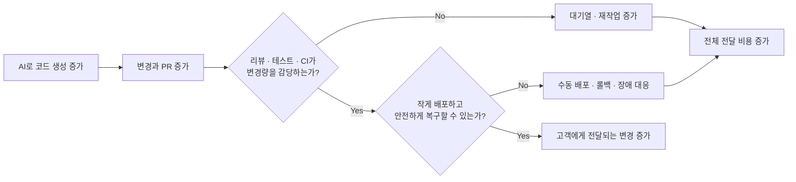

## TL;DR

- AI 생산성은 개인의 코드 생성 속도보다 팀 하네스의 품질에 좌우된다.
- CTS-SW는 전체 전달 비용을 고객에게 도달한 소프트웨어와 연결한다.
- 하네스는 개인별 최적화가 아니라 팀 단위 투자로 다뤄야 한다.

## 시작하며

AI 코딩 도구를 도입하면 코드 작성 시간, 자동완성 수락률, PR 수처럼 쉽게 수집할 수 있는 숫자부터 보게 된다.

이 숫자들은 도구가 얼마나 자주 쓰이고 코드 생성이 얼마나 빨라졌는지는 보여준다. 하지만 고객에게 기능을 전달하는 비용이 실제로 줄었는지는 알려주지 않는다.

코드는 빨리 만들어졌는데 리뷰가 밀릴 수 있다. CI가 느리거나 수동 배포가 남아 있으면 늘어난 변경량이 대기열에 쌓인다. 배포가 잦아진 만큼 롤백과 장애 대응이 늘었다면 구현에서 절약한 시간은 다른 단계로 이동한 셈이다.[^5]

이전 글에서는 토큰 가격보다 모델, 도구, 재시도와 사람의 검토까지 포함한 **요구사항 실현 비용**을 보는 편이 낫다고 이야기했다.[^1]

Amazon의 CTS-SW(Cost to Serve Software)는 이 생각을 소프트웨어 전달 과정에 적용한 지표다.[^2]

CTS-SW가 AI 도입 효과를 자동으로 판정해주는 것은 아니다. 그래도 코드 생성 속도만 보지 않고, 개발부터 운영까지 들어간 비용을 고객에게 도달한 결과와 연결해서 볼 수 있다는 점이 유용하다고 생각한다.

## 1. 고객에게 도달하기까지의 비용을 본다

CTS-SW의 계산 방식은 단순하다.

```text
CTS-SW =
소프트웨어를 만들고 운영하는 비용
/ 고객에게 도달한 소프트웨어 단위
```

예를 들어 개발자 8명이 한 주 동안 운영 배포를 16회 만들었다고 해보자. 정확한 인건비 대신 개발자-주를 비용의 대리 지표로 사용하면 배포 한 번에 `0.5 개발자-주`가 든다.

같은 인원으로 20회를 안정적으로 전달했다면 `0.4 개발자-주`로 내려간다. 같은 소프트웨어 단위를 전달하는 데 사용한 엔지니어링 여력이 줄었다고 볼 수 있다.

어려운 부분은 계산보다 **무엇을 소프트웨어 한 단위로 볼 것인가**다.

Amazon은 서비스 지향 아키텍처에서는 배포를 사용할 수 있지만, 모놀리스나 정기 릴리스 조직에서는 고객에게 전달된 코드 검토나 커밋이 더 적절할 수 있다고 설명한다.[^2]

배포를 단위로 정했다면 내부 환경에 올린 횟수가 아니라 실제 고객 트래픽을 받은 배포만 셀 수도 있다. 릴리스 단위가 큰 조직이라면 배포 횟수보다 고객이 사용할 수 있게 된 변경 묶음이 더 자연스러울 수 있다.

이 합의 없이 CTS-SW부터 계산하면 숫자는 나오지만 서로 다른 것을 세게 된다.

소프트웨어 단위가 비즈니스 가치와 같은 것도 아니다. 배포 하나가 매출이나 고객 만족을 얼마나 바꿨는지는 별도로 확인해야 한다.

그래서 CTS-SW는 최종 성과보다 **소프트웨어 전달 과정의 효율을 보는 중간 지표**에 가깝다. 코드가 만들어진 뒤 고객에게 도달하기까지 얼마나 많은 사람과 시간이 더 필요한지 확인하는 용도로 쓰는 편이 맞다고 생각한다.

## 2. AI가 줄인 시간이 어디로 이동했는지 본다

Amazon은 개발 쪽의 코드 검토 속도와 배포 쪽의 배포 속도를 나누어 본다.[^2]

이 구분이 필요한 이유는 한쪽만 빨라졌을 때 다른 쪽이 바로 병목이 되기 때문이다.

AI가 코드 생성을 빠르게 하면 변경과 PR이 늘어난다. 리뷰할 사람이 그대로라면 검토 대기 시간이 길어진다. 리뷰를 통과해도 CI와 배포가 느리면 고객에게 도달하는 속도는 달라지지 않는다.

반대로 자동 테스트, 빠른 CI, 작은 배포와 롤백 장치가 갖춰져 있으면 늘어난 변경을 짧은 주기로 검증하고 전달할 수 있다.

여기서 하네스는 개인이 쓰는 프롬프트나 에디터 설정만을 뜻하지 않는다. 팀이 공유하는 요구사항 계약, 저장소 규칙, 도구, 테스트, CI/CD, 배포와 관측성까지 포함한다.[^10]

그래서 AI 생산성은 개인이 모델을 얼마나 잘 다루느냐보다 **팀의 하네스가 생성된 변경을 얼마나 안정적으로 흡수하느냐**에 더 크게 좌우된다고 생각한다.

한 개발자가 좋은 프롬프트와 설정으로 코드를 빠르게 만들어도, 팀의 리뷰 기준과 테스트가 약하면 동료의 검토와 재작업이 늘어난다. 반대로 팀 하네스가 반복되는 판단을 자동화하면 개인 한 명의 숙련이 다음 작업과 다른 구성원에게도 남는다.





DORA의 2025년 분석이 AI를 기존 조직 역량의 증폭기로 설명하는 것도 이 흐름과 비슷하다. 자동 테스트, 버전 관리와 빠른 피드백이 약한 조직에서는 늘어난 변경량이 불안정성으로 이어질 수 있다.[^8]

따라서 AI 도입 전에 개발 환경을 완벽하게 만들 필요는 없지만, 현재 변경이 어디에서 기다리고 실패하는지는 알아야 한다.

리뷰가 가장 오래 걸린다면 코드 생성량을 더 늘리기 전에 검토 범위와 배정 방식을 손보는 편이 낫다. CI가 병목이라면 테스트 실행 시간을 줄이는 일이 먼저일 수 있다. 배포 뒤 사고가 잦다면 롤백과 관측성을 보강해야 한다.

AI 도구의 효과는 이런 기반과 분리해서 측정하기 어렵다. 나는 AI가 개발 체계를 대신하기보다, 이미 있는 피드백 순환의 장단점을 더 크게 드러내는 쪽에 가깝다고 생각한다.

## 3. 지표를 목표로 만들면 다시 왜곡된다

배포를 소프트웨어 단위로 정했다고 해서 배포 횟수 자체를 목표로 두면 안 된다.

평가 기준이 배포 횟수를 향하면 변경을 필요 이상으로 나누거나 의미 없는 배포를 늘릴 수 있다. 개인에게는 평가에 맞춘 합리적인 행동이지만, 조직은 고객과 관계없는 숫자를 최적화하게 된다.

DORA도 지표를 목표나 팀 간 경쟁에 사용하면 굿하트의 법칙에 따라 수치가 조작될 수 있다고 경고한다.[^9]

CTS-SW도 여기서 자유롭지 않다.

| 숫자가 좋아 보이는 방법 | 실제로 확인할 내용 |
| --- | --- |
| 배포를 잘게 나눠 단위를 늘린다 | 고객에게 도달한 의미 있는 단위인가 |
| 유지보수와 장애 비용을 뺀다 | 개발부터 운영까지 같은 비용 범위를 썼는가 |
| 롤백과 재배포도 산출물로 센다 | 변경 실패와 장애가 함께 늘지 않았는가 |
| 정의가 다른 팀을 비교한다 | 같은 팀에서 같은 정의로 본 추세인가 |

CTS-SW가 개인 생산성 점수가 되어서는 안 되는 이유도 같다.

소프트웨어 전달은 개발자 한 명의 코드 작성만으로 끝나지 않는다. 리뷰 방식, 테스트 인프라, 배포 권한과 운영 체계가 함께 결과를 만든다. 개인에게 점수를 매기면 시스템 문제를 사람의 성과로 돌리게 된다.

AI 코딩 도구는 개인이 사용하지만, 그 결과가 통과해야 하는 하네스는 팀 자산이다. 따라서 도입 효과를 측정하는 단위도 개인의 생성량보다 팀의 전달 비용과 품질에 맞추는 편이 자연스럽다.

SPACE가 개발 생산성을 하나의 활동량으로 환원하지 말아야 한다고 제안한 이유도 여기에 있다.[^3]

나는 CTS-SW를 같은 팀의 시간에 따른 변화로 보고, 소요 시간과 검토 대기 같은 흐름 지표로 원인을 찾는 방식이 적절하다고 생각한다. 롤백률, 변경 실패율과 장애 대응 시간은 비용이 다른 곳으로 전가되지 않았는지 확인하는 장치로 함께 둔다.[^4]

예를 들어 CTS-SW가 낮아졌는데 변경 실패율과 당직 대응이 늘었다면 개선으로 보기 어렵다. 반대로 코드 생성량은 비슷해도 검토 대기와 수동 배포가 줄어 CTS-SW가 낮아졌다면 실제 전달 체계가 나아진 것이다.

## 4. 처음에는 한 팀의 병목 하나에 투자한다

평가 기준이 없던 팀이라면 대시보드보다 한 장짜리 합의문부터 만드는 편이 낫다.

적어도 아래 내용은 먼저 정해야 한다.

- 이 숫자로 무엇을 배우려는가
- 고객에게 도달한 소프트웨어 단위는 무엇인가
- 비용 대신 어떤 대리 지표를 사용할 것인가
- 품질이 나빠지지 않았다고 볼 기준은 무엇인가
- 개인 평가, 팀 서열과 인원 감축 근거로 사용하지 않는가

이 합의에는 하네스를 고칠 시간도 포함해야 한다.

리뷰에서 반복되는 지적을 테스트로 옮기고, CI 피드백 시간을 줄이고, 배포와 복구를 자동화하는 일은 당장 기능 하나를 더 만드는 것보다 느려 보일 수 있다. 그래서 개인의 자발적인 개선에 맡기면 눈앞의 작업에 밀리기 쉽다.

팀이 정식 작업으로 시간을 배정하고, 도메인 지식과 플랫폼·운영 역량을 함께 투입해야 개선이 다음 작업에도 남는다. AI 도입 예산도 도구 라이선스와 교육만이 아니라 **팀 하네스를 만들고 운영할 여력**까지 포함해야 한다고 생각한다.

소프트웨어 단위의 정의가 바뀌면 이전 숫자와 그대로 이어 붙이지 않는다. 숫자를 계산하는 SQL보다 이 정의를 매주 같은 의미로 유지하는 일이 더 중요하다.

그다음 최근 몇 주의 Git, CI/CD, 조직 정보와 장애 기록을 연결해 기준선을 만든다.

처음부터 정확한 원가를 계산할 필요는 없다. 활성 개발자 수, 고객에게 도달한 단위, 소요 시간, 롤백과 장애 대응 시간 정도로도 어디에서 비용이 커지는지 볼 수 있다.

기준선이 팀의 실제 경험과 대체로 맞는지 확인한 뒤 가장 큰 병목 하나를 고른다.

검토 대기열이 길다면 리뷰 방식을 바꾸고, CI가 느리다면 테스트 피드백을 줄인다. AI 코딩 도구를 시험하고 싶다면 다른 큰 변화와 겹치지 않게 넣어 코드 검토와 배포, CTS-SW가 함께 어떻게 바뀌는지 본다.

시스템 처리량은 가장 느린 구성요소에 제한되고, 변경 효과를 확인하려면 한 번에 하나의 변수를 바꾸는 편이 낫다는 성능 분석 원칙과 같은 접근이다.[^6][^7]

이 과정에서 시니어 엔지니어가 모든 숫자의 소유자가 될 필요는 없다.

제품 담당자는 고객에게 도달한 단위를 정의하고, SRE는 품질과 운영 비용을 확인한다. 엔지니어링 매니저는 팀 구성 변화와 지표의 사용 범위를 관리한다. 시니어 엔지니어는 숫자에서 실제 PR, 배포와 장애까지 다시 추적할 수 있게 연결하는 역할을 맡을 수 있다.

처음부터 Amazon의 분석 모델을 그대로 재현하는 것보다, 한 팀에서 같은 정의로 전후 변화를 설명할 수 있게 만드는 것이 먼저라고 생각한다.

## 마치며

AI 코딩 도구의 효과를 코드 작성 시간과 PR 수로만 보면 구현 뒤에 생긴 비용을 놓치기 쉽다.

리뷰가 밀리고 CI가 느려졌거나, 수동 배포와 장애 대응이 늘었다면 코드 생성이 빨라져도 고객에게 소프트웨어를 전달하는 비용은 줄지 않는다.

CTS-SW는 이 비용을 한 번에 정확하게 계산해주는 답은 아니다. 특히 소프트웨어 단위와 비용 범위를 어떻게 정하느냐에 따라 숫자가 크게 달라진다.

그래도 **코드를 얼마나 만들었는가보다 고객에게 도달한 소프트웨어를 어떤 비용으로 만들었는가**를 묻게 해준다는 점에서 출발점으로 쓸 만하다고 생각한다.

내가 지금 권하고 싶은 방식은 단순하다.

한 팀에서 고객에게 도달한 단위와 품질 기준을 정한다. 최근 기준선을 복원하고, 가장 큰 병목 하나를 고쳐본다. 그 뒤 CTS-SW가 낮아졌는지보다 먼저 비용이 리뷰, 장애와 운영으로 이동하지 않았는지 확인한다.

AI 도구를 더 많이 쓰는 것보다 이 흐름을 반복해서 개선하는 편이 실제 개발 비용을 줄이는 데 더 직접적일 수 있다.

개인의 AI 활용 능력을 높이는 일은 필요하다. 다만 그 능력이 팀 생산성으로 이어지려면 개인의 요령을 공유 계약, 도구와 가드레일로 바꾸는 투자가 뒤따라야 한다.

**AI 생산성은 개인에게 도구를 지급한 결과라기보다, 팀이 하네스에 투자한 결과에 가깝다.**

---

[^1]: [AI 도입은 언제 비즈니스 성과로 평가해야 할까 — 3S와 AHEAD·LEVER](/2026/06/15/organizational-ai-adoption-3s.html)

[^2]: Amazon Science, [Measuring the effectiveness of software development tools and practices](https://www.amazon.science/blog/measuring-the-effectiveness-of-software-development-tools-and-practices) — CTS-SW의 정의, 아키텍처별 소프트웨어 단위, 팀 속도와 전달 품질, Q Developer 효과 분석을 설명한다.

[^3]: Nicole Forsgren et al., [The SPACE of Developer Productivity](https://queue.acm.org/detail.cfm?id=3454124) — 개발 생산성을 단일 활동량으로 환원하지 않고 여러 차원에서 함께 보아야 한다고 제안한다.

[^4]: Google Cloud DORA, [Accelerate State of DevOps Report 2024](https://dora.dev/research/2024/dora-report/) — 소프트웨어 전달의 처리량과 불안정성을 함께 개선해야 한다고 설명한다.

[^5]: [AI로 코드는 빨리 만들었는데 왜 리뷰는 더 힘들까](/2026/08/18/ai-coding-review-cognitive-load.html) — AI가 구현 과정의 인지부하를 리뷰 시점으로 옮기는 문제를 다룬다.

[^6]: Microsoft Learn, [How to Investigate Bottlenecks](https://learn.microsoft.com/en-us/biztalk/core/how-to-investigate-bottlenecks) — 시스템 처리량은 가장 느린 구성요소에 제한되며, 한 번에 하나의 변수를 변경한 뒤 다시 측정해 효과를 검증하라고 설명한다.

[^7]: AWS Well-Architected Framework, [Use a data-driven approach for architectural choices](https://docs.aws.amazon.com/wellarchitected/latest/performance-efficiency-pillar/perf_architecture_use_data_driven_approach.html) — 추측과 가정에 기반한 선택을 안티패턴으로 보고, 성능 지표와 실험을 통해 선택을 검증하도록 권고한다.

[^8]: Google Cloud DORA, [Announcing the 2025 DORA Report: State of AI-Assisted Software Development](https://cloud.google.com/blog/products/ai-machine-learning/announcing-the-2025-dora-report) — AI가 기존 조직의 강점과 약점을 증폭하며, 자동 테스트, 버전 관리와 빠른 피드백 순환이 부족하면 늘어난 변경량이 소프트웨어 전달의 불안정성으로 이어질 수 있다고 설명한다.

[^9]: DORA, [DORA's software delivery performance metrics](https://dora.dev/guides/dora-metrics-four-keys/) — 지표를 목표로 설정하면 팀이 수치를 조작할 가능성이 높아지며, 서로 다른 애플리케이션 비교와 팀 간 경쟁을 피해야 한다고 설명한다.

[^10]: [EncBird에 하네스를 한 겹씩 씌워온 과정](/2026/06/16/harness-engineering-in-practice.html) — 요구사항, 컨텍스트, 도구, 테스트와 가드레일을 실제 프로젝트의 하네스로 축적하는 과정을 다룬다.
