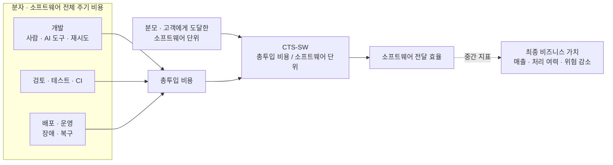
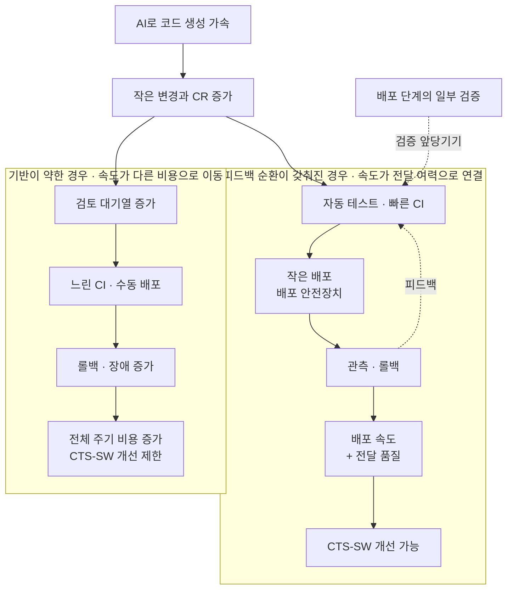
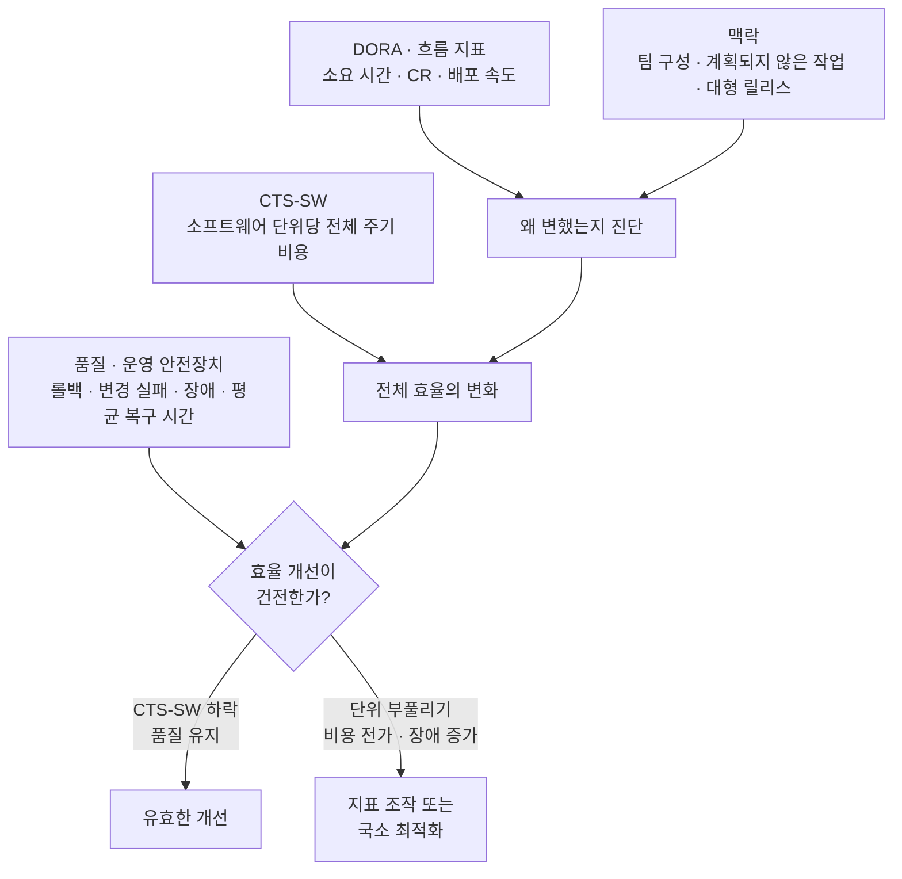
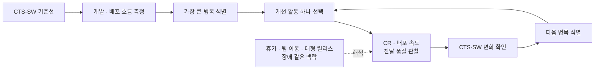
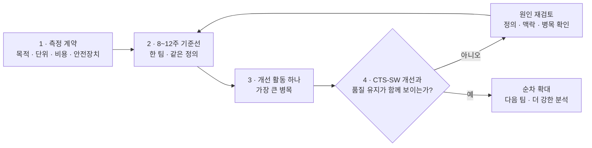
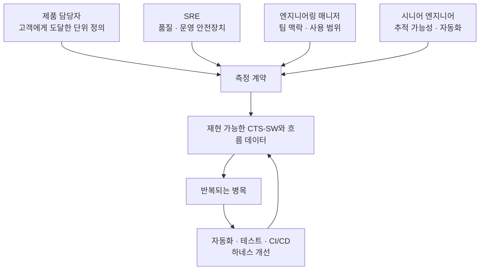

## TL;DR

- CTS-SW는 고객에게 전달된 소프트웨어 단위당 비용을 본다.
- 개발과 배포 중 한쪽만 빨라지면 다른 쪽이 병목이 된다.
- AI 효과는 테스트·CI/CD·배포 안전장치가 갖춰질수록 커진다.

## 시작하며

AI 코딩 도구를 도입하면 보통 코드 작성 시간, 자동완성 수락률, PR 수 같은 숫자를 먼저 본다.

그런데 코드가 빨리 만들어졌다고 고객에게 기능이 더 빨리 전달됐다고 말할 수는 없다. 검토가 밀리거나 CI가 느리거나, 배포 뒤 롤백과 장애가 늘었다면 절감한 시간은 다른 곳으로 이동했을 뿐이다.

이전 글에서는 에이전틱 엔지니어링을 **비즈니스 요구사항을 검증된 코드와 운영 가능한 기능으로 바꾸는 과정**으로 정의하고, 토큰보다 요구사항 실현 비용을 평가하는 편이 적절하다고 이야기했다.[^1]

그 비용을 소프트웨어 전달 관점에서 측정하려는 지표가 Amazon의 **CTS-SW(Cost to Serve Software)**다.[^2]

이 점에서 CTS-SW는 앞선 글에서 말한 **토큰 가격과 비즈니스 가치를 함께 봐야 한다**는 주장과 같은 방향이다. 토큰 가격은 모델·도구·재시도·사람의 검토와 함께 소프트웨어를 전달하는 비용의 일부이고, CTS-SW는 그 총투입을 고객에게 도달한 소프트웨어 단위와 연결한다.

다만 소프트웨어 단위가 곧 비즈니스 가치는 아니다. CTS-SW는 요구사항 실현 비용과 최종 비즈니스 성과 사이에서, 소프트웨어 전달이 얼마나 효율적인지를 보여주는 중간 지표라고 볼 수 있다.

## 1. CTS-SW는 무엇을 측정하는가

CTS-SW의 개념은 단순하다.

```text
CTS-SW =
소프트웨어를 만들고 운영하는 비용
/ 고객에게 도달한 소프트웨어 단위
```

쉽게 말하면 **고객이 사용할 수 있는 소프트웨어 한 단위를 전달하는 데 얼마나 많은 비용이 들었는가**를 본다.

예를 들어 개발자 8명이 한 주 동안 고객에게 도달한 운영 배포를 16회 만들었다고 해보자. 정확한 인건비 대신 개발자-주를 비용의 대리 지표로 사용하면 다음과 같다.

```text
CTS-SW(시간) = 8 개발자-주 / 16회 배포
             = 0.5 개발자-주 / 배포
```

같은 인원으로 20회를 안정적으로 전달했다면 CTS-SW는 `0.4`로 낮아진다. 소프트웨어 단위 하나를 전달하는 데 필요한 엔지니어링 여력이 줄었다고 해석할 수 있다.

여기서 중요한 것은 **소프트웨어 단위가 조직마다 다를 수 있다는 점**이다.

Amazon은 서비스 지향 아키텍처에서는 배포를 사용하지만, 모놀리스나 정기 릴리스 조직에서는 실제 고객에게 전달된 PR·코드 검토·커밋이 더 적절할 수 있다고 설명한다.[^2]

따라서 CTS-SW는 정해진 공식을 그대로 가져오는 일보다, 우리 조직에서 무엇을 고객에게 전달된 소프트웨어로 볼지 합의하는 일부터 시작해야 한다.

CTS-SW가 보는 범위를 그리면 다음과 같다. 코드 작성만 떼어내지 않고 검토, 테스트, 배포와 운영까지의 투입을 합친 뒤, 합의한 소프트웨어 단위로 나눈다.





## 2. 배포 횟수만 늘리면 왜 안 되는가

배포를 소프트웨어 단위로 정했다고 해서 배포 수 자체가 목표가 되어서는 안 된다.

평가 기준이 배포 횟수를 향하면 구성원은 변경을 잘게 쪼개거나 의미 없는 배포를 늘리는 쪽으로 움직일 수 있다. 개인에게는 합리적인 행동이지만, 조직은 고객 가치와 무관한 숫자를 최적화하게 된다.

그래서 CTS-SW는 개인의 생산성 점수가 아니라 **팀과 전달 체계의 효율을 보는 지표**로 사용해야 한다. Amazon도 팀 속도를 개발자 개인의 코드 검토(CR) 수가 아니라 팀 단위 결과로 다룬다.[^2]

SPACE가 개발 생산성을 하나의 활동량으로 환원하지 말아야 한다고 제안하는 이유도 비슷하다.[^3]

CTS-SW를 볼 때는 최소한 아래 지표를 함께 둔다.

| 역할 | 예시 |
| --- | --- |
| 효율 | CTS-SW, 전달 속도 |
| 흐름 | 소요 시간, 검토 대기 시간 |
| 품질 | 롤백률, 변경 실패율 |
| 운영 | 장애 대응 시간, 평균 복구 시간(MTTR) |
| 맥락 | 계획되지 않은 작업, 팀 구성 변경 |

효율이 좋아졌는데 롤백과 장애가 늘었다면 성공이라고 보기 어렵다. DORA 역시 처리량과 불안정성을 함께 보고, 한쪽을 높이기 위해 다른 쪽을 희생하지 말아야 한다고 설명한다.[^4]

Amazon의 분석도 개발 쪽의 CR 속도와 배포 쪽의 배포 속도를 나누어 본다.[^2]

개인적으로 이 구분이 중요한 이유는 **개발 사이클과 배포 사이클을 함께 개선하지 않으면 결국 느린 쪽이 전체 CTS-SW의 병목이 되기 때문**이라고 생각한다. AI가 코드 생성을 빠르게 해도 검토와 테스트가 밀리면 개발 사이클에서 막히고, 개발이 빨라져도 배포가 느리거나 장애가 늘면 전달 여력으로 이어지지 않는다.

이 관점에서 기존 SDLC와 AI를 전제로 한 개발 주기의 차이를 철사에 비유해볼 수 있다.

기존 SDLC가 100m 철사로 만든 하나의 큰 원이라면, AI를 활용한 개발 주기는 같은 철사를 10m짜리 작은 원 여러 개로 이어 스프링처럼 만든 모습에 가깝다. 전체 범위가 갑자기 줄어든다기보다, **더 작은 개발 사이클을 여러 번 반복해 같은 제품에 도달하는 방식**이다.

작은 사이클이 많아지면 원래 배포 단계에서 늦게 확인하던 테스트와 검증 중 일부를 개발 사이클 안으로 앞당길 수 있다. 옮길 수 있는 검증을 앞당기면 작은 반복 안에서 실패를 더 일찍 발견하고, 배포 사이클의 롤백과 장애를 줄이는 효과도 기대해볼 수 있다.

물론 운영 환경에서만 확인할 수 있는 검증까지 모두 개발 단계로 옮길 수는 없다. 핵심은 개발과 배포를 분리된 두 공정으로 최적화하는 것이 아니라, **검증을 가능한 앞쪽으로 당기면서 두 사이클의 전체 흐름을 함께 개선하는 것**이다.

여기서 AI 도입에 대한 중요한 시사점이 하나 나온다.

AI는 단위 테스트, CI/CD 자동화와 배포 안전장치를 대신하기보다 **이미 갖춰진 피드백 순환의 효과를 증폭하는 도구**에 가깝다. 자동 테스트가 변경을 빠르게 검증하고, CI/CD가 작은 변경을 반복해서 전달하며, 롤백과 관측성이 실패를 안전하게 복구할 수 있을수록 AI가 만든 속도가 실제 전달 여력으로 이어지기 쉽다.

반대로 이 기반이 약하면 AI가 늘린 코드와 변경량이 검토 대기열, 수동 배포와 장애로 쌓일 수 있다.

Amazon도 배포 안전성이 높은 속도를 유지하게 하고, CI/CD 자동화와 변경 안전성 실천이 잘 갖춰진 팀이 더 좋은 CTS-SW 결과를 보였다고 설명한다.[^2] DORA 2025도 AI를 기존 조직 역량의 **증폭기**로 보고, 강한 자동 테스트, 성숙한 버전 관리와 빠른 피드백 순환이 없으면 늘어난 변경량이 불안정성으로 이어질 수 있다고 분석한다.[^8]

따라서 AI 도입 전에 완벽한 개발 환경을 만들 필요는 없지만, 최소한 자동 테스트, CI/CD, 롤백과 운영 관측성이 어느 병목에서 막히는지는 확인해야 한다. 경우에 따라서는 AI 도구를 더 배포하는 것보다 이 안전장치를 먼저 보강하는 편이 CTS-SW 개선에 더 직접적일 수 있다.





## 3. CTS-SW는 DORA보다 조작하기 어려운가

DORA는 소프트웨어 전달의 처리량과 불안정성을 이해하기 좋은 지표다. 하지만 배포 빈도, 소요 시간, 변경 실패율 같은 값은 개발 과정의 사건과 시간에 가깝기 때문에 목표로 설정하는 순간 비교적 직접적으로 조작할 여지가 생긴다.

DORA 공식 가이드도 지표를 목표로 만들면 굿하트의 법칙(Goodhart's law)에 따라 팀이 수치를 조작할 가능성이 높아진다고 경고한다. 서로 다른 애플리케이션을 비교하거나 팀 간 경쟁에 사용하는 것도 피하라고 명시한다.[^9]

예를 들어 배포 빈도가 목표가 되면 변경을 필요 이상으로 쪼갤 수 있다. 소요 시간은 시작 시점을 늦게 잡고, 변경 실패율은 실패의 범위를 좁게 정의하면 좋아 보이게 만들 수 있다.

이것이 DORA가 나쁜 지표라는 뜻은 아니다. **진단 지표를 성과평가 점수로 바꾸는 순간 조작하기 쉬워진다**는 뜻에 가깝다.

CTS-SW는 투입 비용과 고객에게 도달한 산출물을 함께 보기 때문에 국소 지표 하나만 최적화하기는 상대적으로 어렵다.

코드 작성은 빨라졌지만 검토, CI와 장애 대응 비용이 늘었다면 CTS-SW는 쉽게 좋아지지 않는다. 개발팀의 비용을 줄였지만 플랫폼팀이나 당직 대응으로 일이 이동해도 전체 주기 비용에 포함하면 드러난다.

하지만 CTS-SW도 조작에서 자유롭지는 않다.

| 조작 방식 | 방어 방법 |
| --- | --- |
| 배포를 잘게 쪼개 단위를 늘린다 | 고객에게 도달한 의미 있는 단위를 정의한다 |
| 유지보수·장애 비용을 분자에서 제외한다 | 개발부터 운영까지 비용 범위를 고정한다 |
| 롤백이 늘어도 산출물로 센다 | DORA와 전달 품질을 안전장치로 둔다 |
| 정의가 다른 팀의 절대값을 비교한다 | 같은 팀의 추세를 보고 정의를 버전으로 관리한다 |

특히 배포를 소프트웨어 단위로 그대로 사용하면 CTS-SW도 배포 빈도와 같은 취약점을 가진다. Amazon은 아키텍처에 따라 고객에게 전달된 PR·커밋 등 다른 단위가 더 적절할 수 있다고 설명한다.[^2] 조작 관점에서도 이 단위 선택이 중요하다.

따라서 CTS-SW가 DORA보다 상대적으로 조작하기 어려운 이유는 공식 자체보다 **비용과 고객 도달 산출물을 함께 보고, DORA를 원인 지표와 안전장치로 남기는 운영 방식**에 있다고 생각한다.

둘은 대체 관계가 아니다. CTS-SW는 전체 효율과 경제성을 보고, DORA는 흐름의 병목과 전달 품질을 설명한다. CTS-SW를 결과지표로 두고 DORA를 원인과 품질을 설명하는 지표로 함께 보면, 한쪽 숫자만 좋아 보이게 만드는 최적화를 더 빨리 발견할 수 있다.

이 역할 분담을 그림으로 정리하면 CTS-SW가 **결과**, DORA와 흐름 지표가 **원인**, 품질·운영 지표가 **안전장치**에 해당한다.





## 4. CTS-SW는 결과이고 개발자 경험은 개선 과정을 만든다

CTS-SW를 계산했다고 무엇을 고쳐야 하는지 바로 알 수 있는 것은 아니다.

CTS-SW는 **현재 소프트웨어 전달이 얼마나 효율적인가**를 보여주는 결과지표에 가깝다. 반면 회귀분석과 인과모델은 AI 도입, CI 개선, 검토 자동화 같은 행동이 속도와 CTS-SW를 실제로 바꿨는지 확인하기 위한 도구다.

Amazon도 먼저 CTS-SW와 강하게 연결된 영향 요인을 찾고, 이후 Q Developer 사용률이 CR 속도와 배포 속도를 높였는지 별도 모델로 분석했다.[^2]

이 접근을 개발자 경험 프로그램으로 가져오면 다음 순서가 된다.





이 방식은 소프트웨어 성능 최적화와 비슷하다. 성능을 분석하지 않고 감으로 코드를 고치면 실제 병목 구간이 아닌 곳을 최적화하기 쉽다.

Microsoft의 병목 분석 가이드도 지속 가능한 처리량에 대해 다음과 같이 설명한다.

> "a system can only process as fast as its slowest performing component."[^6]

또한 한 번에 하나의 변수만 바꾸고 다시 측정해야 변경의 효과를 구분할 수 있다고 권고한다.[^6] AWS Well-Architected 역시 추측과 가정에 기반한 최적화를 안티패턴으로 보고, 성능 지표와 실험으로 선택을 검증하도록 안내한다.[^7]

조직의 전달 흐름도 마찬가지라고 생각한다. 어떤 팀은 검토 대기열이 병목일 수 있고, 다른 팀은 느린 CI, 수동 승인, 롤백이나 잦은 당직 대응이 전체 처리량을 제한할 수 있다.

그래서 개발자 경험의 역할은 미리 정한 문제 목록이나 AI 도구를 일괄 적용하는 데 있지 않다. **CTS-SW와 흐름 지표를 조직의 성능 분석기처럼 사용해 실제 병목을 찾고, 가장 큰 병목부터 하나씩 줄인 뒤 다시 측정하는 것**에 가깝다.

## 5. 평가 기준이 없는 팀에서는 어떻게 시작할까

평가 기준이 없는 팀에서 바로 대시보드부터 만들면 숫자의 의미를 두고 계속 싸우게 된다.

첫 번째 산출물은 대시보드가 아니라 **측정 계약**이어야 한다고 생각한다.

전체 도입 순서는 측정 계약으로 의미를 고정하고, 한 팀의 기준선과 개선 실험을 거쳐 품질이 유지될 때만 범위를 넓히는 흐름이다.





### 1단계 — 측정 계약을 만든다

시니어 엔지니어, 엔지니어링 매니저, 제품 담당자, SRE가 아래 내용을 한 장에 합의한다.

| 항목 | 예시 |
| --- | --- |
| 목적 | AI 도구가 전달 여력을 개선하는지 학습한다 |
| 소프트웨어 단위 | 고객 트래픽을 받는 운영 배포 |
| 비용 대리 지표 | 주별 활성 개발자 수 |
| 품질 기준 | 롤백, 변경 실패, 장애 대응 시간 |
| 사용 금지 | 개인 평가, 팀 서열, 인원 감축 근거 |

소프트웨어 단위의 정의가 바뀌면 지표 버전도 나눈다. 서로 다른 정의의 숫자를 하나의 추세로 이어 붙이면 안 된다.

### 2단계 — 8~12주의 기준선을 복원한다

한 팀의 Git, CI/CD, 조직 정보, 장애 데이터를 주 단위로 연결한다.

처음부터 거대한 데이터 플랫폼을 만들 필요는 없다. 활성 개발자 수, 고객에게 도달한 단위, 롤백, 장애 대응 시간, 소요 시간 정도를 재현할 수 있다면 파일럿을 시작할 수 있다.

이 기간에는 목표값을 두지 않는다.

숫자가 실제 팀의 경험과 맞는지, 휴가와 팀 이동이 반영됐는지, 롤백과 재배포가 단위를 부풀리지 않는지부터 확인한다.

### 3단계 — 가장 큰 병목에 개선 활동 하나만 넣는다

기준선에서 가장 큰 병목을 고른다. 단위 테스트와 CI 피드백이 약하거나 수동 배포와 롤백이 병목이라면 AI 코딩 도구보다 그 안전장치를 먼저 개선할 수 있다.

기반이 준비됐다면 AI 코딩 도구를 파일럿으로 넣고, CR 속도가 배포 속도와 CTS-SW 개선까지 이어지는지 확인한다.

여러 변화를 동시에 넣으면 CTS-SW가 좋아져도 무엇이 원인인지 알 수 없다. 피할 수 없는 팀 이동, 대형 릴리스와 장애는 주별 맥락으로 기록한다.

### 4단계 — 품질과 함께 확대 여부를 판단한다

초기에는 한 팀의 도입 전후 추세만 본다. 정의가 안정되고 여러 팀의 데이터가 쌓인 뒤에야 순차 확장이나 회귀분석으로 증거 수준을 높인다.

평가 기준이 없던 팀이 첫 달부터 Amazon의 인과모델을 따라 하는 것은 순서가 뒤집힌 접근이다.

먼저 같은 단어와 숫자가 매주 같은 의미를 가지게 만드는 것이 중요하다.

## 6. 시니어의 역할은 평가자가 아니라 측정 체계의 관리자다

CTS-SW를 도입하는 시니어가 모든 숫자의 소유자가 될 필요는 없다.

제품 담당자는 무엇이 고객에게 전달된 단위인지 정의하고, SRE는 품질과 운영 지표를 확인한다. 엔지니어링 매니저는 팀 구성과 지표의 사용 범위를 책임져야 한다.

시니어는 이 사이에서 측정 계약의 초안을 만들고, 숫자에서 실제 배포와 장애까지 추적할 수 있게 연결하며, 반복되는 병목을 자동화와 하네스 개선으로 돌려보내는 역할을 맡을 수 있다.

역할을 나누되 측정과 개선은 하나의 피드백 순환으로 연결되어야 한다.





예를 들어 검토 대기열이 반복되면 검토자 배정 방식을 바꾸고, CI 실패가 반복되면 테스트와 피드백 순환을 개선한다. AI가 같은 실수를 반복하면 평가 사례와 안전장치로 남긴다.[^5]

CTS-SW는 이런 개선이 코드 작성 속도만이 아니라 최종 소프트웨어 전달 비용까지 바꿨는지 확인하는 상위 지표가 된다.

## 마치며

CTS-SW의 장점은 여러 개발 활동을 하나의 개인 생산성 점수로 합치는 데 있지 않다.

코드 작성, 검토, CI/CD, 배포와 운영을 거쳐 **고객에게 소프트웨어를 전달하는 전체 과정이 더 효율적으로 바뀌었는지** 묻게 해준다는 점에 있다.

평가 기준이 없는 팀이라면 처음부터 정확한 원가와 인과효과를 계산하려고 하지 않는 편이 낫다.

한 팀의 소프트웨어 단위와 품질 기준을 합의하고, 과거 기준선을 복원하고, 개선 활동 하나를 넣어 같은 정의로 비교한다. 숫자가 좋아졌다면 품질이 유지됐는지 확인한 뒤 한 팀씩 범위를 넓힌다.

CTS-SW는 팀을 줄 세우는 답안지가 아니라, **어떤 시스템 개선이 고객에게 소프트웨어를 전달하는 비용을 실제로 낮췄는지 학습하는 운영 지표**에 가깝다고 생각한다.

---

[^1]: [AI 도입은 언제 비즈니스 성과로 평가해야 할까 — 3S와 AHEAD·LEVER](/2026/06/15/organizational-ai-adoption-3s.html)

[^2]: Amazon Science, [Measuring the effectiveness of software development tools and practices](https://www.amazon.science/blog/measuring-the-effectiveness-of-software-development-tools-and-practices) — CTS-SW의 정의, 아키텍처별 소프트웨어 단위, 팀 속도와 전달 품질, Q Developer 효과 분석을 설명한다.

[^3]: Nicole Forsgren et al., [The SPACE of Developer Productivity](https://queue.acm.org/detail.cfm?id=3454124) — 개발 생산성을 단일 활동량으로 환원하지 않고 여러 차원에서 함께 보아야 한다고 제안한다.

[^4]: Google Cloud DORA, [Accelerate State of DevOps Report 2024](https://dora.dev/research/2024/dora-report/) — 소프트웨어 전달의 처리량과 불안정성을 함께 개선해야 한다고 설명한다.

[^5]: [EncBird에 하네스를 한 겹씩 씌워온 과정 — 실전 하네스 엔지니어링](/2026/06/16/harness-engineering-in-practice.html)

[^6]: Microsoft Learn, [How to Investigate Bottlenecks](https://learn.microsoft.com/en-us/biztalk/core/how-to-investigate-bottlenecks) — 시스템 처리량은 가장 느린 구성요소에 제한되며, 한 번에 하나의 변수를 변경한 뒤 다시 측정해 효과를 검증하라고 설명한다.

[^7]: AWS Well-Architected Framework, [Use a data-driven approach for architectural choices](https://docs.aws.amazon.com/wellarchitected/latest/performance-efficiency-pillar/perf_architecture_use_data_driven_approach.html) — 추측과 가정에 기반한 선택을 안티패턴으로 보고, 성능 지표와 실험을 통해 선택을 검증하도록 권고한다.

[^8]: Google Cloud DORA, [Announcing the 2025 DORA Report: State of AI-Assisted Software Development](https://cloud.google.com/blog/products/ai-machine-learning/announcing-the-2025-dora-report) — AI가 기존 조직의 강점과 약점을 증폭하며, 자동 테스트, 버전 관리와 빠른 피드백 순환이 부족하면 늘어난 변경량이 소프트웨어 전달의 불안정성으로 이어질 수 있다고 설명한다.

[^9]: DORA, [DORA's software delivery performance metrics](https://dora.dev/guides/dora-metrics-four-keys/) — 지표를 목표로 설정하면 팀이 수치를 조작할 가능성이 높아지며, 서로 다른 애플리케이션 비교와 팀 간 경쟁을 피해야 한다고 설명한다.
