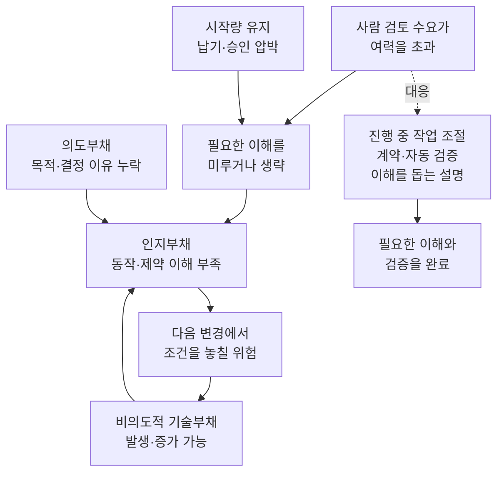
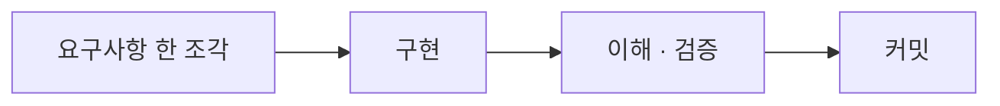
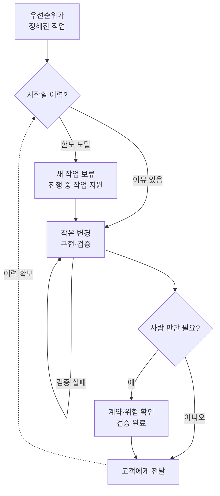
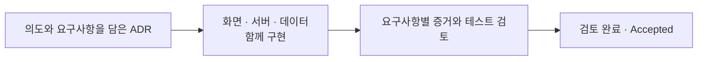

## TL;DR

- 개인은 한 번에 이해하고 검증할 변경을 작게 만든다.
- 팀은 동시에 진행하는 미완료 작업을 제한한다.
- 개선 효과는 전달 비용과 완료량·품질로 확인한다.

## 시작하며

고객과 AI 코딩에 관해 이야기하다가, Agent가 만든 코드를 리뷰할 때 인지부하가 심하게 걸린다는 말을 들었다. 여기서 인지부하는 작업을 이해하고 판단하려고 머릿속에 정보를 유지하는 데 드는 부담이다.

내 경험을 돌아보니 나는 그런 느낌을 거의 받지 못했던 것 같다.

아마 GitHub Copilot 베타 버전부터 AI 코딩 도구를 사용했기 때문인 것 같다.

당시 모델은 지금처럼 신뢰할 수 있는 수준이 아니었다. 큰 작업을 맡기면 실패했기 때문에 문제를 작게 나누고, 작은 커밋과 PR(Pull Request, 코드 변경을 검토하고 합치는 요청)을 만들고, 개발 피드백 루프를 최대한 짧게 가져가는 습관이 자연스럽게 생겼다.

모델의 성능이 좋아지는 동안 나도 모델을 어디까지 신뢰할 수 있는지 조금씩 배웠다.

반면 최근에 AI 코딩을 시작한 사람들은 처음부터 성능이 좋은 모델을 접한다. 그러다 보니 모델이 만들 수 있는 최대치를 한 번에 뽑아내려는 경향이 있는 것 같다.

코드는 빠르게 만들어지지만, 사람이 이해하지 못한 변경도 같은 속도로 쌓인다.

이 경험을 Max Kanat-Alexander가 설명한 Developer Experience의 `Cognitive Load`로 볼 수 있겠다고 생각했다.[^1] 좋은 Developer Experience를 만들려면 작업에 필요한 지식과 판단의 수를 줄여야 한다는 이야기다.

AI가 줄인 인지부하는 사라진 것이 아니라 **구현 과정에서 리뷰 시점으로 이동할 수 있다.**

당장은 작은 변경과 짧은 피드백 루프로 이 부하를 나눌 수 있다. 장기적으로는 사람이 검토할 기준을 비즈니스 요구사항과 코드 사이의 계약으로 옮기고, Agent가 그 계약을 지켰는지 증거로 확인하는 방향으로 가야 한다고 생각한다.

이때 놓치지 말아야 할 것은 다음 변경에 필요한 이해다. 검토할 일이 밀린 상태에서 승인 속도를 유지하려 하면, 필요한 이해를 다음으로 미루는 선택을 할 수 있다. 당장은 리뷰 시간이 줄어도 팀에 동작을 설명할 사람이 남지 않는다면 그 비용은 다음 수정이나 장애 대응에서 다시 나타날 수 있다.

팀으로 범위를 넓히면 개인의 습관만으로 해결되지 않는 문제도 생긴다. 각자 작은 변경을 만들더라도 모두 동시에 제출하면 동료가 검토할 일은 계속 쌓인다.

그래서 개인에게는 한 번에 이해할 범위를, 팀에는 동시에 시작해놓은 작업량을 조절하는 방법이 필요하다. 팀의 목표는 **미완료 작업을 적게 유지하면서, 같은 품질로 고객에게 전달하는 완료량을 높이는 것**이다.

앞부분에서는 인지부하가 생기는 이유와 개인의 대응을 설명하고, 뒤에서는 팀의 작업 제한과 병목 개선으로 넓혀본다. 비용을 평가하는 CTS-SW의 정의와 계산은 별도 소개글에 정리했다.[^19]

## 1. 구현 중 인지부하는 줄었다

Paul Graham은 Maker's Schedule과 Manager's Schedule을 구분했다.[^2]

Manager의 일정은 한 시간 단위로 나눌 수 있지만, 무언가를 만드는 사람은 하나의 문제를 머릿속에 올리는 데 시간이 걸리므로 반나절 정도의 덩어리 시간이 필요하다는 이야기다.

전통적인 개발은 이 설명에 잘 들어맞았다.

주변 코드를 읽고, 요구사항과 제약을 이해하고, 머릿속에 동작 방식을 올린다. 그 상태를 유지하면서 코드를 작성하고 테스트한다.

중간에 회의가 하나 들어오면 단순히 한 시간을 잃는 것이 아니었다. 아직 코드로 다 옮기지 못한 머릿속의 상태도 함께 잃고, 자리로 돌아와서 다시 코드를 읽어야 했다.

Agent를 사용하면 이 과정이 나뉜다.

사람이 의도와 제약을 전달한 뒤에는 Agent가 코드를 탐색하고 구현하고 테스트한다. 그동안 사람은 다른 일을 할 수 있고, 잠깐 자리를 비운다고 해서 Agent가 읽어둔 파일과 작업 상태까지 사라지지는 않는다.

그래서 적어도 **구현하는 시간**은 예전보다 컨텍스트 스위칭에 관대해졌다.

Maker에게 Manager처럼 한 시간 단위로 일할 수 있는 여지가 조금 생긴 셈이다. 물론 요구사항을 정하거나 결과를 판단하는 일에는 여전히 긴 집중이 필요하지만, 구현 내내 같은 코드를 머릿속에 붙들고 있을 필요는 줄었다.

처음에는 이 변화가 그냥 좋은 일이라고 생각했다.

그런데 Agent를 여러 개 돌리기 시작하면 구현 중에 줄어든 인지부하가 결과를 확인하는 시점으로 몰린다는 것을 알게 된다.

## 2. 사라진 이해 과정은 리뷰에 몰린다

예전에는 코드를 작성하는 시간이 길었다.

그 시간 동안 작성할 코드와 주변 코드를 계속 읽었다. 구현하면서 선택지를 하나씩 결정했고, 테스트가 실패하면 머릿속의 동작 방식도 같이 고쳤다.

코드를 다 작성했을 때는 왜 이런 구조를 선택했고 어디가 위험한지를 대략 알고 있었다. 코드 이해가 별도의 작업이라기보다 구현 과정에서 조금씩 쌓이는 부산물에 가까웠다.

구현을 Agent에게 맡기면 완성된 결과를 먼저 받는다.

사람은 이미 만들어진 코드 앞에서 Agent가 무엇을 읽었고, 어떤 가정을 했고, 왜 이런 구현을 골랐는지를 거꾸로 따라간다. Agent가 몇십 분 동안 만든 변경을 사람이 비슷한 시간 안에 이해할 수 있으리라는 보장도 없다.

이 변화를 시간축에 놓으면 아래처럼 볼 수 있다.

전통적인 개발에서는 주변 코드를 읽고 선택지를 결정하고 테스트하는 부담이 구현 시간 전체에 퍼져 있었다. AI 개발에서는 앞에서 의도와 제약을 정할 때 높아지고, Agent가 코딩하는 동안은 크게 낮아졌다가, 끝에서 결과와 숨은 가정을 확인할 때 다시 높아진다.


이 그림은 인지부하의 총량을 측정한 결과가 아니라, 같은 작업을 할 때 사람의 부담이 놓이는 위치를 단순화한 개념도다.

AI가 총량을 자동으로 없앤다고 보기보다, 사람이 구현 중에 조금씩 쌓던 이해가 빠지면서 앞단의 명세와 뒷단의 리뷰로 압축된다고 보는 편이 가깝다. 앞에서 의도와 제약을 충분히 정하지 않으면 Agent가 내린 판단을 마지막에 더 많이 역추론해야 하므로 뒤쪽 봉우리는 더 높아질 수 있다.

PR이 클수록 힘들다는 익숙한 문제와도 조금 다르다.

예전의 큰 PR에서는 작성자가 구현하며 얻은 맥락을 리뷰어에게 설명할 수 있었다. Agent가 작성한 PR에서는 최종 책임을 질 사람도 그 맥락을 새로 배워야 할 수 있다.

이해와 검증 방식을 그대로 둔 채 Agent 수만 늘리면 이 차이는 줄어들지 않을 수 있다. 사람이 확인해야 할 변경이 검토 여력보다 빠르게 들어오는 동안에는 읽지 않은 변경이 쌓인다.

그래서 사람이 모든 결과를 확인하는 현재의 리뷰 방식은 품질을 지키는 장치이면서 동시에 처리량을 제한하는 부분이 된다. 사람이 모든 코드를 이해해야 다음 단계로 넘어갈 수 있다면, 전체 개발 속도는 결국 사람이 코드를 읽을 수 있는 속도에 맞춰진다.

개인적으로 AI 코딩에서 가장 먼저 줄여야 할 인지부하도 이 부분이라고 생각한다.

코드를 더 빨리 생성하는 방법은 이미 많다. 이제는 Agent가 만든 결과를 사람이 어느 정도까지 이해해야 하고, 무엇을 보고 신뢰할 것인지를 다시 정해야 한다.

다만 코드 이해 자체를 없애야 한다는 뜻은 아니다.

Geoffrey Litt는 코드 이해의 목적을 정확성을 검증하는 것과 다음 변화에 참여하는 것으로 나눈다. Agent가 정확한 결과를 내더라도 이번 변경에서 얻은 이해가 없으면 다음 아이디어를 떠올리고 프로젝트에 참여하기 어렵다는 이야기다. 발표에서는 이해하지 못한 변경이 쌓이는 상태를 `Cognitive Debt`로 설명한다.[^7]

이 구분은 계약 중심 리뷰와도 맞닿아 있다고 생각한다. 모든 줄을 같은 깊이로 읽는 대신 정확성은 계약과 증거로 확인하고, 다음 판단에 필요한 동작 방식은 사람이 따라갈 수 있는 설명으로 남겨야 한다.

## 3. 이해를 미룬 비용은 다음 변경에 나타난다

리뷰가 밀렸을 때 읽는 시간을 줄였다는 사실만으로 문제가 해결됐다고 보기는 어렵다. 필요한 이해를 얻었는지, 아니면 다음 작업으로 미뤘는지를 구분해야 한다.

### 집중에 드는 부담과 과부하를 구분하기

인지부하 이론에서는 당장 정보를 붙들고 처리하는 작업 기억의 용량과, 경험을 통해 익힌 지식 구조를 구분한다.[^8] 코드에 적용해보면 처음 보는 상태와 예외를 하나씩 기억해야 하는 사람과, 익숙한 동작 하나로 묶어 이해하는 사람의 부담은 다를 수 있다.

그래서 같은 200줄이라도 익숙한 화면 수정과 처음 보는 결제 재시도의 리뷰는 다르다. 후자는 요청 순서, 저장된 상태, 실패 뒤 다시 호출해도 되는 조건을 함께 이해해야 한다.

동작을 따라가고 실패 조건을 확인하는 데도 인지 자원이 필요하다. 이 노력까지 없애는 것이 목표는 아니다. 줄이고 싶은 것은 흩어진 정보를 계속 찾는 불필요한 부담과, 한 번에 다룰 수 있는 범위를 넘는 인지 과부하다.

2022년 코드 리뷰 실험에서도 더 높은 인지부하와 더 나은 리뷰 성과가 연결되는 결과가 관찰됐다. 참가자들은 전문 개발자였지만 다수가 리뷰 경험은 적었고, 연구진은 과업에 충분한 인지 자원을 투입한 결과일 가능성을 제시했다.[^24]

이 연구만으로 누구에게나 맞는 ‘적정 인지부하’를 정할 수는 없다. 낮은 부하가 익숙한 코드와 좋은 설명 덕분일 수도 있으므로, 부담이 낮다는 사실만으로 대충 읽었다고 판단해서도 안 된다.

### 승인 속도를 유지하려고 이해를 미룰 때

내가 걱정하는 것은 검토 수요가 팀의 여력을 넘었는데도 새 작업의 시작을 조절하거나 검증 방식을 바꾸지 않는 상황이다. 여기에 납기와 승인 건수에 대한 압박이 더해지면, 아직 파악하지 못한 동작을 ‘나중에 필요할 때 보자’고 넘길 수 있다.

이 선택은 당장의 읽는 시간을 줄이지만, 다음 변경과 장애 대응에 필요한 이해까지 함께 미룰 수 있다. 나는 이렇게 미뤄둔 이해가 팀의 인지부채로 남을 수 있다고 생각한다. 승인 건수가 유지됐다고 고객에게 전달한 완료량과 품질까지 유지됐다는 뜻은 아니다.

시간 압박에 관한 체계적 문헌 검토는 102편을 분석했고, 고품질 연구의 다수에서 생산성 증가와 품질 감소를 보고했다. 다만 서로 충돌하는 결과와 과업·지식 수준의 영향도 함께 다뤘다.[^25] AI 개발에서 이해를 미루는 선택을 직접 검증한 연구는 아니지만, 당장의 처리량을 높이는 동안 다른 비용이 생길 수 있다는 점을 참고할 수 있다.

검토를 서두르는 상황에서는 동작을 끝까지 따라가기보다 테스트 통과 표시나 Agent의 요약에 기대기도 쉬워진다고 생각한다. 이때 코드에 문제가 없는 것과 아직 문제를 찾아보지 못한 것이 구별되지 않는다.

### 그럴듯한 설명을 이해로 착각하기

자동화된 결과를 충분히 확인하지 않고 신뢰하는 경향을 자동화 편향이라고 한다. LLM 보조 개발을 관찰한 Zhou 등의 연구에서도 이런 판단 편향을 다룬다.[^11]

14명의 개발자를 관찰한 자료에서 전체 행동의 48.8%가 편향이 있는 것으로 분류됐고, **편향으로 분류된 행동 중** 56.4%가 개발자와 LLM의 상호작용이었다. 모든 AI 상호작용의 56.4%를 무비판적으로 수용했다는 뜻은 아니다.

Shaw와 Nave는 AI의 답을 거의 검토하지 않고 자신의 판단으로 받아들이는 현상을 `Cognitive Surrender`, 인지 항복이라고 부른다. 이들의 실험은 코드 리뷰가 아닌 추론 문제를 대상으로 했으므로 개발자의 리뷰 행동을 직접 증명하지는 않는다.[^12]

그래도 리뷰에서 주의할 구분은 분명하다. Agent에게 반복 작업을 맡기면서 근거를 확인하는 것과, Agent가 괜찮다고 했으니 괜찮다고 받아들이는 것은 다르다. 설명이 유려할수록 그 설명이 어떤 코드와 테스트에 기대고 있는지를 볼 필요가 있다.

### 코드, 사람의 이해, 기록된 의도를 구분하기

Margaret-Anne Storey는 기술부채, 인지부채와 의도부채를 구분하는 Triple Debt Model을 제안했다.[^10] 세 가지를 나누면 코드가 깔끔해도 왜 다음 수정이 어려울 수 있는지 설명하기 좋다.

| 구분 | 부족하거나 잘못된 것 | 확인해볼 질문 |
| --- | --- | --- |
| 기술부채 | 앞으로 변경을 어렵게 만드는 코드와 구조 | 작은 수정이 왜 여러 모듈의 수정으로 번지는가? |
| 인지부채 | 시스템 동작과 결정 이유에 대한 팀의 공유된 이해 | 실패 뒤 재시도했을 때 어떻게 되는지 설명할 사람이 있는가? |
| 의도부채 | 밖으로 기록하지 않은 목적, 제약과 결정 이유 | 왜 이 동작을 골랐고 어떤 조건을 지켜야 하는지 남아 있는가? |

기술부채에는 빠른 출시를 위해 알고 선택한 지름길뿐 아니라, 의존 관계나 기술적 제약을 몰라 생긴 문제도 포함된다. Fowler의 Technical Debt Quadrant도 의도적 선택과 비의도적 선택을 구분한다.[^26] 세 부채를 나누는 기준은 의도했는지가 아니라 코드, 팀의 이해, 외부에 남긴 기록 중 어디에 문제가 있는지다.

지금 리뷰할 때 드는 부담이 인지부하라면, 이해하지 못한 채 넘긴 변경 때문에 팀의 공유된 이해에 남는 빈칸이 인지부채라고 볼 수 있다. 읽는 데 노력이 들더라도 그 과정에서 이해를 얻었다면 다음 작업의 부담을 줄일 수 있다.

문서를 작성했다고 인지부채가 없어지는 것도 아니다. 결정 이유를 기록하면 의도부채를 줄일 수 있지만, 팀이 그 내용을 이해하고 다음 판단에 사용할 수 있는지는 별도로 봐야 한다. 지키려는 요구사항을 알아도 구현이 어떤 조건에서 그 요구사항을 보장하는지 모를 수 있다.

가령 중복 결제를 막는 가상의 시스템에서, 결제 식별자를 저장한 기록이 재시도 기간 내내 유지되어야 한다고 해보자. 처음 구현한 코드는 그 조건을 지키지만, 이유가 문서에 없고 팀에도 이해가 남지 않을 수 있다.

나중에 저장 비용을 줄이는 작업을 맡은 Agent가 기록 보관 기간을 줄이고, 리뷰어도 그 영향을 알아차리지 못하면 문제가 생긴다. 기록이 지워진 뒤의 재시도를 확인하는 테스트가 없다면 기존 테스트는 모두 통과할 수 있다.

팀이 중복 결제를 막아야 한다는 목표를 알아도, 기록 보관과 재시도의 관계를 이해하지 못하면 이런 변경을 통과시킬 수 있다. 이해의 빈칸이 후속 판단에 영향을 주어 비의도적 기술부채를 만들거나, 이미 존재하던 문제의 발견과 수정을 늦출 수 있다고 생각한다.





이 그림은 부채가 서로 영향을 줄 수 있는 경로를 정리한 설명 가설이다. 대기열이 생겼다고 과부하나 이해 유예가 반드시 발생하는 것은 아니며, 이해하지 못한 코드에도 결함이 없을 수 있다. 또한 인지부채가 사라지고 기술부채로 대체되는 것이 아니라 두 부채가 함께 남을 수 있다.

### 연구가 확인한 범위

관련 연구들을 보면 이해도, 개발 시간, 코드 품질이 서로 다른 방식으로 측정된다. 결과를 한데 묶어 ‘AI가 인지부채를 거쳐 장애를 만든다는 사실이 증명됐다’고 읽으면 범위를 넘는다.

| 연구 | 관찰한 결과 | 이 글에서 참고할 범위 |
| --- | --- | --- |
| Shen·Tamkin, 2026[^9] | 주로 초기 경력인 개발자 52명의 새 라이브러리 학습 실험에서 AI 사용 그룹의 퀴즈 평균은 50점, 비사용 그룹은 67점이었다. | 차이는 17%p다. 작업 직후의 이해도를 측정했으며 장기적인 실력 저하나 운영 장애를 확인한 실험은 아니다. |
| METR, 2025[^13] | 숙련된 오픈소스 개발자 16명이 자기 저장소의 246개 작업을 수행할 때 AI 사용 조건에서 완료 시간이 19% 길었다. | 2025년 초 도구와 해당 작업의 결과다. 인지부하만을 지연 원인으로 분리한 연구는 아니다. |
| DORA, 2024[^14] | AI 도입 수준 25% 증가가 코드 리뷰 속도 3.1% 향상, 전달 안정성 7.2% 하락과 연관됐다. | 설문 기반의 관계이며 인과관계가 아니다. 리뷰가 빨라졌다고 전달 안정성까지 좋아지는 것은 아니라는 점을 보여준다. |
| Liu 등, 2026, v2[^15] | 6,299개 저장소의 AI 작성 표시가 있는 커밋 약 30만 건을 분석했다. 추적한 정적 분석 이슈의 22.7%가 마지막 관찰 버전에도 남아 있었다. | 실제 장애 비율이 아니다. 사람만 작성한 코드와의 비교나 리뷰어의 이해도 측정도 없으므로 잔존 원인을 인지부채로 확정할 수 없다. |

METR의 2026년 후속 조사에서는 빨라지는 방향의 추정치가 나왔지만, 참여자와 작업의 선택 편향 때문에 현재 효과를 신뢰성 있게 추정하기 어렵다고 밝혔다. DORA도 2025년에는 AI 도입과 전달 처리량의 관계를 긍정적으로 보고하면서, 불안정성과의 관계는 계속 관찰했다.[^13][^14]

개인적으로 이 결과를 보면 **생성 속도, 사람이 얻은 이해, 배포 뒤 품질을 각각 확인해야 한다**고 생각한다. 하나의 지표만으로는 어디에서 비용이 줄고 어디로 옮겨갔는지 알기 어렵다.

## 4. 개인: 한 번에 이해할 범위를 줄이기

현재는 크게 두 가지 방법이 가능해 보인다.

하나는 사람이 이해할 대상을 코드에서 계약으로 옮기는 방법이다. 다른 하나는 아직 코드를 봐야 하는 영역의 생성 단위를 작게 만드는 방법이다.

둘 중 하나만 써야 하는 것은 아니다. 코드의 위험도와 현재 테스트 수준에 따라 섞어서 쓸 수 있다.

### 코드가 아니라 계약을 이해하기

첫 번째 방법에서는 사람이 이해할 대상을 코드에서 **비즈니스 요구사항과 코드 사이의 계약**으로 옮긴다.

여기서 계약은 문서 자체보다, 비즈니스 요구사항이 코드에서 참인지 판정하는 기준에 가깝다.

사람이 먼저 정할 내용은 생각보다 많지 않다.

- 사용자에게 보여야 하는 동작
- 항상 지켜져야 하는 조건
- 넘으면 안 되는 아키텍처 경계
- Agent가 알아서 정해도 되는 부분
- 어떤 상황에서 다시 사람에게 물어볼지

여기서 처음부터 완벽한 문서를 만들려고 하면 다시 사람이 구현을 미리 하는 것과 비슷해진다.

코드를 열어보기 전에는 알 수 없는 제약도 많고, 알고리즘이나 클래스 구조까지 지정하면 Agent에게 맡길 수 있는 부분도 줄어든다. 사람은 얇은 의도와 판정 기준을 주고, Agent가 저장소를 탐색하면서 발견한 사실을 다시 계약에 반영하는 편이 낫다.

그중 다음 구현에서도 유지되어야 할 내용은 제품 요구사항 문서(PRD)나 아키텍처 결정 기록(ADR)에 남긴다. 특히 ADR에는 무엇을 골랐는지와 함께 이유, 고려한 대안과 지켜야 할 조건을 적는다. 이번 구현 안에서만 의미가 있는 자료구조나 함수 분리는 코드에 남겨두면 된다.[^3]

Agent는 계약을 기준으로 구현하고 테스트한 뒤, 요구사항별로 무엇을 만족했고 무엇으로 검증했는지를 정리한다.

코딩 Agent의 책임도 코드를 많이 만드는 것에서 계약을 빠짐없이 준수하고 그 사실을 증명하는 쪽으로 옮겨가야 한다.

이때 사람이 확인해야 할 것은 두 가지다.

- 명시된 계약 조건을 모두 지켰는가
- 계약에 없던 판단은 어떤 가정을 바탕으로 내렸는가

예를 들어 결제 코드 전체를 읽기 전에 아래 내용을 먼저 확인하는 식이다. 실제 실행 결과가 아니라, 검증한 내용과 남은 판단을 구분하기 위한 가상의 보고서다.

```text
요구사항
- 같은 payment_id는 두 번 결제되지 않는다.
- 같은 payment_id, 금액, 통화로 재시도하면 기존 결제 결과를 반환한다.

검증
- duplicate_webhook_does_not_charge_twice: PASS
- retry_after_timeout_returns_previous_result: PASS

구현 재량
- 같은 요청을 식별할 키를 기존 Redis 저장소에 보관
- 이웃 모듈과 같은 key 형식 사용

아직 검증할 조건
- 결제 기록의 보관 기간과 유실 시에도 중복 결제를 막는지: 미검증

제품 판단이 필요한 빈칸
- 같은 payment_id로 금액이나 통화가 달라졌을 때의 동작
- 추천안: 충돌 오류로 거부
- 대안: 기존 결과 반환 / 새 payment_id로 다시 요청하도록 안내
- 영향: 중복 결제와 데이터 의미가 달라지므로 사람에게 요청
```

중복 결제 금지와 재시도 응답은 별개의 요구사항이다. 예시에서는 둘 다 이미 합의했다고 가정했다. 테스트 두 개가 통과해도 보관·유실 조건과 제품 판단이 남아 있으므로 전체 작업을 완료로 표시해서는 안 된다.

구현 세부를 전혀 보지 않겠다는 뜻은 아니다.

먼저 요구사항과 테스트를 보고, Agent가 계약에 없던 판단을 어떤 가정으로 내렸는지 확인한다. 증거가 부족하거나 위험도가 높은 부분만 실제 코드로 내려가면 된다.

여기서 가정은 모델의 내부 사고과정을 모두 설명하라는 뜻이 아니다.

외부 결제사가 결과를 계속 보관하는지, 요청에 담긴 고객 조직 정보가 신뢰할 수 있는 출처인지, 외부 서비스의 완료 알림이 순서대로 한 번만 오는지처럼 **코드가 의존하는 외부에서 검증 가능한 전제**를 말한다.

이 전제가 틀렸을 때 계약이나 안전이 깨진다면 코드, 테스트, 설정이나 권위 있는 외부 문서로 확인해야 한다. 확인할 수 없다면 성공으로 닫지 않고 미검증 위험으로 사람에게 올린다.

계약의 빈칸을 모두 질문으로 돌려보낼 필요도 없다.

명시된 계약에서 논리적으로 따라오는 의무를 먼저 찾고, 저장소의 관례와 이웃 코드를 따른다. 그래도 비어 있으면 권위 있는 protocol이나 domain 규칙을 확인하고, 외부 동작을 바꾸지 않는 가역적인 기본값까지는 Agent가 선택할 수 있다.

함수 이름이나 내부 자료구조처럼 외부 동작을 바꾸지 않는 선택은 Agent의 구현 재량으로 둘 수 있다. 반면 사용자에게 보이는 동작, 데이터의 의미, 보안과 권한 경계를 바꾸는 가정은 새 계약이나 결정으로 올려야 한다.

여러 제품 선택지가 남는다면 Agent는 그냥 질문만 던지기보다 추천안과 근거, 현실적인 대안, 각각의 영향과 추가할 계약 문구를 묶어서 요청하는 편이 낫다.

테스트가 틀렸거나 계약에서 요구사항을 빼먹었다면 여전히 문제가 생긴다. 그래도 검토 범위를 코드 전체에서 요구사항, 테스트, 예외로 줄일 수 있다는 점은 꽤 크다.

여기서 계약을 완벽하게 준수한다는 말은 오류가 절대 없다고 선언하는 것이 아니다.

명시된 계약 중 확인하지 못한 항목을 숨긴 채 성공으로 끝내지 않고, 계약별 증거가 부족하거나 새로운 결정이 필요하면 완료하지 않은 채 사람에게 올린다는 뜻이다.

### 사람이 이해할 크기로 나누기

계약과 테스트만으로 승인하기 어려운 코드도 있다.

보안, 결제, 데이터 마이그레이션처럼 구현 방식이 위험에 직접 연결되는 영역이 그렇다. 테스트가 부족한 오래된 코드베이스도 당분간은 사람이 코드를 읽어야 한다.

이 경우에는 파일 수보다 **한 번에 새로 이해해야 하는 개념의 수**를 줄이는 것이 중요하다.

예를 들어 결제 기능 전체를 하나의 PR로 만들기보다 아래처럼 나눌 수 있다.

```text
PR 1 - Payment 상태 모델 추가
PR 2 - 외부 결제사 호출을 교체 가능한 인터페이스로 분리
PR 3 - 중복 결제 방지
PR 4 - 결제사 완료 알림(Webhook)으로 최종 상태 확정
```

각 PR에서 왜 필요한 변경인지, 새로 생긴 개념이 무엇인지, 반드시 지켜야 할 조건과 확인할 테스트가 무엇인지만 분명하면 된다.

다만 작은 PR을 하나씩 merge한 뒤 다음 작업을 시작하면 Agent의 빠른 생성 속도를 활용하기 어렵다.

Stacked PR은 앞의 PR이 merge되기 전에 그 위에서 다음 작업을 이어갈 수 있어서 이 문제를 어느 정도 줄여준다.[^4] Agent는 계속 작업하고, 사람은 각 PR에서 새로 추가된 내용만 순서대로 읽을 수 있다.

인지부하 분포로 보면 Stacked PR은 마지막의 큰 봉우리를 작은 리뷰 여러 개로 나눈다.


하지만 첫 PR이 검토 가능한 상태가 되기 전까지는 사람이 구현을 따라가며 이해를 쌓기 어렵다. 전통적인 개발처럼 긴 구현 과정 전체에 부하가 고르게 퍼지기보다, 뒤쪽에서 작은 단위로 이어지는 모양에 가깝다.

각 봉우리도 PR의 diff만큼만 높아지는 것은 아니다.

한 PR을 이해하려면 변경 전 동작과 앞선 PR의 결정, 뒤에 쌓인 PR에 미치는 영향을 함께 머릿속에 올려야 한다. 리뷰에서 수정이 생기면 그 수정이 위에 쌓인 PR의 의미를 바꾸는지도 다시 확인해야 한다.

```text
실제 검토 범위
= 현재 PR의 diff
+ 변경 전 동작
+ 앞선 PR의 결정
+ 뒤 PR에 미치는 영향
+ 수정 뒤 다시 확인할 범위
```

그래서 Stacked PR의 작은 봉우리 아래에는 전후 컨텍스트를 유지하는 기본 부하가 남는다. Stack이 길어질수록 실제 이해 범위는 개별 PR의 diff보다 더 넓어진다.

Stacked PR은 한 번에 복원해야 하는 컨텍스트와 순간적인 리뷰 부하를 줄여준다는 점에서 현재 꽤 유용해 보인다. 하지만 모든 단계에 사람이 들어가야 하는 점은 그대로이고, Agent가 사람보다 여러 PR 앞서가면 검토해야 할 컨텍스트도 다시 커진다.

#### 개발 사이클을 작은 산으로 만들기

현실적으로 이 부하를 줄이려면 PR만 작게 자르는 것보다 **개발 사이클 자체를 작은 단위로 압축해야 한다.**

요구사항 한 조각을 정하고, Agent가 구현하면, 사람이 그 변경을 이해하고 검증한 뒤 커밋한다. 그다음 작은 조각으로 넘어간다.





코드가 작은 단위로 생성됐어도 사람의 이해가 같은 단위에서 닫히지 않으면 개발 사이클은 작아지지 않는다. 작은 PR 네 개를 먼저 쌓아두고 나중에 몰아서 읽으면 생성 단위는 작아도 개발 사이클은 여전히 크다.

동네 뒷산을 하루에 세 번 오르내리는 것과, 누적 높이가 비슷한 큰 산을 한 번 오르내리는 것은 같지 않다.

큰 산은 더 긴 준비가 필요하고, 오르는 동안 높은 체력을 오래 요구하며, 내려온 뒤 회복도 느리다. 현재 체력으로는 끝까지 오르기 어려운 사람도 있다.

AI로 구현한다고 봉우리의 위치가 바뀌는 것은 아니다.

작은 사이클도 앞에서는 의도와 제약을 정하고, 가운데에서는 Agent가 구현하므로 사람의 부하가 낮아지며, 끝에서는 결과를 이해하고 검증한 뒤 커밋해야 한다.

차이는 전체 기능을 하나의 큰 사이클로 닫느냐, 같은 모양의 작은 사이클 여러 개로 닫느냐에 있다. 아래 그래프에서 색 하나가 이해와 커밋까지 끝난 개발 사이클 하나다.


인지부하도 총량만 더해서 비교하기 어렵다고 생각한다.

사람마다 한 번에 머릿속에 올릴 수 있는 컨텍스트의 양이 다르고, 같은 사람도 도메인 경험, 훈련, 피로와 중단에 따라 달라진다. 그래프의 인지 용량선은 사람과 상황마다 다른 위치에 놓인다.

현재 용량보다 큰 리뷰를 맡으면 코드를 조금 느리게 읽는 정도로 끝나지 않는다. 컨텍스트를 여러 번 나누어 올리고, 놓친 내용을 다시 복원하고, 수정 뒤 영향 범위를 다시 읽는 시간이 추가된다.

그래서 리뷰가 길어질수록 높은 인지부하를 유지해야 하는 시간도 늘어난다. 작은 개발 사이클은 각 봉우리를 낮추고, 이해하고 검증한 변경을 다음 사이클의 출발점으로 만드는 방법이다.

커밋 자체가 이해를 저장해주지는 않는다. 다음 사람이 찾아볼 결정 이유와 테스트도 함께 남겨야 한다. 읽는 동안 조건을 계속 놓친다면 아직 한 사이클이 너무 크거나, 주변 맥락에 대한 설명이 부족하다는 신호로 삼아볼 수 있다.

## 5. 개인: 리뷰에서 이해를 돕는 발판 만들기

작게 나눠도 처음 보는 동작을 어디서부터 읽어야 할지 모를 수 있다. 이때 읽을 순서와 질문을 제공해 사람이 스스로 이해하도록 돕는 방식을 인지 스캐폴딩이라고 부를 수 있다. 건물 작업에 발판을 놓듯, 한 번에 알아야 할 내용을 단계별로 따라가게 만드는 것이다.

앞의 결제 예시라면 변경 전후의 차이를 보여주는 diff부터 읽기보다 다음 순서로 검토 자료를 구성해보고 싶다. 마지막의 관점 분담은 이 읽기 방법을 동료와 함께 적용하는 방식이다.

### 목적과 흐름을 보고 필요한 코드까지 내려가기

먼저 무엇이 바뀌었는지, 요청이 어느 구성 요소를 거치고 어디에 상태가 남는지 한 장의 그림으로 보여준다. 다음에는 지켜야 할 조건과 테스트 결과를 연결하고, 마지막에 그 조건이 깨질 수 있는 코드로 내려간다.

이렇게 필요한 정보를 단계적으로 보여주는 방식을 점진적 공개라고 한다. 요약이 원래 코드를 가리는 막이 되지 않도록, 각 설명에서 실제 코드와 실행한 테스트로 바로 이동할 수 있어야 한다.

결제 재시도라면 ‘요청 → 저장된 결제 기록 확인 → 기존 결과 반환’ 흐름을 먼저 이해한다. 그다음 기록이 없거나 두 요청이 동시에 들어오는 경우를 확인한다. 동시 요청 처리가 안전한지 증거가 부족하면 그 부분의 구현을 읽는다.

고위험 변경은 자동 검사에서 경고가 없어도 읽어야 할 수 있다. 결제 기록 보관, 권한 검사와 데이터 이전처럼 실패의 영향이 큰 부분은 처음부터 깊게 검토할 대상으로 지정하는 편이 낫다.

### 테스트를 먼저 읽되, 빠진 조건도 찾기

테스트를 먼저 읽으면 입력과 기대 결과를 통해 변경의 목적을 파악할 수 있다. 이 순서로 리뷰하는 방법을 Test-Driven Code Review(TDR)라고 한다.[^17]

다만 Spadini 등의 실험에서는 테스트를 먼저 읽은 그룹이 테스트 코드의 결함을 더 발견했지만, 운영 코드의 결함 발견 비율은 같았고 유지보수 관련 문제는 덜 발견했다. 모든 리뷰를 더 빠르고 정확하게 만드는 방법으로 받아들이기는 어렵다.

그래서 나는 테스트를 출발점으로 쓰되, 계약과 대조해 빠진 조건을 먼저 찾는 편이 낫다고 생각한다. Agent가 구현과 테스트를 함께 만들었다면 같은 잘못된 가정을 양쪽에 넣었을 수도 있기 때문이다.

앞의 예시에서는 ‘바로 재시도하면 기존 결과를 반환한다’는 테스트만 읽고 끝내면 안 된다. 기록이 사라진 뒤의 재시도도 계약에서 요구하는지, 그 조건을 확인한 테스트가 있는지까지 봐야 한다.

### 답을 읽기 전에 자기 말로 설명하기

Anthropic 실험에서 생성 뒤 설명을 요청하거나 개념을 질문한 참가자들은 비교적 높은 퀴즈 점수를 보였다. 다만 이 사용 방식별 비교는 무작위로 배정한 실험이 아니므로, 질문만 추가하면 같은 효과가 난다는 보장은 없다.[^9]

실무에서는 새 동작이나 고위험 변경을 검토할 때 핵심 질문 몇 개에 먼저 답해보는 방식으로 적용할 수 있다. 결제 예시에서는 아래처럼 묻는다.

- 외부 결제는 성공했는데 응답만 유실됐다면, 재시도는 무엇을 확인해야 하는가?
- 중복 결제를 막는 기록이 사라지면 어떤 보장이 깨지는가?
- 같은 결제 식별자로 금액이 달라졌다면 어떤 동작이 합의돼 있는가?

Agent의 정답을 바로 읽기 전에, 사람이 예상하는 동작과 이유를 한두 문장으로 설명한다. 답이 막히면 관련 상태 변화나 테스트를 찾아보고, Agent에는 그 부분을 짚어주는 질문을 요청한다. 이후 설명이 실제 코드와 맞는지 대조한다.

DeepCodeTutor도 코드 예제를 자기 말로 설명하게 하고, 부족한 부분에 단계적인 힌트를 주는 방식을 연구했다. 다만 학생 대상 실험에서 전체 실험군과 대조군의 학습 향상 차이는 통계적으로 유의하지 않았다. 실무 리뷰의 결함 감소 효과가 입증된 도구로 소개할 근거는 아니다.[^18]

나는 퀴즈 통과를 모든 PR의 승인 조건으로 만들기보다, 낯선 동작을 배우거나 중요한 변경을 인수할 때 선택적으로 쓰고 싶다. 모델이 출제하고 채점한 답을 외우는 절차가 되면 승인 단계만 늘어난다. **질문에 답하는 것은 이해를 점검하는 방법이고, 코드가 맞다는 증거는 별도로 필요하다.**

### 검토할 관점을 나눠 맡기기

한 사람이 보안, 성능과 업무 규칙을 한꺼번에 추적하기 어렵다면 검토 질문을 나눌 수 있다. 관점 기반 읽기(Perspective-Based Reading, PBR)는 테스터, 개발자, 사용자처럼 서로 다른 관점에서 자료를 읽도록 하는 방법이다. Basili 등의 초기 실험은 요구사항 문서에서 팀이 발견하는 결함의 범위가 넓어지는 결과를 보고했다.[^16]

코드 리뷰에 적용한다면 결제 기록의 접근 권한을 보는 사람, 재시도와 동시 요청을 보는 사람, 합의한 사용자 동작과 테스트를 대조하는 사람으로 질문을 나눌 수 있다. 원래 실험이 AI 코드 리뷰의 인지부하 감소를 직접 측정한 것은 아니며, 여기서는 검토 범위를 나누는 방법으로 가져온 것이다.

각자 검토한 뒤에는 경계에 걸친 문제를 함께 확인해야 한다. 예를 들어 성능을 위해 보관 기간을 줄이는 선택이 중복 결제 방지 조건을 깨뜨릴 수 있다. 역할을 나눴다고 다른 관점에 영향을 주는 가정까지 무시해서는 안 된다.

이 방법들을 도입한다면 승인 시간만 줄었는지 보지 않으려 한다. 변경 뒤 담당자가 실패 시 동작을 설명할 수 있는지, 다음 수정에서 맥락을 다시 찾는 시간이 줄었는지, 빠뜨린 조건 때문에 재작업하는 일이 줄었는지를 함께 보겠다.

## 6. 팀: 해야 할 일과 진행 중인 일을 나누기

개인이 작은 단위로 이해하고 검증하더라도, 여러 사람이 Agent를 병렬로 실행하면 팀의 리뷰 대기열은 커질 수 있다. 내가 만든 작은 PR이 동료에게는 오늘 들어온 스무 번째 PR일 수 있기 때문이다.

여기서는 해야 할 일의 목록인 Backlog와, 이미 시작했지만 아직 끝내지 못한 WIP(Work in Progress)를 구분해야 한다. 해야 할 일이 많다는 이유만으로 모두 동시에 시작할 필요는 없다.

예를 들어 작업 100개가 있는 가상의 팀이 아래처럼 운영될 수 있다.

| 상태 | 작업 수 |
| --- | ---: |
| 아직 시작하지 않은 Backlog | 94 |
| 구현 중 | 2 |
| 검토 중 또는 검토 대기 | 2 |
| 배포 중 또는 배포 대기 | 2 |
| 진행 중인 미완료 작업 합계 | 6 |

이 팀이 94개를 포기한 것은 아니다. 우선순위에 따라 여섯 개를 진행하고, 끝나는 만큼 다음 작업을 시작한다. 다만 Backlog에 넣었다고 모두의 납기와 우선순위까지 약속한 것은 아니므로, 사업 요구의 선택은 별도로 해야 한다.

이 글에서 소프트웨어 재고는 **팀이 일을 시작했지만 고객에게 전달하지 못한 작업**을 뜻한다. 코드 작성뿐 아니라 상세 설계, 수정, 검증과 배포 대기도 포함한다. Agent가 코딩을 끝냈거나 PR이 병합됐다는 이유만으로 재고에서 빼지 않는다.

한 작업은 그 시점의 상태 하나에만 넣어 중복 집계하지 않는다. 작업 하나를 PR 세 개로 나누더라도 고객에게 전달할 작업 자체는 하나로 추적할 수 있다.

진행 중 작업 수에 상한을 두는 WIP limit은 이런 미완료 작업의 축적을 조절한다. DORA는 한도에 걸려 여유가 생겼을 때 한도를 올리는 대신, 다른 단계의 지연 원인을 해결하라고 권한다.[^20]

### 뒷단의 여력에 맞춰 새 작업을 시작하기

검토나 배포가 감당할 수 있는 양을 앞단에 알려 새 작업 시작을 조절하는 것을 Backpressure, 백프레셔라고 한다. 검증된 결과를 다음 단계가 받아갈 여력이 있을 때 이어가는 방식이다.





리뷰 대기열이 가득 찼다면 새 기능을 계속 만들어 제출하는 대신, 기존 작업의 테스트를 보강하고 검증 근거를 정리하거나 검토하기 어려운 변경을 나눌 수 있다. AWS도 WIP 한도에 도달하면 새 일을 시작하기보다 진행 중인 일을 돕고 도구와 지식을 개선하도록 제안한다.[^21]

물론 이 작업도 공짜는 아니다. 별도 개선 작업이 필요하면 담당자와 시간을 배정하고 WIP에 포함한다. 기존 변경의 검증을 보강하는 일이라면 해당 작업에 연결한다. 개선이라는 이름으로 또 다른 무제한 대기열을 만들면 같은 문제가 반복된다.

검증 여력이 아직 부족하면 새 기능 생성량도 실제로 줄여야 한다. 당장의 축적을 막는 제한과, 장기적으로 더 많이 완료하기 위한 개선을 함께 하는 것이다. 모든 단계를 항상 바쁘게 만드는 것이 팀 전체의 완료량을 보장하지는 않는다.

## 7. 팀: 신호를 진단과 대응으로 연결하기

대기열이 늘었다는 숫자만으로 무엇을 고칠지는 알 수 없다. 먼저 검토자가 배정되기를 기다리는 시간과, 실제로 읽고 확인하는 시간, 수정 뒤 재검토하는 시간을 나눠보면 대응이 달라진다.

| 관찰한 신호 | 확인할 원인 | 적용해볼 대응 |
| --- | --- | --- |
| 리뷰 대기 증가 | 담당자 부재, 특정 전문가에게 집중 | 담당 범위 명확화, 공동 리뷰, 지식 공유 |
| 실제 검토 시간 증가 | 여러 개념이 섞인 변경, 주변 맥락 부족 | 독립적으로 확인할 행동 단위로 분할, 목적·흐름·근거 보강 |
| 수정과 재검토 반복 | 요구사항의 빈칸, 테스트 누락 | 합의할 계약을 먼저 보완하고 실패 조건을 테스트 |
| 같은 지적 반복 | 검사할 수 있는 규칙이 사람에게 남음 | 정적 분석·아키텍처 테스트·작업 지침으로 이전 |
| 여러 리뷰어에게 지속적인 초과 수요 | 신규 작업 유입이 현재 검증 여력보다 큼 | 신규 시작 제한, 자동 검증과 검토 지원에 여력 배정 |
| 검토는 끝났는데 전달이 지연됨 | 테스트 환경, 다른 팀 승인, 수동 배포 | 실제로 막힌 환경·권한·팀 간 의존 관계 개선 |

PR이 커졌고 대기 시간도 길어졌다고 해서 크기가 원인이라고 바로 확정하지는 않는다. 대기 중인 몇 건을 직접 따라가보고, 한 가지 대응을 적용한 뒤 완료량과 품질을 다시 확인하는 편이 낫다.

### 사람이 판단해야 할 양을 줄이기

앞 절의 WIP 제한으로 새 작업의 시작량을 조절할 수 있다. 그와 함께 검토 방식도 바꿀 수 있다. **사람에게 들어오는 검토 수요를 줄이거나, 필요한 검토를 더 적은 노력으로 끝내도록 돕는다.**

계약과 테스트는 전자에, 맥락 설명과 공동 리뷰는 후자에 기여할 수 있다. DORA도 AI가 만든 큰 변경에 대응하려면 작은 작업 단위, 작성 단계의 자동 검사와 검증 방식의 재검토가 필요하다고 설명한다.[^14]

계약과 자동 검증으로 반복 확인을 맡기려면 무엇을 검사했고 어떤 증거로 통과했는지 남겨야 한다. 이렇게 검증 책임을 명확히 나누는 것과, 아직 설명하지 못하는 동작을 ‘나중에 보자’고 넘기는 것을 구분해야 한다.

이때 사람에게 필요한 이해의 범위도 정해야 한다. 모든 함수와 라이브러리 내부를 같은 깊이로 읽을 필요는 없지만, 담당자는 다음 변경과 장애 대응에 필요한 동작·제약·실패 조건을 판단할 수 있어야 한다.

모든 변경을 같은 방식으로 처리하기보다 아래처럼 위험과 증거에 따라 경로를 정해볼 수 있다. 이는 팀이 합의해서 사용할 운영 예시이며, 파일 종류만으로 자동 승인할 기준은 아니다.

| 변경의 성격 | 검토 경로의 예 |
| --- | --- |
| 합의한 범위의 반복 변경이며 외부 동작·권한·데이터 의미를 바꾸지 않음 | 신뢰할 수 있는 자동 검사로 닫고, 결과를 기록해 표본 점검 |
| 기존 계약 안의 업무 동작 변경 | 계약별 증거와 바뀐 가정을 사람이 검토 |
| 결제·인증·권한·데이터 이전 또는 새로운 제품 결정 | 관련 책임자가 실패 경로와 구현까지 깊게 검토 |

문구나 설정 한 줄도 권한이나 결제 의미를 바꿀 수 있다. Agent가 ‘저위험’이라고 적었다는 이유만으로 승인하지 않고, 분류 근거와 검증 범위가 부족하면 사람 검토로 올려야 한다.

검토 수요도 PR 개수만으로 계산하면 틀리기 쉽다. PR 하나를 세 개로 나누면 건수는 늘지만 각각의 맥락 복원 비용은 줄어들 수 있다. 반대로 같은 사람이 세 번 설명을 다시 읽어야 해서 총시간이 늘 수도 있다.

그래서 검토 가능한 시간과 필요한 시간을 같은 단위로 비교하는 편이 낫다. 가령 하루에 30개 변경이 들어오고 각각 사람 검토 20분이 필요하다면 수요는 10시간이다. 실제 검토 여력이 5시간이라면 수요가 여력의 두 배이므로 현재 방식은 지속할 수 없다. 이 수치는 계산을 설명하기 위한 가정이다.

일부 반복 변경을 자동 검증으로 처리하고 나머지는 근거를 잘 정리해 검토 시간을 낮출 수 있다. 다만 ‘자동화로 몇 건, 분할로 몇 건을 제거했다’고 임의로 빼지 말고, 바꾼 뒤 실제 사람의 검토 시간이 얼마나 줄었는지 확인해야 한다.

수요와 여력이 평균적으로 같아도 복잡한 변경이나 휴가가 겹치면 대기열이 생긴다. 예외를 처리할 여유를 남기고, 오래 기다리는 작업을 살펴보며 한도를 조정하는 편이 낫다.

## 8. 팀: CTS-SW 옆에서 미완료 작업을 읽기

CTS-SW는 고객에게 전달한 소프트웨어 한 단위의 비용을 보여준다.[^19] 그 비용을 낮추는 동안 미완료 작업이 쌓이지 않는지 보려면 별도의 흐름 지표가 필요하다.

처음에는 완료한 작업 수, 평균 WIP, 오래된 작업, 품질을 함께 보겠다. 평균 WIP는 같은 시간 간격으로 기록한 진행 중 작업 수의 평균이다. 오래된 작업은 시작 뒤 지난 시간과 리뷰 대기 시간을 구분해 본다.

다만 필요한 이해를 미룬 채 승인한 변경은 리뷰 대기열에서 이미 사라졌을 수 있다. **대기열 감소가 공유된 이해의 개선을 뜻하지는 않는다.** 중요한 변경을 표본으로 골라 담당자가 동작과 실패 조건을 설명할 수 있는지, 다음 수정에서 맥락 복원과 재작업이 반복되는지도 함께 살펴보고 싶다.

### 평균 WIP를 완료 속도와 함께 보기

아래는 비슷한 크기의 사용자 변경을 같은 기준으로 추적한 가상의 두 기간이다. 하루와 기간의 길이도 동일하며, 작업 취소는 없다고 가정한다.

| 항목 | 도입 전 | AI 도입 초기 |
| --- | ---: | ---: |
| 고객에게 전달한 변경당 비용 | 500달러 | 400달러 |
| 하루 완료한 변경 | 4개 | 4.8개 |
| 평균 WIP | 10개 | 40개 |
| 평균 WIP / 하루 완료량 | 2.5일 | 약 8.3일 |

전달 비용은 낮아지고 하루 완료량은 20% 늘었지만, 미완료 작업은 네 배가 됐다. 이를 곧바로 실패나 성공으로 분류하기보다, 왜 끝내지 못한 일이 늘었는지 확인해야 한다.

평균 WIP를 평균 완료율로 나눈 값은 Little's Law와 연결된다.[^21]

```text
평균 WIP = 평균 완료율 × 평균 작업 소요 시간

예: 10개 / 하루 4개 = 2.5일
```

이 관계를 쓰려면 같은 작업 단위와 같은 시작·완료 경계를 사용해야 한다. 위 예시의 단위는 배포 횟수가 아니라 고객에게 전달한 변경이다. 진행 중 PR 20개를 하루 배포 4회로 나눠 ‘5일’이라고 하면 서로 다른 단위를 섞은 계산이다.

장기간의 흐름이 안정적이고 같은 경계를 드나드는 작업을 추적할 때 이 비율을 평균 소요 시간과 연결할 수 있다. WIP가 빠르게 늘어나는 짧은 기간에는 보조적인 비율로 읽고, 실제 완료 작업의 소요 시간과 아직 열린 작업의 나이를 함께 확인해야 한다. 특정 PR이 며칠 안에 끝난다는 예측값은 아니다.

취소된 작업도 WIP에서는 빠져나가지만 고객에게 전달한 산출물은 아니다. 취소가 많은 구간에서는 전달 완료량만으로 전체 작업의 평균 소요 시간을 추정하지 않고, 취소 건수와 소요 시간을 별도로 본다.

나는 이 비율에 별도의 표준 지표 이름을 붙이기보다 계산식과 단위를 그대로 보여주고 싶다. Backlog의 개수나 ‘Agent 완료’ 건수를 섞지 않아야 다음 주에도 같은 의미로 읽을 수 있다.

### 미처리 판단량과 오래된 작업 확인하기

WIP가 같아도 단순 반복 변경 열 개와 결제·인증 변경 열 개의 검토 부담은 다르다. 전체 WIP와 별도로 사람 판단을 기다리는 건수, 검토에 필요한 시간, 지식이 집중된 담당 영역을 표시하면 좋겠다.

위험도에 1·2·4 같은 가중치를 주는 방법도 가능하지만, 위험이 네 배라고 검토 시간도 네 배인 것은 아니다. 이런 점수는 팀이 만든 가정이지 검증된 인지부채 지표가 아니다. 사용한다면 실제 검토 기록으로 조정하고, 위험도와 예상 소요 시간은 구분해야 한다.

대기열 길이와 나이도 함께 본다. 열 건이 들어와 당일 처리되는 경우와 네 건이 여러 날 멈춘 경우는 대응이 다르다. 평균이나 중앙값만 보면 오래 멈춘 소수가 숨을 수 있으므로 가장 오래된 작업과 팀이 합의한 기한을 넘긴 작업도 확인한다.

‘24시간을 넘으면 위험’ 같은 공통 기준을 바로 적용하지는 않겠다. 제품의 배포 주기, 변경 위험과 실제 검토 여력에 맞춰 기준을 정하고, 지연 이유를 기록하겠다.

### 개선 하나를 적용하고 다시 보기

매주 CTS-SW와 완료량을 보고, WIP·대기 시간·재작업·변경 실패가 함께 어떻게 움직였는지 확인한다. 문제가 보이면 앞 절의 진단표에서 원인을 찾아 한 가지 대응을 정한다.

예를 들어 담당자가 없어서 이틀 기다리는 작업에 설명 문서만 더 붙여도 배정 문제는 해결되지 않는다. 반대로 리뷰어가 매번 배경을 복원하느라 오래 읽는다면 사람을 추가하기 전에 계약과 근거를 정리해볼 수 있다.

개선 뒤 대기열이 줄어도, 대충 승인해서 재작업이나 장애가 늘었다면 해결한 것이 아니다. 비용에는 개선에 쓴 시간도 포함하고, 품질을 유지하면서 고객에게 도달한 완료량이 늘었는지 확인한다.

## 9. 반복되는 판단을 팀 하네스로 옮기기

앞의 대응이 담당자 한 명의 요령에 머물면 그 사람이 자리를 비웠을 때 같은 병목이 다시 생긴다. 팀이 공유할 계약, 도구와 테스트로 남겨야 다음 작업에서도 쓸 수 있다.

계약 준수 증거가 충분하고 계약 밖의 가정까지 드러난 정상 경로라면 사람의 반복 승인을 요구하지 않아야 한다.

계약 변경, 기존 결정과의 모순, 자동으로 확인하지 못한 고위험 예외나 중요한 가정이 있을 때만 사람에게 올린다. 그래야 사람의 개입을 매 구현의 기본 단계가 아니라 계약과 예외를 다루는 단계로 줄일 수 있다.[^6]

리뷰할 때마다 같은 모듈 참조 방향을 지적한다면 아키텍처 테스트로 옮기고, 같은 요구사항을 확인한다면 테스트 케이스로 만든다. 예를 들어 업무 규칙을 담은 모듈이 화면 모듈을 직접 가져오지 못하도록 자동 검사하는 식이다. 같은 실수를 여러 번 고치는 대신 다음 Agent가 처음부터 피하도록 하네스, 즉 작업 지침과 도구·검증 환경을 고치는 방식이다.[^5]

이 작업을 개인의 여가에 맡기지 않고 팀의 정식 작업으로 배정해야 한다. 도구 사용료뿐 아니라 하네스를 만들고 운영하는 비용도 AI 도입 비용이다. Frontier Development에서 다룬 Amazon 팀들도 컨텍스트, 테스트와 도구를 먼저 정비했다.[^23]

팀 경계를 넘는 문제라면 담당 범위도 함께 바꿔야 한다. Team Topologies는 고객에게 가치를 전달하는 팀의 인지부하를 플랫폼, 학습 지원과 복잡한 전문 영역의 분리로 줄이는 방법을 다룬다.[^22] 리뷰를 빠르게 하려고 제품팀 모두에게 운영 환경과 보안의 모든 세부를 배우게 하는 것보다, 공통 도구와 전문 지원을 제공하는 편이 나을 수 있다.

조직에서도 같은 원칙을 적용할 수 있다고 생각한다. 요청은 우선순위를 정해 보관하되, 팀이 이미 진행 중인 프로젝트를 끝낼 여력 없이 새 프로젝트를 계속 시작시키지 않는다. Agent 수가 늘었다는 이유만으로 한 팀이 책임질 제품과 운영 범위까지 무한히 넓혀서는 안 된다.

내가 만드는 [ALPS Writer Plugins](https://github.com/haandol/alps-writer-plugins)에는 작업을 나누고, 계약에 맞게 구현했는지 검증하는 기준을 넣었다.[^3]

ALPS의 Feature는 화면, 서버, 데이터 계층을 따로 나누지 않고 사용자가 관찰할 행동 하나를 끝까지 완성하는 Vertical Slice, 수직 슬라이스로 작성한다. 단위가 너무 크면 기술 계층이 아니라 독립적으로 시연할 수 있는 사용자 행동 경계를 기준으로 나눈다.

`/feature-to-adr`가 이 Slice의 계약을 ADR로 옮기고, `/adr-impl`은 화면, 서버의 요청 처리와 데이터를 함께 구현하고 테스트한다. 앞의 색깔별 작은 AI 사이클에 대응시키면 아래처럼 볼 수 있다.





하나의 Slice를 의미상 더 나눌 수 없다면 같은 Slice 안에서 Stacked PR을 사용할 수 있다. 각 PR에 하나의 리뷰 질문과 테스트를 두어 순간적인 봉우리를 낮추지만, 전체 계약과 전후 컨텍스트는 Stack이 끝날 때까지 남는다.

완료 리뷰에서는 계약 항목마다 구현 내용, 코드 근거와 실행한 테스트를 연결한다. 계약을 바꾸지 않는 코드와 테스트 결함은 Agent가 고치고, 사람은 새 계약이나 모순, 확인하지 못한 중요한 위험만 판단한다.

최근 ADR Writer에는 `Explain Diff`와 비슷한 구현 설명도 넣었다. ADR의 목적과 범위, 변경 전후, 실제 요청 흐름, 상태와 실패 경로, 테스트를 코드 근거와 함께 설명한다.

이 설명은 5절의 점진적 공개를 적용할 수 있는 자리다. 목적과 변경 전후에서 출발해 요청 흐름과 실패 경로를 따라가고, 필요한 곳에서 코드 근거를 확인한다.

다만 이 설명은 구현의 정확성을 판정하지 않는다. 사람이 다음 변경에 참여할 수 있도록 이해를 돕는 역할과, 계약별 증거와 실행한 테스트로 완료 여부를 판단하는 역할을 분리했다.

현재 도구가 개인의 인지 용량을 측정하거나 매 커밋에서 사람이 실제로 이해했는지 보장하는 것은 아니다. 팀의 WIP 한도와 배포 완료량까지 관리해주는 것도 아니다. 다만 Vertical Slice ADR이 어디까지를 하나의 사이클로 만들고 검증해 닫을지 경계를 제공한다는 점은 작은 개발 사이클을 만드는 데 도움이 된다고 생각한다.

## 마치며

Copilot 초기부터 AI 코딩 도구를 사용하면서 문제와 변경을 작게 나누는 습관이 먼저 생겼다.

덕분에 최근 모델이 큰 작업을 수행할 수 있게 된 뒤에도 한 번에 최대한 많은 코드를 만들게 하기보다, 짧은 개발 피드백 루프를 유지해왔다. 내가 인지부하를 크게 느끼지 않았던 이유도 여기에 있는 것 같다.

당장은 **만들고 이해하고 검증하고 커밋할 때까지의 개발 사이클**을 작게 유지하려 한다. 그 안에서도 같은 판단이 반복되면 계약과 테스트로 옮겨 다음 리뷰에서는 다시 확인하지 않게 만들고 싶다.

장기적으로는 이렇게 사람의 반복 판단을 하네스로 옮겨, 정상 경로에서 사람이 매번 개입하는 HITL(Human-in-the-Loop)을 제거하는 방향으로 가야 한다고 생각한다. 사람이 다음 변경을 위해 동작을 이해하는 일과, 매번 같은 조건을 승인하는 일은 구분할 필요가 있다.

팀에서는 이 습관에 미완료 작업의 제한과 병목 개선을 더하고 싶다. 검증할 여력이 없는데 새 변경만 쌓기보다, 이미 시작한 일이 고객에게 도달하도록 도울 것이다.

내가 늘리고 싶은 것은 같은 품질로 끝내는 일의 양이다. 개인이 이해할 범위와 팀이 감당할 WIP를 함께 조절하고, 그 결과를 전달 비용·완료량·품질로 확인해야 AI의 생성 속도가 팀의 성과로 이어질 것 같다.

---

[^1]: Max Kanat-Alexander, [What Makes a Great Developer Experience?](https://www.codesimplicity.com/post/what-makes-a-great-developer-experience/) (2025).

[^2]: Paul Graham, [Maker's Schedule, Manager's Schedule](https://www.paulgraham.com/makersschedule.html) (2009).

[^3]: [PRD·ADR·코드를 왜 나눠야 할까 — 추상화 계층 하나만 읽고 판단하기](/2026/07/25/alps-adr-abstraction-boundaries.html) — PRD와 ADR을 코드 생성의 계약이자 리뷰 기준으로 사용하는 구체적인 방법.

[^4]: GitHub Docs, [Stacked pull requests](https://docs.github.com/en/pull-requests/reference/stacked-pull-requests) — 작은 의존 PR을 Stack으로 연결하고 각 PR의 변경을 독립적으로 리뷰하는 방식.

[^5]: [EncBird에 하네스를 한 겹씩 씌워온 과정](/2026/06/16/harness-engineering-in-practice.html) — 반복적인 사람의 판단을 규칙, 도구, 가드레일로 옮기는 과정.

[^6]: [현상을 해석하는 렌즈, 그리고 에이전틱 엔지니어링](/2026/06/12/lens-for-agentic-engineering.html) — 에이전틱 엔지니어링을 정상 경로의 HITL 제거라는 렌즈로 보는 이유를 설명한다.

[^7]: Geoffrey Litt, [Understanding is the new bottleneck](https://www.geoffreylitt.com/2026/07/02/understanding-is-the-new-bottleneck) — AI가 만든 코드를 이해하는 목적을 정확성 검증과 다음 변화에 참여하기 위한 이해로 나누고, `Explain Diff`를 소개한다. [한영 자막 영상](https://youtu.be/x3e_Yl4NNHY).

[^8]: John Sweller, [Cognitive Load During Problem Solving: Effects on Learning](https://doi.org/10.1207/s15516709cog1202_4) (1988). 문제 해결에 쓰는 인지 자원과 지식 구조를 익히는 과정의 관계를 다룬다. AI 코드 리뷰를 측정한 연구는 아니다.

[^9]: Judy Hanwen Shen·Alex Tamkin, [How AI assistance impacts the formation of coding skills](https://www.anthropic.com/research/AI-assistance-coding-skills) (2026). 새 Python 라이브러리 Trio를 학습하는 무작위 배정 실험. AI 사용 방식별 분석은 관찰적 분석이며, 작업 속도 차이는 통계적으로 유의하지 않았다.

[^10]: Margaret-Anne Storey, [From Technical Debt to Cognitive and Intent Debt](https://arxiv.org/abs/2603.22106) (2026). 코드의 변경 가능성, 팀의 공유된 이해, 외부에 기록한 목적과 근거를 구분하는 개념적 모델.

[^11]: Xinyi Zhou 등, [Cognitive Biases in LLM-Assisted Software Development](https://arxiv.org/abs/2601.08045) (2026). 14명 관찰과 추가 22명 설문을 결합한 연구. 행동을 분류한 비율을 전체 개발자 집단의 편향 발생 확률로 일반화할 수는 없다.

[^12]: Steven Shaw·Gideon Nave의 연구를 소개한 [Thinking Fast, Slow, Artificially: AI and Your Brain](https://executiveeducation.wharton.upenn.edu/thought-leadership/wharton-at-work/2026/05/thinking-fast-slow-and-artificially/) (Wharton, 2026). 추론 문제에서 AI 답변을 수용하는 행동을 연구진의 설명과 함께 다룬다.

[^13]: METR, [Measuring the Impact of Early-2025 AI on Experienced Open-Source Developer Productivity](https://metr.org/blog/2025-07-10-early-2025-ai-experienced-os-dev-study/) (2025). 후속 글 [We are Changing our Developer Productivity Experiment Design](https://metr.org/blog/2026-02-24-uplift-update/) (2026)은 도구 변화와 참여자·작업 선택 편향 때문에 초기 결과를 현재 효과로 그대로 적용할 수 없음을 설명한다.

[^14]: Google Cloud, [Highlights from the 10th DORA report](https://cloud.google.com/blog/products/devops-sre/announcing-the-2024-dora-report) (2024). 후속 DORA 해설 [Balancing AI tensions](https://dora.dev/insights/balancing-ai-tensions/)은 2025년의 처리량·불안정성 결과와 생성에서 검증으로 옮겨가는 부담을 함께 설명한다.

[^15]: Yue Liu 등, [Debt Behind the AI Boom: A Large-Scale Empirical Study of AI-Generated Code in the Wild, v2](https://arxiv.org/html/2603.28592v2) (2026), Table VI와 VIII절. 추적 가능한 464,900개 이슈 중 105,364개가 남아 있었다. 정적 분석의 오탐과 추적 오차가 있으며, Sonar 설문이나 GitClear의 코드 변경량 분석과는 별개의 연구다.

[^16]: Victor R. Basili 등, [The empirical investigation of Perspective-Based Reading](https://doi.org/10.1007/BF00368702) (1996). NASA 개발자들이 요구사항 문서를 서로 다른 관점으로 검토한 실험.

[^17]: Davide Spadini 등, [Test-driven code review: an empirical study](https://sback.it/publications/icse2019a.pdf) (2019). 테스트를 먼저 읽는 순서가 결함과 유지보수 문제의 발견에 미치는 효과 및 실무자의 인식을 다룬다.

[^18]: Priti Oli 등, [Improving Code Comprehension through Scaffolded Self-Explanations](https://par.nsf.gov/servlets/purl/10447589) (2023), 4절. DeepCodeTutor의 전체 집단 비교에서는 유의한 차이가 없었고, 실험군 내부에서 사전 지식 수준에 따른 차이가 관찰됐다.

[^19]: [AI 코딩 도구가 정말 개발 비용을 줄였을까 — CTS-SW 이해하기](/2026/08/14/cts-sw-software-delivery-cost.html) — 고객에게 전달한 단위당 비용의 정의와 계산, 품질·미완료 작업을 함께 읽는 방법.

[^20]: DORA, [Work in process limits](https://dora.dev/capabilities/wip-limits/) — 전체 전달 과정을 가시화하고, 한도 때문에 여유가 생기면 한도를 늘리기보다 병목을 개선하도록 권한다.

[^21]: AWS Enterprise Strategy, [Deliver Faster by Limiting Work in Progress](https://aws.amazon.com/blogs/enterprise-strategy/deliver-faster-by-limiting-work-in-progress/) — WIP, 처리량과 소요 시간을 Little's Law로 연결하고, 새 작업 시작보다 진행 중 작업 완료를 지원하는 방법을 설명한다.

[^22]: Team Topologies, [Key Concepts](https://teamtopologies.com/key-concepts) — 팀의 인지부하와 가치 전달 흐름, 플랫폼·학습 지원·복잡한 전문 영역을 맡는 팀의 역할을 설명한다.

[^23]: [같은 AI 도구를 썼는데 왜 어떤 팀은 10배까지 빨라졌을까 — Frontier Development의 다섯 습관](/2026/08/31/frontier-development-habits.html) — Amazon 팀들이 컨텍스트·도구·테스트와 의도 문서에 투자한 사례와 관찰의 한계를 다룬다.

[^24]: [Do explicit review strategies improve code review performance? Towards understanding the role of cognitive load](https://link.springer.com/article/10.1007/s10664-022-10123-8) (2022). 안내 방식과 리뷰 성과, 인지부하의 관계를 다룬 실험. 전문 개발자 대상이지만 다수는 리뷰 경험이 적었으며, 보편적인 최적 인지부하를 정한 연구는 아니다.

[^25]: Miikka Kuutila 등, [Time Pressure in Software Engineering: A Systematic Review](https://arxiv.org/abs/1901.05771) (2020; 초고 2019). 시간 압박을 다룬 102편을 검토하며, 생산성과 품질의 관계가 맥락에 따라 달라지고 상충하는 결과도 있음을 설명한다.

[^26]: Martin Fowler, [Technical Debt Quadrant](https://martinfowler.com/bliki/TechnicalDebtQuadrant.html) (2009). 기술부채를 의도적·비의도적 선택과 신중한·무모한 선택의 두 축으로 구분한다.
