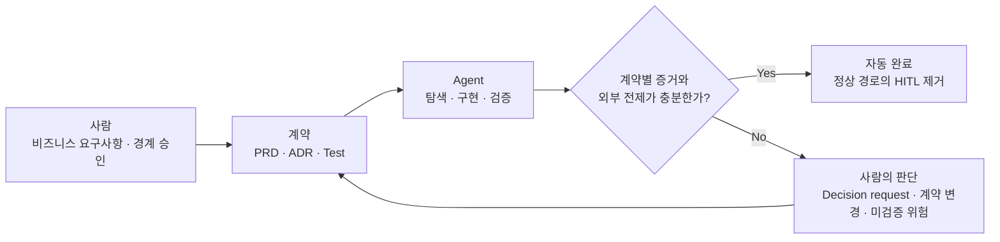

## TL;DR

- AI는 구현 과정의 인지부하를 리뷰 시점으로 옮긴다.
- 사람은 코드보다 비즈니스 계약을 이해해야 한다.
- 계약 준수와 숨은 가정이 드러나야 HITL을 줄일 수 있다.

## 시작하며

고객과 AI 코딩에 관해 이야기하다가, Agent가 만든 코드를 리뷰할 때 인지부하가 심하게 걸린다는 말을 들었다.

내 경험을 돌아보니 나는 그런 느낌을 거의 받지 못했던 것 같다.

아마 GitHub Copilot 베타 버전부터 AI 코딩 도구를 사용했기 때문인 것 같다.

당시 모델은 지금처럼 신뢰할 수 있는 수준이 아니었다. 큰 작업을 맡기면 실패했기 때문에 문제를 작게 나누고, 작은 커밋과 PR을 만들고, 개발 피드백 루프를 최대한 짧게 가져가는 습관이 자연스럽게 생겼다.

모델의 성능이 좋아지는 동안 나도 모델을 어디까지 신뢰할 수 있는지 조금씩 배웠다.

반면 최근에 AI 코딩을 시작한 사람들은 처음부터 성능이 좋은 모델을 접한다. 그러다 보니 모델이 만들 수 있는 최대치를 한 번에 뽑아내려는 경향이 있는 것 같다.

코드는 빠르게 만들어지지만, 사람이 이해하지 못한 변경도 같은 속도로 쌓인다.

이 경험을 Max Kanat-Alexander가 설명한 Developer Experience의 `Cognitive Load`로 볼 수 있겠다고 생각했다.[^1] 좋은 Developer Experience를 만들려면 작업에 필요한 지식과 판단의 수를 줄여야 한다는 이야기다.

AI가 줄인 인지부하는 사라진 것이 아니라 **구현 과정에서 리뷰 시점으로 이동할 수 있다.**

당장은 작은 변경과 짧은 피드백 루프로 이 부하를 나눌 수 있다. 하지만 장기적으로는 사람이 코드를 이해하는 대신 비즈니스 요구사항과 코드 사이의 계약을 이해하고, Agent가 그 계약을 준수했다는 사실을 증명하는 방향으로 가야 한다고 생각한다.

## 1. 구현 중 인지부하는 줄었다

Paul Graham은 Maker's Schedule과 Manager's Schedule을 구분했다.[^2]

Manager의 일정은 한 시간 단위로 나눌 수 있지만, 무언가를 만드는 사람은 하나의 문제를 머릿속에 올리는 데 시간이 걸리므로 반나절 정도의 덩어리 시간이 필요하다는 이야기다.

전통적인 개발은 이 설명에 잘 들어맞았다.

주변 코드를 읽고, 요구사항과 제약을 이해하고, 머릿속에 동작 방식을 올린다. 그 상태를 유지하면서 코드를 작성하고 테스트한다.

중간에 회의가 하나 들어오면 단순히 한 시간을 잃는 것이 아니었다. 아직 코드로 다 옮기지 못한 머릿속의 상태도 함께 잃고, 자리로 돌아와서 다시 코드를 읽어야 했다.

Agent를 사용하면 이 과정이 나뉜다.

사람이 의도와 제약을 전달한 뒤에는 Agent가 코드를 탐색하고 구현하고 테스트한다. 그동안 사람은 다른 일을 할 수 있고, 잠깐 자리를 비운다고 해서 Agent가 읽어둔 파일과 작업 상태까지 사라지지는 않는다.

그래서 적어도 **구현하는 시간**은 예전보다 컨텍스트 스위칭에 관대해졌다.

Maker에게 Manager처럼 한 시간 단위로 일할 수 있는 여지가 조금 생긴 셈이다. 물론 요구사항을 정하거나 결과를 판단하는 일에는 여전히 긴 집중이 필요하지만, 구현 내내 같은 코드를 머릿속에 붙들고 있을 필요는 줄었다.

처음에는 이 변화가 그냥 좋은 일이라고 생각했다.

그런데 Agent를 여러 개 돌리기 시작하면 구현 중에 줄어든 인지부하가 결과를 확인하는 시점으로 몰린다는 것을 알게 된다.

## 2. 사라진 이해 과정은 리뷰에 몰린다

예전에는 코드를 작성하는 시간이 길었다.

그 시간 동안 작성할 코드와 주변 코드를 계속 읽었다. 구현하면서 선택지를 하나씩 결정했고, 테스트가 실패하면 머릿속의 동작 방식도 같이 고쳤다.

코드를 다 작성했을 때는 왜 이런 구조를 선택했고 어디가 위험한지를 대략 알고 있었다. 코드 이해가 별도의 작업이라기보다 구현 과정에서 조금씩 쌓이는 부산물에 가까웠다.

AI 개발에서는 완성된 결과를 먼저 받는다.

사람은 이미 만들어진 코드 앞에서 Agent가 무엇을 읽었고, 어떤 가정을 했고, 왜 이런 구현을 골랐는지를 거꾸로 따라간다. Agent가 몇십 분 동안 만든 변경을 사람이 비슷한 시간 안에 이해할 수 있으리라는 보장도 없다.

PR이 클수록 힘들다는 익숙한 문제와도 조금 다르다.

예전의 큰 PR은 적어도 작성자 한 명은 내용을 알고 있었다. 지금은 작성자 역할을 한 Agent와 최종 책임을 질 사람 사이에 이해의 차이가 처음부터 생긴다.

Agent를 여러 개 병렬로 실행해도 이 차이는 줄어들지 않는다. 오히려 읽지 않은 변경만 더 빠르게 쌓인다.

그래서 사람이 모든 결과를 확인하는 현재의 리뷰 방식은 품질을 지키는 장치이면서 동시에 처리량을 제한하는 부분이 된다. 사람이 모든 코드를 이해해야 다음 단계로 넘어갈 수 있다면, 전체 개발 속도는 결국 사람이 코드를 읽을 수 있는 속도에 맞춰진다.

개인적으로 AI 코딩에서 가장 먼저 줄여야 할 인지부하도 이 부분이라고 생각한다.

코드를 더 빨리 생성하는 방법은 이미 많다. 이제는 Agent가 만든 결과를 사람이 어느 정도까지 이해해야 하고, 무엇을 보고 신뢰할 것인지를 다시 정해야 한다.

## 3. 인지부하를 줄이는 두 가지 방법

현재는 크게 두 가지 방법이 가능해 보인다.

하나는 사람이 이해할 대상을 코드에서 계약으로 옮기는 방법이다. 다른 하나는 아직 코드를 봐야 하는 영역의 생성 단위를 작게 만드는 방법이다.

둘 중 하나만 써야 하는 것은 아니다. 코드의 위험도와 현재 테스트 수준에 따라 섞어서 쓸 수 있다.

### 코드가 아니라 계약을 이해하기

첫 번째 방법에서는 사람이 이해할 대상을 코드에서 **비즈니스 요구사항과 코드 사이의 계약**으로 옮긴다.

여기서 계약은 문서 자체보다, 비즈니스 요구사항이 코드에서 참인지 판정하는 기준에 가깝다.

사람이 먼저 정할 내용은 생각보다 많지 않다.

- 사용자에게 보여야 하는 동작
- 항상 지켜져야 하는 조건
- 넘으면 안 되는 아키텍처 경계
- Agent가 알아서 정해도 되는 부분
- 어떤 상황에서 다시 사람에게 물어볼지

여기서 처음부터 완벽한 문서를 만들려고 하면 다시 사람이 구현을 미리 하는 것과 비슷해진다.

코드를 열어보기 전에는 알 수 없는 제약도 많고, 알고리즘이나 클래스 구조까지 지정하면 Agent에게 맡길 수 있는 부분도 줄어든다. 사람은 얇은 의도와 판정 기준을 주고, Agent가 저장소를 탐색하면서 발견한 사실을 다시 계약에 반영하는 편이 낫다.

그중 다음 구현에서도 유지되어야 할 내용만 PRD나 ADR로 올린다. 이번 구현 안에서만 의미가 있는 자료구조나 함수 분리는 코드에 남겨두면 된다.[^3]

Agent는 계약을 기준으로 구현하고 테스트한 뒤, 요구사항별로 무엇을 만족했고 무엇으로 검증했는지를 정리한다.

코딩 Agent의 책임도 코드를 많이 만드는 것에서 계약을 빠짐없이 준수하고 그 사실을 증명하는 쪽으로 옮겨가야 한다.

이때 사람이 확인해야 할 것은 두 가지다.

- 명시된 계약 조건을 모두 지켰는가
- 계약에 없던 판단은 어떤 가정을 바탕으로 내렸는가

예를 들어 결제 코드 전체를 읽기 전에 아래 정도를 먼저 확인하는 식이다.

```text
요구사항
같은 payment_id는 두 번 결제되지 않는다.

검증
- duplicate_webhook_does_not_charge_twice: PASS
- retry_after_timeout_returns_previous_result: PASS

계약에서 도출한 의무
- 같은 payment_id의 재시도에는 기존 결제 결과를 반환

구현 재량
- 기존 Redis cluster에 idempotency key 저장
- 이웃 모듈과 같은 key 형식 사용

제품 판단이 필요한 빈칸
- 같은 payment_id로 금액이나 통화가 달라졌을 때의 동작
- 추천안: 충돌 오류로 거부
- 대안: 기존 결과 반환 / 새로운 요청으로 처리
- 영향: 중복 결제와 데이터 의미가 달라지므로 사람에게 요청
```

구현 세부를 전혀 보지 않겠다는 뜻은 아니다.

먼저 요구사항과 테스트를 보고, Agent가 계약에 없던 판단을 어떤 가정으로 내렸는지 확인한다. 증거가 부족하거나 위험도가 높은 부분만 실제 코드로 내려가면 된다.

여기서 가정은 모델의 내부 사고과정을 모두 설명하라는 뜻이 아니다.

Provider가 응답을 영속적으로 보장하는지, 입력한 tenant 정보가 신뢰할 수 있는 출처인지, callback의 순서와 유일성이 보장되는지처럼 **코드가 의존하는 외부에서 검증 가능한 전제**를 말한다.

이 전제가 틀렸을 때 계약이나 안전이 깨진다면 코드, 테스트, 설정이나 권위 있는 외부 문서로 확인해야 한다. 확인할 수 없다면 성공으로 닫지 않고 미검증 위험으로 사람에게 올린다.

계약의 빈칸을 모두 질문으로 돌려보낼 필요도 없다.

명시된 계약에서 논리적으로 따라오는 의무를 먼저 찾고, 저장소의 관례와 이웃 코드를 따른다. 그래도 비어 있으면 권위 있는 protocol이나 domain 규칙을 확인하고, 외부 동작을 바꾸지 않는 가역적인 기본값까지는 Agent가 선택할 수 있다.

함수 이름이나 내부 자료구조처럼 외부 동작을 바꾸지 않는 선택은 Agent의 구현 재량으로 둘 수 있다. 반면 사용자에게 보이는 동작, 데이터의 의미, 보안과 권한 경계를 바꾸는 가정은 새 계약이나 결정으로 올려야 한다.

여러 제품 선택지가 남는다면 Agent는 그냥 질문만 던지기보다 추천안과 근거, 현실적인 대안, 각각의 영향과 추가할 계약 문구를 묶어서 요청하는 편이 낫다.

테스트가 틀렸거나 계약에서 요구사항을 빼먹었다면 여전히 문제가 생긴다. 그래도 검토 범위를 코드 전체에서 요구사항, 테스트, 예외로 줄일 수 있다는 점은 꽤 크다.

여기서 계약을 완벽하게 준수한다는 말은 오류가 절대 없다고 선언하는 것이 아니다.

명시된 계약 중 확인하지 못한 항목을 숨긴 채 성공으로 끝내지 않고, 계약별 증거가 부족하거나 새로운 결정이 필요하면 완료하지 않은 채 사람에게 올린다는 뜻이다.

### 사람이 이해할 크기로 나누기

계약과 테스트만으로 승인하기 어려운 코드도 있다.

보안, 결제, 데이터 마이그레이션처럼 구현 방식이 위험에 직접 연결되는 영역이 그렇다. 테스트가 부족한 오래된 코드베이스도 당분간은 사람이 코드를 읽어야 한다.

이 경우에는 파일 수보다 **한 번에 새로 이해해야 하는 개념의 수**를 줄이는 것이 중요하다.

예를 들어 결제 기능 전체를 하나의 PR로 만들기보다 아래처럼 나눌 수 있다.

```text
PR 1 - Payment 상태 모델 추가
PR 2 - 외부 결제사를 Port 뒤로 격리
PR 3 - 중복 결제 방지
PR 4 - Webhook으로 최종 상태 확정
```

각 PR에서 왜 필요한 변경인지, 새로 생긴 개념이 무엇인지, 반드시 지켜야 할 조건과 확인할 테스트가 무엇인지만 분명하면 된다.

다만 작은 PR을 하나씩 merge한 뒤 다음 작업을 시작하면 Agent의 빠른 생성 속도를 활용하기 어렵다.

Stacked PR은 앞의 PR이 merge되기 전에 그 위에서 다음 작업을 이어갈 수 있어서 이 문제를 어느 정도 줄여준다.[^4] Agent는 계속 작업하고, 사람은 각 PR에서 새로 추가된 내용만 순서대로 읽을 수 있다.

이 방식은 현재 꽤 유용해 보인다.

다만 큰 리뷰 한 번을 작은 리뷰 여러 번으로 나눈 것이므로, 모든 단계에 사람이 들어가야 하는 점은 그대로다. 사람이 코드를 이해해야 하는 상황을 견딜 만하게 만들어주지만 리뷰 자체를 줄이는 방법은 아니다.

## 4. 반복되는 판단을 리뷰 밖으로 옮긴다

지금까지의 코드리뷰는 작성자가 구현을 이해하고 있다는 전제에서 시작했다.

리뷰어는 작성자의 설명을 읽고, 이상한 부분을 질문하고, 놓친 위험을 찾았다. 작성자는 왜 이렇게 만들었는지 답할 수 있었다.

Agent가 대부분의 코드를 만들면 사람은 더 이상 같은 의미의 작성자가 아니다.

그런데도 기존 방식대로 모든 줄을 설명할 수 있어야 한다고 요구하면, Agent가 줄여준 구현 시간을 사람이 리뷰 단계에서 다시 지불하게 된다.

그래서 리뷰에서 사람이 맡을 일을 구현 전체의 재구성보다 비즈니스 요구사항과 계약의 경계를 확인하는 쪽으로 옮길 필요가 있다고 생각한다.

Agent는 구현만 하는 것이 아니라 테스트와 아키텍처 검사를 실행하고, 계약 조건별 증거와 계약 밖의 판단에 사용한 가정, 남은 위험을 정리해야 한다. 사람은 그 자료에서 증명하지 못한 조건과 숨은 가정을 먼저 찾는다.

계약 준수 증거가 충분하고 계약 밖의 가정까지 드러난 정상 경로라면 사람의 반복 승인을 요구하지 않아야 한다.

계약 변경, 기존 결정과의 모순, 자동으로 확인하지 못한 고위험 예외나 중요한 가정이 있을 때만 사람에게 올린다. 그래야 사람의 개입을 매 구현의 기본 단계가 아니라 계약과 예외를 다루는 단계로 줄일 수 있다.[^6]

같은 판단이 반복되면 다음부터는 사람이 하지 않게 만드는 것도 중요하다.

리뷰할 때마다 같은 import 방향을 지적한다면 아키텍처 테스트로 옮기고, 같은 요구사항을 확인한다면 테스트 케이스로 만든다. 같은 실수를 여러 번 고치는 대신 다음 Agent가 처음부터 피하도록 하네스를 고치는 방식이다.[^5]

이렇게 보면 인지부하를 줄이는 일은 사람이 반복해서 내리는 판단을 리뷰 밖으로 옮기는 일에 가깝다.

사람이 판단해야 하는 범위를 줄이고, 반복되는 판단을 계약과 가드레일로 옮길수록 다음 리뷰에서 새로 이해해야 할 내용도 줄어든다.

## 5. ALPS Writer에서 시험하는 흐름

지금은 두 가지가 모두 필요하다고 생각한다.

계약과 테스트로 충분히 확인할 수 있는 부분은 구현 전체를 읽지 않고 넘어가고, 사람이 이해해야 하는 부분은 작은 PR로 나누는 방식이 현실적이다.

Stacked PR은 인지부하를 작은 덩어리로 나눠준다. 하지만 리뷰어가 이해해야 할 전체 개념의 수가 같다면, 큰 리뷰 한 번이 작은 리뷰 여러 번으로 바뀐 것에 가깝다.

작은 PR은 지금 당장 인지부하를 줄이는 데 유용하지만, 모든 단계에 사람이 들어가야 한다는 점은 바꾸지 못한다. 장기적으로는 계약을 검증하는 테스트와 가드레일을 늘려 사람이 코드에서 다시 추론할 범위 자체를 줄여야 한다.

내가 만드는 [ALPS Writer](https://github.com/haandol/alps-writer-plugins)도 이 관점을 반영하면서 계속 수정하고 있다.[^3]

ALPS 문서를 작성할 때는 사용자가 제품 의도와 기능 계약을 적극적으로 확인한다. handoff가 끝나면 그 계약의 소유권을 ADR로 옮기고, 구현부터는 Agent가 계약을 기준으로 탐색, 구현, 테스트와 리뷰를 한 사이클 안에서 처리한다.

현재 `/adr-impl`은 계약의 빈칸을 발견하면 아래 순서로 처리한다.

1. 명시된 계약에서 논리적으로 필요한 의무를 도출한다.
2. 저장소 관례와 이웃 코드의 동작을 따른다.
3. 권위 있는 protocol, platform과 domain 규칙을 확인한다.
4. 계약 아래의 가역적이고 저위험한 기본값을 선택한다.

여기까지 해도 여러 제품 결과가 유효하거나 금액, 권한, 보존기간, 규제, 비가역 데이터 의미처럼 사람이 정해야 할 내용이 남으면 하나의 Decision request로 묶는다. 추천안과 근거, 대안과 영향, ADR에 추가할 계약 문구까지 함께 제시한다.

이미 승인된 ADR이 바뀌지 않았다면 구현 계획은 승인 요청이 아니라 진행 상황으로 공유하고 바로 진행한다.

구현 리뷰에서는 계약의 각 항목이 무엇으로 충족됐는지 Evidence Package로 보여준다. 코드가 의존하는 외부 전제가 확인되지 않았고 틀릴 경우 계약이나 안전이 깨진다면 `Unverified risk`로 남기고 완료 판정을 막는다.





목표는 문서를 더 많이 만드는 것이 아니다.

사람은 계약을 만들고 변경하며, Agent가 자동으로 닫을 수 없는 제품 결정과 모순, 미검증 위험을 판단한다. 대신 정상적인 구현마다 같은 코드를 다시 읽고 승인하는 HITL은 제거하는 흐름을 시험하고 있다.

## 마치며

Copilot 초기부터 AI 코딩 도구를 사용하면서 문제와 변경을 작게 나누는 습관이 먼저 생겼다.

덕분에 최근 모델이 큰 작업을 수행할 수 있게 된 뒤에도 한 번에 최대한 많은 코드를 만들게 하기보다, 짧은 개발 피드백 루프를 유지해왔다. 내가 인지부하를 크게 느끼지 않았던 이유도 여기에 있는 것 같다.

하지만 작은 PR만으로는 장기적인 병목을 없앨 수 없다.

큰 리뷰를 여러 번의 작은 리뷰로 바꿀 뿐, 사람이 모든 코드를 이해하고 승인해야 한다는 전제는 남기 때문이다.

앞으로는 사람이 코드를 더 빨리 읽는 방향보다, 비즈니스 요구사항과 코드 사이의 계약을 이해하는 방향으로 가야 한다고 생각한다. Agent는 계약별 검증 증거와 코드가 의존하는 외부 전제를 보여주고, 확인하지 못한 부분을 성공으로 숨기지 않아야 한다.

이렇게 보면 인지부하를 줄이는 일은 리뷰를 편하게 만드는 데서 끝나지 않는다. **사람의 반복 판단을 계약과 하네스로 옮겨 정상 경로의 HITL을 제거하는 과정**이라고 생각한다.

---

[^1]: Max Kanat-Alexander, [What Makes a Great Developer Experience?](https://www.codesimplicity.com/post/what-makes-a-great-developer-experience/) (2025).

[^2]: Paul Graham, [Maker's Schedule, Manager's Schedule](https://www.paulgraham.com/makersschedule.html) (2009).

[^3]: [프로덕션에서도 효과적인 컨텍스트 구성 방법](/2026/07/25/alps-adr-abstraction-boundaries.html) — PRD와 ADR을 코드 생성의 계약이자 리뷰 기준으로 사용하는 구체적인 방법.

[^4]: GitHub Docs, [Stacked pull requests](https://docs.github.com/en/pull-requests/reference/stacked-pull-requests) — 작은 의존 PR을 Stack으로 연결하고 각 PR의 변경을 독립적으로 리뷰하는 방식.

[^5]: [EncBird에 하네스를 한 겹씩 씌워온 과정](/2026/06/16/harness-engineering-in-practice.html) — 반복적인 사람의 판단을 규칙, 도구, 가드레일로 옮기는 과정.

[^6]: [현상을 해석하는 렌즈, 그리고 에이전틱 엔지니어링](/2026/06/12/lens-for-agentic-engineering.html) — 에이전틱 엔지니어링을 정상 경로의 HITL 제거라는 렌즈로 보는 이유를 설명한다.
