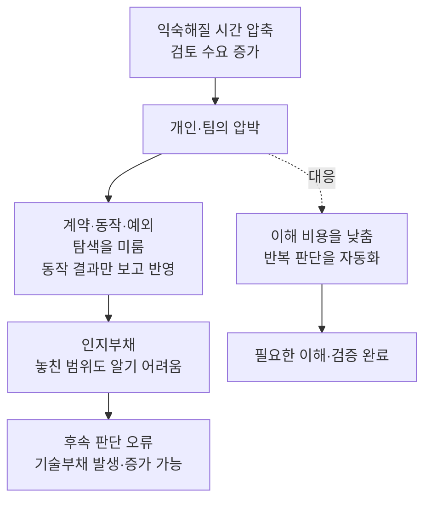
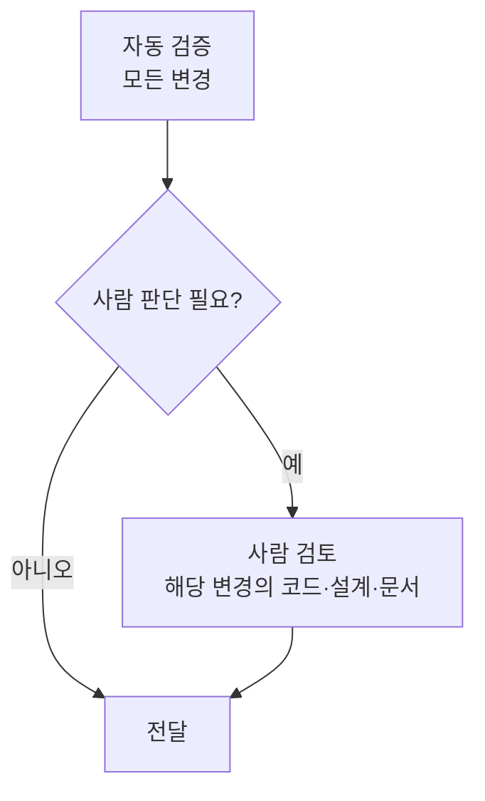

## TL;DR

- 컨텍스트에 익숙해질 시간이 리뷰 시점으로 압축된다.
- 동작 여부만 보고 반영한 코드는 인지하지 못한 부채를 남길 수 있다.
- 리뷰 병목은 이해 비용을 낮추거나 반복 판단을 자동화해야 풀린다.

## 시작하며

고객과 AI 코딩에 관해 이야기하다가, Agent가 만든 코드를 리뷰할 때 인지부하가 심하게 걸린다는 말을 들었다. 여기서 인지부하는 작업을 이해하고 판단하려고 머릿속에 정보를 유지하는 데 드는 부담이다.

내 경험을 돌아보니 그런 느낌은 거의 받지 못했다. GitHub Copilot 베타 버전부터 도구를 사용하면서 작은 작업과 커밋, 결과를 자주 확인하고 고치는 방식에 익숙해졌기 때문인 것 같다.

당시 모델은 큰 작업을 맡기면 실패했다. 그래서 문제를 나눠 맡기고, 결과를 읽고 고치는 동안 나도 코드와 제약에 조금씩 익숙해졌다. 모델의 성능이 좋아지는 동안 신뢰할 수 있는 범위도 함께 배웠다.

지금은 처음부터 많은 코드를 한 번에 만들 수 있다. 하지만 **코드를 만드는 시간이 줄어든 만큼, 사람이 컨텍스트와 친해지는 시간까지 저절로 줄어드는 것은 아니다.** 구현과 함께 진행되던 이해가 빠지면 결과를 받는 시점에 그 부담이 몰린다.

나는 이 압박이 이해하지 못한 코드를 ‘동작하니까’ 받아들이게 만들고, 인지하지 못한 부채를 남길 수 있다고 생각한다. 이 경로를 끊으려면 사람이 코드·아키텍처·문서를 검토하는 부담을 낮추거나, 반복적인 리뷰에서 사람을 빼낼 수 있어야 한다.

## 1. 컨텍스트에 익숙해질 시간이 압축된다

직접 코드를 작성할 때는 주변 코드를 읽고, 요구사항을 구현으로 옮기고, 실패한 테스트를 고쳤다. 그 과정에서 왜 이런 구조가 필요하고 어떤 조건에서 깨지는지 조금씩 배웠다.

코딩에 쓴 시간은 컨텍스트에 익숙해지는 시간이기도 했다. 이해가 완벽하지 않아도 다음 판단에 필요한 동작 방식은 머릿속에 남았다.

Agent에게 구현을 맡기면 완성된 결과를 먼저 받는다. 사람은 코드와 테스트를 거꾸로 따라가며 의도, 가정과 예외를 복원해야 한다. 앞에서 분산되어 있던 일이 짧은 리뷰 시간 안에 함께 들어오는 것이다.

DORA는 생성에서 줄어든 시간이 검증으로 옮겨가는 현상을 설명하면서 두 작업의 차이를 이렇게 짚는다.[^14]

> “Verification is a fundamentally different cognitive task than creation.”
>
> 검증은 생성과는 근본적으로 다른 인지 작업이다. — DORA, 번역


이 그림은 부담이 놓이는 위치를 표현한 개념도다. 같은 양의 코드를 더 빨리 만들었더라도, 사람이 그 코드에 익숙해지는 일을 별도로 해야 한다면 전체 작업이 같은 비율로 빨라지지는 않는다.

특히 기존과 같은 납기를 유지하면서 더 많은 변경을 동시에 맡기면, 아직 익숙하지 않은 맥락을 계속 바꿔가며 검토하게 된다. 개인에게는 인지부하가, 팀에는 검토 대기와 재작업이 쌓인다.

이 글에서는 사람의 이해·검증 여력이 앞단의 출력을 받아들이지 못해 진행이 막히는 상황을 **리뷰의 백프레셔**로 보겠다. 컨텍스트에 익숙해질 시간이 압축된 상태에서 생성량만 늘리면 이 압박을 더 키울 수 있다.

## 2. 알고 타협한 부채와 알아차리지 못한 부채

기술부채를 논의할 때는 출시 일정, 성능과 유지보수 비용을 비교하고 타협하는 상황을 자주 떠올린다. 중복 구현이 있다는 것을 알지만 출시를 위해 공통화를 미루는 식이다.

Fowler는 의도적으로 선택한 기술부채를 설명하면서 다음을 전제한다.[^26]

> “the team knows they are taking on a debt”
>
> 팀은 자신들이 부채를 떠안고 있다는 사실을 알고 있다. — Martin Fowler, 번역

무엇을 미뤘고 어떤 비용이 생길지 알고 있으므로, 지금 갚을지 나중에 갚을지를 논의할 수 있다. 물론 기술부채에는 비의도적으로 생긴 것도 있다. 여기서 비교하려는 것은 이처럼 부채를 인지한 타협과, 검토하지 못한 채 생기는 이해의 빈칸이다.

인지부채는 팀이 시스템의 동작 방식과 변경의 영향을 판단하는 데 필요한 이해를 충분히 공유하지 못한 상태다. 내가 주목하는 경우는 이 부족함을 충분히 알아차리지 못한 채 코드를 반영하는 상황이다.

예를 들어 중복 결제를 막는 가상의 기능을 만들었다고 해보자. 화면에서 결제가 되고 재시도 테스트도 통과하지만, 기록이 사라진 뒤의 재시도나 두 요청이 동시에 들어오는 경우는 탐색하지 않았다.

여기서 ‘같은 요청은 두 번 청구되지 않는다’처럼 구현이 지켜야 할 동작과 조건을 계약이라고 부르겠다. 이 계약을 아는 것과, 구현이 그 계약을 어떤 조건에서 지키는지 이해하는 것은 다르다. 단순히 동작한다는 결과만 보고 반영하면, 팀은 무엇을 놓쳤는지조차 모를 수 있다.

납기와 승인 속도에 대한 압박 때문에 필요한 이해를 다음으로 미루는 선택은 의식적일 수 있다. 하지만 그 선택이 남긴 빈칸의 크기와 영향까지 인지한 것은 아니다. Storey도 이 지점을 구분한다.[^10]

> “Even when surrender is intentional, the resulting debt accumulates invisibly.”
>
> 판단을 포기하는 선택이 의도적이어도, 그 결과인 부채는 보이지 않게 쌓인다. — Margaret-Anne Storey, 번역

나중에 저장 비용을 줄이려고 결제 기록의 보관 기간을 단축할 때, 재시도와의 관계를 이해하지 못하면 잘못된 변경을 통과시킬 수 있다. 인지부채가 후속 판단을 흐리게 해 기술부채를 만들거나 기존 문제의 발견을 늦추는 경로다.





이 그림은 이해를 미룬 채 코드를 받아들일 때 생길 수 있는 경로를 표현한 것이다. 이때 인지부채가 기술부채로 바뀌어 사라지는 것은 아니다. 이해가 부족한 상태와 그로 인해 생긴 잘못된 코드가 함께 남을 수 있다.

## 3. 팀 속도는 느린 검증 단계에 묶인다

인지부채를 남기지 않으려면, 필요한 이해와 검증을 마친 변경을 얼마나 처리할 수 있는지 살펴봐야 한다. 코드 생성이 충분히 빨라진 상황에서는 이 검증의 처리 용량이 팀 속도를 제한할 수 있다. Microsoft의 시스템 병목 설명도 지속 가능한 처리량에 관해 다음 원칙을 제시한다.[^27]

> “a system can only process as fast as its slowest performing component.”
>
> 시스템은 가장 느린 구성 요소가 처리하는 속도까지만 처리할 수 있다. — Microsoft, 번역

이 원칙을 리뷰에 적용해보자. 생성과 배포에는 별도 병목이 없고 검토할 변경이 충분히 들어온다고 가정한다. 모든 변경이 자동 검증을 거친 뒤 필요한 변경만 사람에게 오며, 두 단계는 서로 다른 변경을 동시에 처리할 수 있다. 작업 단위와 품질 기준도 같게 둔다.





각 단계의 용량을 전체 변경 수 기준으로 환산하면 리뷰가 제한하는 팀 속도를 아래처럼 근사할 수 있다. 이는 실제 팀을 측정해 얻은 공식이 아니라, 어디를 개선할지 설명하기 위한 병목 모델이다.

```text
team velocity ≈ min(human review velocity, automated review velocity)
```

여기서 velocity는 단순 승인 건수가 아니라 같은 품질 기준을 충족하는 변경의 처리량이다. 실제로는 재작업과 대기 때문에 이 용량보다 낮아질 수 있고, 생성이나 배포가 더 느리면 그 단계도 병목에 포함해야 한다.

사람 쪽 용량은 다음처럼 나눠볼 수 있다.

```text
H = 하루에 사용할 수 있는 사람 검토 시간
C = 사람 검토가 필요한 변경 하나당 평균 검토 시간
p = 전체 변경 중 사람 검토가 필요한 비율

human review velocity = H / (p × C)
```

이 값은 사람이 직접 검토한 건수가 아니라, 그 검토 여력으로 감당할 수 있는 전체 변경 수다.

C에는 코드를 읽는 시간뿐 아니라 컨텍스트를 복원하고, 아키텍처와 문서의 가정을 확인하고, 예외를 탐색하는 시간이 포함된다. 낯선 맥락과 복잡한 조건 때문에 이해·판단에 시간이 더 들면 C가 커진다. 검토에 쓸 수 있는 시간 H와 사람 검토가 필요한 비율 p가 같다면, C가 커질수록 처리할 수 있는 변경 수는 줄어든다.

나는 이런 점에서 **인지부하가 팀 속도의 역수처럼 작용한다고 생각한다.** 여기서는 인지부하를 이해·판단에 필요한 시간을 통해 팀의 처리량과 연결한 것이다. 심리적인 부담 점수와 팀 속도가 정확히 반비례한다는 뜻은 아니며, 사람 검토가 병목일 때 이 관계가 팀 속도를 제한한다.

가상의 예로 하루 240분을 검토에 쓸 수 있고 모든 변경을 사람이 30분씩 검토해야 한다면 사람 쪽 용량은 하루 8개다. 익숙해지는 비용을 줄여 15분이면 같은 수준으로 검토할 수 있다면 16개가 된다. 다만 자동 검증의 용량이 하루 12개라면 팀은 그 이상을 지속적으로 통과시키지 못한다.

같은 인력과 가용 시간을 놓고 보면 사람 쪽에서 바꿀 수 있는 것은 C와 p다. 사람이 이해·판단하는 비용을 줄이거나, 사람의 직접 검토가 필요한 비율을 줄인다. 사람 검토가 전혀 필요 없어 p가 0인 경우에는 이 나눗셈을 적용하지 않고, 자동 검증 등 나머지 단계의 처리 용량으로 본다.

## 4. 사람이 컨텍스트에 익숙해지는 비용을 낮춘다

첫 번째 방향은 사람이 맡아야 할 리뷰를 더 적은 부담으로 끝내도록 만드는 것이다. 코드, 아키텍처, 기획 문서를 검토할 때마다 목적과 가정을 처음부터 복원하게 두면 C가 커진다.

나는 구현 전에 계약을 정리하고, 결과에는 변경 전후의 동작, 실패 조건과 검증 근거를 함께 남기는 편이 낫다고 생각한다. 계약에는 사용자에게 보여야 할 동작, 항상 지켜야 할 조건, 누가 어떤 데이터를 읽거나 바꿀 수 있는지 같은 기준을 담는다.

결제 예시에서는 ‘테스트 통과’라는 요약보다 어떤 재시도를 확인했는지, 기록 유실과 동시 요청은 어디까지 검증했는지, 아직 어떤 판단이 남았는지가 먼저 보여야 한다. 설명에서 실제 코드와 실행한 테스트로 바로 이동할 수 있어야 맥락을 다시 찾는 비용도 줄어든다.

한 번에 익혀야 할 범위도 줄일 수 있다. 요구사항 한 조각을 구현하고, 이해·검증한 뒤 커밋한다. 작은 PR(Pull Request, 코드 변경을 검토하고 합치는 요청)을 여러 개 쌓아 나중에 몰아서 읽으면 익숙해질 시간이 다시 마지막으로 밀린다.


이 그림은 이해를 쌓는 시간을 작은 구현 작업 사이에 배치하는 개념도다. 지금의 작은 변경에 익숙해진 상태가 다음 변경의 출발점이 되도록 만드는 것이다.

이미 쌓인 인지부채는 별도로 갚아야 한다. 함께 코드와 설계를 따라가며 놓친 가정과 실패 조건을 찾고, 잘못된 구현을 고치는 데는 시간이 든다. 이때 정리한 동작과 가정을 코드·문서·테스트에 남겨야 다음 작업에서 같은 맥락을 처음부터 복원하는 부담을 줄일 수 있다.

내가 만드는 [ALPS Writer Plugins](https://github.com/haandol/alps-writer-plugins)에도 작업을 나누고 계약별 근거를 검토하는 기준을 넣었다. 오래 유지할 결정은 아키텍처 결정 기록(ADR)에 남기고, 구현 설명은 요청 흐름과 실패 경로를 코드·테스트에 연결한다.[^3]

문서가 있다는 사실만으로 사람이 이해했다고 볼 수는 없다. 담당자가 다음 변경과 장애 대응에 필요한 동작을 설명할 수 있는지 확인해야 한다. 작은 구현 단위와 읽을 수 있는 근거는 그 이해를 돕는 수단이다.[^7]

## 5. 반복 리뷰에서 사람을 빼낸다

두 번째 방향은 모든 변경에 같은 사람 검토를 요구하지 않는 것이다. 자동 검증으로 확인할 수 있는 조건을 매번 사람이 다시 읽으면 p를 낮출 수 없다.

어떤 모듈이 다른 모듈을 참조해도 되는지 반복해서 지적한다면, 그 관계를 검사하는 아키텍처 테스트로 옮긴다. 동일 요청이 중복 처리되지 않는지 매번 확인한다면, 이후 변경에서도 같은 문제가 생기지 않는지 검사하는 회귀 테스트로 남긴다. 작업 지침, 도구와 검증 환경을 묶은 하네스에 이런 판단을 축적하면 다음 변경부터 재사용할 수 있다.[^5]

내가 목표로 하는 정상 경로에서는 합의된 계약을 자동 검증이 충분히 확인하면 반복적인 사람 승인을 요구하지 않는다. 사람은 새 제품 결정, 계약 변경, 고위험 조건과 자동으로 확인하지 못한 가정을 판단한다.

단, Agent가 ‘문제없음’이라고 쓴 설명만으로 사람을 빼서는 안 된다. 무엇을 검증했고 어떤 증거가 있는지 확인할 수 있어야 한다. 그렇지 않으면 리뷰를 자동화한 것이 아니라 이해하지 못한 코드를 더 빨리 통과시킨 셈이다.

검증의 자동화와 팀이 필요한 이해를 갖는 일도 구분해야 한다. 모든 구현 세부를 사람이 읽지 않아도 되지만, 제품의 의도와 품질 기준을 정하고 다음 변경을 책임질 이해는 팀에 남아야 한다.

이 전환에 시간이 필요하다면 그동안 새 작업의 유입을 조절해야 한다. 다만 유입량을 줄이는 것만으로 리뷰 한 건의 이해 비용이 낮아지는 것은 아니다. 확보한 시간을 설명·계약·테스트와 도구 개선에 써야 이후 처리 용량이 높아진다.

자동화 뒤에는 남은 사람 리뷰의 난이도도 다시 봐야 한다. 단순한 변경이 빠지고 어려운 판단만 남으면 p가 줄어도 C는 커질 수 있다. 효과는 실제 검토 시간과 품질로 확인해야 한다. 자동 검증에도 도구와 운영 비용이 드는 만큼, 비용까지 줄었는지는 고객에게 소프트웨어 한 단위를 전달하는 비용인 CTS-SW로 함께 살펴볼 수 있다.[^19]

## 마치며

AI가 줄여준 것은 코드 작성 시간이고, 그 과정에서 사람이 컨텍스트와 친해지던 시간은 따로 확보해야 할 수 있다. 이 차이를 무시한 채 동작하는 결과만 받아들이면, 무엇을 놓쳤는지 모르는 인지부채를 남길 수 있다.

같은 압박 아래에서 더 빨리 승인하라고 요구해서는 이 경로를 끊기 어렵다. **같은 품질을 유지하며 사람이 이해·판단하는 비용을 낮추거나, 반복 검증에서 사람을 빼낼 수 있어야 한다.** 나는 이것이 코드 생성 이후의 팀 속도를 높이는 주된 작업이라고 생각한다.

---

[^14]: Jessica Baolin·Nathen Harvey, [Balancing AI tensions](https://dora.dev/insights/balancing-ai-tensions/) (DORA, 2026). 생성에서 검증으로 이동하는 부담을 설명한다. 본문의 한국어 인용은 직접 번역했다.

[^26]: Martin Fowler, [Technical Debt Quadrant](https://martinfowler.com/bliki/TechnicalDebtQuadrant.html) (2009). 인용은 의도적인 기술부채를 설명하는 부분이며, 같은 글에서 비의도적인 기술부채도 다룬다.

[^10]: Margaret-Anne Storey, [From Technical Debt to Cognitive and Intent Debt](https://arxiv.org/pdf/2603.22106v3) (2026). 비판적 판단을 포기하는 선택의 의도성과 결과인 부채의 가시성을 구분한다.

[^27]: Microsoft Learn, [How to Investigate Bottlenecks](https://learn.microsoft.com/en-us/biztalk/core/how-to-investigate-bottlenecks). 컴퓨터 시스템의 지속 가능한 처리량을 설명하는 원칙이며, 팀 리뷰에 적용한 수식과 가정은 이 글의 모델이다.

[^3]: [PRD·ADR·코드를 왜 나눠야 할까 — 추상화 계층 하나만 읽고 판단하기](/2026/07/25/alps-adr-abstraction-boundaries.html).

[^7]: Geoffrey Litt, [Understanding is the new bottleneck](https://www.geoffreylitt.com/2026/07/02/understanding-is-the-new-bottleneck) — 정확성 검증과 다음 변화에 참여하기 위한 이해를 구분한다.

[^5]: [EncBird에 하네스를 한 겹씩 씌워온 과정](/2026/06/16/harness-engineering-in-practice.html).

[^19]: [AI 코딩 도구가 정말 개발 비용을 줄였을까 — CTS-SW 이해하기](/2026/08/14/cts-sw-software-delivery-cost.html).
