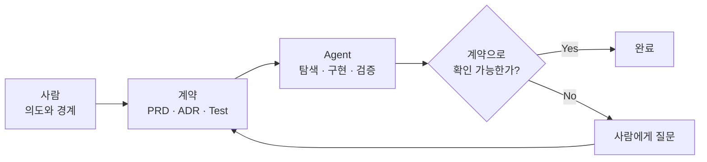

## TL;DR

- AI는 구현의 집중 시간을 리뷰의 인지부하로 옮긴다.
- Builder Experience의 병목은 사람의 이해 속도다.
- 계약 기반 리뷰가 HITL 제거에 더 유리해 보인다.

## 시작하며

얼마 전 Max Kanat-Alexander의 Developer Experience 글을 읽었다.[^1]

좋은 Developer Experience를 만들려면 `Cycle Time`, `Focus/Flow`, `Cognitive Load`를 줄여야 한다는 내용이다. 개발자가 생각한 것을 결과로 확인하기까지의 시간을 줄이고, 집중을 깨뜨리는 일을 없애고, 작업에 필요한 지식과 판단의 수를 줄이라는 이야기다.

이 글을 읽으면서 요즘 코딩 에이전트를 쓰는 경험은 어디에 넣어야 할지 생각해봤다.

개인 프로젝트에서 Agent에게 작업을 맡기고 나면 구현을 기다리는 시간은 거의 문제가 되지 않는다. 하나를 실행해두고 다른 문서를 보거나 다른 작업을 시작하면 된다.

문제는 작업이 끝난 다음이다.

몇 개의 Agent가 만든 변경이 쌓이면 코드는 이미 완성되어 있는데 내가 리뷰하지 못해서 다음으로 넘어가지 못하는 상황이 생긴다. 코드를 만드는 시간은 크게 줄었는데, 이상하게 피로도는 줄지 않는 이유도 여기에 있는 것 같다.

코드를 직접 작성하지 않더라도 자연어로 의도를 설명하고 결과를 만들 수 있게 되면서, 이런 경험은 개발자만의 이야기도 아니게 되었다.

여기서는 **의도를 AI를 통해 실제 결과물로 바꾸는 사람**을 Builder라고 부르려고 한다. AI 시대의 Developer Experience를 조금 넓혀서 Builder Experience라고 생각해보는 셈이다.

## 1. 길게 집중해야 하는 시간은 줄었다

Paul Graham은 Maker's Schedule과 Manager's Schedule을 구분했다.[^2]

Manager의 일정은 한 시간 단위로 나눌 수 있지만, 무언가를 만드는 사람은 하나의 문제를 머릿속에 올리는 데 시간이 걸리므로 반나절 정도의 덩어리 시간이 필요하다는 이야기다.

전통적인 개발은 이 설명에 잘 들어맞았다.

주변 코드를 읽고, 요구사항과 제약을 이해하고, 머릿속에 동작 방식을 올린다. 그 상태를 유지하면서 코드를 작성하고 테스트한다.

중간에 회의가 하나 들어오면 단순히 한 시간을 잃는 것이 아니었다. 아직 코드로 다 옮기지 못한 머릿속의 상태도 함께 잃고, 자리로 돌아와서 다시 코드를 읽어야 했다.

Agent를 사용하면 이 과정이 나뉜다.

사람이 의도와 제약을 전달한 뒤에는 Agent가 코드를 탐색하고 구현하고 테스트한다. 그동안 사람은 다른 일을 할 수 있고, 잠깐 자리를 비운다고 해서 Agent가 읽어둔 파일과 작업 상태까지 사라지지는 않는다.

그래서 적어도 **구현하는 시간**은 예전보다 컨텍스트 스위칭에 관대해졌다.

Maker에게 Manager처럼 한 시간 단위로 일할 수 있는 여지가 조금 생긴 셈이다. 물론 요구사항을 정하거나 결과를 판단하는 일에는 여전히 긴 집중이 필요하지만, 구현 내내 같은 코드를 머릿속에 붙들고 있을 필요는 줄었다.

처음에는 이 변화가 그냥 좋은 일이라고 생각했다.

그런데 Agent를 여러 개 돌리기 시작하면 구현 중에 사라진 인지부하가 없어진 것이 아니라, 결과를 확인하는 시점으로 몰렸다는 것을 알게 된다.

## 2. 이해는 구현 과정에서 조금씩 쌓이던 일이었다

예전에는 코드를 작성하는 시간이 길었다.

그 시간 동안 작성할 코드와 주변 코드를 계속 읽었다. 구현하면서 선택지를 하나씩 결정했고, 테스트가 실패하면 머릿속의 동작 방식도 같이 고쳤다.

코드를 다 작성했을 때는 왜 이런 구조를 선택했고 어디가 위험한지를 대략 알고 있었다. 코드 이해가 별도의 작업이라기보다 구현 과정에서 조금씩 쌓이는 부산물에 가까웠다.

AI 개발에서는 완성된 결과를 먼저 받는다.

사람은 이미 만들어진 코드 앞에서 Agent가 무엇을 읽었고, 어떤 가정을 했고, 왜 이런 구현을 골랐는지를 거꾸로 따라간다. Agent가 몇십 분 동안 만든 변경을 사람이 비슷한 시간 안에 이해할 수 있으리라는 보장도 없다.

PR이 클수록 힘들다는 익숙한 문제와도 조금 다르다.

예전의 큰 PR은 적어도 작성자 한 명은 내용을 알고 있었다. 지금은 작성자 역할을 한 Agent와 최종 책임을 질 사람 사이에 이해의 차이가 처음부터 생긴다.

Agent를 여러 개 병렬로 실행해도 이 차이는 줄어들지 않는다. 오히려 읽지 않은 변경만 더 빠르게 쌓인다.

그래서 현재의 HITL은 품질을 지키는 장치이면서 동시에 처리량을 제한하는 부분이 된다.[^3] 사람이 모든 코드를 이해해야 다음 단계로 넘어갈 수 있다면, 전체 개발 속도는 결국 사람이 코드를 읽을 수 있는 속도에 맞춰진다.

개인적으로 Builder Experience에서 가장 먼저 줄여야 할 것도 이 부분이라고 생각한다.

코드를 더 빨리 생성하는 방법은 이미 많다. 이제는 Agent가 만든 결과를 사람이 어느 정도까지 이해해야 하고, 무엇을 보고 신뢰할 것인지를 다시 정해야 한다.

## 3. 인지부하를 줄이는 두 가지 방법

현재는 크게 두 가지 방법이 가능해 보인다.

하나는 모든 구현 내용을 이해하려는 시도를 포기하고 계약과 검증 결과를 보는 방법이다. 다른 하나는 사람이 코드를 계속 이해할 수 있도록 생성 단위를 작게 만드는 방법이다.

둘 중 하나만 써야 하는 것은 아니다. 코드의 위험도와 현재 테스트 수준에 따라 섞어서 쓸 수 있다.

### 계약을 보고 리뷰하기

첫 번째 방법에서는 사람이 이해할 대상을 코드에서 계약으로 옮긴다.

사람이 먼저 정할 내용은 생각보다 많지 않다.

- 사용자에게 보여야 하는 동작
- 항상 지켜져야 하는 조건
- 넘으면 안 되는 아키텍처 경계
- Agent가 알아서 정해도 되는 부분
- 어떤 상황에서 다시 사람에게 물어볼지

여기서 처음부터 완벽한 문서를 만들려고 하면 다시 사람이 구현을 미리 하는 것과 비슷해진다.

코드를 열어보기 전에는 알 수 없는 제약도 많고, 알고리즘이나 클래스 구조까지 지정하면 Agent에게 맡길 수 있는 부분도 줄어든다. 사람은 얇은 의도와 판정 기준을 주고, Agent가 저장소를 탐색하면서 발견한 사실을 다시 계약에 반영하는 편이 낫다.

그중 다음 구현에서도 유지되어야 할 내용만 PRD나 ADR로 올린다. 이번 구현 안에서만 의미가 있는 자료구조나 함수 분리는 코드에 남겨두면 된다.[^4]

Agent는 계약을 기준으로 구현하고 테스트한 뒤, 요구사항별로 무엇을 만족했고 무엇으로 검증했는지를 정리한다.

예를 들어 결제 코드 전체를 읽기 전에 아래 정도를 먼저 확인하는 식이다.

```text
요구사항
같은 payment_id는 두 번 결제되지 않는다.

검증
- duplicate_webhook_does_not_charge_twice: PASS
- retry_after_timeout_returns_previous_result: PASS

Agent가 정한 내용
- 기존 Redis cluster에 idempotency key 저장
- 현재 ADR에서 허용하는 범위 안의 결정
```

구현 세부를 전혀 보지 않겠다는 뜻은 아니다.

먼저 요구사항과 테스트를 보고, Agent가 계약에 없던 중요한 결정을 내렸는지 확인한다. 증거가 부족하거나 위험도가 높은 부분만 실제 코드로 내려가면 된다.

테스트가 틀렸거나 계약에서 요구사항을 빼먹었다면 여전히 문제가 생긴다. 그래도 검토 범위를 코드 전체에서 요구사항, 테스트, 예외로 줄일 수 있다는 점은 꽤 크다.

### 사람이 이해할 크기로 나누기

계약과 테스트만으로 승인하기 어려운 코드도 있다.

보안, 결제, 데이터 마이그레이션처럼 구현 방식이 위험에 직접 연결되는 영역이 그렇다. 테스트가 부족한 오래된 코드베이스도 당분간은 사람이 코드를 읽어야 한다.

이 경우에는 파일 수보다 **한 번에 새로 이해해야 하는 개념의 수**를 줄이는 것이 중요하다.

예를 들어 결제 기능 전체를 하나의 PR로 만들기보다 아래처럼 나눌 수 있다.

```text
PR 1 - Payment 상태 모델 추가
PR 2 - 외부 결제사를 Port 뒤로 격리
PR 3 - 중복 결제 방지
PR 4 - Webhook으로 최종 상태 확정
```

각 PR에서 왜 필요한 변경인지, 새로 생긴 개념이 무엇인지, 반드시 지켜야 할 조건과 확인할 테스트가 무엇인지만 분명하면 된다.

다만 작은 PR을 하나씩 merge한 뒤 다음 작업을 시작하면 Agent의 빠른 생성 속도를 활용하기 어렵다.

Stacked PR은 앞의 PR이 merge되기 전에 그 위에서 다음 작업을 이어갈 수 있어서 이 문제를 어느 정도 줄여준다.[^5] Agent는 계속 작업하고, 사람은 각 PR에서 새로 추가된 내용만 순서대로 읽을 수 있다.

이 방식은 현재 꽤 유용해 보인다.

다만 큰 리뷰 한 번을 작은 리뷰 여러 번으로 나눈 것이므로, 모든 단계에 사람이 들어가야 하는 점은 그대로다. 사람이 코드를 이해해야 하는 상황을 견딜 만하게 만들어주지만 HITL을 없애는 방법은 아니다.

## 4. 코드리뷰 문화도 바뀌어야 한다

지금까지의 코드리뷰는 작성자가 구현을 이해하고 있다는 전제에서 시작했다.

리뷰어는 작성자의 설명을 읽고, 이상한 부분을 질문하고, 놓친 위험을 찾았다. 작성자는 왜 이렇게 만들었는지 답할 수 있었다.

Agent가 대부분의 코드를 만들면 사람은 더 이상 같은 의미의 작성자가 아니다.

그런데도 기존 방식대로 모든 줄을 설명할 수 있어야 한다고 요구하면, Agent가 줄여준 구현 시간을 사람이 리뷰 단계에서 다시 지불하게 된다.

그래서 사람의 역할을 구현 설명보다 의도와 경계를 정하는 쪽으로 옮길 필요가 있다고 생각한다.

Agent는 구현만 하는 것이 아니라 테스트와 아키텍처 검사를 실행하고, 스스로 정한 내용과 남은 위험을 정리해야 한다. 사람은 그 자료에서 계약 밖의 결정과 증명하지 못한 부분을 먼저 찾는다.

같은 판단이 반복되면 다음부터는 사람이 하지 않게 만드는 것도 중요하다.

리뷰할 때마다 같은 import 방향을 지적한다면 아키텍처 테스트로 옮기고, 같은 요구사항을 확인한다면 테스트 케이스로 만든다. 같은 실수를 여러 번 고치는 대신 다음 Agent가 처음부터 피하도록 하네스를 고치는 방식이다.[^6]

이렇게 보면 인지부하를 줄이는 일과 HITL을 줄이는 일은 거의 같은 문제가 된다.

사람이 판단해야 하는 범위를 줄이고, 반복되는 판단을 계약과 가드레일로 옮길수록 둘 다 함께 줄어든다.

## 5. 지금은 계약 기반 리뷰 쪽이 더 유효해 보인다

아직 어떤 방식이 정답인지는 잘 모르겠다.

당장은 두 가지가 모두 필요하다.

계약과 테스트로 충분히 확인할 수 있는 부분은 구현 전체를 읽지 않고 넘어가고, 사람이 이해해야 하는 부분은 작은 PR로 나누는 방식이 현실적이다.

그래도 HITL을 계속 줄이는 방향을 기준으로 보면 계약 기반 리뷰 쪽이 더 오래 유효할 것 같다.

Stacked PR은 리뷰어가 이해할 양을 줄여주지만 피드백 루프마다 사람이 들어간다. Agent의 생성 속도가 더 빨라지면 리뷰 대기열도 함께 늘어난다.

반면 계약은 처음에 만들어두고 끝나는 문서가 아니다.

개발하면서 발견한 요구사항과 경계를 계속 반영할 수 있고, 구현이 바뀌어도 같은 계약을 다시 사용할 수 있다. 계약을 검증하는 테스트와 가드레일이 늘어날수록 사람에게 물어볼 내용도 줄어든다.





내가 원하는 형태는 사람이 코드 생성 과정을 계속 관리하는 것이 아니다.

사람은 무엇이 참이어야 하는지 정하고, Agent가 그것을 확인하지 못했거나 기존 계약 밖의 결정을 발견했을 때만 개입한다.

직접 읽은 코드만 신뢰할 수 있다는 전제를 계속 유지하면 AI가 빨라질수록 사람이 병목이 된다. 그렇다고 테스트만 통과하면 된다고 생각하는 것도 위험하다.

결국 코드 대신 믿을 수 있는 계약과 검증 방법을 얼마나 잘 쌓을 수 있는지가 중요할 것 같다.

## 마치며

AI는 코드를 만드는 동안 필요한 집중 시간을 크게 줄였다.

Agent에게 작업을 맡긴 뒤 다른 일을 할 수 있고, 여러 작업을 동시에 진행할 수도 있다. 적어도 구현 과정은 이전보다 컨텍스트 스위칭에 관대해졌다.

대신 사람이 구현하면서 자연스럽게 얻던 코드 이해가 사라졌다.

Agent가 만든 결과를 짧은 시간에 다시 이해하려고 하면 인지부하가 한꺼번에 몰린다. Agent를 많이 사용할수록 코드 생성보다 리뷰가 더 힘들어지는 이유라고 생각한다.

현재는 계약 기반 리뷰와 Stacked PR을 함께 쓰는 것이 무난해 보인다.

장기적으로는 사람이 코드를 더 빨리 읽는 방법보다, Agent가 계약을 기준으로 스스로 구현하고 검증해서 사람이 읽지 않아도 되는 범위를 넓히는 방법이 더 중요해질 것 같다.

AI의 빠른 피드백 루프를 제대로 활용하는 개발 방법론이 빨리 정리되면 좋겠다.

---

[^1]: Max Kanat-Alexander, [What Makes a Great Developer Experience?](https://www.codesimplicity.com/post/what-makes-a-great-developer-experience/) (2025).

[^2]: Paul Graham, [Maker's Schedule, Manager's Schedule](https://www.paulgraham.com/makersschedule.html) (2009).

[^3]: [현상을 해석하는 렌즈, 그리고 에이전틱 엔지니어링](/2026/06/12/lens-for-agentic-engineering.html) — 에이전틱 엔지니어링을 human in the loop의 제거라는 렌즈로 보는 이유.

[^4]: [프로덕션에서도 효과적인 컨텍스트 구성 방법](/2026/07/25/alps-adr-abstraction-boundaries.html) — PRD와 ADR을 코드 생성의 계약이자 리뷰 기준으로 사용하는 구체적인 방법.

[^5]: GitHub Docs, [About stacked pull requests](https://docs.github.com/en/pull-requests/collaborating-with-pull-requests/working-with-pull-requests/about-stacked-pull-requests) — 작은 의존 PR을 Stack으로 연결하고 각 PR의 변경을 독립적으로 리뷰하는 방식.

[^6]: [EncBird에 하네스를 한 겹씩 씌워온 과정](/2026/06/16/harness-engineering-in-practice.html) — 반복적인 사람의 판단을 규칙, 도구, 가드레일로 옮기는 과정.
