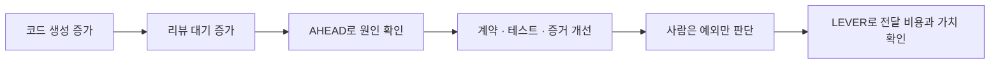

## TL;DR

- Shape에서는 하네스와 리뷰 부담의 변화를 본다.
- Scale에서는 CTS-SW와 비즈니스 성과를 함께 본다.
- AHEAD와 LEVER는 종합점수가 아닌 질문 목록이다.

## 시작하며

[1/2 글](/2026/06/15/organizational-ai-adoption-3s.html)에서 설명한 3S를 처음 정리했을 때 AHEAD에는 Efficiency를, LEVER에는 Extraction Efficiency를 넣었다.

두 항목 모두 비용을 보려다 보니 Shape와 Scale의 차이가 흐려졌다. 코드 생성에서 줄어든 비용이 리뷰, CI와 운영으로 이동하는 문제도 충분히 드러나지 않았다.

[08-18 글](/2026/08/18/ai-coding-review-cognitive-load.html)을 쓰면서 Shape에서 먼저 확인해야 할 것은 비용 절감보다 **사람이 결과를 이해하고 승인하는 부담이 실제로 줄고 있는가**라는 생각이 분명해졌다.[^1]

[08-14 CTS-SW 글](/2026/08/14/cts-sw-software-delivery-cost.html)을 정리하면서 Scale의 비용은 토큰이나 구현 시간보다 고객에게 도달하기까지의 전체 전달 비용으로 봐야 한다고 생각하게 됐다.[^2]

그래서 AHEAD의 `E`를 `Efficiency`에서 `Evidence Quality`로 바꾸고, LEVER의 첫 번째 `E`를 `End-to-end Efficiency`로 다시 정의했다.

AHEAD는 Shape에서 하네스가 학습하고 사람의 반복 판단을 줄이는지 본다. LEVER는 Scale에서 그 하네스를 재사용해 전체 비용과 시간을 낮추고 비즈니스 가치를 만드는지 본다.

두 이름은 여전히 내가 제안하는 평가 렌즈다. 검증된 표준이나 하나의 점수로 사용하지 않는다.

## 1. 처음부터 평가하되 같은 것을 묻지 않는다

평가는 Scale에 도착한 뒤 시작하는 일이 아니다.

도입 전에는 현재 워크플로우의 시간, 품질, 비용과 사람 개입을 기록해야 한다. Streamlining에서는 Agent가 업무를 수행할 데이터, 도구와 권한이 준비됐는지 확인한다.

Shape에서는 실패가 하네스에 남고 리뷰 부담이 줄어드는지 본다.

Scale에서는 고객에게 전달하는 비용과 시간, 비즈니스 성과를 본다.

| 단계 | 먼저 답할 질문 | 평가의 초점 |
| --- | --- | --- |
| Streamlining | 업무를 끝까지 수행할 환경이 있는가 | 경계·데이터·도구·권한·기준선 |
| Shape | 실패와 리뷰 피드백이 하네스를 바꾸는가 | AHEAD |
| Scale | 하네스를 재사용해 가치 전달 비용을 줄였는가 | CTS-SW와 LEVER |

Streamlining과 Shape에 Scale의 ROI를 바로 적용하면 선행 투자를 실패로 보기 쉽다.

반대로 Scale에 들어간 워크로드를 계속 학습 단계라고만 부르면 비용과 성과를 설명하지 않아도 된다. 단계 구분은 투자를 정당화하기 위한 이름이 아니라 다음 판단을 바꾸기 위한 기준이어야 한다.

## 2. AHEAD — 하네스와 리뷰 부담의 변화를 본다

Shape에서는 Agent가 만든 산출물의 수보다 같은 실패와 판단이 어떻게 줄어드는지 확인한다.

업데이트한 AHEAD는 다음 다섯 질문으로 구성한다.

| 관점 | 판단할 질문 | 살펴볼 신호 |
| --- | --- | --- |
| **A — Autonomy Boundary** | 정상 경로는 자동으로 닫고 새 계약·모순·고위험 예외만 사람에게 올리는가 | 반복 승인, escalation 정확도, 승인 대기 |
| **H — Harness Learning** | 실패와 리뷰 피드백이 계약·평가 사례·테스트·규칙·도구로 남는가 | 같은 실패의 재발, 수동 체크의 자동화 |
| **E — Evidence Quality** | 사람이 전체 구현을 복원하지 않고 계약과 증거로 판단할 수 있는가 | 계약별 검증 근거, 코드 확인이 필요한 예외 |
| **A — Adoption** | 도메인팀이 실제 업무에서 사용하고 직접 개선하는가 | 운영 워크로드, 도메인 피드백, 소유권 이전 |
| **D — Dependability** | 품질·안전·안정성과 실패 시 통제가 기준 안에 있는가 | regression, 장애, rollback, 위험 누락 |

`Autonomy Boundary`는 자동화율을 높이라는 뜻이 아니다.

위험이 낮고 계약이 분명한 정상 경로는 Agent가 구현과 검증을 끝낼 수 있어야 한다. 반대로 계약 변경, 기존 결정과의 모순, 보안과 데이터 위험은 빠짐없이 사람에게 올라와야 한다.

사람의 개입이 적다는 사실만으로는 좋은 자율성인지 알 수 없다. 필요한 escalation까지 사라졌다면 Dependability가 낮아진 것이다.

`Harness Learning`은 실패 보고서의 개수를 세지 않는다.

리뷰에서 반복된 판단이 다음 Agent가 사용할 계약, 테스트, 규칙이나 도구로 바뀌었는지 본다. 같은 문제를 사람이 계속 찾아낸다면 하네스가 학습했다고 보기 어렵다.

이번에 새로 넣은 `Evidence Quality`는 리뷰 인지부하를 직접 다룬다.

Agent가 테스트를 통과했다는 한 줄만 남기면 사람은 코드를 처음부터 읽게 된다. 계약별로 무엇을 만족했고 어떤 증거가 있으며, 확인하지 못한 위험과 구현 중 새로 정한 내용이 무엇인지 보여줘야 검토 범위를 줄일 수 있다.

Evidence Quality가 좋아졌다는 것은 긴 보고서를 만든다는 뜻이 아니다.

사람이 새로 이해해야 할 범위가 계약 변경과 예외로 좁아졌다는 뜻이다. 보안, 결제와 데이터 마이그레이션처럼 코드까지 봐야 하는 영역은 남겨두되, 모든 변경에 같은 수준의 리뷰를 요구하지 않는다.

`Adoption`은 도구 접속자 수보다 운영 소유권을 본다.

도메인팀이 결과를 신뢰하고, 실패를 분류하고, 평가 기준을 직접 고칠 수 있어야 한다. 하네스 엔지니어가 떠난 뒤 워크플로우가 멈춘다면 아직 조직 역량으로 넘어가지 않은 것이다.

AHEAD 다섯 항목은 하나의 점수로 합치지 않는다.

Autonomy만 높이면 Dependability를 잃을 수 있고, Dependability만 강화하면 Evidence Quality와 Adoption이 나빠질 수 있다. 서로의 부작용을 확인하는 대시보드처럼 보는 편이 낫다고 생각한다. 생산성을 단일 활동량으로 환원하지 말자는 SPACE의 제안과도 같은 이유다.[^3]

## 3. Shape에서 Scale로 넘어가는 기준

대표 평가 사례를 몇 번 통과했다고 바로 Scale로 넘어가지는 않는다.

다음 조건이 함께 보여야 한다.

- 반복 실패가 계약·테스트·규칙과 도구에 반영된다.
- 정상 경로는 사람의 반복 승인 없이 완료된다.
- 사람은 계약 변경과 중요한 예외를 정확히 전달받는다.
- 도메인팀이 하네스와 운영 지표를 직접 관리한다.
- 모니터링, rollback과 책임 경계가 준비되어 있다.

리뷰 대기열이 계속 늘거나 사람이 모든 코드를 다시 이해해야 한다면 Shape가 끝난 것이 아니다.

코드 생성 속도만 높인 상태에서 Scale을 선언하면 변경량만 늘고 병목은 리뷰, CI와 운영으로 이동한다. DORA가 AI를 조직의 기존 강점과 약점을 증폭하는 요소로 설명하는 것도 이 흐름과 맞닿아 있다.[^4]

Scale 전환은 하네스가 완벽하다는 선언이 아니다.

정의된 범위에서는 반복 가능한 품질과 위험 기준을 유지하며 운영할 수 있고, 새로운 계약과 예외가 생기면 다시 Shape로 돌아갈 수 있다는 뜻이다.

## 4. LEVER — 전체 전달 비용과 가치 회수를 본다

Scale에서는 같은 하네스를 다음 요구사항에 재사용했을 때 무엇이 달라졌는지 본다.

업데이트한 LEVER는 다음과 같다.

| 관점 | 판단할 질문 | 살펴볼 신호 |
| --- | --- | --- |
| **L — Lead Time** | 요구사항이 운영 가능한 기능으로 고객에게 도달하는 시간이 줄었는가 | 개발·리뷰·CI·배포 대기 |
| **E — End-to-end Efficiency** | 전체 전달 비용이 품질 저하 없이 줄었는가 | CTS-SW, 사람 시간, 재시도, 운영 비용 |
| **V — Value Realization** | 자동화가 어떤 비즈니스 결과를 만들었는가 | 비용 절감, 처리 여력, 매출, 위험 감소 |
| **E — Extension & Reuse** | 계약·평가·가드레일·커넥터를 새 워크로드에 재사용하는가 | 추가 준비 작업, 재사용 범위, 신규 구축량 |
| **R — Reliability** | 전달량이 늘어도 품질과 복구 능력을 유지하는가 | 변경 실패, 장애, rollback, 복구 시간 |

기존 `Extraction Efficiency`를 `End-to-end Efficiency`로 바꾼 이유는 비용이 이동하기 때문이다.

코드 생성 시간과 토큰이 줄어도 리뷰 대기, CI 재시도와 장애 대응이 늘면 효율이 좋아진 것이 아니다. 모델, 도구, 사람과 운영을 포함한 전체 비용을 고객에게 도달한 소프트웨어와 연결해야 한다.

CTS-SW는 이 항목을 보는 출발점으로 사용할 수 있다.[^2]

다만 CTS-SW 자체가 비즈니스 가치는 아니다. 배포 한 단위의 비용이 낮아져도 고객이 원하지 않는 기능을 더 싸게 만든 것일 수 있다.

그래서 `Value Realization`을 따로 둔다.

무엇을 가치로 볼지는 워크로드마다 다르다. 고객 요청 처리 시간이 줄었는지, 같은 인원으로 더 많은 업무를 처리하는지, 사고 위험을 낮췄는지 시작할 때 정해야 한다.

`Extension & Reuse`는 기능 개수보다 추가 준비 작업을 본다.

새 워크로드마다 프롬프트, 도구, 평가와 권한 체계를 처음부터 만든다면 앞선 투자를 재사용한 것이 아니다. 반대로 기존 계약과 평가 사례를 조금 확장해 새 요구사항을 처리했다면 Scale의 효과가 나타난 것이다.

`Reliability`는 비용 절감이 다른 곳으로 전가되지 않았는지 확인한다.

CTS-SW가 낮아졌는데 변경 실패와 당직 대응이 늘었다면 개선으로 보기 어렵다. 같은 팀의 시간에 따른 추세를 품질 지표와 함께 봐야 한다.

## 5. 코드 생성이 빨라졌는데 리뷰가 밀리는 경우

여러 Agent를 도입한 뒤 PR은 빨리 생기지만 리뷰 대기열이 길어졌다고 해보자.

코드 생성량만 보면 도입이 성공한 것처럼 보인다.

AHEAD로 보면 다른 문제가 드러난다.

- Autonomy Boundary: 정상 변경도 모두 사람의 승인을 기다린다.
- Harness Learning: 같은 리뷰 지적이 테스트와 규칙으로 옮겨지지 않는다.
- Evidence Quality: 계약별 증거가 없어 사람이 전체 diff를 읽는다.
- Adoption: 도메인팀은 결과를 사용하지만 하네스를 고치지 못한다.
- Dependability: 리뷰를 줄이면 어떤 위험이 생기는지 기준이 없다.

이 상태에서 Agent를 더 늘리면 읽지 않은 변경만 빨리 쌓인다.

먼저 반복되는 리뷰 판단을 계약과 테스트로 옮기고, Agent가 요구사항별 검증 근거와 남은 위험을 남기게 해야 한다. 사람이 구현 전체보다 예외를 검토할 수 있게 된 뒤에야 생성 속도가 전달 속도로 이어진다.





LEVER는 그 다음 질문이다.

리뷰 대기가 줄어 고객에게 도달하는 시간이 짧아졌는지, CTS-SW가 품질 저하 없이 낮아졌는지, 그 변화가 실제 비즈니스 결과로 이어졌는지 본다.

## 6. 지표는 목표보다 대화의 순서로 쓴다

AHEAD와 LEVER의 각 항목을 KPI로 만들면 다시 숫자 최적화가 시작될 수 있다.

자동 완료 비율을 목표로 두면 필요한 사람 검토까지 피할 수 있다. CTS-SW만 낮추려 하면 유지보수와 장애 비용을 계산에서 빼거나 소프트웨어 단위를 잘게 나눌 수 있다.

그래서 한 팀의 한 워크로드에서 기준선을 만들고, 아래 순서로 대화하는 편이 낫다고 생각한다.

1. 현재 가장 큰 병목과 위험은 어디인가
2. 이번 변경이 AHEAD의 어떤 항목을 바꿀 것으로 예상하는가
3. 실제 리뷰 부담과 품질이 어떻게 달라졌는가
4. Scale 이후 CTS-SW와 LEVER에 어떤 변화가 나타났는가
5. 비용이 다른 단계나 사람에게 이동하지 않았는가

모든 항목이 매주 좋아질 필요는 없다.

새로운 보안 요구사항이 생기면 사람 검토와 Lead Time이 일시적으로 늘어날 수 있다. 그 판단이 계약과 가드레일로 남아 다음 작업의 반복 검토를 줄인다면 Shape의 학습으로 볼 수 있다.

지표는 성공을 선언하는 점수보다, 다음에 어디를 고칠지 찾는 기록에 가깝다.

## 마치며

AI 도입 효과를 코드 생성 속도로만 보면 비용이 이동한 자리를 놓친다.

Shape에서는 실패가 하네스에 남고, 사람이 전체 구현을 다시 이해하지 않아도 되는 범위가 넓어지는지 봐야 한다. 그래서 AHEAD의 Efficiency를 Evidence Quality로 바꿨다.

Scale에서는 토큰과 구현 시간만 줄었는지 보지 않는다.

리뷰, CI, 배포와 운영을 포함한 전체 전달 비용을 CTS-SW로 확인하고, LEVER로 시간·비용·재사용·신뢰성과 비즈니스 가치를 함께 본다.

지금은 AHEAD와 LEVER를 조직 평가 점수보다 **도입 단계에 맞는 질문을 빠뜨리지 않기 위한 체크리스트**로 쓰는 편이 적절하다고 생각한다.

이 기준을 실제 워크로드에 적용하면 항목의 이름이나 관찰 방법은 더 바뀔 수 있다. 다만 Shape에서 학습과 리뷰 부담을 먼저 보고, Scale에서 전체 비용과 가치를 묻는 순서는 유지할 생각이다.

---

[^1]: [AI로 코드는 빨리 만들었는데 왜 리뷰는 더 힘들까](/2026/08/18/ai-coding-review-cognitive-load.html) — 구현에서 줄어든 인지부하가 리뷰 시점으로 이동하는 문제를 다룬다.

[^2]: [AI 코딩 도구가 정말 개발 비용을 줄였을까](/2026/08/14/cts-sw-software-delivery-cost.html) — CTS-SW를 같은 팀의 추세와 품질 지표로 보는 방법을 정리한다.

[^3]: Nicole Forsgren et al., [The SPACE of Developer Productivity](https://queue.acm.org/detail.cfm?id=3454124) — 생산성을 단일 활동량으로 환원하지 않고 여러 차원에서 함께 보아야 한다고 제안한다.

[^4]: Google Cloud DORA, [Announcing the 2025 DORA Report: State of AI-Assisted Software Development](https://cloud.google.com/blog/products/ai-machine-learning/announcing-the-2025-dora-report) — AI가 기존 조직의 강점과 약점을 증폭하며 빠른 피드백과 자동화된 테스트 같은 기반 역량이 결과를 좌우한다고 설명한다.
