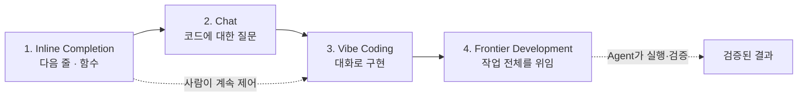
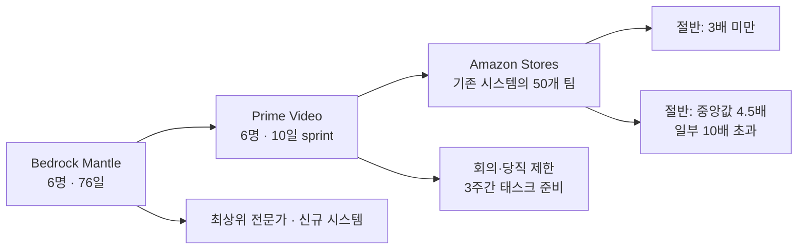
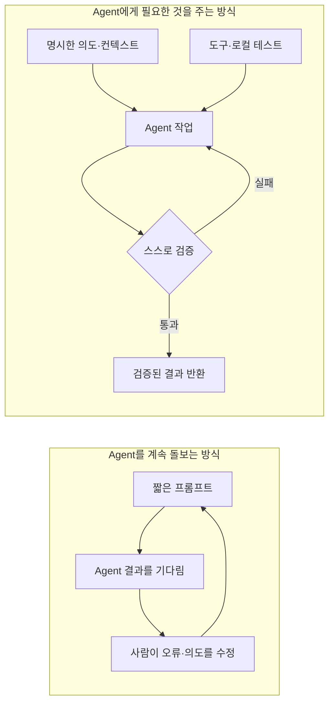
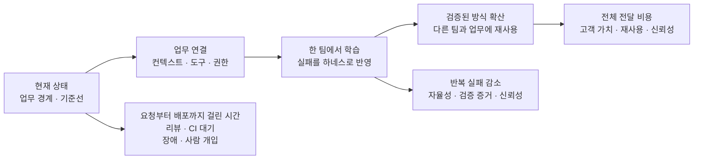

## TL;DR

- 같은 도구를 쓴 팀에서도 성과가 크게 갈렸다.
- Frontier 팀은 다섯 가지 습관으로 Agent의 자율성을 높였다.
- 코드 다음 병목은 리뷰와 의사결정이었다.

## 시작하며

최근 개발·리뷰·운영을 포함한 소프트웨어 전달 비용을 다룬 CTS-SW 글을 정리하면서, AI 코딩 도구가 실제 전달 속도를 얼마나 바꾸는지 관련 자료를 찾아봤다.

사례마다 숫자의 편차가 꽤 컸다. 어떤 팀은 조금 빨라졌다고 하고, 어떤 팀은 몇 배에서 10배가 넘는 개선을 이야기한다.

그러다 같은 조직 안에서 이 차이가 왜 생겼는지를 꽤 구체적으로 설명하는 영상을 보게 됐다.

AWS Senior Principal Engineer Clare Liguori가 Amazon 내부 팀들을 관찰하면서 발견한 `Frontier Development`의 특징을 정리한 발표다.[^1]

발표에는 30명이 18개월 동안 만들 것으로 예상한 시스템을 6명이 76일 만에 만든 사례부터, 기존 코드베이스를 운영하는 50개 팀을 비교한 결과까지 나온다.

발표자는 성과가 크게 오른 팀들이 일하는 방식을 다섯 가지 습관으로 정리했다. 같은 도구를 쓰는 팀 사이에서 어떤 차이를 관찰했는지가 특히 흥미로웠다.

## 1. AI 코딩은 네 번째 단계로 들어가고 있다

Clare는 AI 코딩의 흐름을 네 단계로 나눈다.

첫 번째는 다음 줄이나 함수를 제안하는 `inline code completion`이다.

두 번째는 코드에 관해 질문하고 답을 받는 `chat`이고, 세 번째는 높은 수준의 요구를 Agent와 대화하며 구현하는 `Vibe Coding`이다.

Clare 개인은 이 세 단계에서 체감한 생산성 향상이 대략 10~20% 정도였다고 말한다.

그리고 지금 막 시작된 네 번째 단계를 `Frontier Development`라고 부른다.

기존 단계에서는 사람이 한 줄, 한 함수, 한 번의 대화를 계속 제어했다. Frontier Development에서는 검증 방법까지 포함한 작업 전체를 Agent에게 넘긴다.





Clare는 Frontier Developer를 사용하는 제품이나 모델이 아니라 세 가지 행동으로 정의한다.

1. 자신이 직접 작성하는 코드는 전체의 1~2% 정도다.
2. Agent가 사람의 개입 없이 몇 시간씩 작업하게 만든다.
3. 여러 Agent가 대기 중인 작업을 병렬로 처리하게 해 쉬는 시간을 줄인다.

이 숫자는 모든 개발자가 따라야 할 기준이라기보다, Amazon 내부에서 생산성이 크게 오른 초기 사용자들의 행동을 설명한 것이다.

## 2. 6명이 76일 만에 만들었지만, 그대로 믿을 수는 없었다

발표에서 처음 소개한 팀은 Bedrock Mantle 팀이다.

Bedrock 팀은 AI 모델의 추론 요청과 응답을 처리하는 새 시스템(inference data plane)이 필요하다고 판단했고, 처음에는 30명이 18개월 정도 걸릴 것으로 예상했다.

새 시스템을 만들고, 고객과 모델을 기존 시스템에서 옮겨야 하는 큰 작업이었다.

하지만 실제로는 6명이 Kiro를 사용해 76일 만에 만들었다.

Amazon 내부에서도 처음 보는 결과였고, 코드 변경을 저장한 commit 수를 기준으로 약 20배의 개선을 보인 선행 실험(Pathfinder) 사례가 됐다.

문제는 이 6명이 평범한 팀이 아니었다는 점이다.

두 명의 Distinguished Engineer를 포함해 분산 시스템, 대규모 언어 모델(LLM)과 해당 아키텍처를 잘 아는 최상위 엔지니어들이었다. 기존 코드의 제약 없이 새 시스템을 처음부터 만드는 프로젝트이기도 했다.

가능성을 증명하기에는 좋은 사례였지만, 다른 팀이 일상적인 환경에서 재현할 수 있는지는 알 수 없었다.

다음 실험은 Prime Video에서 진행됐다.

6명의 엔지니어가 10일 동안 Kiro를 제한 없이 사용했고, 진행 상황을 바탕으로 프로젝트 예상 기간을 90주에서 24주로 줄였다.

다른 엔지니어들도 개발 속도를 높일 수 있다는 가능성을 보여줬지만, 24주는 완료 실적이 아니라 실험 중 진행 상황으로 다시 계산한 예상 기간이었다. 이 실험에도 특별한 조건이 있었다.

팀은 당직과 회의가 거의 없었고, 평소 엔지니어를 방해하는 일이 제한됐다. 시니어 엔지니어 한 명은 실험 전에 3주 동안 작고 구체적인 태스크와 요구사항을 준비했다.

일상적인 개발팀의 환경과는 달리 Agent가 일하기 좋은 조건을 의도적으로 만든 단기 집중 개발 기간(sprint)이었다.

그래서 Amazon Stores는 더 현실적인 조건에서 시범 도입(pilot)을 진행했다.

경력 분포가 평범하고, 기존 시스템과 코드베이스를 운영하는 50개 팀을 상당 기간 관찰했다.

측정 기준도 commit 수가 아니라 변경이 운영 환경까지 전달되는 속도였다.

결과는 두 집단으로 갈렸다.

- 절반은 배포 속도가 3배 미만으로 개선됐다.
- 나머지 절반은 중앙값이 4.5배였고, 일부는 10배를 넘었다.

90%의 팀이 Kiro를 포함해 거의 같은 내부 도구를 사용했다.

도구 선택만으로는 팀 사이의 성과 차이를 설명하기 어려웠다.

성과가 크게 오른 팀은 AI 도구를 기존 개발 방식 위에 추가하는 데서 끝나지 않고, **일하는 방식을 의도적으로 바꿨다.**

세 사례를 따라가면 전문가로 구성된 신규 개발팀에서 시작해, 기존 시스템을 운영하는 팀에서도 속도를 높일 수 있는지 확인하는 과정이 보인다.





발표의 숫자는 Amazon 내부 관찰을 공유한 것이며 원자료와 팀별 측정 방법이 모두 공개된 연구는 아니다.

따라서 4.5배를 다른 조직에서도 기대할 수 있는 수치로 받아들이기보다, 같은 도구를 사용한 팀 사이에서 차이를 만든 행동에 주목하는 편이 낫다고 생각한다.

## 3. Frontier 팀이 만든 다섯 가지 습관

Amazon은 Bedrock Mantle, Prime Video와 50개 pilot 팀을 인터뷰해서 공통된 다섯 가지 습관을 찾았다.

Clare는 한 번의 특별한 실험에 그치지 않고 매일 반복하는 방식이라는 점을 강조하며 `practice`보다 `habit`이라는 표현을 쓴다.

### 1) Agent Context에 투자한다

사람의 머릿속에는 문서에 없는 정보가 많다.

동료에게는 Slack 대화, 업무 적응 교육, 멘토링, 코드리뷰와 계획 회의를 통해 전달한다. Agent가 다음 작업에서도 참고할 정보는 파일로 남겨둘 수 있다.

Frontier 팀은 작업 방법이나 프로젝트 규칙을 알려주는 Skill·Steering 파일에 이 정보를 담았다. Agent가 실수하거나 팀이 원하지 않은 방식으로 일할 때마다 아래 질문을 반복했다.

> Agent가 필요했던 내용 중 Skill이나 Steering 파일에 빠진 것은 무엇인가?

잘못된 결과를 그 자리에서 한 번 고치고 끝내지 않고, 다음 실행에서도 사용할 컨텍스트로 남겼다.

반대로 컨텍스트를 계속 추가하기만 해서는 안 된다.

예전 모델의 특이한 행동을 막기 위해 넣었던 `하지 말 것`이 최신 모델에서는 필요 없을 수 있다. 이런 임시방편을 그대로 두면 Agent가 읽어야 할 지침만 늘어날 수 있다.

따라서 새로운 실패에서 규칙을 추가하는 습관과, 모델이 좋아졌을 때 필요 없어진 규칙을 지우는 습관이 함께 필요하다.

### 2) 빨라지기 위해 먼저 느려진다

인터뷰한 거의 모든 팀은 Frontier 방식으로 바꾼 초기에 생산성이 오히려 떨어졌다고 답했다.

특히 기존 코드베이스에서는 Agent에게 코딩 도구만 지급한다고 바로 빨라지지 않는다.

팀들은 먼저 Agent가 성공하기 좋은 환경을 만들었다.

- 실패 이유를 알 수 있도록 기존 도구의 오류 메시지를 개선했다.
- Agent가 필요한 작업을 수행할 수 있도록 새 도구와, 공통 규약으로 도구를 연결하는 MCP 서버를 만들었다.
- Agent가 탐색하기 어려운 코드 구조를 정리했다.
- 코드의 오류나 규칙 위반을 검사하는 린터와 테스트를 보강했다.
- 필요하면 타입과 컴파일러가 더 많은 피드백을 주는 언어로 옮겼다.

발표에서는 Python이나 JavaScript에서 TypeScript로 이동하거나, 컴파일러 오류가 구체적인 Rust를 선택한 사례도 나온다.

여기서 참고할 점은 언어를 바꿨다는 사실보다 그 이유다. Agent가 추측해야 하는 영역을 줄이고, 실패했을 때 무엇을 고쳐야 하는지 알려주기 위해 꽤 큰 엔지니어링 투자를 했다.

### 3) Agent를 돌보지 말고 먹이를 준다

Clare가 가장 강조한 표현 중 하나는 `feeding agents, not babysitting agents`다.

Vibe Coding처럼 Agent와 하루 종일 짧은 대화를 주고받으면 사람은 계속 루프 안에 있다.

Agent가 코드를 만드는 30초에서 1분 동안 기다리고, 결과를 검토한 뒤 다시 지시한다. 이 방식으로는 여러 Agent를 병렬로 실행하기 어렵다.

Frontier 팀은 Agent에게 아래 내용을 먼저 제공했다.

- 무엇을 해야 하는가
- 어떤 제약을 지켜야 하는가
- 무엇으로 스스로 검증해야 하는가
- 어느 품질 기준을 만족해야 돌아올 수 있는가

Agent가 코드를 실행하고 컴파일하며, 테스트 결과와 테스트가 코드를 얼마나 확인했는지 나타내는 커버리지까지 살펴본 뒤 품질 기준을 만족할 때만 돌아오게 만든다.

반복되는 지시는 Steering 파일에 넣어서 다음 작업부터는 별도로 설명하지 않는다.

이렇게 해야 Agent가 실패를 스스로 수정하고, 사람은 기다리는 대신 다른 일을 하거나 다른 Agent를 실행할 수 있다.

### 4) 코드를 만들기 전에 의도를 명시한다

일반적인 Vibe Coding에서는 높은 수준의 프롬프트를 주고 많은 코드를 만든 뒤, 결과를 보면서 의도를 수정한다.

`"내가 원한 건 이게 아니야"`, `"요구사항을 잘못 이해했어"`, `"이런 구조를 원한 게 아니야"`라는 대화가 코드가 만들어진 뒤에 이어진다.

Clare는 의도 자체가 잘못된 상태에서 코드로 대화하는 것이 비효율적이라고 설명한다.

Amazon 팀들은 복잡하거나 모호한 기능일수록 어떤 상황에서 어떤 동작과 결과를 기대하는지 문서로 먼저 정리했다. 이런 식으로 기대 동작을 구체적인 사례로 표현하는 방법을 BDD(Behavior-Driven Development)라고 한다.

Agent가 명세 초안을 만들면 사람과 Agent가 코드보다 수정하기 쉬운 문서에서 요구사항과 기술 설계를 조정한다. 의도가 맞춰진 뒤에 코드를 생성한다.

### 5) 테스트를 개발 초반으로 옮긴다

Agent가 사람의 개입 없이 몇 시간 동안 일하려면 빠른 피드백이 필요하다.

실수를 바로 확인하고 스스로 수정할 수 있도록, Frontier 팀은 린터와 단위·통합·성능·보안 테스트를 추가했다.

모두 이전부터 쓰던 엔지니어링 관행이지만, 테스트를 추가하면 Agent가 같은 작업을 다시 시도할 때마다 활용할 수 있다. 코드베이스를 기계가 읽고 고치기 좋은 형태로 만드는 투자의 가치가 커진 것이다.

특히 여러 팀은 테스트에서 실제 외부 서비스를 호출하는 대신, 같은 입력에 정해진 응답을 돌려주는 로컬 대역(mock)을 만드는 데 투자했다.

매번 클라우드 서비스와 실제 환경을 연결하면 피드백이 느리고 결과가 흔들릴 수 있다. 로컬에서 같은 입력에 같은 응답을 받으면 Agent는 짧은 시간에 더 많은 수정 루프를 돌 수 있다.

다섯 습관을 하나의 흐름으로 묶으면 아래처럼 볼 수 있다.





## 4. Frontier Development도 사람을 힘들게 한다

Clare는 다섯 습관을 적용하면 모든 문제가 해결된다고 말하지 않는다.

아직 초기 도입 단계이고, 팀들도 새로운 일하는 방식을 배우는 중이다.

먼저 번아웃 위험이 있다. 아침에 완성된 코드를 받으려고 밤새 실행할 완벽한 프롬프트를 만들다가 오히려 늦게까지 일하게 될 수 있다.

여러 Agent를 병렬로 실행하면 터미널 탭 사이를 계속 이동해야 한다. 구현 중에 줄어든 정신적 부담, 즉 인지부하가 Agent의 상태를 관리하고 결과를 검토하는 쪽으로 이동한다.

AI가 만든 코드를 리뷰하는 일이 직접 작성하는 것보다 어렵게 느껴질 수도 있다.

특히 다른 사람의 코드를 검토한 경험이 적은 초기 경력 엔지니어는 작성보다 리뷰에서 더 큰 인지부하를 느낄 수 있다.

조직도 바뀌어야 한다.

팀이 코드베이스와 도구를 정비하고 새로운 습관을 만드는 동안에는 생산성이 먼저 떨어질 수 있다.

그런데 리더가 `"좋은 AI 도구를 줬는데 왜 더 빨라지지 않는가"`라고 묻고 이전과 같은 기능 출시량을 계속 요구하면, 팀은 이 선행 투자를 할 수 없다.

Clare는 팀이 코드베이스와 일하는 방식을 바꾸는 데 두 달 정도를 투자해야 할 수도 있다고 말한다.

전사에 너무 빨리 확산하는 것도 위험하다.

Amazon은 Pathfinder 한 팀의 결과를 곧바로 모든 팀에 적용하지 않았다. 제한된 sprint와 50개 팀 pilot을 통해 습관과 제약을 찾았고, 발표 당시에는 다음 2,000개 팀으로 확장하는 문제를 다루고 있었다.

## 5. 코드 다음에는 의사결정이 병목이 된다

발표의 마지막에는 Frontier 팀이 새롭게 만난 병목이 나온다.

발표에서 든 예시는 새로운 제품의 코드를 만드는 데 9~12개월이 걸리는 경우다.

제품을 만들지 결정하는 데 두 달, 출시를 승인하는 데 두 달이 걸려도 전체 일정에서는 상대적으로 덜 두드러졌다.

그런데 코드 작성이 1~2개월로 줄면 앞뒤의 두 달이 가장 긴 단계가 된다.

Clare는 Frontier 팀이 코드를 작성하는 시간보다 의사결정에 더 많은 시간을 쓰는 경우가 많다고 말한다.

같은 과정을 기존 개발과 Frontier Development에 놓으면 병목의 이동이 더 잘 보인다.





코드 생성이 빨라지면서 아래 과정이 새로운 병목으로 드러난다.

- 어떤 제품을 만들지 결정한다.
- 제품과 기술 설계를 검토한다.
- 보안과 운영 조건을 확인한다.
- 출시를 승인한다.

특히 쉽게 되돌릴 수 있는 결정까지 오래 검토하면, 코드가 빨라진 효과를 조직의 의사결정이 흡수해버린다.

다섯 습관으로 구현이 빨라진 뒤에는 제품 결정과 출시 승인에 걸리는 시간도 줄여야 했다.

## 6. 조직에 적용하려면 현재 상태부터 확인한다

발표를 보고 나니 우리 조직에 적용할 때 무엇부터 확인해야 하는지가 남았다.

아래는 발표 요약이 아니라 기존에 쓴 글들을 바탕으로 정리한 내 제안이다.

### 현재 업무의 기준선을 만든다

AI 도구 사용률이나 생성한 코드의 양을 성과로 삼기 전에, 한 팀의 한 업무를 골라 요구사항이 운영 환경에 도달하기까지의 흐름을 펼친다.

- 요구사항을 정하는 데 얼마나 걸리는가
- 구현과 리뷰에서 사람이 어디에 개입하는가
- 코드 변경을 자동으로 빌드하고 테스트하는 CI와 배포에서 얼마나 기다리는가
- 재작업, 이전 버전으로 되돌리기와 장애 대응이 얼마나 발생하는가
- Agent가 일을 끝내는 데 필요한 데이터, 도구와 권한이 있는가

도입 전 기준선이 없으면 코드 생성에서 줄어든 시간이 리뷰나 운영으로 이동해도 알아차리기 어렵다.

### 한 팀에서 연결하고, 실패를 하네스로 바꾼다

앞에서 설명한 배경 정보와 도구, 권한, 실행 환경과 검증 수단을 묶어 하네스라고 부른다. 현재 업무를 파악했다면 Agent가 일을 끝까지 수행하는 데 필요한 하네스를 갖춰간다.

처음부터 여러 Agent와 여러 팀으로 넓히기보다, Agent 하나가 작은 작업 하나를 사람 없이 끝내는 것부터 확인하는 편이 낫다고 생각한다.

Agent가 같은 실수를 반복하면 프로젝트 규칙에 남긴다. 필요한 일을 못 하면 명령줄 도구나 MCP 서버를 연결하고, 작업 방법을 모르면 Skill에 지침을 적는다. 실패를 스스로 발견하지 못하면 린터와 테스트를 추가한다.

이 과정을 실제 프로젝트에 적용한 순서는 실전 하네스 엔지니어링 글에 정리해뒀다.[^2]

조직 단위에서는 이 흐름을 세 단계로 나눠볼 수 있다.[^3]

- 먼저 업무 경계와 데이터·도구·권한을 연결한다.
- 한 팀의 pilot에서 실패와 리뷰 피드백을 하네스로 바꾼다.
- 검증된 방식을 다른 팀과 요구사항에 재사용한다.





### 단계에 따라 다른 효과를 확인한다

초기 pilot에 바로 비용 절감과 비즈니스 성과를 요구하면, 영상에서 말한 `slow down to speed up` 구간을 실패로 판단하기 쉽다.

한 팀에서 학습하는 동안에는 같은 실패가 다시 발생하는지, 사람이 모든 코드를 다시 읽어야 하는지, 예외가 없는 업무를 Agent가 스스로 끝내는지 확인한다.

검증된 방식을 확산할 때는 질문이 달라진다.

요구사항이 고객에게 도달하는 시간이 줄었는지, 같은 품질을 유지하면서 개발·리뷰·운영을 포함한 전체 비용이 낮아졌는지, 앞선 투자가 다른 업무에도 재사용되는지 본다.

이 두 단계에서 확인할 질문은 별도 글에 조금 더 자세히 정리해뒀다.[^4] CTS-SW는 고객에게 도달한 소프트웨어 한 단위의 전체 전달 비용을 보는 출발점으로 사용할 수 있다.[^5]

영상의 50개 팀 사례에서는 배포 속도가 크게 오른 팀들이 일하는 방식도 바꿨다고 보고한다. 이것만으로 어느 습관이 얼마나 기여했는지 알 수는 없지만, 시범 도입에서 살펴볼 행동을 고르는 데는 참고할 수 있다.

조직에 적용한 뒤에는 여기서 한 단계 더 나아가, **빨라진 배포가 전체 전달 비용과 고객 가치의 개선으로 이어졌는지** 확인해야 한다.

### 실행 비용이 낮아지기 전에 일하는 방식을 익힌다

발표에서 제안한 방식으로 일하려면 평소에도 토큰이 계속 들어간다.

코드 수정과 테스트뿐 아니라, 작업에서 얻은 내용을 컨텍스트·도구·테스트에 반영하고 오래된 규칙을 걷어내는 하네스 관리에도 토큰이 필요하다.

이 비용은 워크플로우를 유지하고 개선하는 운영비로 계속 들어간다.

최근 연구들을 보면 같은 수준의 성능을 얻는 비용은 빠르게 낮아지고 있다. 측정 방법에 따라 하락 속도의 차이는 크고, 답을 내기 전에 긴 추론을 거치는 최상위 작업의 총비용은 오를 수도 있지만 같은 성능을 얻는 비용의 하락은 여러 자료에서 공통적으로 나타난다.[^6][^7][^8]

METR의 평가에서는 Agent가 50%의 성공률로 끝내는 소프트웨어 작업의 길이도 늘어나는 추세다. 여기서 길이는 사람이 해당 작업을 끝내는 데 걸리는 시간이며, 실제 회사 업무를 그만큼 오래 안정적으로 수행한다는 뜻은 아니다.[^9]

이 연구들이 `토큰당 비즈니스 가치`를 직접 측정한 것은 아니다. 그래도 같은 성능을 더 싸게 얻고, 모델이 더 긴 작업을 끝내게 되면서 주어진 토큰 예산으로 전달할 수 있는 비즈니스 가치는 커지는 방향이라고 생각한다.

최근 추세가 앞으로도 이어진다고 단정할 수는 없지만, 2~3년 뒤 같은 작업 비용이 지금보다 수십 배 낮아지는 경우도 업무 흐름을 설계할 때 고려할 만한 시나리오다.

실행 비용이 충분히 낮아진 뒤에야 전환을 시작하면, 이미 몇 년 동안 컨텍스트·도구·테스트와 조직의 습관을 쌓아온 팀을 따라가기 어렵다. 같은 작업을 수행하는 비용이 내려가더라도 조직의 일하는 방식은 같은 속도로 바뀌지 않기 때문이다.

그래서 업무 흐름을 설계할 때는 앞으로 3년의 토큰 단가와 사용량을 몇 가지 경우로 나눠 예상해보고, 그 예산으로 수행할 업무와 그동안 개선할 하네스를 함께 고려해야 한다고 생각한다.

## 마치며

이 발표에서 가장 눈에 남은 것은 성과가 오른 팀들이 당장의 기능 출시가 느려지는 것을 받아들였다는 점이다. Agent가 일할 컨텍스트와 도구, 테스트를 먼저 고치는 데 시간을 썼다.

나도 조직에 적용한다면 한 팀의 작은 업무부터 시작하는 편이 낫다고 생각한다. 하네스를 고칠 시간과 토큰 예산을 확보하고, 같은 실패와 사람의 반복 개입이 줄어드는지 확인한 뒤 넓혀가고 싶다.

---

[^1]: Clare Liguori, [From AI-Assisted to AI-Native: Building a Frontier Development Team](https://www.youtube.com/watch?v=pqlWNihgdjI) (2026). Amazon 내부 Pathfinder, sprint 실험과 50개 팀 pilot, Frontier 팀의 다섯 습관을 소개한 발표다.

[^2]: [EncBird에 하네스를 한 겹씩 씌워온 과정](/2026/06/16/harness-engineering-in-practice.html) — 반복되는 실수를 컨텍스트, 도구, 테스트와 가드레일로 옮기는 구체적인 순서를 다룬다.

[^3]: [AI 도입은 왜 토큰 절감부터 시작하면 안 될까 — 3S로 단계 나누기 1/2](/2026/06/15/organizational-ai-adoption-3s.html) — 현재 상태를 연결·학습·확산 단계로 나눠 조직에 적용하는 방법을 설명한다.

[^4]: [AI 도입 성과는 언제 비즈니스 지표로 봐야 할까 — AHEAD·LEVER 다시 보기 2/2](/2026/08/18/measuring-ai-adoption-ahead-lever-part-2.html) — 하네스 학습과 전체 전달 비용·가치 회수를 단계별로 평가하는 질문을 정리한다.

[^5]: [AI 코딩 도구가 정말 개발 비용을 줄였을까 — CTS-SW 시작하기](/2026/08/14/cts-sw-software-delivery-cost.html) — 고객에게 도달한 소프트웨어와 개발·리뷰·운영 비용을 연결하는 방법을 다룬다.

[^6]: Stanford HAI, [AI Index 2025: State of AI in 10 Charts](https://hai.stanford.edu/news/ai-index-2025-state-of-ai-in-10-charts) — GPT-3.5 수준의 MMLU 성능을 얻는 가격이 약 18개월 동안 280배 이상 낮아졌다고 정리한다.

[^7]: Epoch AI, [LLM inference prices have fallen rapidly but unequally across tasks](https://epoch.ai/data-insights/llm-inference-price-trends) — 성능 수준을 고정했을 때 benchmark별 가격 하락 속도와 측정상의 한계를 분석한다.

[^8]: Hans Gundlach et al., [The Price of Progress: Price Performance and the Future of AI](https://arxiv.org/abs/2511.23455) — reasoning token을 포함한 benchmark 실행 비용으로 품질 조정 가격과 최상위 평가 비용을 분석한다.

[^9]: METR, [Time Horizon 1.1](https://metr.org/blog/2026-1-29-time-horizon-1-1/) — Agent가 일정 신뢰도로 완료할 수 있는 작업 길이와 최근 추세를 업데이트한다.
