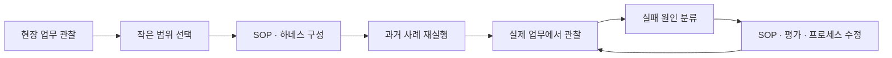
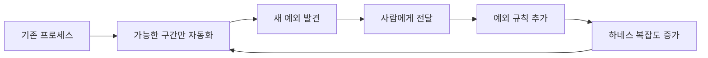
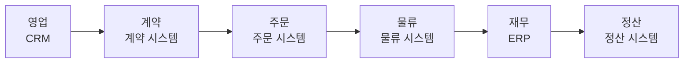

## TL;DR

- Agent로 개발이 빨라지면 업무 프로세스가 다음 병목이 된다.
- 외부 FDE가 떠난 뒤 SOP와 평가를 고칠 사람이 필요하다.
- 고전 개발자의 다음 형태 중 하나가 FDE인 것 같다.

## 시작하며

최근 기존 개발자가 앞으로 어떤 일을 하게 될지 자주 생각했다.

Coding Agent로 사람이 직접 하던 구현 작업을 자동화해나가면 같은 기능을 만드는 데 필요한 개발자의 시간은 줄어든다. 더 어려운 설계와 리뷰에 시간을 쓸 수도 있고, 더 많은 기능을 만들 수도 있다.

그런데 둘 다 여전히 개발 프로세스 안의 일이다.

[비즈니스를 아는 개발자의 가치](/2026/03/13/agentic-dev-business-aligned-code.html)를 쓸 때는 실행 비용이 낮아질수록 무엇을 실행할지 판단하는 능력이 중요해질 것이라고 생각했다.

요즘은 고전적인 개발자의 다음 형태 중 하나가 FDE인 것 같다는 생각을 한다.

그래서 FDE가 실제로 무슨 일을 하는지 관련 발표와 사례를 찾아보고 있다.

FDE(Forward Deployed Engineer)는 현업 가까이에서 아직 요구사항으로 정리되지 않은 문제를 찾고, 필요한 데이터와 시스템을 연결하고, 실제 운영 결과가 나올 때까지 고치는 엔지니어다. OpenAI의 채용 공고도 FDE를 고객의 문제 발견부터 프로덕션 배포까지 함께 책임지는 역할로 설명한다.[^1]

지금까지 찾아본 내용을 바탕으로 FDE가 실제로 어떤 일을 하는지, 왜 내부에 있어야 하는지, 기존 개발자와 어떤 점에서 이어지는지를 정리해본다.

## 1. Maersk 사례에서 FDE가 하는 일을 다시 봤다

Maersk의 글로벌 물류 Agent 운영 발표를 보면서 FDE가 하는 일이 훨씬 구체적으로 보였다.

> “The agent loop is not the system. The refining loop around the agent is the system.”[^2]

Agent가 한 번 실행되는 안쪽 Loop보다, 실패를 관찰하고 현업 전문가의 수정을 SOP와 하네스에 반영하는 바깥쪽 Loop가 실제 시스템이라는 뜻이다.

여기서 하네스는 Agent가 사용하는 컨텍스트와 권한, 실행 환경, 평가와 가드레일을 묶은 환경을 말한다. 이전에 정리한 [하네스 엔지니어링](/2026/03/15/harness-engineering-beyond-context-engineering.html)을 기업 업무에 적용한 모습에 가깝다.

발표자는 200개가 넘는 Agent를 운영하면서 9개월 동안 10만 건이 넘는 correction을 만들었다고 설명한다. 국가마다 다른 절차를 담은 SOP 모음은 Agent 실행 코드보다 약 20배 컸고, 실패 유형 하나를 제대로 해결하는 데 한두 달이 걸리기도 했다.[^2]

왜 이렇게 많은 작업이 필요한지는 물류 예제를 보면 이해하기 쉽다.

하나의 수출 화물에 대해 운송 관리 시스템에는 예약 완료로 나오는데, 선사 API에는 승인 대기로 표시될 수 있다. SAP에는 결제가 끝났지만 세관 시스템에는 서류가 누락되어 있을 수도 있다.

정상적인 화물은 이미 잘 처리된다.

문제는 시스템의 상태가 서로 어긋난 경우다. 담당자는 여러 화면과 이메일을 돌아다니며 실제 상태를 확인하고, 어느 팀에 무엇을 요청해야 하는지 판단한다.

이 업무에 Agent를 붙이려면 사람용 매뉴얼을 Prompt에 넣는 것만으로는 부족하다.

어떤 조건에서 작업을 시작하는지, 어느 식별자로 데이터를 조회하는지, 어떤 순서로 시스템을 확인하는지, 결과를 어떻게 검증하고 실패하면 어디까지 되돌리는지를 정해야 한다.

FDE의 작업을 단계와 산출물로 나누면 다음과 같다.

| 단계 | 실제 작업 | 남는 것 |
| --- | --- | --- |
| 현장 관찰 | 담당자가 예외를 처리하는 과정과 판단 기준을 확인한다 | 현재 업무 흐름과 기준선 |
| 범위 결정 | 첫 자동화 범위와 사람이 판단할 범위를 정한다 | 자동화 경계 |
| 업무 표현 | 암묵지를 실행 가능한 절차로 옮긴다 | SOP와 하네스 |
| 사전 검증 | 과거 사례를 읽기 전용으로 다시 실행한다 | 평가 사례와 실패 유형 |
| 제한적 운영 | 실제 변경 없이 제안하는 Shadow Mode부터 시작한다 | Trace와 현업의 수정 |
| 반복 개선 | 실패를 하네스에 반영하고 안정된 절차를 코드로 옮긴다 | Composite Tool과 조직 지식 |





발표에서 correction으로 센 것은 `"결과가 별로다"`라는 피드백이 아니다.

특정 국가와 상태에서는 어느 절차를 먼저 실행해야 한다는 식으로 실제 동작이 바뀌어야 한다. 같은 실패를 다시 실행할 평가 사례도 함께 남아야 한다.

현업 전문가는 무엇을 해야 하는지 정하고, Agent는 하네스가 허용한 범위 안에서 그 목표를 수행한다. 위험한 변경은 Agent에게 주의하라고 말하는 대신 권한에서 제외하고, 검증 조건이 맞지 않으면 실행되지 않게 만든다.

Agent가 반복해서 성공한 부분은 평범하고 안정적인 소프트웨어로 옮긴다.

### 잘 되는 절차는 Agent 밖으로 꺼낸다

처음에는 Agent가 Booking, 결제, 세관 서류를 어떤 순서로 확인할지 판단하는 편이 유리할 수 있다. 업무 자체를 충분히 이해하지 못했고 새로운 예외도 계속 나오기 때문이다.

운영을 반복하면서 항상 같은 조건에서 같은 순서로 처리되는 부분이 보이기 시작한다.

예를 들어 `Booking 조회 → 결제 확인 → 서류 확인 → 결과 검증` 순서가 안정적으로 성공한다면, 매번 Agent가 다음 단계를 추론하게 둘 이유가 줄어든다. 이 절차를 하나의 함수나 API로 묶어 `resolve_booking_exception()` 같은 Composite Tool로 만들 수 있다.[^5]

코드를 사람이 직접 작성해야 한다는 뜻도 아니다.

FDE가 입력과 출력, 실패 조건과 검증 기준을 정하면 Coding Agent가 Composite Tool과 테스트를 생성할 수 있다. Agent가 발견한 성공 패턴을 다시 deterministic한 소프트웨어로 굳히는 과정이다.

| Agent가 매번 절차를 지휘 | deterministic code·Composite Tool |
| --- | --- |
| 실행할 때마다 단계와 분기를 판단한다 | 실행 순서와 분기 조건이 코드에 고정된다 |
| 같은 입력에서도 경로가 달라질 수 있다 | 같은 조건에서 같은 제어 흐름을 따른다 |
| 전체 업무 흐름을 평가 사례로 검증한다 | 단위·통합 테스트를 직접 작성할 수 있다 |
| 단계마다 넓은 권한과 컨텍스트가 필요하다 | 입력·출력과 권한 범위를 좁힐 수 있다 |
| Trace를 따라 실패 원인을 복원한다 | 실패 지점과 복구 조건을 코드로 확인한다 |

외부 시스템의 데이터와 응답까지 항상 같아진다는 뜻은 아니다.

Agent가 상황마다 실행 순서를 새로 결정하는 대신, 조회 순서와 분기, 검증과 복구 규칙을 코드로 고정한다는 뜻이다. 이 편이 회귀 테스트와 권한 검증, 장애 재현에서 훨씬 유리하다.

이후 Agent는 Composite Tool을 호출할지, 아직 정형화하지 못한 새로운 예외인지 판단하는 데 집중하면 된다. FDE의 개선 작업은 Agent가 처리하는 범위를 계속 넓히는 일인 동시에, **Agent가 매번 판단하지 않아도 되는 범위를 코드로 빼내는 일**이기도 하다.

이 과정을 거치면 Agent 외에도 회사가 일하는 방법이 SOP, 하네스와 운영 기록으로 남는다. 업무가 바뀌면 이 내용도 계속 고쳐야 한다.

## 2. 기존 프로세스를 그대로 자동화하면 어떻게 될까

기업의 업무는 보통 깔끔하게 정리돼 있지 않다.

예를 들어 고객 문의를 처리하기 위해 담당자가 Excel을 확인하고, 다른 팀에 메시지를 보내고, 승인을 기다린 뒤 ERP에 입력한다고 해보자.

여기에 Agent를 넣으면 Excel 조회와 메시지 전송, ERP 입력은 쉽게 자동화할 수 있다.

하지만 왜 승인을 기다려야 하는지, 왜 필요한 데이터가 Excel에 있는지, 왜 시스템마다 값이 다른지는 그대로 남는다. Agent가 모르는 경우에는 다시 사람에게 전달하면 시스템도 일단 돌아간다.

초기에는 괜찮아 보인다.

시간이 지나면 금액이 크면 팀장, 특정 거래처면 AP 담당자, EU 고객이면 Compliance 조직으로 보내는 규칙이 하나씩 붙는다. 새로운 요구사항을 코드로 추가하는 비용이 낮아졌기 때문에 이런 규칙도 전보다 훨씬 빨리 늘어난다.

예전에는 복잡한 요구사항을 추가하려 할 때 개발자가 데이터 모델과 기존 구조를 이유로 한 번쯤 멈춰 세웠을 수 있다.

Agent 시대에는 `"기존 업무 흐름 뒤에 이 단계만 추가해줘"`라고 하면 일단 구현된다. 변경 비용이 낮아진 것이 프로세스를 다시 설계할 기회를 줄이는 쪽으로 작동할 수도 있다.

몇 년이 지나면 복잡함은 코드 한곳에만 있지 않는다.

복잡함은 하네스 안의 Prompt와 SOP, 평가 사례, 사람에게 넘기는 조건으로 흩어진다. 코드만 봐서는 전체 흐름을 이해할 수 없고, 기존 프로세스 위에 Agent용 규칙이 계속 겹친다.

이 과정을 반복하면 부분 자동화가 다음과 같은 순환을 만들 수 있다.





그래서 FDE는 새 규칙을 추가하기 전에 조금 다른 질문을 해야 한다.

- 이 일은 정말 예외인가
- 같은 예외가 계속된다면 정상 프로세스로 바꿔야 하지 않는가
- 이 승인은 지금도 필요한가
- 두 시스템의 값이 다른 원인은 무엇인가
- 사람이 판단해야 하는 이유가 책임 때문인가, 시스템이 정리되지 않았기 때문인가

사람에게 전달된 건도 같은 방식으로 봐야 한다.

한 달에 10만 건 중 8만2천 건을 자동 처리하고 1만8천 건을 사람에게 전달했다고 해보자. 자동화율 82%만 보면 꽤 좋은 결과다.

그런데 1만8천 건을 분류해보니 데이터 부족이 8천 건, 정책이 모호한 경우가 4천 건, 시스템의 값이 다른 경우가 3천 건이고 실제로 사람의 판단이 필요한 건 2천 건일 수 있다.

각 분류는 다음 조치로 이어져야 한다.

| 사람에게 전달된 이유 | 사람이 계속 맡아야 하는가 | 다음 조치 |
| --- | --- | --- |
| 데이터 부족 | 대부분 아니다 | 필수 데이터의 생성·검증 과정 수정 |
| 정책 모호 | 대부분 아니다 | 정책 소유자와 기준 합의 |
| 시스템 불일치 | 대부분 아니다 | 기준 시스템과 연동 방식 정리 |
| 새로운 사례 | 일시적으로 필요하다 | 평가 사례에 추가하고 반복 여부 확인 |
| 법적 책임·고객 협상 | 필요할 수 있다 | 사람의 판단 범위와 책임 명시 |

앞의 1만5천 건은 실제 판단보다 데이터와 정책, 시스템을 아직 고치지 못해서 사람이 메우고 있는 일에 가깝다.

이 상태에서 사람에게 전달하는 기능만 잘 만들면 회사는 원인을 고치지 않고도 계속 운영할 수 있게 된다.

자동화율과 함께 사람이 남아 있는 이유를 봐야 한다고 생각한다.

법적 책임이나 고객 협상 때문에 남은 것인지, 데이터가 엉켜 있어서 남은 것인지를 구분하지 않으면 부분 자동화를 완료로 착각하기 쉽다.

## 3. 프로세스가 부서 경계를 넘을 때

프로세스를 제대로 고치려면 여러 조직의 데이터와 시스템을 함께 봐야 한다.





각 시스템의 권한과 데이터 정의, KPI를 서로 다른 조직이 가지고 있을 수 있다.

[이벤트 스토밍 글](/2020/12/10/demystifying-event-storming.html)을 쓸 때도 도메인 전문가의 지식이 각자의 사일로에 있어서 전체 지도를 가진 사람이 아무도 없다고 정리했다.

업무 지도를 만드는 일은 여러 실무자가 모여 바텀업으로 할 수 있다.

다른 조직의 데이터에 접근하고, 어느 시스템을 기준으로 삼을지 정하고, 조직 사이의 책임을 바꾸는 일에는 탑다운 권한이 필요하다.

FDE는 문제를 찾고 해결안을 만들 수 있지만 그 권한을 스스로 만들 수는 없다.

특히 한국 엔터프라이즈에서 흔히 보는 강한 사일로 구조를 생각하면 이 부분이 가장 어렵다. 자동화해야 하는 업무는 여러 부서를 지나가는데 FDE가 실제로 바꿀 수 있는 범위는 요청한 부서와 시스템 안에 머무르기 쉽다.

그러면 접근할 수 있는 곳까지만 자동화하고 나머지는 사람에게 넘기게 된다.

화면상으로는 Agent가 여러 일을 처리하지만, 조직 사이의 데이터와 책임을 연결하는 일은 여전히 사람이 한다. 사람이 조직 사이를 연결하는 중간 시스템처럼 동작하는 구조다.

FDE는 이 문제를 드러낼 수는 있어도 다른 조직의 권한을 스스로 바꿀 수는 없다.

업무 전체 결과를 책임지는 Process Owner와 데이터 접근, 조직 간 책임 변경을 밀어줄 경영진이 함께 있어야 한다. 역할을 나누면 다음과 같다.

| 역할 | 맡아야 하는 결정 |
| --- | --- |
| 경영진 | 조직 간 데이터 접근과 책임 변경 |
| Process Owner | 업무 전체의 성공 기준과 사람의 판단 범위 |
| 도메인 전문가 | 올바른 결과와 위험한 예외 |
| 사내 FDE | Trace 분석, 하네스 개선과 시스템 반영 |

FDE는 운영 데이터와 Trace로 문제를 보여주고, 합의된 변경을 실제 시스템에 반영한다.

## 4. 외부 FDE가 떠난 뒤에도 계속 고칠 수 있을까

외부 FDE는 초기 구축에서 분명 도움이 된다.

여러 고객의 사례를 경험한 외부 FDE가 초기 문제를 더 빨리 찾을 수도 있고, Agent와 평가 체계를 내부 인력보다 빠르게 구축할 수도 있다.

다만 해결해야 하는 업무는 조직 전체에 걸쳐 있는데 외부 FDE의 권한은 계약한 프로젝트와 시스템으로 제한되기 쉽다.

데이터 접근이나 정책 변경이 지연되면 계약기간 안에 낼 수 있는 현실적인 결과는 접근 가능한 구간의 자동화다. 나머지는 사람에게 넘기고, 예외 규칙을 추가해서 일단 운영한다.

계약기간에는 외부 FDE가 직접 예외를 분석하고 여러 팀에 물어보기 때문에 시스템이 돌아간다.

계약이 끝난 뒤에는 누가 새로운 예외를 분류하고 SOP와 평가 사례를 고칠지 정해야 한다. 이 역할이 없다면 사람에게 넘어가는 건은 조금씩 늘고, 왜 추가했는지 모르는 규칙이 남는다.

외부 조직이 이 개선을 계속 담당하려면 장기 유상 서비스가 필요하다.

유상 계약이 아닌 협력 관계라면 고객 조직과 같은 우선순위로 몇 달씩 예외를 고치기 어렵다. 계약이 있더라도 내부의 모든 맥락과 비공식적인 조직 관계를 외부 인력이 계속 따라가는 데는 비용이 든다.

프로세스를 바꾸려면 불편한 질문도 해야 한다.

왜 이 승인이 필요한지, 어느 팀이 데이터를 잘못 관리하고 있는지, 누가 앞으로 책임질지를 이야기해야 한다. 같은 회사에서 이후 결과를 함께 감당할 동료의 제안과 단기 계약으로 들어온 외부 인력의 제안은 받아들여지는 무게가 다를 수 있다.

외부 FDE에게 초기 구축과 전문 기술을 맡기더라도, 운영 중 발견한 실패를 어느 프로세스의 변경으로 돌려보낼지는 내부에서 결정해야 한다.

이 역할까지 외부에 맡기면 계약이 끝날 때 개선도 함께 멈출 가능성이 크다.

## 5. 고전 개발자의 다음 형태 중 하나로 FDE를 생각해본다

Varick Agents의 Vasuman Moza는 앞으로의 병목을 다음과 같이 설명한다.

> “It’s the ability to go deep with the customer, redesign the workflows, deciding what should be automated versus shouldn’t.”[^3]

코드를 만드는 능력보다 고객의 업무 안으로 깊이 들어가 업무 흐름을 다시 설계하고, 무엇을 자동화할지 결정하는 능력이 더 중요해진다는 이야기다.

이 설명을 들으면서 고전적인 개발자의 다음 형태 중 하나가 FDE인 것 같다는 생각이 조금 더 구체화됐다.

개발자는 이미 내부 시스템이 어디에서 자주 깨지는지, 데이터가 실제로 어디에 있는지, 문서와 현실이 어떻게 다른지 알고 있다. 오랫동안 같은 조직에서 일했다면 어느 팀과 어떤 순서로 이야기해야 하는지도 어느 정도 알고 있다.

여기에 Agent를 만드는 기술과 업무를 관찰하는 능력을 더해야 한다.

현업 전문가만큼 도메인을 알 필요는 없겠지만, 담당자가 왜 그런 판단을 했는지 물어보고 이를 데이터 조회, SOP, 평가 사례와 권한으로 옮길 수 있어야 한다.

기존 개발 방식과 비교하면 업무가 꽤 달라진다.

| 고전적인 개발자 | FDE 형태의 개발자 |
| --- | --- |
| 전달받은 요구사항을 구현한다 | 요구사항이 필요한 이유부터 확인한다 |
| 담당 시스템의 범위를 본다 | 업무가 시작하고 끝나는 전체 경로를 본다 |
| 배포를 완료 시점으로 본다 | 운영에서 반복되는 예외까지 따라간다 |
| 코드와 API를 주로 다룬다 | 데이터 정의와 조직의 책임 경계도 다룬다 |
| 기술적으로 맞는 해결책을 만든다 | 관련 조직을 설득해 프로세스까지 바꾼다 |

마지막 항목은 내부 FDE가 외부 FDE보다 유리할 수 있는 부분이다.

같은 회사에서 장애와 운영 결과를 함께 경험한 동료라는 사실이 자동으로 권위를 만들어주지는 않는다. 그래도 조직의 역사와 맥락을 공유하고 변경 이후에도 남아 있다는 점은 설득 과정에서 도움이 된다.

플랫폼, 보안, 모델과 분산 시스템을 깊게 다루는 개발자는 계속 필요하다. 개발자의 미래가 모두 하나의 모습으로 수렴할 것 같지는 않다.

다만 엔터프라이즈의 애플리케이션 개발자는 이미 현업의 요구사항을 시스템으로 옮기고 여러 팀 사이의 문제를 조율하고 있다.

Agent가 구현을 더 많이 맡게 되면 코드 작성보다 프로세스 이해와 시스템 연결에 더 많은 시간을 쓰게 될 가능성이 크다. 직함이 FDE가 아니더라도 개발자의 역할이 FDE와 비슷한 형태로 바뀔 수 있다.

## 6. FDE 업무도 Agent로 자동화되지 않을까

FDE 업무도 빠르게 자동화될 것 같다.

Palantir는 Foundry의 관리와 운영 작업을 자연어로 수행하는 Agent를 `AI FDE`라는 이름으로 제공하고 있다.[^4] 회의 기록을 정리하고, 실패 Trace를 묶고, SOP 초안과 Integration 코드를 만드는 일도 Agent가 점점 더 많이 맡을 수 있다.

Varick 발표에서도 FDE가 업무 흐름을 만드는 동안 빠진 내용을 찾고 변경을 제안하는 내부 Agent를 소개한다.[^3]

FDE의 기술 작업이 자동화돼도 조직 사이의 권한과 책임을 조정하는 일은 남는다.

정책 소유자를 정하고 기존 승인을 없앴을 때의 책임을 맡으려면 동료를 설득하고 변경 이후의 결과를 함께 감당해야 한다.

이 부분까지 Agent가 대신할 수 있다고 생각한다면 FDE를 굳이 내재화할 이유는 줄어든다.

반대로 당분간은 사람이 맡아야 한다고 생각한다면, FDE 역량을 외부에만 두는 것은 손해일 수 있다. 회사는 Coding Agent로 개발 시간을 줄인 뒤 다시 외부 FDE에게 비용을 지불해서 다른 부서의 자동화를 맡기게 된다.

기존 개발자가 사내 FDE로 이동하면 그동안 쌓인 시스템 지식과 조직의 맥락을 그대로 사용할 수 있다.

그래서 FDE 내재화는 개발 자동화로 확보한 여력을 어디에 다시 투자할지에 대한 선택으로 보인다.

## 마치며

처음에는 Coding Agent가 발전하면 기존 개발자가 설계와 리뷰를 더 많이 맡게 될 것이라고 생각했다.

지금은 고전적인 개발자의 다음 형태 중 하나가 FDE인 것 같다는 생각을 한다.

FDE는 반복되는 예외가 왜 생기는지 확인하고, 불필요한 승인과 데이터 불일치를 고치고, 그 결과를 다시 SOP와 평가 사례에 남겨야 한다.

외부 FDE가 초기 구축을 도울 수는 있지만 이 개선을 계속 소유할 사람은 내부에 필요하다. 조직을 넘는 데이터 접근과 책임 변경은 경영진이 지원하고, 현업 Process Owner가 무엇을 자동화하고 무엇을 사람의 책임으로 남길지 결정해야 한다.

플랫폼과 인프라처럼 기술 자체를 깊게 다루는 개발자는 그대로 남을 것이다. 반면 현업의 요구를 애플리케이션으로 옮기던 개발자는 업무와 Agent, 조직 변화를 함께 다루는 FDE 형태로 발전할 수도 있다.

개발 조직에서 자동화로 확보한 시간을 다른 부서의 불필요한 수작업과 프로세스 부채를 줄이는 데 쓰기 시작하면, 개발자와 FDE의 경계도 자연스럽게 흐려질 것이라고 생각한다.

아직 FDE라는 역할이 회사마다 어디까지 책임지고 어떤 권한으로 일하는지는 차이가 커 보인다. 그래서 당분간은 실제 FDE 조직이 어떻게 일하고, 외부 계약이 끝난 뒤에도 개선을 어떻게 이어가는지 더 찾아볼 생각이다.

---

[^1]: OpenAI, [Forward Deployed Engineer](https://openai.com/careers/forward-deployed-engineer-nyc/) — 고객의 문제 발견부터 프로덕션 배포까지 함께 책임지는 FDE 역할을 설명한다.

[^2]: Dmitry Buykin, [Tribal Dungeons of Global Shipping: AI Agents at Global Scale](https://www.youtube.com/watch?v=dQ-_i1tZiws&t=230s), AI Engineer World's Fair 2026 — Maersk의 SOP, 평가, 가드레일과 지속적인 개선 과정을 소개한다.

[^3]: Vasuman Moza, [AI tools for Forward Deployed Engineering](https://www.youtube.com/watch?v=l0FLhNqBOic&t=656s), AI Engineer World's Fair 2026 — 고객의 업무를 이해하고 업무 흐름과 자동화 범위를 다시 설계하는 FDE 업무를 설명한다.

[^4]: Palantir, [AI Forward Deployed Engineer](https://palantir.com/docs/foundry/ai-fde/overview/) — Foundry의 관리와 운영 작업을 자연어로 수행하는 Agent.

[^5]: Dmitry Buykin, [Tribal Dungeons of Global Shipping: AI Agents at Global Scale](https://www.youtube.com/watch?v=dQ-_i1tZiws&t=631s), AI Engineer World's Fair 2026 — 반복해서 성공한 단계들을 더 큰 Composite Tool로 묶어 재사용하는 방법을 설명한다.
