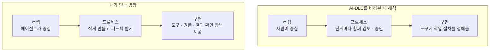
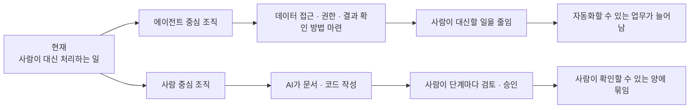
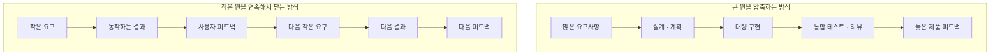
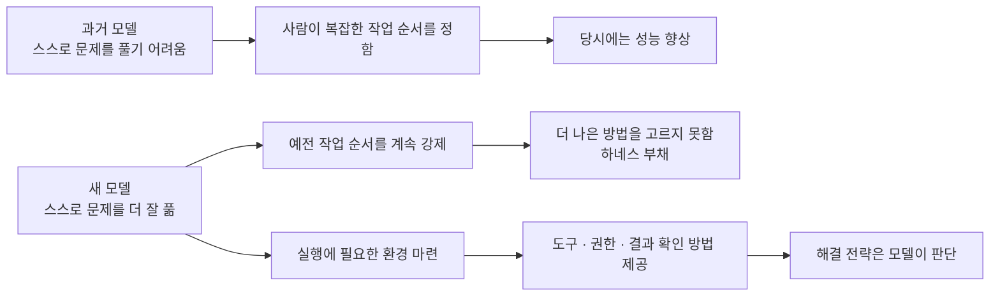

## TL;DR

- AWS AI-DLC는 컨셉·프로세스·구현 전반에서 내가 믿는 에이전틱 개발과 크게 다르다.

## 시작하며

지금의 역할과 내가 믿는 방향이 다르다는 점을 오래 고민해왔다.

지금도 함께 일하는 동료들은 뛰어나고 좋은 사람들이고, 회사가 주는 안정성과 기회도 크기 때문에 오히려 오래 고민했다.

지난 1년 동안은 내 관점과 다른 내용을 앞장서서 전달해야 하는 상황을 꽤 잘 피해왔다. 다른 주제를 고르거나, 내가 동의하는 일부만 설명하거나, 아주 가까운 사람들에게만 제한적으로 다른 의견을 말하는 식이었다.

그런데 AWS가 제안하는 AI 기반 개발 방식인 AI-DLC(AI-Driven Development Lifecycle)가 더 구체적인 절차와 도구를 갖추고 퍼지면서 더는 피하기 어려워졌다.[^1][^2]

시니어는 회사의 방향을 이해하고, 주니어 동료들이 움직일 수 있게 돕고, 회사가 만들고 싶은 결과가 실제로 나오게 해야 한다.

문제는 내 관점과 거리가 있는 내용을 전달하는 일에 적극적으로 나설 마음이 생기지 않는다는 것이다.

방향에 확신을 갖지 못한 채 직급과 안정성 때문에 남아 있고, 뒤에서는 의심하면서 앞에서는 동료들에게 열심히 하자고 말하는 모습은 팀에도 나에게도 정직하지 않다.

**내가 확신하지 못하는 방향을 적극적으로 전달하지 않는 것과, 시니어로서 해야 할 역할을 하지 않는 것은 결국 같은 일이었다.**

AI-DLC와 내 관점이 어디서 달라지는지, 그 차이가 왜 현재 역할에 대한 고민으로 이어졌는지를 정리해본다. AWS의 공식 입장이 아니며, 공개 자료와 개인 경험을 바탕으로 쓴 내 의견이다.

나는 개발자로 커리어를 시작했고, 고객이 기술을 선택하고 시스템을 설계하도록 돕는 SA(Solutions Architect)가 된 뒤에도 개인 서비스를 직접 개발하고 배포하며 운영해왔다. 그래서 여러 고객의 문제를 넓게 보는 경험보다, 하나의 제품을 오래 운영하며 내 결정의 결과를 겪는 경험에 더 큰 갈증을 느끼는 편이다.

다른 경력과 강점을 가진 SA라면 같은 역할을 전혀 다르게 해석할 수 있다.

내가 AI-DLC와 다르게 생각하는 지점은 **컨셉 → 프로세스 → 구현** 세 가지다.

어떤 미래를 목표로 하느냐에 따라 일을 나누고 반복하는 방식이 달라지고, 그 차이는 실제 도구와 실행 환경을 만드는 방식에도 이어진다.





## 1. 컨셉의 차이 — 사람을 중심에 남기는 접근

도구를 사용해 작업을 수행하는 AI 에이전트에게 개발을 맡기는 에이전틱 엔지니어링에 대해, 나는 이전 글에서 그 방향을 판단할 기준을 하나 정했다.

**에이전틱 엔지니어링의 장기적인 방향은 human in the loop(HITL), 즉 실행 과정에 반복적으로 개입하는 사람을 제거하는 것**이라고 생각한다.[^3]

지금 당장 모든 사람을 빼자는 뜻은 아니고, 데이터 접근이나 실행 권한, 결과 확인 방법이 없어 사람이 대신 처리하는 일을 하나씩 해결하자는 뜻이다. 다른 팀의 도움이 필요한 일도 같은 관점에서 살펴보면 에이전트가 스스로 끝낼 수 있는 범위를 넓혀갈 수 있다.

AI-DLC는 다른 출발점을 가진다.

공식 소개 글에서는 AI가 계획하고 실행하되 중요한 결정은 사람이 내린다. 팀 전체가 모여 AI가 정리한 요구사항과 설계를 바로 확인하는 방식을 `Mob Elaboration`과 `Mob Construction`이라고 부른다.[^1]

최근 공개된 adaptive workflow는 단순한 버그 수정과 새 시스템 개발에 똑같은 절차를 적용하지 않도록, 작업에 따라 필요한 단계를 고르고 얼마나 자세히 다룰지 조절한다. 초기 버전보다 분명 나아진 방향이다.

그럼에도 사람의 승인은 여전히 예외가 아니라 방법론의 중심이다.

공식 글도 AI의 결과를 믿고 쓸 수 있는지, 누가 책임지는지, 결과가 정확한지를 확인하려면 사람이 필요하다고 설명한다. 그래서 모든 단계에서 팀이 함께 결과를 검토하고 승인하도록 한다.[^2]

이 접근은 AI에 익숙하지 않은 팀이 처음 워크숍을 해보거나, 규제와 감사 때문에 누가 무엇을 책임지는지 분명히 해야 하는 조직에는 유용할 수 있다.

다만 나는 **앞으로 실제 서비스를 개발하는 조직은 지금 사람이 필요한 이유를 하나씩 없애갈 것**이라고 생각한다.

데이터가 흩어져 있어서 사람이 찾는다면 에이전트가 필요한 데이터를 찾을 수 있게 연결한다. 권한이 없어서 사람이 대신 실행한다면 필요한 권한만 가진 도구를 만든다.

결과를 믿을 수 없어 사람이 일일이 읽는다면, 결과가 만족해야 할 조건을 정해 테스트로 확인하고 로그와 지표로 실제 동작까지 살펴볼 수 있게 한다.

반대로 사람이 항상 확인할 것이라고 가정하면, 데이터 접근이나 권한 문제를 해결하지 않고 사람이 대신 처리하는 데 머물기 쉽다.

두 조직은 지금은 비슷해 보여도 2~3년 뒤에는 전혀 다른 모습이 될 것이라고 생각한다.





3년 뒤에야 에이전트가 주요 업무를 대신할 수 있다는 사실이 충분히 증명됐다고 해보자.

그때부터 팀마다 따로 관리하던 데이터를 연결하고, 에이전트에게 필요한 권한과 결과 확인 방법을 마련하기 시작하면 늦을 가능성이 크다. 모델은 빠르게 바뀌지만 회사가 데이터를 관리하고 책임을 나누는 방식은 같은 속도로 바뀌지 않기 때문이다.

내가 생각하는 미래와 AI-DLC의 컨셉은 이 지점에서 갈라진다.

Kiro가 공개한 Frontier Engineering 가이드에서도 같은 방향을 제시한다. 두 번째 원칙은 에이전트가 일하는 시간을 늘리고 사람의 개입을 줄이라는 것으로, 목표를 다음과 같이 설명한다.[^13]

> 목표는 실행 과정에서 사람의 개입을 점차 줄여가는 것이다. (원문 일부 번역)

사람은 방향을 정하고 결과를 확인하되, 그 사이의 구현과 테스트, 오류 수정은 에이전트가 스스로 반복하도록 맡기자는 이야기다. **내가 생각하는 방향이 실제 에이전트 도구를 만드는 쪽에서 공개적으로 제시하는 방향과도 맞닿아 있다는 점**을 확인할 수 있다.

## 2. 프로세스의 차이 — 큰 원을 더 빨리 도는 접근

AI로 개발하면서 가장 강력하다고 느낀 것은 **요구사항을 정하고, 실제로 만들고, 테스트하고, 피드백을 받는 사이클을 거의 실시간에 가깝게 줄일 수 있다는 점**이다.

예전에는 제품을 작게 만들어 확인하려 해도 종이에 화면을 그리거나 화면 구성을 간단히 보여주는 정도에 머물렀다.

지금은 일부 기능과 데이터를 임시로 대신하더라도, 기존 코드와 실제 화면을 연결해 서비스에 가까운 형태로 만들어볼 수 있다. 사용자가 직접 써볼 수 있는 결과를 먼저 띄우고, 그 결과를 보면서 다음에 필요한 기능을 정할 수 있다.

예전의 SDLC(Software Development Life Cycle, 소프트웨어 개발 생명주기)를 100미터짜리 철사를 구부려 큰 원 하나를 만드는 일이라고 생각해보자.

요구사항을 모으고, 설계하고, 개발하고, 테스트한 뒤 마지막에야 처음으로 원이 닫힌다.

내가 생각하는 에이전틱 개발은 10미터짜리 작은 원을 여러 개 만들어 용수철처럼 쌓는 방식에 가깝다.

각 원은 화면부터 그 뒤의 처리까지 함께 만들어 사용자가 처음부터 끝까지 써볼 수 있는 작은 기능 하나로, 이런 단위를 vertical slice라고 한다. 원의 크기는 문제에 따라 더 작게도, 조금 크게도 바꿀 수 있다.





제품을 직접 써보고 익숙해지면서 다음에 필요한 것을 정할 수 있으니, 한 번도 본 적 없는 제품의 요구사항을 회의실에서 미리 쏟아낼 필요가 없다. 그만큼 머릿속으로 제품 전체를 상상하고 판단해야 하는 부담, 즉 인지부하도 낮아진다.

리뷰하는 사람도 제품 전체를 한 번에 이해하는 대신, 방금 추가된 한 가지 동작과 그 증거만 확인하면 된다.[^4]

내가 경험한 AI-DLC는 큰 원을 작은 원으로 바꾸기보다, 기존의 큰 원을 AI로 더 빨리 돌리는 프로세스에 가까웠다.

반면 내가 선호하는 프로세스는 요구사항과 동작하는 결과, 사용자 피드백의 작은 원을 반복해서 닫는 방식이다.

공식 방법론도 `bolt`라는 짧은 작업 기간을 두고, 할 일을 Unit of Work라는 작은 단위로 나눈다. adaptive workflow도 불필요한 단계를 건너뛸 수 있게 개선됐다.

그런데 각 단계에서 관련된 사람들이 모여 문제와 배경을 함께 이해하고, AI가 만든 계획과 결과물을 검토해 승인한 뒤 다음 단계로 넘어가는 방식은 그대로다.

전체 기간은 줄어들 수 있지만, 같은 양의 요구사항과 설계 판단, 리뷰가 더 짧은 시간 안에 몰리면 사람의 인지부하는 오히려 높아질 수 있다.

AI가 구현 시간을 크게 줄이면 코딩은 전체 일정의 작은 일부가 되고, 제품 결정과 리뷰, 출시 승인이 새로운 병목으로 드러난다. Amazon 내부의 Frontier Development 사례를 정리하면서도 같은 현상을 확인했다.[^5]

AI-DLC 워크숍에 참여한 사람들이 좋았다고 말하는 이유 중에는 여러 이해관계자가 한자리에 모여 커뮤니케이션 비용이 줄었다는 이야기가 많았다.

그 효과는 분명 중요하지만 AI-DLC만의 효과라기보다, 작은 팀이 빠르게 결정하는 Two-Pizza Team 방식과 개발부터 운영까지 함께 책임지는 DevOps 문화가 잘 작동한 결과일 수도 있다.[^5]

좋은 협업 문화와 AI-DLC라는 방법론의 효과를 같은 것으로 보면, 다른 조직에 옮겼을 때 무엇을 재현해야 하는지가 흐려진다.

## 3. 구현의 차이 — 모델이 일할 순서까지 정해주는 하네스

이 차이는 작업 흐름을 실제 도구와 실행 환경에 옮길 때도 이어진다.

여기서 하네스는 모델이 일하는 데 필요한 배경 정보와 도구, 접근 권한, 코드를 실행할 환경과 결과를 확인할 방법을 통틀어 말한다.[^6]

에이전트가 사람 없이 더 오래 일할수록 좋은 하네스가 필요하지만, 그 역할은 두 종류로 나눠볼 필요가 있다고 생각한다.

| 종류 | 역할 | 모델이 강해질수록 |
| --- | --- | --- |
| 사고방식과 순서를 정하는 장치(Cognitive scaffolding) | 어떻게 생각하고 어떤 순서로 일할지 강제한다 | 줄어들 가능성이 크다 |
| 실행에 필요한 환경(Execution infrastructure) | 도구, 권한, 격리된 실행 공간, 테스트와 동작 기록을 제공한다 | 계속 필요하다 |

계획을 세우는 Planner, 문제점을 찾는 Critic, 결과를 검토하는 Reviewer, 작업을 되돌아보는 Reflection Agent처럼 역할을 나눠 여러 에이전트를 쓰거나, 사람이 일을 나누는 순서를 미리 정해두기도 한다. 모두 모델이 스스로 문제를 풀기 어려웠던 시기에 부족한 능력을 절차로 보완하려는 시도였다.

하지만 강한 모델은 문제에 따라 첫 행동을 다르게 고를 수 있다.

오류 기록을 바로 읽을 수도 있고, 테스트부터 실행할 수도 있고, 코드 변경 이력에서 언제 문제가 생겼는지 찾을 수도 있다. 짧은 계획이 필요한 문제도 있고, 긴 계획을 쓰는 행위 자체가 낭비인 문제도 있다.

이때 하네스가 항상 `조사 → 계획 → 할 일 나누기 → 구현 → 검토 → 회고` 순서를 강제하면, 모델이 문제를 어떻게 풀지까지 미리 결정하게 된다.

과거 모델의 약점을 보완하려고 만든 규칙을 새 모델에서도 걷어내지 못해 오히려 방해가 되는 문제를 나는 **Harness Debt**, 하네스 부채라고 부르고 싶다.

Kiro의 열 번째 원칙도 새 모델이 나오면 예전 모델의 약점을 보완하려고 만든 임시방편이 여전히 필요한지 다시 검토하라고 한다.[^14] 실패에서 배워 필요한 지침과 도구를 추가하는 만큼, 모델이 좋아졌을 때 더는 필요하지 않은 제약을 걷어내는 일도 중요하다는 뜻으로 읽었다.





최근 관심을 받는 Pi도 자신을 “minimal agent harness”, 즉 최소한의 기능을 갖춘 하네스라고 소개한다. 사용자는 확장 기능(extension), 작업 지침(skill), 재사용할 요청문(prompt template)을 추가해 원하는 작업 흐름을 만들 수 있다.[^7]

이 자유도는 분명 매력적이지만, 최신 모델을 쓸 때 사용자가 더 많이 손본다고 결과가 더 좋아지는 것은 아니다. 사용자가 정한 절차 때문에 모델이 더 나은 방법을 선택하지 못할 수도 있기 때문이다.

결제나 금융 업무처럼 반드시 지켜야 하는 실행 순서와 승인 규칙이 있는 일에는 정해진 절차가 필요할 수 있지만, 모든 소프트웨어 개발을 같은 방식으로 해야 하는지는 별개의 문제다.

Claude Code와 Codex를 만드는 조직은 모델과 에이전트 제품을 함께 개발하므로, 새 모델이 나올 때마다 어떤 정보와 지침을 제공하고 어떤 판단을 모델에게 맡길지 함께 확인할 수 있다.

Anthropic도 앞으로 모델에게 어떤 정보와 지침이 필요할지 예측하기 어렵다고 설명한다. 그래서 Managed Agents에서는 작업 기록을 관리하는 session, 모델의 작업을 돕는 harness, 코드를 격리해서 실행하는 sandbox를 서로 분리해 연결했다고 한다.[^8]

OpenAI의 Codex 사례도 모델에게 생각할 순서를 길게 가르치기보다, 코드가 정해진 구조와 규칙을 지키는지 자동으로 검사하고 테스트로 결과를 확인하는 데 집중한다.[^9]

내가 생각하는 좋은 하네스의 역할도 이쪽에 가깝다.

> **하네스는 모델에게 경기장을 제공해야지, 어떻게 경기할지를 대신 결정해서는 안 된다.**

하네스는 모델이 읽을 수 있는 코드 저장소, 명령을 실행할 환경, 접근 가능한 데이터와 금지된 작업, 통과해야 할 테스트를 정한다.

그 경계 안에서 어떤 순서로 문제를 풀지는 가능한 한 모델에게 맡긴다.

Kiro의 여덟 번째 원칙도 필요한 파일과 도구, 네트워크에만 접근하도록 권한을 제한한 뒤, 사람이 계속 지켜보지 않아도 에이전트가 일하게 하라고 설명한다. 이를 옮기면 “안전장치를 자동화할 때마다 사람이 개입해야 할 이유가 하나씩 줄어든다”라는 뜻인데, 내가 하네스에 기대하는 역할과 가깝다.[^15] 되돌릴 수 없는 작업에는 승인을 남기면서도, 사람이 매번 확인하던 일을 시스템이 대신하도록 바꿔가는 방향이다.

AI-DLC의 adaptive workflow는 모든 작업에 같은 절차를 적용하던 문제를 상당히 줄였지만, 단계마다 무엇을 만들고 언제 승인받고 함께 검토할지는 여전히 도구에 정해두고 있다. 그런 점에서 모델의 사고방식과 작업 순서를 정해주는 장치에 가깝다고 생각한다.

모델이 좋아지면 하네스가 정해두었던 작업 순서와 해결 전략도 다시 검토해, 모델에게 맡길 수 있는 판단을 늘려야 한다고 생각한다.

## 4. 내 생각을 가장 흔드는 건 실제 결과가 있다는 점

여기까지 확신이 있다면 그냥 내 길을 가면 될 것 같지만, 나를 가장 힘들게 한 부분은 따로 있다.

**AI-DLC로 실제 서비스를 만들어 성과를 냈다는 사례가 생각보다 계속 나온다.**

AWS의 공개 글은 Bedrock Mantle을 6명이 76일 만에 만든 과정 중 일부를 AI-DLC와 연결해 설명한다. 유럽의 한 금융사에서 제품 담당자 한 명과 개발자 3명이 한 번의 sprint, 즉 정해진 작업 기간마다 최대 35개 기능을 완성했다는 초기 도입 사례도 소개한다.[^10]

다만 Mantle이 성공했다고 해서 그 성과가 AI-DLC 방법론 전체 덕분이라고 단정할 수는 없다.

뛰어난 엔지니어와 빠른 의사결정, 좋은 내부 도구가 있었고, 기존 시스템을 고치는 대신 새로 만드는 프로젝트이기도 했다. 공개 글도 Mantle에서 사용한 과정과 도구 중 일부가 오늘날 AI-DLC에 포함됐다고 조심스럽게 표현한다.

그럼에도 결과가 있다는 사실은 남는다.

현장에서 비슷한 이야기를 접할 때마다 성과에 영향을 준 다른 이유를 내가 놓친 것은 아닌지 의심하게 된다. 내 개인 프로젝트에서 겪은 일이 다른 팀에도 똑같이 적용된다고 생각하는 건 아닌지도 돌아보게 된다.

가끔은 내 경험을 과대평가하는 건지, 조직에서 설명하는 성과를 과소평가하는 건지 헷갈린다.

지금은 한 제품과 팀을 몇 년 동안 운영하며 그 방법의 결과를 끝까지 책임지기보다 AI-DLC를 설명하고 도입을 돕는 역할에 가깝다 보니, 이 의문을 풀기 어렵다고 생각한다.

두 접근이 어떤 조건에서 더 잘 작동하는지를 프레젠테이션과 워크숍의 반응만으로 판단하고 싶지 않다.

실제 고객의 문제를 골라 팀을 이끌고 서비스를 출시한 뒤, 장애와 조직 안에서 부딪히는 문제까지 겪어보고 판단하고 싶다.

그래서 **내 관점의 한계를 확인하려면 실제 팀에서 제품을 운영하고, 내 결정이 어떤 결과로 이어지는지 직접 겪어봐야 한다**고 생각한다.

## 5. 넓게 보는 경험만으로는 내 갈증이 풀리지 않았다

스티브 잡스가 1992년 MIT 강연에서 컨설턴트에 관해 말한 영상이 있다.

<iframe width="560" height="315" style="width: 100%; max-width: 560px; aspect-ratio: 16 / 9; height: auto;" src="https://www.youtube.com/embed/-c4CNB80SRc" title="Steve Jobs on consultants" frameborder="0" allow="accelerometer; autoplay; clipboard-write; encrypted-media; gyroscope; picture-in-picture; web-share" referrerpolicy="strict-origin-when-cross-origin" allowfullscreen></iframe>

잡스는 여러 회사를 넓게 볼 수 있어도 자신의 권고를 구현하고 그 결과와 실패를 오래 겪지 않으면 배움이 얕을 수 있다고 말했다. 과일 사진은 많이 봤지만 직접 맛보지는 못했다는 비유다.[^11]

이를 SA 전체에 대한 평가로 가져오고 싶지는 않다. 고객과 오래 일하고, 여러 회사에서 반복되는 패턴과 선택지를 보여주는 것 역시 분명한 전문성이다.

다만 내게는 `권고한 뒤의 운영 결과를 직접 겪는가`라는 질문이 남았다. 개인적으로 20만 줄과 10만 줄 규모의 서비스에 시간과 비용을 직접 들이고 운영도 책임지고 있지만, 공식적인 고객 사례는 아니다.

SA로서 여러 고객의 문제를 접한 경험은 자산이다. 하지만 지금 필요한 것은 한 팀을 이끌며 제품을 오래 운영하고, 그 과정에서 겪은 실패와 운영 결과를 다음 결정에 반영하는 경험이라고 생각한다.

제품 조직에 속해도 주어진 티켓만 처리하고 결과에는 관심 없이 월급만 챙기는 사람도 봤다. **결과를 책임지려면 문제 정의부터 운영까지 끝까지 참여해야 한다.**

AI가 코드를 만드는 능력의 개인차를 줄일수록, 풀려는 문제와 배경을 공유하고 결과를 확인하며 같은 실패를 반복하지 않도록 하네스를 고치는 팀의 능력이 더 중요해진다. 같은 도구를 사용한 Amazon 팀들의 성과가 크게 갈린 이유도 여기에 있었다.[^5]

그래서 **제품을 함께 운영하고, 실패한 이유를 다음 결정에 반영하는 팀**에서 일하고 싶다.

## 마치며

AI-DLC는 AI를 처음 도입하거나 승인 절차와 책임을 엄격하게 관리해야 하는 조직에는 현실적인 답이 될 수 있다. 다만 나는 에이전틱 엔지니어링이 사람을 더 잘 배치하기보다, 사람이 필요했던 이유를 시스템에서 제거하는 방향으로 갈 것이라고 믿는다.

현재 가장 지치는 것은 다른 생각 자체보다, 이를 편하게 논의할 곳이 거의 없다는 점이다. 고객 문제를 이야기하기도 전에, 왜 사람의 반복 개입을 줄여야 하는지와 왜 작게 만들고 자주 피드백을 받아야 하는지를 설명하는 데 시간과 에너지를 대부분 쓴다.

에이전틱 엔지니어링을 직접 경험한 팀이라면 모든 결론이 같지 않아도 된다. 함께 겪어본 일이 있으니 **고객 문제를 어떻게 풀고, 일하는 방식과 하네스를 어떻게 바꿀지에 더 집중할 수 있기** 때문이다.

그래서 연말까지는 이직하려고 한다. 회사 이름이나 직함보다, 고객 문제를 진지하게 고민하고 운영을 함께 책임지는 팀을 찾고 싶다. 또는 AI가 나아갈 방향에 대한 생각이 잘 맞는 팀에서 새로운 개발 방식을 배우고 동료들과 나누고 싶다.

그런 팀을 찾지 못한다면 AI를 활용하는 작은 회사를 직접 만들어, 작게 만들고 고객 반응을 확인하며 다음 결정을 내리는 Lean Startup 방식을 실험해볼 생각도 있다.[^12] 고객 문제를 고르는 일부터 개발 방식과 구현, 운영까지 직접 책임지며 내 생각이 맞는지 확인할 수 있기 때문이다.

지금은 **내 생각이 실제 팀과 고객 문제 앞에서도 통하는지 확인할 수 있는 팀**을 찾고 있다.

---

[^1]: AWS, [AI-Driven Development Life Cycle: Reimagining Software Engineering](https://aws.amazon.com/blogs/devops/ai-driven-development-life-cycle/) (2025.07.31) — AI가 계획하고 실행하되 사람이 중요한 결정을 검증하는 AI-DLC의 기본 구조를 설명한다.

[^2]: AWS, [Open-Sourcing Adaptive Workflows for AI-Driven Development Life Cycle](https://aws.amazon.com/blogs/devops/open-sourcing-adaptive-workflows-for-ai-driven-development-life-cycle-ai-dlc/) (2025.11.29) — 작업에 맞게 절차를 바꾸되 각 단계에서 사람이 확인하는 방식을 설명한다.

[^3]: [현상을 해석하는 렌즈, 그리고 에이전틱 엔지니어링](/2026/06/12/lens-for-agentic-engineering.html) — HITL 제거를 기준으로 에이전틱 엔지니어링의 방향을 해석한 글.

[^4]: [AI로 코드는 빨리 만들었는데 왜 리뷰는 더 힘들까](/2026/08/18/ai-coding-review-cognitive-load.html) — AI가 줄인 구현 인지부하가 리뷰에 몰리는 현상과 작은 개발 사이클을 다룬다.

[^5]: [같은 AI 도구를 썼는데 왜 어떤 팀은 10배까지 빨라졌을까](/2026/08/31/frontier-development-habits.html) — 구현이 빨라진 뒤 제품 결정과 출시 승인이 새 병목으로 드러난 Amazon 내부 사례를 정리한다.

[^6]: [EncBird에 하네스를 한 겹씩 씌워온 과정](/2026/06/16/harness-engineering-in-practice.html) — 모델에게 필요한 정보, 도구, 결과 확인 방법과 실행 환경을 실제 프로젝트에 추가한 과정을 설명한다.

[^7]: [Pi Coding Agent](https://pi.dev/) — 확장 기능과 작업 지침, 요청문을 추가해 작업 흐름을 만들 수 있는 하네스.

[^8]: Anthropic, [Decoupling the brain from the hands](https://www.anthropic.com/engineering/managed-agents) — session, harness와 sandbox를 분리한 Managed Agents의 설계를 설명한다.

[^9]: OpenAI, [Harness engineering: leveraging Codex in an agent-first world](https://openai.com/index/harness-engineering/) — 코드 구조와 규칙을 자동으로 검사하고 테스트로 결과를 확인하도록 에이전트의 작업 환경을 만든 사례.

[^10]: AWS, [AI-Driven Development Lifecycle for Financial Services](https://aws.amazon.com/blogs/industries/ai-driven-development-lifecycle-for-financial-services/) (2026.05.26) — Bedrock Mantle과 유럽 금융사의 초기 AI-DLC 도입 사례를 소개한다.

[^11]: MIT Sloan, [Steve Jobs talks consultants, hiring, and leaving Apple in unearthed 1992 talk](https://mitsloan.mit.edu/ideas-made-to-matter/steve-jobs-talks-consultants-hiring-and-leaving-apple-unearthed-1992-talk) — 권고를 구현하고 그 결과를 오래 겪지 않을 때 학습이 얕아질 수 있다는 잡스의 강연을 정리한다.

[^12]: [망하지 않는 게 먼저인 이유](/2026/06/27/failure-comes-first.html) — AI로 실험 비용을 낮추고, 고객 반응을 보며 다음 시도를 정하는 개발 방식에 대한 내 생각을 정리했다.

[^13]: Kiro, [Maximize agent time, minimize your involvement](https://kiro.dev/topics/frontier-engineering/maximize-agent-time/) — Frontier Engineering의 두 번째 원칙. 사람의 개입을 방향 설정과 결과 확인으로 줄여가는 방향을 제시한다.

[^14]: Kiro, [Continuously tune your agent setup](https://kiro.dev/topics/frontier-engineering/tune-your-setup/) — 열 번째 원칙. 실패에서 지침과 도구를 개선하고, 새 모델에서 오래된 임시방편이 여전히 필요한지 재검토하도록 한다.

[^15]: Kiro, [Trust the boundaries, not the agent](https://kiro.dev/topics/frontier-engineering/trust-the-boundaries/) — 여덟 번째 원칙. 권한 제한과 자동 검사로 사람의 반복 개입을 줄이되, 되돌릴 수 없는 행동에는 승인을 남긴다.
