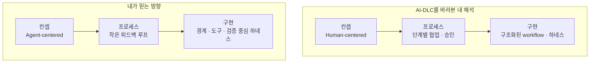
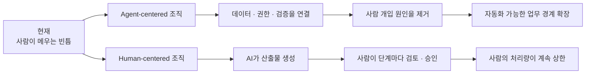
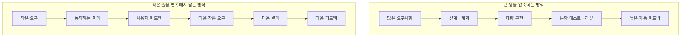
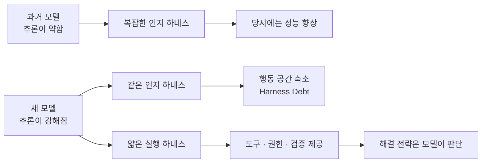

## TL;DR

- AI-DLC는 컨셉·프로세스·구현 전반에서 내가 믿는 에이전틱 개발과 크게 다르다.
- 개발자 출신인 나는 제품의 결과를 함께 소유하고 학습하는 팀이 더 필요해졌다.

## 시작하며

최근 지금의 역할과 내가 믿는 방향 사이의 거리를 오래 고민하고 있다.

회사나 동료에 대한 불만을 정리하려는 글은 아니다. 지금도 함께 일하는 동료들은 뛰어나고 좋은 사람들이고, 회사가 주는 안정성과 기회도 크다.

오히려 그래서 오래 고민했다.

지난 1년 동안은 내 관점과 다른 내용을 앞장서서 전달해야 하는 상황을 꽤 잘 피해왔다. 다른 주제를 고르거나, 내가 동의하는 일부만 설명하거나, 아주 가까운 사람들에게만 제한적으로 다른 의견을 말하는 식이었다.

그런데 AWS의 AI-Driven Development Lifecycle, 이하 AI-DLC가 더 구체적인 방법론과 실행 도구를 갖추고 확산되면서 더는 피하기 어려워졌다.[^1][^2]

시니어의 역할은 회사의 방향을 이해하는 데서 끝나지 않는다.

그 방향의 선봉에 서서 주니어 동료들이 움직일 수 있게 돕고, 회사가 만들고 싶은 결과가 실제로 나오게 해야 한다.

문제는 내 관점과 거리가 있는 내용을 전달하는 일에 적극적으로 나설 마음이 생기지 않는다는 것이다.

방향에 확신을 갖지 못한 채 직급과 안정성 때문에 남아 있고, 뒤에서는 의심하면서 앞에서는 동료들에게 열심히 하자고 말하는 모습은 팀에도 나에게도 정직하지 않다.

**내가 확신하지 못하는 방향을 적극적으로 전달하지 않는 것과, 시니어로서 해야 할 역할을 하지 않는 것은 결국 같은 일이었다.**

그래서 이 글은 AI-DLC의 옳고 그름을 판정하려는 글이 아니다.

AI-DLC와 내가 에이전틱 개발을 바라보는 관점이 어디서 달라지는지, 그리고 그 차이가 왜 현재 역할에 대한 고민으로 이어졌는지를 정리한 글이다.

당연히 AWS의 공식 입장이 아니며, 공개 자료와 개인 경험을 바탕으로 쓴 내 의견이다.

여기에는 내 경력에서 오는 편향도 있다.

나는 개발자로 커리어를 시작했고, SA가 된 뒤에도 개인 서비스를 직접 개발하고 배포하며 운영해왔다. 그래서 여러 고객의 문제를 넓게 보는 경험보다, 하나의 제품을 오래 소유하며 결정의 결과를 겪는 경험에 더 큰 갈증을 느끼는 편이다.

다른 경력과 강점을 가진 SA라면 같은 역할을 전혀 다르게 해석할 수 있다.

**이 글은 SA라는 역할의 한계를 일반화하려는 글이 아니라, 개발자였던 내가 현재 역할에서 느낀 개인적인 한계를 설명하는 글이다.**

내가 AI-DLC와 다르게 생각하는 지점은 **컨셉 → 프로세스 → 구현**으로 이어지는 세 층이다.

여기서 컨셉은 어떤 미래를 목표로 두는지, 프로세스는 그 미래를 향해 일을 어떻게 나누고 반복하는지, 구현은 그 프로세스를 workflow와 하네스에 어떤 구조로 옮기는지를 뜻한다.

세 가지는 서로 떨어진 차이가 아니다. 상위의 컨셉이 프로세스를 만들고, 그 프로세스가 구현의 형태를 결정한다.





## 1. 컨셉의 차이 — 사람을 중심에 남기는 접근

나는 이전 글에서 에이전틱 엔지니어링을 해석하는 렌즈를 하나 정했다.

**에이전틱 엔지니어링의 장기적인 방향은 human in the loop(HITL), 즉 실행 과정에 반복적으로 개입하는 사람을 제거하는 것**이라고 생각한다.[^3]

지금 당장 모든 사람을 빼자는 뜻은 아니다.

사람이 반복해서 메우고 있는 데이터, 권한, 검증과 조직 사이의 빈틈을 발견하고, 그 빈틈을 에이전트가 스스로 닫을 수 있는 구조로 바꾸는 것을 목표로 삼자는 뜻이다.

AI-DLC는 다른 출발점을 가진다.

공식 소개 글은 AI가 계획과 실행을 담당하되 중요한 결정은 사람에게 미루고, 팀 전체가 `Mob Elaboration`과 `Mob Construction`에 모여 AI가 만든 요구사항과 설계를 실시간으로 검증하는 구조를 설명한다.[^1]

최근 공개된 adaptive workflow는 단순한 버그 수정과 신규 시스템 개발을 같은 절차에 넣지 않도록 단계의 폭과 깊이를 동적으로 고른다. 초기 버전보다 분명 나아진 방향이다.

그럼에도 사람의 승인은 여전히 예외가 아니라 방법론의 중심이다.

공식 글도 HITL을 신뢰, 책임과 정확성의 초석으로 두고 모든 단계에 협업형 승인 사이클을 요구한다.[^2]

이 접근은 AI에 익숙하지 않은 팀이 처음 워크숍을 해보거나, 규제와 감사 때문에 사람의 책임 지점을 명시해야 하는 조직에는 유용할 수 있다.

내 생각과 갈리는 지점은 그 유용성이 아니다.

나는 **앞으로 프로덕션 개발이 수렴할 기본 형태**를 다르게 예상한다.

내가 믿는 조직은 지금 사람이 필요한 이유를 하나씩 없앤다.

데이터가 흩어져 있어서 사람이 찾는다면 데이터를 연결한다. 권한이 없어서 사람이 대신 실행한다면 제한된 권한을 가진 도구를 만든다. 결과를 믿을 수 없어 사람이 읽는다면 계약, 테스트와 관측성을 보강한다.

반대로 사람이 항상 중앙에 있을 것이라고 가정하면, 어려운 경계는 정리하지 않은 채 마지막에 사람이 확인하는 것으로 닫기 쉽다.

두 조직은 지금은 비슷해 보여도 2~3년 뒤에는 전혀 다른 모습이 될 것이라고 생각한다.





3년 뒤에야 에이전트가 주요 워크플로우를 대체할 수 있다는 사실이 충분히 증명됐다고 해보자.

그때부터 데이터 사일로를 부수고, 권한과 검증 체계를 에이전트가 사용할 수 있게 바꾸기 시작하면 늦을 가능성이 크다. 모델은 빠르게 바뀌지만 조직의 데이터와 책임 경계는 같은 속도로 바뀌지 않기 때문이다.

내가 생각하는 미래와 AI-DLC의 컨셉은 이 지점에서 갈라진다.

## 2. 프로세스의 차이 — 큰 원을 더 빨리 도는 접근

AI로 개발하면서 가장 강력하다고 느낀 것은 코드 생성 속도 자체가 아니다.

**요구사항을 정하고, 실제로 만들고, 테스트하고, 피드백을 받는 사이클을 거의 실시간에 가깝게 줄일 수 있다는 점**이다.

예전에는 제품을 충분히 작게 만들어 확인하려 해도 페이퍼 프로토타입이나 와이어프레임 정도에 머물렀다.

지금은 로직과 데이터의 일부가 mock이어도 기존 코드와 실제 인터페이스를 연결해서 프로덕션에 가까운 경험을 만들 수 있다. 사용자가 만질 수 있는 결과를 먼저 띄우고, 그 결과를 보면서 다음 요구사항을 정할 수 있다.

예전의 SDLC(Software Development Life Cycle, 소프트웨어 개발 생명주기)를 100미터짜리 철사를 구부려 큰 원 하나를 만드는 일이라고 생각해보자.

요구사항을 모으고, 설계하고, 개발하고, 테스트한 뒤 마지막에야 처음으로 원이 닫힌다.

내가 생각하는 에이전틱 개발은 10미터짜리 작은 원을 여러 개 만들어 용수철처럼 쌓는 방식에 가깝다.

각 원은 사용자가 확인할 수 있는 작은 vertical slice다. 원의 크기는 문제에 따라 더 작게도, 조금 크게도 바꿀 수 있다.





작은 원의 장점은 속도만이 아니다.

한 번도 본 적 없는 제품의 요구사항을 회의실에서 미리 쏟아낼 필요가 없다. 손으로 만져보고 충분히 익숙해지면서 다음 요구사항을 정할 수 있어서 인지부하도 낮아진다.

리뷰하는 사람도 제품 전체를 한 번에 이해하는 대신, 방금 추가된 한 가지 동작과 그 증거만 확인하면 된다.[^4]

내가 경험한 AI-DLC는 큰 원을 작은 원으로 바꾸기보다, 기존의 큰 원을 AI로 더 빨리 돌리는 프로세스에 가까웠다.

반면 내가 선호하는 프로세스는 요구사항과 동작하는 결과, 사용자 피드백의 작은 원을 반복해서 닫는 방식이다.

공식 방법론은 `bolt`라는 짧은 실행 단위와 작은 Unit of Work를 사용한다. adaptive workflow도 불필요한 단계를 건너뛸 수 있게 개선됐다.

그런데 각 단계에서 여러 이해관계자가 함께 컨텍스트를 맞추고, AI가 만든 계획과 산출물을 검토하고, 승인을 거쳐 다음 단계로 넘어가는 기본 형태는 유지된다.

전체 기간은 줄어들 수 있다.

하지만 같은 양의 요구사항, 설계 판단과 리뷰가 더 짧은 시간 안에 몰리면 사람의 인지부하는 오히려 높아질 수 있다.

AI가 구현 시간을 크게 줄이면 코딩은 전체 일정의 작은 일부가 되고, 제품 결정과 리뷰, 출시 승인이 새로운 병목으로 드러난다. Amazon 내부의 Frontier Development 사례를 정리하면서도 같은 현상을 확인했다.[^5]

AI-DLC 워크숍에 참여한 사람들이 좋았다고 말하는 이유 중에는 여러 이해관계자가 한자리에 모여 커뮤니케이션 비용이 줄었다는 이야기가 많았다.

그 효과는 분명 중요하다.

다만 그것은 AI-DLC만의 효과라기보다 작은 팀이 함께 책임지고 빠르게 결정하는 Amazon의 Two-Pizza Team과 DevOps 문화가 잘 작동한 결과일 수도 있다.[^5]

좋은 협업 문화와 AI-DLC라는 방법론의 효과를 같은 것으로 보면, 다른 조직에 옮겼을 때 무엇을 재현해야 하는지가 흐려진다.

## 3. 구현의 차이 — 모델의 판단을 구조화하는 하네스

컨셉과 프로세스의 차이는 실제 workflow와 하네스의 구현에서도 이어진다.

여기서 말하는 하네스는 모델을 둘러싼 컨텍스트, 도구, 권한, 실행 환경과 검증 체계를 뜻한다.[^6]

하네스가 필요 없다는 뜻은 아니다.

오히려 에이전트가 사람 없이 더 오래 일할수록 좋은 하네스는 반드시 필요하다.

다만 하네스를 두 종류로 나눠볼 필요가 있다고 생각한다.

| 종류 | 역할 | 모델이 강해질수록 |
| --- | --- | --- |
| Cognitive scaffolding | 어떻게 생각하고 어떤 순서로 일할지 강제한다 | 줄어들 가능성이 크다 |
| Execution infrastructure | 도구, 권한, sandbox, 검증과 관측성을 제공한다 | 계속 필요하다 |

Planner, Critic, Reviewer, Reflection Agent와 고정된 task decomposition은 모델의 추론이 약하던 시기에 부족한 부분을 사람이 만든 workflow로 메우려는 시도였다.

하지만 강한 모델은 문제에 따라 첫 행동을 다르게 고를 수 있다.

버그 로그를 바로 읽을 수도 있고, 테스트부터 실행할 수도 있고, Git history에서 regression을 찾을 수도 있다. 짧은 계획이 필요한 문제도 있고, 긴 계획을 쓰는 행위 자체가 낭비인 문제도 있다.

이때 하네스가 항상 `Research → Plan → Task 생성 → Implement → Review → Reflection` 순서를 강제하면, 하네스가 모델을 돕는 범위를 넘어 해결 전략까지 미리 결정하게 된다.

과거 모델의 약점을 보완하려고 만든 제약이 다음 모델에서도 남아 더 나은 판단을 제한하는 현상을 나는 **Harness Debt**라고 부르고 싶다.





최근 관심을 받는 Pi도 자신을 “minimal agent harness”라고 소개하며, 사용자가 extension, skill과 prompt template으로 원하는 workflow를 만들 수 있다는 점을 내세운다.[^7]

이 자유도는 분명 매력적이다.

하지만 최신 모델을 사용할 때 더 많은 customization이 더 좋은 성능을 보장하지는 않는다.

사용자가 설계한 workflow가 모델이 상황에 맞게 선택할 수 있는 더 나은 판단을 제한할 수도 있기 때문이다. 결제나 금융의 일부처럼 실행 순서와 승인 규칙이 업무 계약인 영역에는 이런 구조가 필요할 수 있지만, 모든 소프트웨어 개발의 기본값으로 삼아야 하는지는 별개의 문제다.

Claude Code와 Codex처럼 모델과 에이전트 제품을 함께 만드는 조직은 새 모델이 나올 때마다 어떤 context engineering이 여전히 필요한지, 어떤 판단을 다시 모델에 돌려줘도 되는지를 함께 검증할 수 있다.

Anthropic도 Managed Agents에서 미래 모델에 어떤 context engineering이 필요할지 예측할 수 없기 때문에 session, harness와 sandbox의 인터페이스를 분리했다고 설명한다. OpenAI의 Codex 사례도 모델에게 사고 순서를 장황하게 가르치기보다 저장소의 경계와 검증을 기계적으로 강제하는 데 집중한다.[^8][^9]

내가 생각하는 좋은 하네스의 역할도 이쪽에 가깝다.

> **하네스는 모델에게 경기장을 제공해야지, 어떻게 경기할지를 대신 결정해서는 안 된다.**

하네스는 읽을 수 있는 repository, 실행할 수 있는 shell, 접근 가능한 데이터와 금지된 권한, 통과해야 할 테스트를 정한다.

그 경계 안에서 어떤 순서로 문제를 풀지는 가능한 한 모델에게 맡긴다.

AI-DLC의 adaptive workflow는 고정된 하나의 workflow를 강제하던 문제를 상당히 줄였다.

그럼에도 단계 라이브러리, 산출물, 승인 지점과 협업 의식을 실행 계층에 깊게 넣는 방향은 내가 생각하는 미래보다 cognitive scaffolding 쪽에 가깝다.

모델이 좋아질수록 intelligence를 하네스에 더 넣는 것이 아니라, 과거에 하네스로 옮겨놓았던 intelligence를 다시 모델에게 돌려줘야 한다고 생각한다.

## 4. 내 생각을 가장 흔드는 건 실제 결과가 있다는 점

여기까지 확신이 있다면 그냥 내 길을 가면 될 것 같지만, 나를 가장 힘들게 한 부분은 따로 있다.

**AI-DLC로 프로덕션에서 실제 결과를 냈다는 사례가 생각보다 계속 나온다.**

AWS의 공개 글은 Bedrock Mantle을 6명이 76일 만에 만들었다는 사례를 AI-DLC의 일부 과정과 연결한다. 유럽의 한 금융사에서 제품 소유자 한 명과 개발자 3명이 sprint당 최대 35개 기능을 전달했다는 초기 도입 사례도 소개한다.[^10]

다만 Mantle의 성공이 AI-DLC 전체 방법론의 인과적 효과를 증명하는 것은 아니다.

최상위 엔지니어, greenfield 프로젝트, 빠른 의사결정과 좋은 내부 도구가 함께 있었고, 공개 글도 Mantle에서 사용한 일부 과정과 도구가 오늘날 AI-DLC의 일부라고 조심스럽게 표현한다.

그럼에도 결과가 있다는 사실은 남는다.

현장에서 비슷한 이야기를 접할 때마다 내가 중요한 변수를 놓치고 있는지, 내 개인 프로젝트의 경험을 일반화하고 있는지 스스로 의심하게 된다.

가끔은 내 경험을 과대평가하는 건지, 조직에서 설명하는 성과를 과소평가하는 건지 헷갈린다.

이 의문은 지금 자리에서는 풀기 어렵다고 생각한다.

나는 AI-DLC를 설명하고 도입을 돕는 쪽에 가깝지, 한 제품과 팀을 몇 년 동안 운영하며 그 방법의 결과를 끝까지 책임지는 사람이 아니기 때문이다.

두 접근이 어떤 조건에서 더 잘 작동하는지를 프레젠테이션과 워크숍의 반응만으로 판단하고 싶지 않다.

실제 고객의 문제를 고르고, 팀을 이끌고, 프로덕션에 배포하고, 장애와 조직의 반작용까지 겪은 뒤에 판단하고 싶다.

그래서 이 문제는 내 가설을 뒷받침하는 논리를 더 쌓는 것보다, **내 관점의 한계를 확인할 수 있는 환경에서 결과를 직접 소유해봐야 알 수 있다**고 생각한다.

## 5. 넓게 보는 경험만으로는 내 갈증이 풀리지 않았다

스티브 잡스가 1992년 MIT 강연에서 컨설턴트에 관해 말한 영상이 있다.

<iframe width="560" height="315" style="width: 100%; max-width: 560px; aspect-ratio: 16 / 9; height: auto;" src="https://www.youtube.com/embed/-c4CNB80SRc" title="Steve Jobs on consultants" frameborder="0" allow="accelerometer; autoplay; clipboard-write; encrypted-media; gyroscope; picture-in-picture; web-share" referrerpolicy="strict-origin-when-cross-origin" allowfullscreen></iframe>

잡스는 컨설턴트가 여러 회사의 넓은 단면을 볼 수는 있지만, 자신의 권고를 구현하고 몇 년 동안 결과를 책임지며 실패의 상처를 쌓지 않으면 경험이 얇을 수밖에 없다고 말했다.

바나나와 복숭아의 정확한 사진을 벽에 많이 걸어둘 수는 있어도 실제로 맛보지는 못했다는 비유다.[^11]

이 영상을 SA 전체에 대한 평가로 가져오고 싶지는 않다.

SA는 컨설턴트와 완전히 같은 역할도 아니고, 고객과 장기적으로 일하며 구현 이후의 결과까지 함께 책임지는 SA도 많다. 여러 회사와 산업을 가로지르며 반복되는 패턴을 발견하고, 한 조직 안에서는 보기 어려운 선택지를 제시하는 것도 별개의 전문성이다.

다만 개발자로 시작한 내게는 `권고한 뒤의 운영 결과를 직접 겪는가`라는 질문이 계속 남았다.

나는 약 20만 줄짜리 서비스와 10만 줄짜리 서비스를 개인적으로 개발하고 운영하고 있다.

요구사항을 정하고, 에이전트 하네스를 만들고, 배포하고, 사용자의 반응을 보며 다시 고친다. 적어도 내 돈과 시간, 서비스의 결과는 내가 소유한다.

하지만 개인 프로젝트이므로 고객에게 AWS의 공식 사례처럼 이야기할 수는 없다.

지금까지 블로그에 쓴 내용도 결국 한 사람의 경험과 인사이트다. 근거를 아무리 길게 붙여도 내가 주장하는 방법으로 실제 팀의 결과를 바꿔본 경험이 없다면, 적어도 에이전틱 개발 방법론에 관한 내 메시지의 권위에는 한계가 있다.

재작년부터 내가 에이전트 주도 개발이라고 부르던 현상도, Andrej Karpathy가 `Vibe Coding`이라는 이름을 붙이자 훨씬 빠르게 공용어가 됐다.[^12]

메시지가 의미를 얻는 데는 내용만큼 메신저의 권위가 필요하다.

SA의 권위는 여러 고객의 사례를 비교하면서 쌓은 넓이와, 복잡한 선택을 이해관계자에게 설명하고 움직이게 만든 경험에서도 나온다.

하지만 내가 앞으로 얻고 싶은 종류의 권위는 다르다.

**개발자였던 내게 지금 필요한 것은 한 팀과 제품의 결과를 오래 소유하고, 내 결정의 실패에서 생긴 상처를 직접 쌓는 경험이다.**

SA(Solutions Architect, 솔루션즈 아키텍트)로 일하면서 여러 고객이 어떤 상황에서 시작했고, 어떤 아키텍처와 방법을 적용했으며, 어떤 결과를 얻었는지를 비교하는 시야를 얻었다. 이 경험은 앞으로도 큰 자산으로 남을 것이다.

다만 지금의 내 역할과 업무 범위에서는 하나의 문제를 몇 년 동안 소유하고, 내가 내린 결정 때문에 장애를 겪고, 팀의 신뢰를 잃거나 다시 얻으며, 그 결과를 다음 결정에 반영하는 경험을 온전히 갖기 어려웠다.

이것은 SA라는 직군의 보편적인 한계가 아니라, 지금의 역할과 내가 다음에 쌓고 싶은 경험 사이의 거리다.

반대로 문제를 푸는 조직 안에 들어간다고 해서 이런 깊이가 자동으로 생기는 것도 아니다.

실제로 고객사에서도 주어진 티켓만 처리하고, 제품의 결과에는 별 관심 없이 paycheck만 챙기는 사람을 적지 않게 봤다. 제품 조직에 소속돼 있다는 사실과 제품의 결과를 소유한다는 것은 전혀 다른 이야기다.

**결과를 소유하는 경험은 회사나 직함이 주는 것이 아니라, 문제 정의에 참여하고 자기 결정의 운영 결과를 확인하며 실패를 다음 선택에 반영할 때 생긴다.**

AI 시대에는 이 경험을 개인 혼자 만들기도 더 어려워진다고 느낀다.

개인의 역량이 중요하지 않다는 뜻은 아니다. 다만 AI가 구현 속도와 기술 탐색의 개인차를 빠르게 줄이면, 성과를 가르는 지점은 팀이 고객의 문제를 얼마나 정확히 정의하는지, 컨텍스트와 판단 기준을 얼마나 잘 공유하는지, 생성된 결과를 검증하고 운영에 흡수할 수 있는지로 이동한다.

같은 AI 도구를 사용한 Amazon 내부 팀들 사이에서도 성과가 크게 갈렸고, 차이를 만든 것은 개인의 프롬프트 기술보다 팀이 컨텍스트·도구·테스트와 일하는 방식을 함께 바꾼 정도였다.[^5]

**AI 시대에는 뛰어난 개인이 있는 것보다, 실패를 함께 학습하고 다음 실행의 하네스로 남기는 팀이 있는지가 더 중요해질 수 있다고 생각한다.**

4년 전에도 어렴풋이 알고 있었지만, SA로서 넓이를 얻는 동안 내가 원하는 종류의 깊이는 줄어들 수 있다는 사실을 애써 외면했던 것 같다.

이제는 더 많은 바나나 사진을 비교하는 능력을 키우는 데 더해, 하나를 직접 키우고 망쳐보고 맛보는 경험을 해보고 싶다.

## 마치며

이 글은 AWS나 AI-DLC에 대한 최종 판결문이 아니다.

내가 앞으로 몇 년을 어디에 걸 것인지 정리한 개인적인 결정문에 가깝다.

AI-DLC는 AI를 처음 도입하는 조직에 유용할 수 있고, 강한 거버넌스가 필요한 산업에서는 현실적인 답이 될 수도 있다. 공개된 성과 사례도 있다.

다만 나는 에이전틱 엔지니어링의 미래가 사람을 중심에 더 잘 배치하는 방향보다, 사람이 필요했던 이유를 시스템에서 제거하는 방향으로 갈 것이라고 믿는다.

시니어로서 내가 전달해야 하는 방향과 다른 미래를 믿으면서 일하는 것은 오래 지속할 수 없다.

SA로서 얻은 넓은 관점은 분명 내 자산이다.

하지만 개발자였던 내가 다음에 쌓고 싶은 것은 더 정교한 논리나 더 많은 글이 아니라, 실제 팀과 제품의 결과를 오래 소유한 경험이라는 결론에 도달했다.

AI-DLC와 다른 생각을 회사 안에서 공개적으로 크게 말하기는 어렵다. 이 방법을 만들고 열심히 전달하는 동료들이 있고, 누군가에게는 실제로 도움이 되고 있기 때문이다.

그보다 더 지치는 것은, 지금은 이런 생각을 편하게 꺼내놓고 이야기할 곳 자체가 거의 없다는 점이다.

이야기를 시작하면 AI가 어디로 가고 있다고 보는지, 왜 HITL 제거를 기준으로 삼는지, 왜 작은 피드백 루프가 중요하다고 생각하는지부터 설명하고 설득해야 한다. 정작 고객의 문제를 어떻게 풀지까지 가기도 전에 `why`를 맞추는 데 시간과 에너지를 대부분 써버린다.

에이전틱 엔지니어링을 긴 호흡으로 직접 경험한 팀이라면 모든 결론이 같을 필요는 없다.

그래도 어떤 변화가 일어나고 있는지에 대한 공통 경험이 있으므로, 왜 이 방향을 봐야 하는지만 설명하다 끝나는 대신 **고객의 문제를 어떻게 풀고 프로세스와 하네스를 어떻게 바꿀 것인지라는 `how`에 더 많은 시간을 쓸 수 있을 것**이라고 생각한다.

그렇다고 안정적이라는 이유로 내가 확신하지 못하는 방향을 외면한 채 계속 머물고 싶지도 않다.

그래서 연말까지는 이직하려고 한다.

이직할 곳을 고를 수 있다면 고객의 문제를 진지하게 풀고 그 결과에서 권위를 얻을 수 있는 회사에 가고 싶다.

또는 AI의 발전 방향에 대한 관점이 잘 맞는 회사에서, 지금 가장 앞선 베스트 프랙티스를 배우고 검증한 뒤 전파하는 일을 해보고 싶다.

두 조건을 모두 만족하는 곳이면 가장 좋겠지만, 반드시 같은 회사일 필요는 없다고 생각한다.

무엇보다 회사 이름이나 직함보다 실제로 함께 일할 팀을 잘 골라야 한다.

아무리 AI의 방향성이 잘 맞는 회사라도 팀이 주어진 티켓만 처리하고 실패를 다음 작업에 남기지 않는다면 내가 원하는 경험을 얻기 어렵다. 반대로 회사 전체가 완벽하게 정렬돼 있지 않더라도, 고객의 문제를 진지하게 고민하고 운영 결과를 함께 책임지며 실패를 팀의 하네스에 남기는 팀이라면 많은 것을 배울 수 있다고 생각한다.

그런 팀을 찾지 못한다면 직접 만드는 선택도 고민하고 있다.

AI 기반 Lean Startup을 다시 실험해볼 겸 작은 회사를 하나 차리면, 고객의 문제를 고르는 순간부터 컨셉·프로세스·구현과 결과까지 전부 소유해볼 수 있다.[^13] 성공할 가능성이 높다고 믿어서가 아니라, 지금까지의 가설을 가장 직접적으로 검증할 수 있는 실험이기 때문이다.

문제는 현재의 내가 그런 자리를 선택할 준비가 충분히 되어 있는 것 같지 않다는 점이다.

더 답답한 것은 무엇이 준비되지 않았는지도 아직 정확히 모르겠다는 것이다.

프로덕션에서 팀의 결과를 소유한 경험이 부족한 것인지, 생각을 실제 조직 변화로 연결했다는 증거가 부족한 것인지, 아니면 내가 원하는 역할 자체를 아직 구체적으로 정의하지 못한 것인지 점검하고 있다.

회사와 직무뿐 아니라 실제로 함께 일할 팀을 판단하는 기준도 아직 부족하다.

면접에서 팀이 고객의 문제를 어떻게 고르는지, AI가 만든 결과를 어떻게 검증하는지, 실패와 리뷰 피드백을 다음 작업에 어떻게 남기는지를 확인할 수 있어야 한다. 회사가 내세우는 방향과 실제 팀의 일하는 방식이 같은지도 구분해야 한다.

그래서 지금은 회사를 고르는 것보다 먼저, **내게 무엇이 비어 있는지를 찾는 중**이다.

연말까지 이직한다는 목표는 그대로 두되, 현재 회사를 피하기 위해 아무 곳으로나 움직이고 싶지는 않다.

다음 선택에서는 내가 믿는 방향을 더 가까이에서 배우거나, 실제 고객의 문제에 끝까지 책임지는 경험 중 적어도 하나를 좋은 팀과 함께 얻고 싶다. 그런 팀을 찾지 못한다면 직접 만드는 것까지 포함해서.

---

[^1]: AWS, [AI-Driven Development Life Cycle: Reimagining Software Engineering](https://aws.amazon.com/blogs/devops/ai-driven-development-life-cycle/) (2025.07.31) — AI가 계획하고 실행하되 사람이 중요한 결정을 검증하는 AI-DLC의 기본 구조를 설명한다.

[^2]: AWS, [Open-Sourcing Adaptive Workflows for AI-Driven Development Life Cycle](https://aws.amazon.com/blogs/devops/open-sourcing-adaptive-workflows-for-ai-driven-development-life-cycle-ai-dlc/) (2025.11.29) — 작업에 따라 단계의 폭과 깊이를 조정하는 workflow scaffold와 단계별 HITL을 설명한다.

[^3]: [현상을 해석하는 렌즈, 그리고 에이전틱 엔지니어링](/2026/06/12/lens-for-agentic-engineering.html) — HITL 제거를 기준으로 에이전틱 엔지니어링의 방향을 해석한 글.

[^4]: [AI로 코드는 빨리 만들었는데 왜 리뷰는 더 힘들까](/2026/08/18/ai-coding-review-cognitive-load.html) — AI가 줄인 구현 인지부하가 리뷰에 몰리는 현상과 작은 개발 사이클을 다룬다.

[^5]: [같은 AI 도구를 썼는데 왜 어떤 팀은 10배까지 빨라졌을까](/2026/08/31/frontier-development-habits.html) — 구현이 빨라진 뒤 제품 결정과 출시 승인이 새 병목으로 드러난 Amazon 내부 사례를 정리한다.

[^6]: [EncBird에 하네스를 한 겹씩 씌워온 과정](/2026/06/16/harness-engineering-in-practice.html) — 컨텍스트, 도구, 검증과 실행 환경을 실제 프로젝트에 쌓은 과정을 설명한다.

[^7]: [Pi Coding Agent](https://pi.dev/) — extension, skill과 prompt template으로 workflow를 구성하는 minimal agent harness.

[^8]: Anthropic, [Decoupling the brain from the hands](https://www.anthropic.com/engineering/managed-agents) — session, harness와 sandbox를 분리한 Managed Agents의 설계를 설명한다.

[^9]: OpenAI, [Harness engineering: leveraging Codex in an agent-first world](https://openai.com/index/harness-engineering/) — 저장소의 구조적 경계, 린터와 테스트를 통해 에이전트의 실행 환경을 만든 사례.

[^10]: AWS, [AI-Driven Development Lifecycle for Financial Services](https://aws.amazon.com/blogs/industries/ai-driven-development-lifecycle-for-financial-services/) (2026.05.26) — Bedrock Mantle과 유럽 금융사의 초기 AI-DLC 도입 사례를 소개한다.

[^11]: MIT Sloan, [Steve Jobs talks consultants, hiring, and leaving Apple in unearthed 1992 talk](https://mitsloan.mit.edu/ideas-made-to-matter/steve-jobs-talks-consultants-hiring-and-leaving-apple-unearthed-1992-talk) — 권고의 구현과 결과를 오래 소유하지 않을 때 학습이 얕아질 수 있다는 잡스의 강연을 정리한다.

[^12]: Andrej Karpathy, [“There's a new kind of coding I call ‘vibe coding’”](https://x.com/karpathy/status/1886192184808149383) (2025.02.03).

[^13]: [망하지 않는 게 먼저인 이유](/2026/06/27/failure-comes-first.html) — AI로 고객 학습을 남기는 실험의 비용을 낮추고 Lean Startup과 함께 적용하는 개인적 가설을 정리했다.
