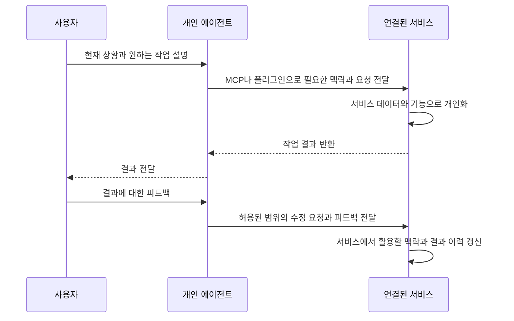

## TL;DR

- 비즈니스의 해자가 애플리케이션 레이어에서 데이터로 옮겨가고 있다.
- 에이전트가 여러 서비스를 이용하는 다음 웹 브라우저가 될 것이다.
- MCP나 플러그인으로 서비스의 데이터와 기능을 에이전트에 연결하려고 한다.

## 시작하며

최근 떠올린 ‘헤드리스 커뮤니티’ 아이디어는 이야기하는 사람마다 꽤 흥미로워했다. 그런데 “이게 돈이 안 될 것 같냐”고 물으면 아무도 선뜻 답하지 못했다. 나도 돈이 안 될 것 같아서 물어본 거긴 하다.

헤드리스 커뮤니티는 운영자가 사용자용 화면 대신 데이터와 기능을 제공하고, 사용자의 에이전트가 글을 골라서 보여주는 구상이다. 퇴근길에 Reddit에서 이해하기 어려운 댓글을 읽다가, 커뮤니티 글을 각자 자기 언어와 익숙한 방식으로 보면 좋겠다는 생각에서 시작했다.

Codex를 켜고 ALPS 방식으로 제품 요구사항 문서(PRD)를 작성한 뒤 구현해봤다. 요구사항이 단순해서 5시간 정도 만에 구현과 테스트까지 끝났고, 며칠 써보니 생각보다 그럴듯했다. 하지만 광고를 글과 함께 보내도 에이전트가 정리하면서 빼버릴 수 있고, 사람이 실제로 봤는지도 알기 어려워 비즈니스 모델(BM)이 애매했다.

그래서 프로젝트는 보류하고 BM을 조금 다르게 생각해봤다. 사용자를 가장 잘 아는 개인 에이전트와 연결된다는 점에서 수익을 만들 수 있지 않을까 싶었다. 내가 운영하는 영어 학습 서비스인 잉크버드(EncBird)에서 그 방식을 실험해볼 예정이다.

이 과정을 보면서 **에이전트가 강해질수록 비즈니스의 해자가 애플리케이션 레이어에서 데이터로 옮겨가고 있다**는 생각이 들었다. 화면과 기능을 만드는 일, 여러 서비스를 연결해 작업하는 일을 에이전트가 더 많이 맡는다면, 서비스를 구별하는 힘도 달라질 것이다.

## 1. 다음 웹 브라우저는 에이전트가 될 것이다

요즘 나는 옵시디언을 열어 직접 글을 쓰기보다 에이전트에게 글을 남기는 경우가 많다. 그러면 에이전트가 내용을 정리해 노트 폴더인 볼트에 저장해준다.

글을 입력하고 정리하는 일은 에이전트에게 맡기고, 옵시디언은 그 결과를 보관하고 확인하는 데 쓰고 있다.

웹 브라우저에서는 내가 사이트를 찾아 들어가고, 각 서비스가 정해둔 화면에서 일을 한다. 개인 에이전트에게 일을 맡기면 에이전트가 필요한 서비스를 찾아 호출하고 결과를 가져온다. 나는 그때마다 서비스의 화면과 사용법을 익히기보다, 에이전트에게 원하는 일을 설명한다.

브라우저가 여러 웹사이트에 들어가는 공통 입구였듯이, 에이전트가 여러 서비스를 이용하는 공통 입구가 될 것이라고 생각한다.

이런 작업을 지원하는 기능도 여러 제품에 들어와 있다. OpenAI의 dots는 대화와 메모리를 활용해 작업을 이어가고, 백그라운드 에이전트에게 일을 나눠줄 수 있다.[^1] Meta의 Muse는 연결된 앱과 브라우저에서 작업하고, 대화에서 파악한 선호와 정보를 이후 작업에 활용한다. 연결할 서비스와 접근 범위는 사용자가 정한다.[^2]

Claude Projects는 관련 자료와 지침을 모아두고 그 맥락 안에서 작업하는 공간을 제공한다. 일부 Claude Code Pro·Max 사용자에게 베타로 제공되는 새 Projects는 하나의 대화에서 요청한 일을 여러 작업으로 나눠 클라우드에서 진행한다. 각 작업에는 프로젝트의 파일, 저장소, 지침, 메모리가 전달된다.[^3]

필요한 도구를 직접 만드는 기능도 있다. Claude Artifacts에서는 대시보드나 작은 인터랙티브 도구를 만들고 대화로 수정할 수 있다. 지원되는 요금제의 웹·데스크톱 환경에서는 연결된 앱의 데이터를 읽고 쓰거나, 작업에 쓰는 데이터를 다음 사용 때까지 저장할 수도 있다.[^4]

자료를 모아두고 질문하는 데서 더 나아가, 그 자료를 다룰 도구를 만들고 실제 작업까지 수행할 수 있게 된 것이다.

## 2. 애플리케이션 레이어에서 데이터로 옮겨가는 해자

화면을 만들고, 자료를 정리하고, 여러 기능을 순서대로 실행하는 일은 기존에 애플리케이션 레이어가 맡던 역할이다. 에이전트가 이 일을 맡게 되면 서비스의 경쟁 우위인 해자도 달라질 것이라고 생각한다.

에이전트가 필요한 도구를 만들거나 기존 서비스의 기능을 조합해 일을 처리할 수 있다면, 잘 만들어둔 화면과 기능만으로 차이를 유지하기는 점점 어려워질 것이다. 반면 그 서비스가 실제 운영을 통해 쌓은 데이터까지 에이전트가 바로 만들어낼 수 있는 것은 아니다.

**어떤 데이터를 가지고 있고, 그 데이터로 어떤 결과를 만들 수 있는지가 서비스의 차이를 더 크게 만들 것 같다.**

초개인화는 그 변화를 생각해볼 수 있는 사례다. 사용자의 구체적인 상황과 목적을 알고 있다면, 같은 기능으로도 다른 결과를 만들어줄 수 있다.

예를 들어 영어 학습 서비스에서 “직장인이고 영어를 공부한다”는 정보만 있을 때와, “다음 주 고객 회의에서 기술을 설명해야 하고, 특정 표현을 반복해서 어려워한다”는 정보를 알고 있을 때 만들어줄 연습은 다를 것이다.

이런 맥락은 한 번의 가입 설문으로 충분히 알기 어렵다. 사용자가 무엇을 요청했고, 어떤 결과가 도움이 되었고, 무엇을 다시 고쳐달라고 했는지를 실제 사용 과정에서 쌓아야 한다. 기능을 비슷하게 만들어도 그 이력까지 바로 복제할 수는 없다.

예전에 챗봇과 사용자 데이터의 관계를 다룬 글에서도, 사용자의 구체적인 요구를 파악하고 다음 결과에 반영하는 선순환을 이야기했다.[^7] 그때는 서비스 안에 챗봇을 두고 맥락을 쌓는 쪽을 생각했다.

그런데 요즘 내가 가장 많이 머무는 서비스는 ChatGPT와 Codex다. 내가 하는 일과 관심사, 고민을 자주 이야기하다 보니 나에 대한 정보도 그쪽에 많이 쌓여 있다고 느낀다. 사용자의 맥락이 개인 에이전트에 모인다면, 서비스마다 같은 정보를 처음부터 다시 입력하게 하는 방식도 다시 생각해볼 필요가 있다.

## 3. 데이터와 기능을 에이전트에 연결하기

사용자의 맥락이 개인 에이전트에 모이고, 서비스 이용도 그곳에서 시작된다면 서비스는 에이전트가 직접 사용할 수 있는 형태로 제공되어야 한다고 생각한다.

그 방법으로 MCP나 플러그인을 생각하고 있다. MCP(Model Context Protocol)는 에이전트와 외부 도구·데이터를 연결하는 규약이고, 플러그인은 해당 에이전트 환경에 기능과 사용 방법을 추가하는 방식이다. 서비스가 어떤 일을 할 수 있고 어떤 입력이 필요한지 에이전트에 알려주면, 사용자의 요청을 처리할 때 그 기능을 이용할 수 있다.

Notion은 MCP를 통해 외부 에이전트가 페이지를 검색하고, 읽고, 만들고, 수정하는 기능을 제공한다.[^5] 사용자가 에이전트에게 일을 요청해도 데이터는 Notion에 남고, 접근 범위도 연결한 사용자의 권한을 따른다.

내가 옵시디언을 사용하는 방식도 비슷하다. 에이전트가 글을 정리해주지만 결과는 여전히 볼트에 저장된다. 사용자와 직접 만나는 도구가 에이전트로 바뀌어도, 데이터를 보관하고 기능을 제공하는 서비스의 역할은 남는다.

서비스가 필요한 맥락을 전달받아 개인화된 결과를 만들 수도 있고, 에이전트가 서비스의 데이터를 받아 자신이 가진 맥락으로 선택하고 정리할 수도 있다. 처음 구상한 커뮤니티의 번역과 추천은 후자에 가깝다.

다만 MCP를 연결한다고 사용자의 전체 대화나 메모리를 서비스가 가져오는 것은 아니다. MCP의 공식 아키텍처도 전체 대화는 에이전트가 실행되는 앱 쪽에 두고, 서버에는 필요한 맥락만 전달하는 구조를 설명한다.[^6] 어떤 맥락을 활용할 수 있는지는 플랫폼의 기능과 사용자 권한, 실제 도구 호출에 따라 달라진다.

앞의 영어 학습 예시라면 고객 회의를 준비한다는 목적과 연습할 표현을 기능의 입력으로 받는 식이다.

서비스 쪽에서 개인화한다면 다음과 같이 구성할 수 있다.





연결된 서비스가 맡은 작업의 결과와 피드백을 허용된 범위에서 축적하면, 서비스에도 그 업무에 필요한 개인화 데이터가 쌓일 수 있다. 개인 에이전트가 사용자의 넓은 맥락을 가지고, 서비스는 자기 분야에서 어떤 결과가 도움이 되었는지 학습하는 구상이다.

## 4. 잉크버드에서 실험해볼 UX와 BM

잉크버드에서는 사용자가 화면과 학습 흐름 같은 사용자 경험(UX)을 직접 만들어 쓰는 방식도 고려하고 있다. 앞서 헤드리스 커뮤니티를 구상할 때도, 공개된 API와 MCP를 이용해 각자 엑셀이나 사내 포털처럼 원하는 화면을 만들 수 있겠다고 생각했다.[^8]

잉크버드가 데이터와 학습 기능을 제공하면, 사용자는 에이전트와 함께 자신에게 맞는 화면과 학습 흐름을 만드는 것이다. 예를 들어 표현을 표로 모아 보는 화면을 만들 수도 있고, 한 번에 하나씩 연습하는 화면을 만들어 쓸 수도 있다.

BM은 이런 기능들을 MCP나 플러그인으로 제공하고, 그중 사용자 맥락을 활용해 추가 가치를 만드는 기능에 과금하는 방식으로 생각하고 있다.

모든 기능을 유료로 만들 필요는 없다. 무료 기능으로 서비스를 연결할 이유를 만들고, 한두 가지 초개인화 기능을 유료로 제공하는 형태를 생각하고 있다.

다만 에이전트가 무료로 받은 자료를 정리하는 것만으로 충분하다면, 사용자가 서비스에 추가로 돈을 낼 이유는 없다. 유료 기능에는 서비스가 가진 데이터와 기능이 사용자의 맥락과 만났을 때 생기는 이점이 있어야 한다.

이를 위해서는 서비스가 제공할 데이터와 기능, 에이전트에서 전달받아야 할 맥락, 그 맥락이 있을 때 달라지는 결과를 나눠서 설계해야 한다. 사용자의 피드백을 어떤 데이터로 남기고 다음 결과에 반영할지도 함께 생각해야 한다.

잉크버드에서 먼저 확인하려는 것은 실제로 전달받을 수 있는 맥락의 범위와, 그 맥락을 활용해 달라진 결과에 사용자가 돈을 낼 의사가 있는지다. 유용한 기능으로 연결을 시작하고, 반복해서 쓸수록 개인화가 나아지는 방향으로 실험해보고 싶다.

## 마치며

에이전트가 더 많은 일을 맡게 될수록, 서비스가 제공하던 화면과 기능의 일부도 에이전트 쪽으로 옮겨갈 것이라고 생각한다. 그 과정에서 비즈니스의 해자는 애플리케이션 레이어보다 서비스가 쌓고 활용하는 데이터 쪽으로 이동하고 있다.

사용자가 여러 서비스를 이용하는 다음 웹 브라우저도 에이전트가 될 것 같다. 그렇다면 서비스를 만드는 입장에서는 웹사이트에 사용자를 데려오는 것과 함께, 에이전트가 우리 데이터와 기능을 사용할 수 있게 연결하는 방식을 고민해야 한다.

잉크버드에서는 MCP나 플러그인으로 데이터와 학습 기능을 제공하고, 사용자가 자기 UX를 만들어 쓰는 방식까지 실험해보고 싶다. 그 과정에서 사용자 맥락을 활용한 개인화가 어떤 가치를 만드는지 확인해보려고 한다.

---

[^1]: [OpenAI dots — Tasks and memory](https://learn.chatgpt.com/docs/dots/tasks-and-memory)
[^2]: [Meta — Introducing Muse](https://about.fb.com/news/2026/09/introducing-muse-personal-ai-agent/)
[^3]: [Claude — What are projects?](https://support.claude.com/en/articles/9517075-what-are-projects)
[^4]: [Claude — What are artifacts and how do I use them?](https://support.claude.com/en/articles/17153992-what-are-artifacts-and-how-do-i-use-them)
[^5]: [Notion MCP](https://developers.notion.com/docs/mcp)
[^6]: [MCP 공식 아키텍처](https://modelcontextprotocol.io/specification/latest/architecture)
[^7]: [왜 당신의 비즈니스는 지금 챗봇을 시작해야 하는가](/2025/06/03/why-your-business-should-start-your-own-chatbot-now.html)
[^8]: [헤드리스 커뮤니티 구상 — LinkedIn](https://www.linkedin.com/feed/update/urn:li:activity:7510882185231581184/)
