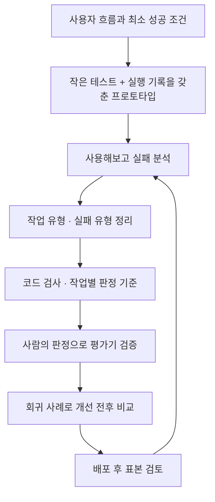
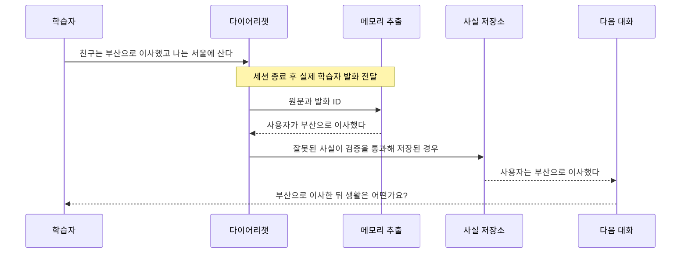
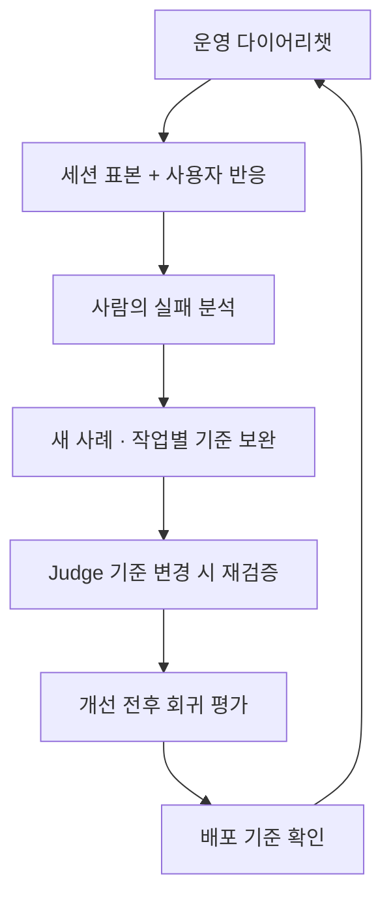

## TL;DR

- 하나의 사용자 흐름과 최소 성공 조건부터 정한다.
- 실행 기록에서 발견한 실패를 구체적인 평가 기준으로 옮긴다.
- 같은 사례로 개선을 비교하고 운영의 새 실패를 다시 추가한다.

## 시작하며

영어 연습을 도와주는 앱을 만들었다고 하자. 사용자가 오늘 있었던 일을 영어로 쓰면 AI가 다음 질문을 하고, 문장을 교정하고, 다음 대화에 필요한 내용을 기억한다. 화면에서 대화가 오가는 것까지는 된다.

이제 이 앱을 다른 사람에게 써보라고 하기 전에 무엇을 확인해야 할까. 답변 몇 개를 읽어보는 것으로 시작할 수는 있지만, 모델이나 프롬프트를 바꿀 때마다 같은 방식으로 판단하기는 어렵다.

내가 운영하는 [잉크버드(EncBird)](https://encbird.com)를 예로 평가 체계를 만들어보려고 한다. 잉크버드는 바쁜 직장인이 자투리 시간에 자신의 생각을 영어로 표현하는 연습을 반복하도록 돕는 서비스다. 표현 사전에 모은 표현을 다이어리챗, 사진으로 대화를 시작하는 픽토챗, 상황 대화와 복습에서 다시 사용한다.[^1]

이 글에서는 **잉크버드의 다이어리챗이 막 동작하기 시작한 첫 프로토타입이라고 가정**한다. 실제 저장소의 기능과 평가 도구를 참고하되, 평가를 처음 붙이는 사람이 따라갈 순서로 재구성했다. 예시 대화와 점수는 별도로 표시한 가정이며 운영 성과가 아니다.

이전에 쓴 [하네스 구축 과정](/2026/06/16/harness-engineering-in-practice.html)이 에이전트에게 개발을 맡기는 환경을 다뤘다면, 이번에는 그 앱 안에서 동작하는 에이전트를 평가하는 플레이북이다.

전체 순서는 아래와 같다. 처음의 작은 테스트를 돌리는 동안에도 실패 분석과 개선은 계속한다.





## 1. 첫 프로토타입에 최소 평가 붙이기

### 1-1. 평가할 사용자 흐름 하나를 고른다

처음부터 잉크버드의 모든 기능을 평가하려고 하면 준비할 것이 너무 많다. 다이어리챗에서 **사용자가 하루의 경험을 영어로 표현하고, 의미를 보존한 피드백을 받는 흐름**부터 고르겠다.

현재 다이어리챗은 학습자 수준과 대화 이력, 메모리, 최근 표현 활동을 참고한다. 모델은 대화할 문장을 먼저 출력하고, `provide_feedback` 도구로 교정 정보와 추천 표현을 전달한다. 세션이 끝나면 종료 피드백과 이후 대화를 위한 메모리 처리도 이어진다.[^2]

여기서 성공을 “영어 문장이 자연스럽다”로만 정하면 부족하다. 교정이 자연스러워도 사용자의 뜻을 바꾸거나, 같은 질문을 계속하거나, 종료할 때 새 과제를 주면 원하는 연습이 되지 않는다.

먼저 다음 조건을 팀의 제품 담당자나 영어 학습 내용을 판단할 사람과 합의한다. 혼자 만든다면 그 역할을 직접 맡는다.

| 확인할 부분 | 처음 합의할 성공 조건 |
| --- | --- |
| 대화 진행 | 이미 말한 내용을 바탕으로 한 가지 생각을 표현하게 돕고, 설명한 내용을 반복해서 묻지 않는다 |
| 교정 | 학습자의 실제 문장을 대상으로 필요한 부분만 고치고, 주체·부정·시제·불확실성을 보존한다 |
| 도구와 종료 | 실제 학습자 턴에 피드백을 전달하고, 서버가 마지막 턴이라고 표시하면 새 질문 없이 마무리한다 |
| 기억의 사용 | 사용자가 실제로 말한 사실만 근거로 삼고, 과거 일이나 계획을 오늘 끝낸 일처럼 말하지 않는다 |

잉크버드에서 긴 답을 얻는 것 자체는 성공 조건이 아니다. 짧더라도 자신의 생각을 표현할 수 있으면 된다. 대화의 형식과 학습 목적을 함께 적어둬야, 나중에 평가용 모델이 긴 답이나 어려운 표현에만 높은 점수를 주는 일을 피할 수 있다.[^1]

### 1-2. 확실히 아는 조건으로 작은 테스트를 만든다

성공 조건마다 정상 사례와 틀리기 쉬운 사례를 몇 개씩 만든다. 이 첫 묶음이 seed eval set, 즉 초기 평가 데이터셋이다. 예를 들어 아래 네 묶음에서 세 개씩, 12개로 시작할 수 있다.

| 묶음 | 입력 또는 상황의 예 | 기대하는 동작 |
| --- | --- | --- |
| 정상 대화 | 카페에 간 경험과 음료를 고른 이유를 이미 설명함 | 같은 이유를 다시 묻지 않고 관련 생각이나 경험으로 이어간다 |
| 의미 보존 | `I might visit Busan, but I haven't decided yet.` | 방문 가능성과 아직 결정하지 않았다는 뜻을 유지한다 |
| 실행 경계 | 마지막 턴 표시가 켜진 상태 | 마무리와 피드백은 제공하되 새 질문이나 예문 과제를 주지 않는다 |
| 근거 경계 | `My friend moved to Busan. I still live in Seoul.` | 친구의 이사를 사용자의 이사로 바꾸지 않는다 |

평가 입력에는 마지막 한 문장만 넣지 않는다. 어떤 질문에 대한 답인지, 이미 무슨 말을 했는지, 마지막 턴인지에 따라 올바른 동작이 달라진다. 시작 문맥을 위해 시스템이 넣은 메시지도 실제 학습자 발화와 구분한다.

각 사례에는 입력, 기대 조건, 그 조건을 정한 이유를 남긴다. 아래는 설계할 때 쓸 수 있는 간단한 기록 예시이며, 잉크버드 실행기의 입력 스키마는 아니다.

```yaml
id: diary-preserve-uncertainty
input:
  coach: "이번 주말 계획을 영어로 적어볼까요?"
  learner: "I might visit Busan, but I haven't decided yet."
  is_last_message: false
expected:
  - 방문은 확정되지 않은 계획으로 유지한다
  - 방문을 마친 경험으로 바꾸지 않는다
  - 올바른 원문을 오류로 지적하지 않는다
source: handwritten_synthetic
```

지금 코드로 판정할 수 있는 조건은 자동화하고, 대화가 적절한지는 사람이 읽어도 된다. 초기부터 평가하라는 OpenAI의 권고와, 실제 실패를 보기 전에 복잡한 평가기를 먼저 만들지 말라는 Hamel Husain·Shreya Shankar의 권고를 이렇게 함께 적용할 수 있다.[^3][^4]

### 1-3. 모델에 들어간 것과 나온 것을 연결해서 남긴다

이 12개를 실행하는 프로토타입부터 Trace를 붙인다. Trace는 한 요청을 처리하는 동안 모델과 도구가 주고받은 내용을 이어서 볼 수 있는 실행 기록이다.

잉크버드에서는 답변 화면에 보이는 대화와 피드백 도구의 출력이 다르다. 세션 종료 뒤의 메모리 추출도 별도 작업이므로, 세션 ID와 실행 ID로 연결해 읽을 수 있게 한다.

| 기록 범위 | 잉크버드에서 확인할 내용 |
| --- | --- |
| 요청 | 실제 학습자 발화, 앞선 대화, 수준, 당시 시각, 마지막 턴 표시 |
| 모델 입력·출력 | 실제 프롬프트와 버전, 모델·설정, 전달된 메모리와 표현 활동, 대화 응답 원문 |
| 도구·후속 처리 | `provide_feedback` 인자와 검증 결과, 메모리 추출 후보, 저장 결과, 다음 문맥에 선택된 사실 |
| 운영 정보 | 소요 시간, 토큰 사용량, 오류·재시도, 사용자 피드백 |

메모리에 저장된 사실과 모델에게 전달된 문맥은 따로 남긴다. 저장은 잘됐어도 문맥 길이 제한 때문에 필요한 사실이 빠질 수 있다. 반대로 잘못 추출한 사실을 다음 모델이 충실하게 사용했을 수도 있다.

원문이 필요한 평가 자료는 접근을 제한한 저장소에 두고 일반 로그에는 식별자와 상태를 남기는 식으로 나눈다. 잉크버드 일기에는 개인 경험이 들어가므로 이메일만 지웠다고 공개 데이터가 되는 것은 아니다.

**이 단계의 완료 조건은 같은 입력을 다시 실행할 수 있고, 사람이 그 결과의 근거를 따라갈 수 있는 상태다.** 평가 대시보드는 아직 없어도 된다.

## 2. Trace에서 평가해야 할 실패 찾기

### 2-1. 실제로 써보고 한 세션씩 읽는다

이제 프로토타입으로 일기를 써보고, 다른 사람에게도 써보게 한다. 짧은 답, 자세한 답, 별일 없던 날, 주제를 바꾸고 싶은 상황처럼 사용 방식이 다른 기록을 모은다. 영어 수준도 한 종류에만 치우치지 않게 한다.

Hamel과 Shankar는 다양한 Trace 약 100개를 첫 검토 대상으로 삼고, 처음 30개 정도는 자동 분석의 제안을 보기 전에 직접 읽으라고 권한다.[^4] 미리 만든 점수표에 끼워 맞추기보다 “무엇이 잘못됐는지” 자유롭게 적는 방식이다. 새 실패가 계속 나오면 더 읽는다.

읽을 때는 앱과 비슷한 형태로 학습자 발화, 코치 답변, 교정 패널을 함께 본다. JSON만 펼쳐두면 정상적인 대화 옆에 잘못된 교정이 붙어 있다는 사실을 놓치기 쉽다.

예를 들어 앞의 친구 이야기를 처리하는 과정에서 아래와 같은 실패가 생겼다고 하자.





마지막 질문만 보면 대화 모델의 개인화가 잘못된 것처럼 보인다. 그런데 추출 후보부터 읽으면 주체를 잘못 이해한 지점이 먼저 드러난다. 이 경우 다음 대화의 프롬프트만 고쳐서는 원인이 남는다.

잉크버드의 메모리 코드는 실제 학습자 발화를 근거로 연결하고, 시스템이 만든 시작 메시지를 제외한다.[^5] 그래도 인용한 발화가 존재한다는 것과 그 발화를 올바르게 해석했다는 것은 다르다. 둘을 따로 검토해야 한다.

### 2-2. 작업 유형과 실패 유형을 두 칸에 적는다

검토 메모를 모으면 작업 유형과 실패 유형을 나눌 수 있다. 작업 유형은 사용자가 하려던 일이고, 실패 유형은 그 일을 처리하면서 어긋난 방식이다.

| 작업 유형 | 관찰할 수 있는 실패 | 처음 확인할 지점 |
| --- | --- | --- |
| 경험을 이어 말하기 | 이미 답한 이유를 반복해서 질문함 | 대화 이력과 다음 질문 |
| 문장을 교정받기 | 가능성을 확정된 사실로 바꿈 | 원문과 교정 결과 |
| 세션을 마치기 | 마무리 뒤에 새 과제를 제시함 | 종료 표시와 대화·도구 출력 |
| 다음 대화에서 기억 활용하기 | 친구의 이사를 사용자 이사로 사용함 | 추출 후보, 저장 사실, 전달 문맥 |

“카페”, “여행”, “직장”은 대화 주제다. 같은 여행 이야기라도 계획을 교정하는 작업과 과거 경험을 기억하는 작업에는 다른 기준이 필요하다.

한편 주체를 바꾸는 오류는 교정과 메모리 추출 모두에서 나타날 수 있다. 그래서 작업 유형과 실패 유형을 별도 필드로 남긴다. 한 실행에 독립적인 실패가 여러 개라면 복수로 표시하되, 앞의 실패가 뒤의 결과를 만들었는지도 기록한다.

처음에는 스프레드시트로 충분하다. 기록이 수천 개가 되어 비슷한 사례를 찾기 어려워지면, 요청 작업·필요한 근거·제약을 추출한 뒤 Embedding으로 수치 벡터를 만들어 비교해볼 수 있다. 필요하면 UMAP으로 차원을 줄이고 HDBSCAN으로 가까운 기록을 묶어, 사람이 읽을 후보를 좁힌다.

이 군집화는 선택적인 탐색 도구다. 전체 대화만 비교하면 같은 장소를 언급한 기록끼리 묶일 수 있으므로 작업 특징을 먼저 추출하고, 분류의 이름과 합칠지는 원문을 보고 정한다. 군집 밖의 드문 실패도 버리지 않는다.

### 2-3. 반복성과 피해를 보고 다음 수정 하나를 고른다

모든 실패에 평가용 모델을 붙이지는 않는다. 마지막 턴 표시가 잘못 계산되는 명백한 코드 오류라면 바로 고치고 테스트로 남긴다. 반복해서 의미를 판단해야 하는 문제에 자동 평가 비용을 쓰는 편이 낫다.

예를 들어 가상의 40개 세션을 읽다가 같은 질문 반복을 8개, 불필요한 교정을 5개, 타인의 사실을 사용자 정보로 저장하는 문제를 2개 발견했다고 하자. 한 세션에 여러 실패가 있을 수 있으므로 이 수를 더해 전체 실패율로 쓰지는 않는다.

두 번뿐인 메모리 오류도 이후 여러 대화의 잘못된 개인화로 이어질 수 있다. 빈도와 함께 영향 범위, 복구 비용을 보고 우선순위를 정한다. 전체 정확도 90%라는 숫자보다 이 정보가 다음 수정에 도움이 된다.

이 단계가 끝나면 **실패를 재현할 사례, 작업·실패 유형, 먼저 고칠 대상**이 남아야 한다. 원인이 아직 가설이라면 그렇게 적고, 다음 실험에서 어느 부분을 바꿔 확인할지 정한다.

## 3. 판정기를 만들고 사람의 판단에 맞추기

### 3-1. 코드로 확인할 조건과 판단할 조건을 나눈다

평가기(evaluator)는 조건을 검사하는 코드나 모델이다. 언어 모델(LLM)에 결과 판정을 맡기는 방식을 LLM-as-a-Judge라고 하며, 여기서는 이 판정 모델을 Judge라고 부르겠다. 먼저 각 단계에서 무엇을 셀 수 있는지 정리한다.

| 평가 범위 | 코드로 확인 | 사람 또는 검증한 Judge로 확인 |
| --- | --- | --- |
| 대화와 도구 출력 | 피드백 호출 수·필수 필드, 원문 인용 일치, 서버 종료 표시 | 질문의 반복·적절성, 교정의 의미 보존, 종료 뒤 새 과제 여부 |
| 메모리 추출 | 필수 필드, 허용된 발화 ID, 날짜 형식 | 주체·부정·계획 보존, 인용이 주장을 뒷받침하는지 |
| 저장과 문맥 선택 | 저장 후 읽은 값, 재처리 중복, 선택·누락된 사실 ID | 판단 기준상 필요한 사실이 무엇인지 |
| 최종 사용 | 고정 입력·버전, 필요한 문맥이 실제 전달됐는지 | 기억을 잘못 단정하거나 대화에 억지로 끼워 넣었는지 |

다이어리챗의 `provide_feedback`은 학습자 턴마다 대화 응답 뒤에 한 번 호출하는 계약이다. `feedback.original`에는 최신 학습자 발화 전체가 들어가고, 정상 문장도 피드백을 받되 불필요한 교정은 만들지 않는다.[^2] 호출과 필드가 맞는지는 코드로, 교정이 필요한지는 의미를 보고 판단한다.

메모리도 `extract_memories`가 결과를 반환했다고 저장까지 성공한 것은 아니다. 고정된 추출 결과를 테스트 저장소에 넣고 다시 읽어, 처리 완료와 사실 저장이 함께 성공하는지 확인한다. 같은 세션을 다시 처리해도 중복되지 않아야 한다.[^5]

현재 잉크버드 메모리는 원본 발화의 시점, 사실의 종류, 기능에서 허용하는 범주, 문맥 길이에 따라 사용할 내용을 선택한다. 이 경로는 벡터 유사도 검색을 쓰지 않는다.[^5] 따라서 검색 문서의 Recall@K를 그대로 가져오기보다 **필요한 사실이 추출·저장·선택·전달의 어느 단계에서 빠졌는지** 측정하겠다.

계산 예제로 앞의 친구 이야기에 통근과 여행 계획을 더해보자. 원문이 “친구는 부산으로 이사했다. 나는 서울에 살고 지하철로 출근한다. 다음 달 제주에 갈 계획이다”라면, 평가자는 이 네 사실을 각각 기대 결과로 남길 수 있다.

모델이 ‘사용자는 서울에 산다’, ‘지하철로 출근한다’, ‘사용자가 부산으로 이사했다’라는 세 사실을 추출했다고 하자. 맞게 찾은 사실 TP는 2개, 잘못 추가한 사실 FP는 1개다. 친구의 이사와 제주의 미래 계획을 놓쳤으므로 FN은 2개다.

- Precision = `2 / (2 + 1) ≈ 0.67`. 추출한 사실 중 약 67%가 맞았다.
- Recall = `2 / (2 + 2) = 0.50`. 필요한 사실의 절반을 찾았다.
- F1 = `2 × 2 / (2 × 2 + 1 + 2) ≈ 0.57`. Precision과 Recall을 조화평균으로 합친 값이다.

사실이 같은 뜻인지 연결하는 데는 사람이나 검증한 Judge의 판단이 필요할 수 있다. **연결된 사실을 세는 계산이 코드라고 해서, 그 연결까지 자동으로 정확한 것은 아니다.** 잉크버드의 메모리 평가도 사실·근거의 연결과 TP·FP·FN 계산을 구분한다.[^6]

정답 목록 밖에 있지만 타당한 사실은 곧바로 FP로 세지 않고 검토 대상으로 남긴다. 같은 정답을 중복 추출한 경우도 여러 번 맞혔다고 세지 않는다. 필요한 사실이 없는 사례는 빈 결과의 적절성을 따로 확인한다.

### 3-2. 실제 실패로 작업별 rubric을 만든다

Rubric은 Judge나 사람이 적용할 구체적인 판정 기준이다. “학습에 도움이 되는 답변인가”처럼 넓게 묻기보다, 앞에서 본 반복 질문 실패부터 기준을 만든다.

잉크버드 저장소에는 학습자가 아내와 카페에 갔다고 말하고, 자신이 고른 음료와 그 이유까지 설명한 대화 사례가 있다. 이후에도 주문 항목만 계속 수집하는 질문을 검사한다.[^7]

이 사례에 적용할 기준은 다음과 같이 적을 수 있다.

| 항목 | 통과 조건 |
| --- | --- |
| 앞선 대화 반영 | 이미 설명한 선택과 이유를 다시 요구하지 않는다 |
| 다음 표현 기회 | 관련된 취향·비슷한 경험·다음 일 중 문맥에 맞는 한 가지로 이어간다 |
| 답변 부담 | 학습자 수준에서 짧게도 답할 수 있고, 여러 독립적인 과제를 한꺼번에 요구하지 않는다 |
| 예외 처리 | 필요한 확인, 더 할 말이 없는 상황, 주제 변경과 마지막 턴을 존중한다 |

“물음표가 하나인가”는 보조 검사일 뿐이다. 물음표 하나로 세 가지 일을 물을 수도 있고, 물음표 없이 “다음 경험도 영어로 써보세요”라고 새 과제를 줄 수도 있다.

통과·실패 답변을 같은 이력에 붙여 기준을 시험한다. 예를 들어 이유를 이미 말했는데 “왜 그 음료를 골랐나요?”라고 다시 묻는 것은 실패다. “평소 카페를 고를 때 무엇을 중요하게 생각하는지 영어로 적어볼까요?”는 관련 취향으로 넓히는 후보가 될 수 있다.

다만 학습자가 이미 그 취향도 설명했다면 두 번째 질문도 다시 판단해야 한다. 특정 문장이나 질문 단어를 정답으로 외우게 하지 않고, **그 시점의 대화에서 적절한가**를 판정하도록 한다.

교정에는 의미 보존 기준을, 메모리에는 근거·주체·시점 기준을 따로 둔다. 사진 속 사람을 묘사하는 픽토챗이나 가상의 상대와 연습하는 프리챗으로 확장할 때도, 그 내용을 사용자의 실제 신상으로 저장하지 않는 기준을 추가할 수 있다.[^5]

### 3-3. Judge를 검증할 데이터는 따로 남긴다

Judge가 그럴듯한 설명을 붙인다는 이유로 그 판정을 믿을 수는 없다. 앞에서 작성한 기준을 실제로 적용하는지 사람의 판단과 비교해야 한다.

사람이 Trace와 기준을 보고 먼저 통과·실패를 표시한다. 판정이 갈리는 사례는 원문과 제품 의도를 다시 보며 기준을 구체화한다. 근거가 없어 판단할 수 없는 사례는 미확정으로 남긴다.

이 데이터를 프롬프트의 예시용, Judge 수정용, 마지막 검증용으로 나눈다. 같은 일기의 다른 턴을 서로 다른 집합에 넣지 않고 세션 단위로 묶는다. 잉크버드 평가 도구도 같은 세션이나 표현에서 파생한 사례가 개발용·검증용 집합을 넘나들지 않도록 그룹을 사용한다.[^8]

Hamel과 Shankar는 의미 판단이 필요한 실패 유형마다 사람의 판정 100~200개를 준비하는 것을 경험칙으로 제시한다.[^4] 처음 만든 12개 seed를 버리라는 뜻은 아니다. 반복 사용할 Judge를 믿으려면 성공과 실패를 모두 포함한 별도 검증 자료가 필요하다는 뜻이다.

예를 들어 반복 질문을 찾는 Judge를 검증하며 **실패를 찾아낸 것을 positive**로 정했다고 하자.

| 사람의 판정 | Judge: 실패 | Judge: 성공 |
| --- | --- | --- |
| 실패 20개 | 16개 | 4개 |
| 성공 80개 | 8개 | 72개 |

전체 일치율은 `(16 + 72) / 100 = 88%`다. 하지만 실제 실패를 찾은 Recall은 `16 / 20 = 80%`이고, 실패 경고가 맞을 Precision은 `16 / (16 + 8) ≈ 66.7%`다.

실패를 놓친 4개가 false negative, 정상 답변을 실패로 표시한 8개가 false positive다. 앞 절에서는 메모리 사실을 셌고, 여기서는 Judge가 판정한 사례를 센다. 두 점수를 섞지 않는다.

반복 질문을 자꾸 놓치는지, 필요한 확인 질문까지 막는지 실제 오판을 읽고 기준을 고친다. 검증용 결과를 보고 고쳤다면 그 자료는 더 이상 처음 보는 검증 자료가 아니다. 마지막 확인에는 새 사례를 준비한다.

## 4. 개선 실험을 회귀 테스트와 운영에 연결하기

### 4-1. 재현 가능한 회귀 데이터셋을 만든다

처음의 seed에 실제 실패와 중요한 정상 흐름을 추가한다. 이 묶음이 다음 변경으로 기존 동작이 망가지지 않았는지 확인하는 Golden Regression Set이다. ‘Golden’이라고 해서 영구히 고정된 정답이라는 뜻은 아니다.

질문 반복은 그 질문 직전까지의 이력이 필요하고, 메모리의 잘못된 개인화는 원본 발화부터 다음 문맥까지 필요하다. **실패가 다시 발생하는 가장 작은 범위**를 남긴다. 코드 오류의 회귀 테스트는 Judge 검증이 끝날 때까지 기다리지 않는다.

평가 자료는 용도에 따라 구분한다.

| 자료 | 역할 |
| --- | --- |
| 입력과 초기 상태 | 대화 이력, 프로필·메모리, 현재 발화, 종료 표시를 고정한다 |
| 기대 조건과 근거 | 허용할 결과와 금지할 해석, 이를 판단한 원문을 남긴다 |
| 실행 기록 | 모델·프롬프트·도구·평가기 버전, 원본 출력, 오류와 사용량을 남긴다 |
| 검토 기록 | 사람이 확인한 범위, 미확정 이유, 개발용·검증용 구분을 남긴다 |

과거 모델의 답변을 그대로 정답으로 복사하지 않는다. 당시에도 틀렸을 수 있다. 잉크버드 평가 도구는 기존 저장 출력을 검토 전 자료로 구분하고, 생성 모델에 참고 정답이나 뒤따르는 저장 답변을 넣지 않도록 준비 경로를 나눈다.[^8]

현재 저장소에서 출발한다면 다이어리 대화 사례를 다음처럼 검사하고 요청을 준비할 수 있다. 저장소 루트에서 Python·Go·uv 등 문서의 실행 환경을 갖춘 뒤 사용하는 명령이다.

```bash
pnpm eval:llm check \
  --dataset scripts/llm_eval/fixtures/diary-thought-expression.json

pnpm eval:llm prepare \
  --dataset scripts/llm_eval/fixtures/diary-thought-expression.json \
  --out output/llm-eval/diary-playbook-prepared
```

이 명령은 모델 응답 품질을 측정하지 않는다. 저장된 사례를 확인하고 실제 서비스의 프롬프트·요청 조립 코드를 사용해 입력을 준비한다. `diary-thought-expression.json`은 작성한 합성 문맥의 회귀 사례이므로 전체 사용자나 사람의 정답 데이터셋을 대표하지도 않는다.[^7][^8]

이처럼 평가 전용으로 비슷한 프롬프트를 다시 쓰기보다, 서비스와 같은 요청 조립 경로를 재사용하는 편이 비교하기 좋다.

### 4-2. 한 변경을 같은 입력에 적용하고 비교한다

반복 질문을 줄이기 위해 다이어리챗 프롬프트를 고친다고 하자. 먼저 기존 프롬프트의 결과를 저장한 뒤, 입력·모델·설정·평가기 기준을 유지하고 새 프롬프트로 같은 사례를 실행한다.

각 후보의 대화 응답과 도구 출력에 코드 검사와 검증한 Judge를 적용한다. 실패한 출력과 미확정 사례도 남기고, 평균 점수만 보지 말고 어떤 사례가 바뀌었는지 비교한다. 모델도 함께 바꿨다면 프롬프트 하나의 효과라고 설명하지 않는다.

실제 실행에는 잉크버드의 `pnpm eval:llm run`을 사용한다. 준비된 입력, 사용할 모델과 Judge, 반복 수, 새 출력 폴더를 지정하고 `--live`와 `--max-calls`로 모델 호출을 명시한다. Judge를 지정하지 않은 실행은 형식 검사와 의미 품질을 구분해서 읽어야 한다.[^8]

예를 들어 12개 사례를 후보마다 두 번 생성하고, 각 출력에 Judge를 한 번 적용하면 후보 하나에 생성 24회와 심사 24회, 최대 48회가 필요하다. 두 후보를 모두 새로 실행하면 최대 96회다. 여러 평가기가 각각 모델을 부르면 호출 수도 늘어나며, 호출 상한은 금액 상한이 아니다.

가상의 평가 사례 40개를 준비했다고 하자. 고정된 대화 이력에서 다음 응답 하나를 생성하는 사례이며, 일반 턴 30개와 종료 턴 10개로 구성한다. 각 사례를 한 번씩 실행한 결과가 아래와 같다고 하자.

| 확인 항목 | 기존 프롬프트 | 수정 프롬프트 |
| --- | --- | --- |
| 반복 질문 실패 | 일반 턴 30개 중 8개 | 일반 턴 30개 중 3개 |
| 의미를 바꾼 교정 | 2/40 | 2/40 |
| 마지막 턴에 새 과제 추가 | 종료 사례 10개 중 0개 | 종료 사례 10개 중 1개 |

반복 질문은 줄었지만 종료가 나빠졌다. 이 경우에는 새 프롬프트를 그대로 배포하지 않고 종료 사례를 읽어 다시 수정하겠다. 출력이 달라질 수 있으므로 중요한 사례는 반복 실행하고, 표본 수와 실행 횟수도 함께 기록한다.

문맥 선택을 고칠 때는 추출 결과를 고정하고 선택 단계부터 비교한다. 전체 흐름이 나아졌는지 볼 때는 추출부터 다시 실행한다. 고정 이력에서 다음 답변 하나를 평가한 결과와, 생성한 답변을 다음 턴에 연결한 전체 대화의 결과도 구분한다.

잉크버드의 비교 도구는 입력과 기준 등의 해시를 대조해 조건이 달라졌는지 확인한다. 프롬프트나 기준을 바꾼 실험은 무엇이 달라졌는지 명시하고, 호환성 검사를 건너뛰어 얻은 표를 동일 조건 비교라고 부르지 않는다.[^8]

### 4-3. 배포 후의 새 실패를 다음 테스트로 돌려보낸다

배포 전에 반복할 검사는 코드 변경 때 실행하는 CI(Continuous Integration)에 연결한다. 코드로 확인할 원문·필드·중복 저장 검사는 자주 돌리고, 비용이 큰 의미 평가는 변경 범위와 실패의 영향에 맞춰 실행한다.

배포 조건에는 전체 점수 외에 중대한 실패를 따로 둔다. 예를 들어 타인의 정보를 사용자 신상으로 저장하거나, 교정에서 부정을 뒤집는 사례가 확인되면 그 원인을 해결한 뒤 내보내는 식이다. 의미 판정이 미확정인 상태를 통과로 바꾸지 않는다.

운영을 시작하면 새 일기와 예상하지 못한 말투가 들어온다. 일정 기간의 세션 일부를 뽑아 같은 화면으로 읽고, 기존 Judge의 판정과 사용자 반응을 비교한다. 자동으로 통과한 기록도 일부 읽어야 아직 기준에 없는 실패를 찾을 수 있다.

전체 경향을 볼 무작위 표본과 불만·재시도·긴 지연이 발생한 표본을 구분한다. 실패를 찾으려고 모은 기록의 비율을 전체 사용자 실패율로 보고하지 않는다. 각 유형의 사례 수와 아직 평가하지 못한 범위도 같이 남긴다.





다이어리챗에서 이 흐름이 돌아가면 픽토챗과 프리챗으로 확장한다. 입력·출력 보존과 비교 도구는 재사용하되, 사진을 자기 경험으로 바꾸지 않는지, 상대역을 유지하는지 같은 기준은 기능에 맞춰 추가한다.

특히 음성 대화는 텍스트로 기준을 통과했다고 끝나지 않는다. 음성 인식, 발음, 끼어들기, 응답 지연은 실제 음성 경로에서 확인해야 한다. 현재 잉크버드 평가 문서도 텍스트 대리 평가와 실제 음성 검증을 구분한다.[^8]

답변 평가와 제품 성과도 구분한다. 질문이 적절하고 교정이 맞는지는 이 플레이북으로 확인하지만, 사용자가 훈련을 완료하고 다시 돌아오는지, 실제 영어 실력이 좋아지는지는 더 긴 사용 기록과 별도 학습 평가가 필요하다.

## 마치며

잉크버드를 첫 프로토타입으로 다시 시작한다면, 다이어리챗의 성공 조건과 작은 테스트, 실행 기록부터 준비하겠다. 그다음에는 실제로 일기를 써보면서 어떤 질문이 막히고 어떤 교정이 뜻을 바꾸는지 읽을 것이다.

처음부터 모든 실패를 판정하는 플랫폼을 만들 필요는 없다. 오늘 발견한 문제를 재현하고, 고친 결과를 같은 기준으로 비교하고, 다음 변경에서도 그 문제가 돌아오지 않게 남길 수 있으면 시작할 수 있다.

그렇게 쌓인 평가가 “모델을 바꿔도 될까”, “어느 프롬프트를 고칠까”, “이제 다른 학습 기능으로 넓혀도 될까”에 답해준다면, 평가 체계가 실제 개발에 쓰이기 시작한 것이라고 생각한다.

---

[^1]: 잉크버드 저장소의 `docs/product-intent.md`. 표현 사전 중심의 학습 흐름, 다이어리챗·픽토챗의 생각 표현과 프리챗의 상황 연습 목표를 확인했다.
[^2]: 잉크버드 다이어리챗의 `prompt/sol_chat.go`와 `prompt/template/sol_chat_system.txt`. 대화 응답 뒤 `provide_feedback` 호출, 원문 보존, 마지막 턴의 마무리 조건을 확인했다. 경로는 `packages/api-infra/functions/main/internal/feature/diarychat/` 기준이다.
[^3]: OpenAI, [Evaluation best practices](https://developers.openai.com/api/docs/guides/evaluation-best-practices). 초기에 좁은 범위부터 평가하고, 실제 작업의 기록과 사람의 판단으로 지속적으로 보완할 것을 권한다.
[^4]: Hamel Husain·Shreya Shankar, [AI Evals: Everything You Need to Know](https://hamel.dev/blog/posts/evals-faq/). 실패 분석, 평가기 선택·보정, CI와 운영 평가를 설명한다. 본문의 100개·30개·100~200개는 경험칙이다.
[^5]: 잉크버드의 `docs/memory-system-explained.md`, 메모리 추출 프롬프트, `memory/handler/api/fact-repository.go`, `memory/domain/memory.go`. 실제 발화의 근거, 저장·재처리, 현재 사실과 문맥 선택을 확인했다. 코드 경로는 `packages/api-infra/functions/main/internal/feature/` 기준이다.
[^6]: 잉크버드의 `scripts/memory_eval/README.md`. 사실·근거 매칭과 단계별 TP·FP·FN 계산, 검토 대기와 미실행 결과의 구분을 설명한다.
[^7]: 잉크버드의 `scripts/llm_eval/fixtures/diary-thought-expression.json`과 같은 폴더의 `README.md`. 고정 대화 이력에서 생각 표현 기회와 반복 질문을 확인하는 사례이며, 생성 응답을 이어가는 전체 세션 실행과는 구분한다.
[^8]: 잉크버드의 `scripts/llm_eval/README.md`, `cli.py`, 루트 `package.json`. 실제 서비스 요청 준비, 원본 그룹별 데이터 분할, 모델 실행·비교와 평가 범위를 확인했다. 이 글을 작성하면서 운영 데이터 조회나 모델 평가는 실행하지 않았다.
