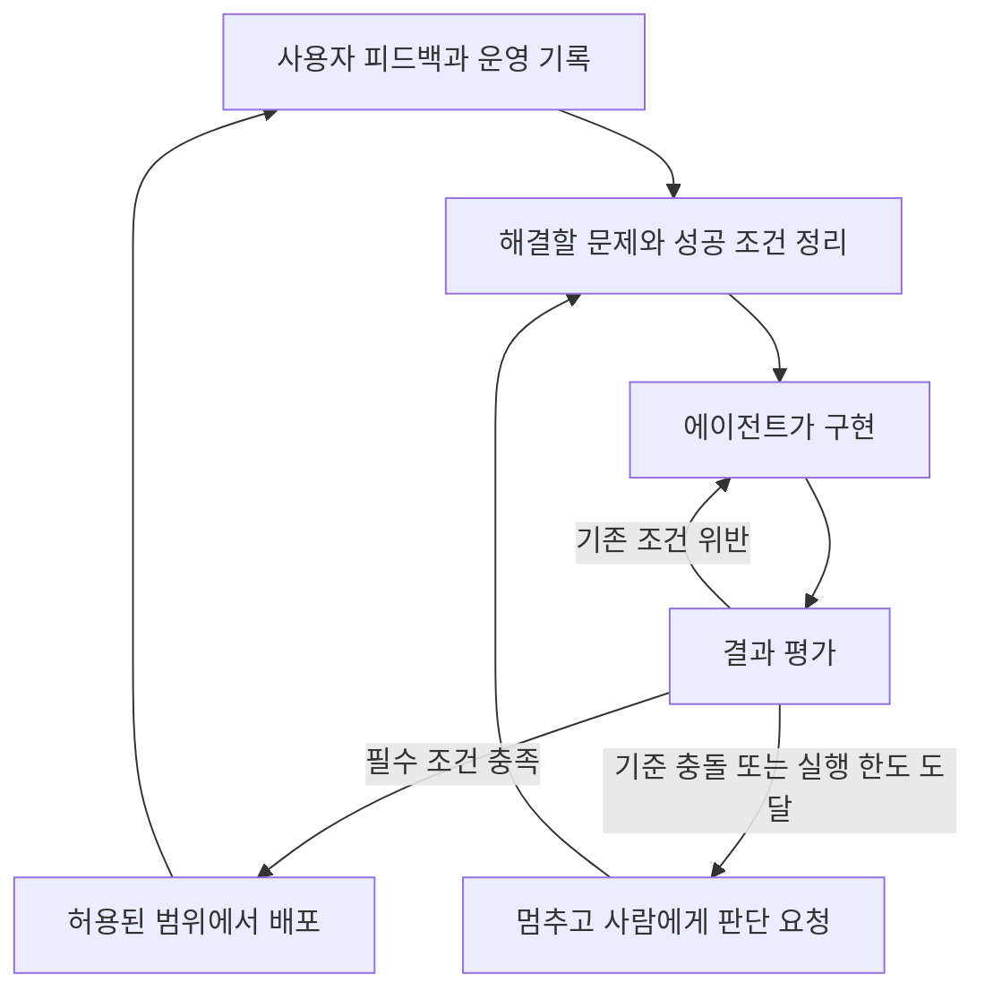
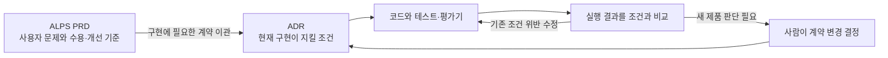

## TL;DR

- Software Factory는 개발과 검증, 운영 피드백을 반복하는 시스템이다.
- 자율적으로 맡길 범위가 넓어질수록 Eval이 더 중요해진다.
- 목표 지표에는 품질 저하를 드러낼 tension metrics를 함께 둔다.

## 시작하며

오늘 [에이전트 애플리케이션 평가 플레이북](/2026/10/05/evaluating-new-agent-applications.html)을 쓰면서, 에이전트에게 어떤 숫자를 개선하라고 줄지에 대해 정리했다. 영어 연습 앱인 잉크버드(EncBird)에서 교정한 문장 수만 늘리면 정상 문장까지 고칠 수 있고, 기억한 사실 수만 늘리면 잘못된 정보까지 저장할 수 있다는 이야기였다.

앱을 만드는 과정에도 같은 문제가 생긴다. 개발 에이전트가 더 오래 일하고 더 많은 변경을 만들 수 있게 되면, 무엇을 근거로 다음 작업을 맡기고 결과를 받아들일지 정해야 한다.

Factory의 Tereza Tížková가 발표한 「What It Actually Takes to Build a Software Factory」는 이 문제를 개발 전체 과정으로 넓혀 설명한다.[^1] 요구사항을 받아 구현하는 것부터, 결과를 검증하고 운영에서 얻은 피드백으로 다시 수정하는 것까지 에이전트가 이어서 수행하도록 만드는 방식이다.

나는 이 흐름에서 **Eval, 즉 결과가 의도한 조건을 만족하는지 평가하는 일이 훨씬 중요해지고 있다**고 생각한다. 기획에 사용하는 ALPS도 이 방향에 맞춰 업데이트해서 쓰고 있다.

## 1. Software Factory는 어디까지 하는가

이 글에서 말하는 Software Factory는 AI 에이전트가 요구사항 정리, 구현, 검증, 배포와 운영 피드백을 연결해 반복하는 개발 시스템이다. 소프트웨어의 개발부터 운영까지 이어지는 생명주기(SDLC)를 다룬다.

예를 들어 사용자가 가입 과정에서 계속 실패한다는 피드백이 들어왔다고 하자. 관련 실행 기록을 찾고, 고칠 문제의 우선순위를 정하고, 코드를 수정한 뒤 실제 가입이 되는지 확인한다. 배포한 뒤에도 같은 실패가 줄었는지 살피고, 남은 문제를 다음 작업으로 돌려보낸다.

사람이 매 단계에서 다음 명령을 입력하던 자리를, 정해진 기준에 따라 움직이는 반복 과정이 채우는 것이다. 사람은 해결할 문제와 허용할 변경 범위를 정하고, 기준이 충돌하거나 새로운 결정이 필요한 지점에 참여한다.





이 과정이 돌아가려면 에이전트가 같은 환경을 다시 띄우고, 필요한 자료를 찾고, 테스트를 반복할 수 있어야 한다. 담당자 한 명의 노트북에서만 실행되거나 실패 원인을 확인할 기록이 없다면, 다음 단계로 넘어갈 때마다 사람이 끼어들게 된다.

발표에서는 특정 모델·도구에 묶이지 않는 것, 사람이 계속 지켜보지 않아도 실행되는 것, 실행하면서 얻은 지식을 다음 작업에 반영하는 것을 원칙으로 제시한다.[^1] 모델 선택과 컨텍스트 관리도 이 반복 과정을 유지하기 위한 요소다.

다만 에이전트가 오래 실행된다는 사실만으로 반복 과정이 완성되지는 않는다. 무엇을 성공으로 인정하고, 실패했을 때 무엇을 고치며, 언제 멈출지 판단할 수 있어야 한다.

## 2. Eval이 다음 행동을 결정한다

사람이 개발 에이전트의 결과를 매번 읽을 때는 명세에서 빠진 조건을 뒤늦게 발견해 보완할 수 있다. 자율적으로 맡기는 범위가 커지면, 그 판단의 일부를 평가 기준과 실행 가능한 검사로 옮겨야 한다.

평가가 통과하면 다음 작업이나 배포로 넘어가고, 실패하면 수정으로 돌아간다. **Eval의 판정이 개발 과정의 다음 행동을 결정한다.** 잘못 통과시키면 결함을 가진 결과 위에서 후속 작업이 계속되고, 정상 결과를 실패로 판단하면 불필요한 수정을 반복한다.

Factory는 구현할 기능을 나누기 전에 Validation Contract를 작성한다. 어떤 동작이 관찰되어야 완료로 인정할지 정한 검증 조건이다. 작업을 조율하는 에이전트가 이를 정리하고, 구현을 맡은 에이전트와 별도의 검증 에이전트가 결과를 확인한다.[^2]

가입 기능이라면 “가입 API를 만들었다”보다 “사용자가 화면에서 가입하고 로그인할 수 있다”가 완료 판단에 가깝다. 중복 가입을 막아야 한다면 그 조건도 함께 확인해야 한다. 코드 검사와 실제 사용자 흐름 검증이 서로 다른 실패를 찾는 이유다.

Factory가 공개한 한 작업에서는 전체 실행 시간 16.5시간 중 6.14시간, 약 37.2%가 검증에 쓰였다.[^2] 한 사례의 비율을 모든 프로젝트의 기준으로 삼을 수는 없지만, 검증에 상당한 실행 시간을 배정한 구조라는 점은 볼 수 있다.

평가를 전부 언어 모델에게 맡길 필요는 없다. 저장한 값이나 권한처럼 코드로 확인할 수 있는 조건은 테스트로 검사하고, 문장의 의미나 답변의 적절성처럼 판단이 필요한 부분에 모델 평가를 쓴다. 실제 화면과 후속 처리까지 이어지는지는 사용자 흐름으로 확인한다.

오늘 글에서 다룬 잉크버드 교정을 예로 들면, 피드백이 전달됐는지는 코드로 확인할 수 있다. 하지만 “갈 수도 있다”를 “갔다”로 바꿨는지는 원문과 교정문을 함께 읽어야 한다. 개발 에이전트가 교정 기능을 수정했다면 두 조건을 모두 확인해야 한다.

평가에 쓰는 모델도 틀릴 수 있다. 사람이 확인한 사례와 비교해 실제 실패를 놓치는지, 정상 결과를 불필요하게 막는지 살펴야 한다. 구현한 에이전트와 검증한 에이전트를 나눠도 같은 잘못된 기준을 공유하면 오류가 남는다.

운영에서 새 실패를 발견하면 재현할 사례를 남기고 다음 평가에 추가한다. 이미 합의한 조건을 어긴 것인지, 지금까지 정하지 않았던 제품 규칙이 필요한 것인지도 구분해야 한다. 후자라면 에이전트가 혼자 정답을 만들어 평가에 넣어서는 안 된다.

## 3. 목표 지표를 올리는 동안 무엇이 나빠질 수 있을까

평가를 반복할 수 있게 되면, 에이전트에게 지표를 주고 더 나은 결과를 찾게 할 수 있다. 이때 평가가 정확히 계산된다고 해도 그 지표가 제품의 목적을 충분히 담고 있는지는 별개다.

배포 횟수만 늘리라고 하면 의미 없는 변경을 잘게 나눌 수 있다. 테스트 통과율만 올리라고 하면 실패하는 테스트를 빼는 쪽으로 갈 수도 있다. 숫자는 좋아졌지만 사용자가 얻는 결과는 그대로이거나 더 나빠지는 경우다.

그래서 오늘 글에서도 **tension metric, 즉 목표 지표를 개선하는 동안 다른 품질이 나빠지는지 함께 확인할 지표**를 세우는 것이 중요하다고 썼다. 목표를 편법으로 달성했을 때 그 문제가 다른 지표에서 드러나게 하는 것이다.

| 개선하려는 것 | 함께 볼 tension metrics | 확인하려는 문제 |
| --- | --- | --- |
| 변경을 전달하는 속도 | 변경 실패율, 운영 장애로 생긴 재배포 비율 | 검증을 생략해 배포 뒤의 수정만 늘어나는가 |
| 개발 과정의 비용 | 재작업 시간, 완료 조건을 충족하지 못한 작업 비율 | 비용을 줄이느라 일을 덜 끝내거나 품질을 낮추는가 |
| 잉크버드의 오류 교정률 | 정상 문장의 불필요한 교정률, 의미 왜곡률 | 모든 문장을 고쳐 교정 실적만 늘리는가 |

이 지표들이 반드시 반대로 움직여야 한다는 뜻은 아니다. 원하는 결과는 전달 속도가 빨라지면서 실패도 줄어드는 것이다. 소프트웨어 전달 성과를 연구하는 DORA도 처리량과 불안정성을 함께 보며, 한 지표만 목표로 삼을 때 생기는 문제를 경고한다.[^3]

지표를 비교하는 조건도 유지해야 한다. 어려운 작업을 평가 대상에서 빼거나, 같은 일을 여러 작업으로 쪼개 분모를 바꾸면 개선 전후를 그대로 비교할 수 없다. 대상 작업, 집계 기준과 관찰 기간을 함께 남겨야 한다.

그리고 관찰할 지표와 반드시 지킬 조건은 다르다. 재작업 시간이 늘었다는 관찰만으로 모든 변경을 자동 탈락시킬 필요는 없다. 반면 사용자 권한을 어겼거나 합의한 완료 조건을 만족하지 못했다면, 속도가 빨라졌다는 이유로 통과시킬 수 없다.

여러 지표를 가중합해서 하나의 점수로만 보면 이런 위반이 가려질 수 있다. 나는 개선할 주지표와 지켜야 할 조건을 따로 보고, 어느 쪽의 변화 때문에 후보를 받아들이거나 제외했는지 남기는 편이 낫다고 생각한다.

## 4. ALPS에도 완료 조건과 개선 기준을 연결해두기

이 기준을 구현이 끝난 뒤에 정하면, 이미 나온 결과를 성공으로 설명하기 쉬워진다. 그래서 에이전트에게 개발을 맡기기 전에 사용자 문제와 필요한 동작을 정리하는 ALPS(Agentic Lean Product Spec)를 업데이트해서 쓰고 있다.

ALPS는 제품 요구사항 문서(PRD)를 작성하는 포맷이다. 내가 만드는 ALPS Writer Plugins의 0.9.6 업데이트에는 처음 기능을 받아들일 조건과, 이후 더 좋아졌는지 판단할 기준을 구분하는 지침을 넣었다.[^4]

Full ALPS에서는 기능별 수용 기준에 어떤 상황에서 무엇을 확인하고, 테스트·품질 평가·데모 중 어떤 근거가 필요한지 연결한다. 개선 지표를 제안할 때는 그 지표만 최적화하면 어떤 문제가 생길지 보고, 의미 있는 tension metric도 함께 고려하도록 했다.

간소한 기획에 쓰는 Lite ALPS에도 같은 관점을 적용했다. 핵심 사용자 경험이 존재하는지만 쓰지 않고, 그 경험이 의도한 결과를 냈는지 알 수 있게 적는다. 예를 들어 사용자가 대화를 끝낼 수 있어야 한다면, 완료 메시지를 보여준 뒤 계속 질문하는 것은 완료가 아니다.

모든 기능에 지표를 하나씩 붙이도록 강제하지는 않았다. 숫자로 표현하기 어려운 조건은 관찰 가능한 실패 사례로 확인할 수 있다. 관찰용으로 제안한 지표를 곧바로 필수 통과 조건으로 바꾸거나, 근거 없는 목표치를 채워 넣지 않도록 했다.[^4]

기획에서 정한 기준은 구현 단계까지 유지되어야 한다. [앞서 정리한 ALPS와 ADR의 역할](/2026/07/25/alps-adr-abstraction-boundaries.html)에 따라, 구현에 필요한 의도와 요구사항을 아키텍처 결정 기록(ADR)으로 넘긴 뒤에는 ADR을 구현 기준으로 쓴다. 기획 문서를 나중에 수정했다고 현재 구현 기준이 자동으로 바뀌지는 않는다.





ADR Writer의 구현 지침에도 사전 수용 근거로 결과를 판단하고, 주지표 상승으로 필수 조건 위반을 상쇄하지 않도록 반영했다. 의도와 정확한 조건은 문서에, 평가 데이터와 평가기 코드, 실행 결과는 구현·검증 자료에 둔다.[^4]

지금 업데이트한 것은 기획과 구현에서 에이전트가 따라야 할 판단 기준이다. 이 지침이 있다는 것과 운영 피드백부터 배포까지 전 과정이 자동으로 돌아간다는 것은 구분해야 한다. 나는 우선 맡긴 기능이 의도한 결과를 냈는지 확인하는 근거부터 연결하고 있다.

## 마치며

Software Factory에 일을 더 많이 맡기려면, 사람이 결과를 다시 확인하는 데 쓰는 시간도 줄어야 한다. 코드 생성이 빨라져도 완료 여부를 매번 처음부터 판단해야 한다면 위임할 수 있는 범위는 쉽게 늘지 않는다.

나는 앞으로 에이전트가 무엇을 만들어낼 수 있는지만큼, **그 결과를 어떤 Eval로 받아들이고 어떤 tension metrics로 개선을 판단할지**에 더 시간을 쓰게 될 것 같다. ALPS를 업데이트하는 것도, 기획할 때 정한 사용자 목적이 구현과 반복 개선 과정에서 사라지지 않게 하려는 것이다.

---

[^1]: Tereza Tížková, [What It Actually Takes to Build a Software Factory](https://ai.engineer/talks/vGCJ7diEtrw-what-it-actually-takes-build-software-factory), AI Engineer. 개발 생명주기의 자율화와 세 가지 원칙을 설명한다.
[^2]: Theo Luan, Factory, [How Missions Work](https://factory.com/news/missions-architecture). 구현 전에 작성하는 Validation Contract, 구현과 검증 역할의 분리, 한 작업에서 검증에 사용한 시간의 근거다.
[^3]: DORA, [DORA’s software delivery performance metrics](https://dora.dev/guides/dora-metrics/). 전달 성과와 불안정성을 함께 측정하고, 단일 지표 최적화와 서로 다른 맥락의 비교를 경계한다.
[^4]: [ALPS Writer Plugins](https://github.com/haandol/alps-writer-plugins)
