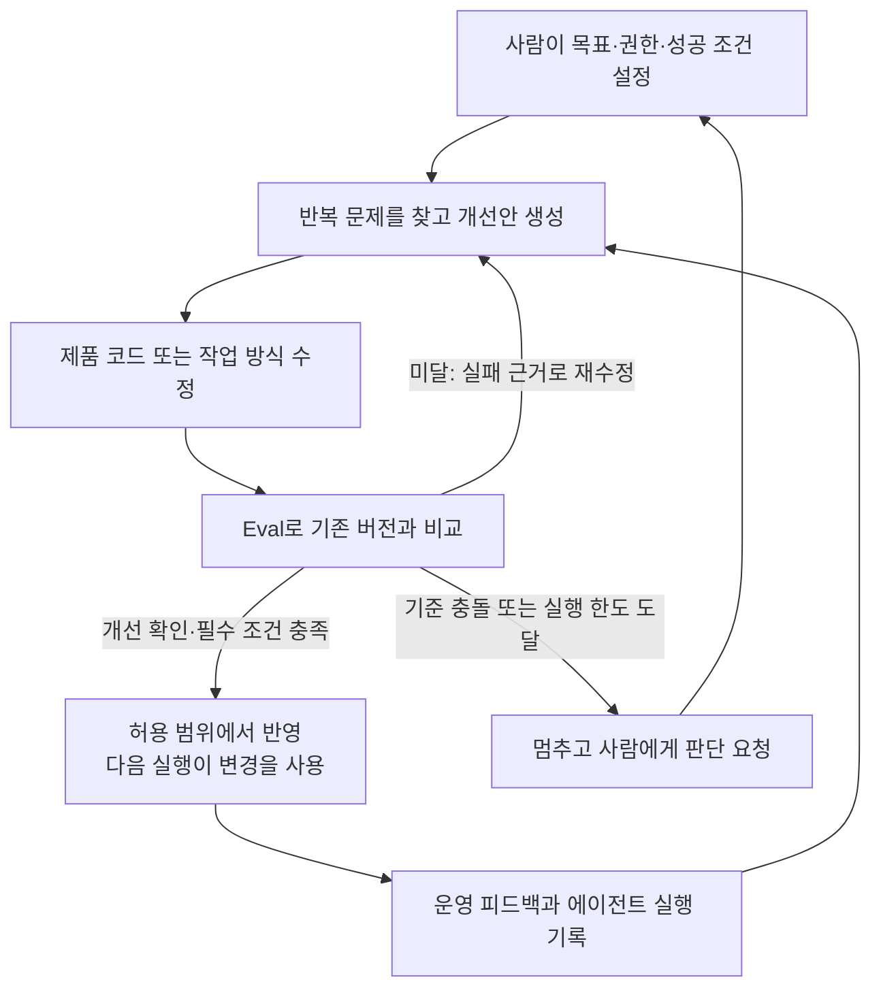
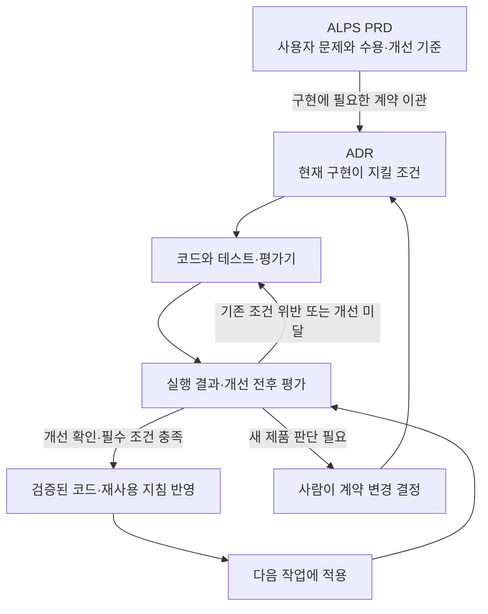

## TL;DR

- Software Factory의 핵심은 자동화된 자기 개선이다.
- Eval은 사람의 반복 판단을 대신할 개선 근거다.
- Tension metrics는 개선 과정의 품질 저하를 드러낸다.

## 시작하며

앞서 쓴 [에이전트 애플리케이션 평가 플레이북](/2026/10/05/evaluating-new-agent-applications.html)에서는 에이전트에게 어떤 숫자를 개선하라고 줄지 정리했다. 영어 연습 앱인 잉크버드(EncBird)에서 교정한 문장 수만 늘리면 정상 문장까지 고칠 수 있고, 기억한 사실 수만 늘리면 잘못된 정보까지 저장할 수 있다는 이야기였다.

이런 개선 기준이 필요한 이유는 개발 에이전트에게 일을 맡길 때 더 분명해진다. 기준이 없으면 수정안이 나올 때마다 사람이 결과를 읽고, 다음에 무엇을 고칠지 정하고, 다시 지시해야 한다. 개선 속도가 사람이 판단할 수 있는 속도에 묶이는 것이다.

Factory의 Tereza Tížková가 발표한 「What It Actually Takes to Build a Software Factory」는 개발 전체 과정을 에이전트가 이어서 수행하는 시스템을 설명한다.[^1] 요구사항을 받아 구현하는 것부터, 결과를 검증하고 운영에서 얻은 피드백으로 다시 수정하는 것까지 포함한다.

내가 이 흐름에서 중요하게 보는 것은 **실행 결과로 문제를 찾고, 수정안을 만들고, 더 나아졌는지 확인하는 과정까지 자동화하는 자기 개선(self-improvement)**이다. 목표는 개선안을 만들고 채택하는 반복 경로에서 사람의 개별 판단을 제거해, 다음 지시를 기다리지 않고 개선을 이어가는 것이다.

그래서 Eval, 즉 결과가 의도한 조건을 만족하고 이전보다 나아졌는지 평가하는 일이 훨씬 중요해진다. 평가 결과가 다음 수정을 이끌기 때문이다. 기획에 사용하는 ALPS도 이 개선 기준을 미리 정할 수 있도록 업데이트해서 쓰고 있다.

## 1. Software Factory가 스스로 개선한다는 것

이 글에서 말하는 Software Factory는 AI 에이전트가 요구사항 정리, 구현, 검증, 배포와 운영 피드백을 연결하고, 그 결과로 제품과 개발 방식까지 개선하는 시스템이다. 소프트웨어의 개발부터 운영까지 이어지는 생명주기(SDLC)를 다룬다.

Factory의 공식 소개도 지속적인 학습과 자기 개선을 핵심 요건으로 제시한다. 에이전트 실행, 코드 리뷰와 장애 해결에서 얻은 정보를 다음 작업에 반영해 시스템 자체가 나아져야 한다는 설명이다.[^5]

예를 들어 사용자가 가입 과정에서 계속 실패한다는 피드백이 들어왔다고 하자. 관련 실행 기록을 찾고, 고칠 문제의 우선순위를 정하고, 코드를 수정한 뒤 실제 가입이 되는지 확인한다. 배포한 뒤에도 같은 실패가 줄었는지 살피고, 남은 문제를 다음 작업으로 돌려보낸다.

여기서 개선할 대상에는 **제품을 만드는 에이전트의 작업 방식도 포함된다**. 예를 들어 개발 에이전트가 가입 관련 테스트를 계속 빠뜨린다면, 코드 수정에 더해 테스트 실행 절차나 재사용하는 작업 지침을 고치는 후보를 만들 수 있다. 그 변경이 다른 작업에서도 누락을 줄이는지 평가하고, 효과가 확인된 지침을 다음 실행에서 쓰게 하는 것이다.

한 번의 실행 안에서 실패를 고치는 데서 끝나면 다음 실행이 같은 실수를 반복할 수 있다. 수정한 코드, 재현 테스트, 검증된 작업 지침처럼 다음 실행에 남는 것이 있어야 개선이 축적된다. 이런 자기 개선은 모델 자체를 재학습하지 않고도 가능하다.[^6]

내가 지향하는 것은 사람이 매 단계에서 다음 명령을 입력하던 자리를 평가와 수정의 반복 과정으로 채우는 것이다. 사람은 목표와 허용할 변경 범위, 성공 조건을 정하고, 그 안에서 개선안을 만들고 비교하고 채택하는 판단은 가능한 한 자동화한다. 기준이 충돌하거나 새로운 제품 결정이 필요할 때는 사람이 참여한다.





이 과정이 돌아가려면 에이전트가 같은 환경을 다시 띄우고, 필요한 자료를 찾고, 테스트를 반복할 수 있어야 한다. 담당자 한 명의 노트북에서만 실행되거나 실패 원인을 확인할 기록이 없다면, 다음 단계로 넘어갈 때마다 사람이 끼어들게 된다.

Factory가 공개한 내부 시스템 Signals는 실행 기록에서 반복되는 문제를 찾아 작업을 만들고, Droid가 수정안을 구현하는 사례다. 해당 설명에서는 병합 전 사람의 승인이 남아 있다.[^7] 매번 사람이 문제를 찾아 일을 배정하던 부분부터 자동화하고 있다는 점과, 전체 과정의 무인화가 끝났다는 주장은 구분할 필요가 있다.

이 과정에서 자동화해야 할 판단은 “작업이 끝났는가”에 더해 “이 변경을 다음 실행에도 쓰는 편이 나은가”까지 이어진다. 그 판단을 맡기려면 무엇을 성공으로 인정하고 어떤 근거로 개선을 채택할지 먼저 정해야 한다.

## 2. Eval이 다음 행동을 결정한다

사람이 개발 에이전트의 결과를 매번 읽을 때는 명세에서 빠진 조건을 뒤늦게 발견해 보완할 수 있다. 자율적으로 맡기는 범위가 커지면, 그 판단의 일부를 평가 기준과 실행 가능한 검사로 옮겨야 한다.

평가는 실패한 사례와 어긴 조건을 다음 수정의 입력으로 돌려준다. 에이전트는 그 근거로 수정안을 만들고 다시 평가하며, 기존 버전보다 나아지고 필수 조건도 지킨 변경을 허용된 범위에서 채택한다. **Eval이 실패의 발견과 수정, 개선안의 채택을 연결한다.** 잘못 통과시키면 결함을 가진 결과 위에서 후속 작업이 계속되고, 정상 결과를 실패로 판단하면 불필요한 수정을 반복한다.

Factory의 Missions는 구현할 기능을 나누기 전에 Validation Contract를 작성한다. 어떤 동작이 관찰되어야 완료로 인정할지 정한 검증 조건이다. 작업을 조율하는 에이전트가 이를 정리하고, 구현을 맡은 에이전트와 별도의 검증 에이전트가 결과를 확인한다. 검증에서 찾은 문제는 수정 작업으로 바뀌고, 수정 뒤 같은 완료 조건으로 다시 검증한다.[^2]

가입 기능이라면 “가입 API를 만들었다”보다 “사용자가 화면에서 가입하고 로그인할 수 있다”가 완료 판단에 가깝다. 중복 가입을 막아야 한다면 그 조건도 함께 확인해야 한다. 코드 검사와 실제 사용자 흐름 검증이 서로 다른 실패를 찾는 이유다.

Factory가 공개한 한 작업에서는 전체 실행 시간 16.5시간 중 6.14시간, 약 37.2%가 검증에 쓰였다.[^2] 한 사례의 비율을 모든 프로젝트의 기준으로 삼을 수는 없지만, 검증에 상당한 실행 시간을 배정한 구조라는 점은 볼 수 있다.

평가를 전부 언어 모델에게 맡길 필요는 없다. 저장한 값이나 권한처럼 코드로 확인할 수 있는 조건은 테스트로 검사하고, 문장의 의미나 답변의 적절성처럼 판단이 필요한 부분에 모델 평가를 쓴다. 실제 화면과 후속 처리까지 이어지는지는 사용자 흐름으로 확인한다.

앞선 평가 플레이북에서 다룬 잉크버드 교정을 예로 들면, 피드백이 전달됐는지는 코드로 확인할 수 있다. 하지만 “갈 수도 있다”를 “갔다”로 바꿨는지는 원문과 교정문을 함께 읽어야 한다.

이 실패를 개선 작업으로 연결한다면, 에이전트가 원문과 잘못된 교정문을 재현 사례로 남기고 프롬프트나 처리 코드를 수정하게 할 수 있다. 수정 전후를 같은 평가 사례로 비교하고, 수정에 쓰지 않은 별도 사례에서도 의미 보존이 나아졌는지 확인한다.

피드백 전달 누락이나 의미 왜곡이 남으면 그 실패를 근거로 다시 수정한다. 이때 정상 문장의 불필요한 교정이 늘었는지도 함께 비교해야 한다. 사람이 매번 교정문을 읽고 다음 지시를 만드는 일을 이런 평가와 재수정 과정으로 옮기려는 것이다.

평가에 쓰는 모델도 틀릴 수 있다. 사람이 확인한 사례와 비교해 실제 실패를 놓치는지, 정상 결과를 불필요하게 막는지 살펴야 한다. 구현한 에이전트와 검증한 에이전트를 나눠도 같은 잘못된 기준을 공유하면 오류가 남는다.

운영에서 새 실패를 발견하면 재현할 사례를 남기고 다음 평가에 추가한다. 이미 합의한 조건을 어긴 것인지, 지금까지 정하지 않았던 제품 규칙이 필요한 것인지도 구분해야 한다. 후자라면 에이전트가 혼자 정답을 만들어 평가에 넣어서는 안 된다.

## 3. 목표 지표를 올리는 동안 무엇이 나빠질 수 있을까

자기 개선 과정에서는 어떤 변경을 남길지 판단할 때 지표를 반복해서 사용하게 된다. 지표를 정확히 계산한다고 해도 그 지표가 제품의 목적을 충분히 담고 있는지는 별개다. 잘못된 기준으로 변경을 채택하면 그 방향이 다음 개선의 출발점이 된다.

배포 횟수만 늘리라고 하면 의미 없는 변경을 잘게 나눌 수 있다. 테스트 통과율만 올리라고 하면 실패하는 테스트를 빼는 쪽으로 갈 수도 있다. 숫자는 좋아졌지만 사용자가 얻는 결과는 그대로이거나 더 나빠지는 경우다.

그래서 앞선 [평가 플레이북](/2026/10/05/evaluating-new-agent-applications.html)에서도 **tension metric, 즉 목표 지표를 개선하는 동안 다른 품질이 나빠지는지 함께 확인할 지표**를 세우는 것이 중요하다고 썼다. 목표를 편법으로 달성했을 때 그 문제가 다른 지표에서 드러나게 하는 것이다.

| 개선하려는 것 | 함께 볼 tension metrics | 확인하려는 문제 |
| --- | --- | --- |
| 변경을 전달하는 속도 | 변경 실패율, 운영 장애로 생긴 재배포 비율 | 검증을 생략해 배포 뒤의 수정만 늘어나는가 |
| 개발 과정의 비용 | 재작업 시간, 완료 조건을 충족하지 못한 작업 비율 | 비용을 줄이느라 일을 덜 끝내거나 품질을 낮추는가 |
| 잉크버드의 오류 교정률 | 정상 문장의 불필요한 교정률, 의미 왜곡률 | 모든 문장을 고쳐 교정 실적만 늘리는가 |

이 지표들이 반드시 반대로 움직여야 한다는 뜻은 아니다. 원하는 결과는 전달 속도가 빨라지면서 실패도 줄어드는 것이다. 소프트웨어 전달 성과를 연구하는 DORA도 처리량과 불안정성을 함께 보며, 한 지표만 목표로 삼을 때 생기는 문제를 경고한다.[^3]

지표를 비교하는 조건도 유지해야 한다. 어려운 작업을 평가 대상에서 빼거나, 같은 일을 여러 작업으로 쪼개 분모를 바꾸면 개선 전후를 그대로 비교할 수 없다. 대상 작업, 집계 기준과 관찰 기간을 함께 남겨야 한다.

그리고 관찰할 지표와 반드시 지킬 조건은 다르다. 재작업 시간이 늘었다는 관찰만으로 모든 변경을 자동 탈락시킬 필요는 없다. 반면 사용자 권한을 어겼거나 합의한 완료 조건을 만족하지 못했다면, 속도가 빨라졌다는 이유로 통과시킬 수 없다.

여러 지표를 가중합해서 하나의 점수로만 보면 이런 위반이 가려질 수 있다. 나는 개선할 주지표와 지켜야 할 조건을 따로 보고, 어느 쪽의 변화 때문에 후보를 받아들이거나 제외했는지 남기는 편이 낫다고 생각한다.

## 4. ALPS에도 완료 조건과 개선 기준을 연결해두기

자기 개선을 맡기려면 처음 기능을 완성할 조건과, 이후 어떤 변화를 개선으로 받아들일지가 함께 필요하다. 이 기준을 구현이 끝난 뒤에 정하면 이미 나온 결과를 성공으로 설명하기 쉬워진다. 그래서 에이전트에게 개발을 맡기기 전에 사용자 문제와 필요한 동작을 정리하는 ALPS(Agentic Lean Product Spec)를 업데이트해서 쓰고 있다.

ALPS는 제품 요구사항 문서(PRD)를 작성하는 포맷이다. 내가 만드는 ALPS Writer Plugins의 0.9.6 업데이트에는 처음 기능을 받아들일 조건과, 이후 더 좋아졌는지 판단할 기준을 구분하는 지침을 넣었다.[^4]

Full ALPS에서는 기능별 수용 기준에 어떤 상황에서 무엇을 확인하고, 테스트·품질 평가·데모 중 어떤 근거가 필요한지 연결한다. 개선 지표를 제안할 때는 그 지표만 최적화하면 어떤 문제가 생길지 보고, 의미 있는 tension metric도 함께 고려하도록 했다.

간소한 기획에 쓰는 Lite ALPS에도 같은 관점을 적용했다. 핵심 사용자 경험이 존재하는지만 쓰지 않고, 그 경험이 의도한 결과를 냈는지 알 수 있게 적는다. 예를 들어 사용자가 대화를 끝낼 수 있어야 한다면, 완료 메시지를 보여준 뒤 계속 질문하는 것은 완료가 아니다.

모든 기능에 지표를 하나씩 붙이도록 강제하지는 않았다. 숫자로 표현하기 어려운 조건은 관찰 가능한 실패 사례로 확인할 수 있다. 관찰용으로 제안한 지표를 곧바로 필수 통과 조건으로 바꾸거나, 근거 없는 목표치를 채워 넣지 않도록 했다.[^4]

기획에서 정한 기준은 구현 단계까지 유지되어야 한다. [앞서 정리한 ALPS와 ADR의 역할](/2026/07/25/alps-adr-abstraction-boundaries.html)에 따라, 구현에 필요한 의도와 요구사항을 아키텍처 결정 기록(ADR)으로 넘긴 뒤에는 ADR을 구현 기준으로 쓴다. 기획 문서를 나중에 수정했다고 현재 구현 기준이 자동으로 바뀌지는 않는다.





ADR Writer의 구현 지침에도 사전 수용 근거로 결과를 판단하고, 주지표 상승으로 필수 조건 위반을 상쇄하지 않도록 반영했다. 의도와 정확한 조건은 문서에, 평가 데이터와 평가기 코드, 실행 결과는 구현·검증 자료에 둔다.[^4]

지금 업데이트한 것은 기획과 구현에서 에이전트가 따라야 할 판단 기준이다. 이 지침이 있다는 것과 운영 피드백부터 배포까지 전 과정이 자동으로 돌아간다는 것은 구분해야 한다. 나는 우선 맡긴 기능이 의도한 결과를 냈는지 확인하는 근거부터 연결하고 있다.

## 마치며

나는 Software Factory를 만들 때 **사람이 다시 지시하지 않아도, 실행에서 발견한 문제가 검증된 개선으로 이어지는가**를 보고 싶다. 그 개선이 다음 작업에도 남아 같은 실패와 사람의 개입을 줄여야, 반복할수록 더 나은 개발 시스템이 된다고 생각한다.

그만큼 앞으로는 무엇을 만들지 정하는 일과 함께, 어떤 Eval과 tension metrics를 근거로 자동 개선을 맡길지에 시간을 쓰게 될 것 같다. ALPS를 업데이트하는 것도, 사람이 정한 사용자 목적이 매번 개입하지 않아도 개선 과정에 남도록 하기 위해서다.

---

[^1]: Tereza Tížková, [What It Actually Takes to Build a Software Factory](https://ai.engineer/talks/vGCJ7diEtrw-what-it-actually-takes-build-software-factory), AI Engineer. 개발 생명주기 전반의 자율 실행과 검증을 설명한다.
[^2]: Theo Luan, Factory, [How Missions Work](https://factory.com/news/missions-architecture). 구현 전에 작성하는 Validation Contract, 구현과 검증 역할의 분리, 한 작업에서 검증에 사용한 시간의 근거다.
[^3]: DORA, [DORA’s software delivery performance metrics](https://dora.dev/guides/dora-metrics/). 전달 성과와 불안정성을 함께 측정하고, 단일 지표 최적화와 서로 다른 맥락의 비교를 경계한다.
[^4]: [ALPS Writer Plugins](https://github.com/haandol/alps-writer-plugins)
[^5]: Matan Grinberg, Eno Reyes, [Factory 2.0: From coding agents to software factories](https://factory.com/news/software-factory). 지속적인 학습과 자기 개선을 Software Factory의 핵심 요건으로 제시한다.
[^6]: Factory, [Self-improving software architecture in practice](https://factory.com/articles/self-improving-software-architecture). 수정이 코드·테스트·도구·작업 지침에 남아 다음 실행에서 쓰이는 구조와, 수정에 쓰지 않은 사례의 검증을 설명한다.
[^7]: Factory, [Signals: Toward a Self-Improving Agent](https://factory.com/news/factory-signals). 반복 문제 발견부터 수정안 구현까지 연결한 내부 사례다. 공개 당시 병합 전 사람의 승인이 남아 있었다.
