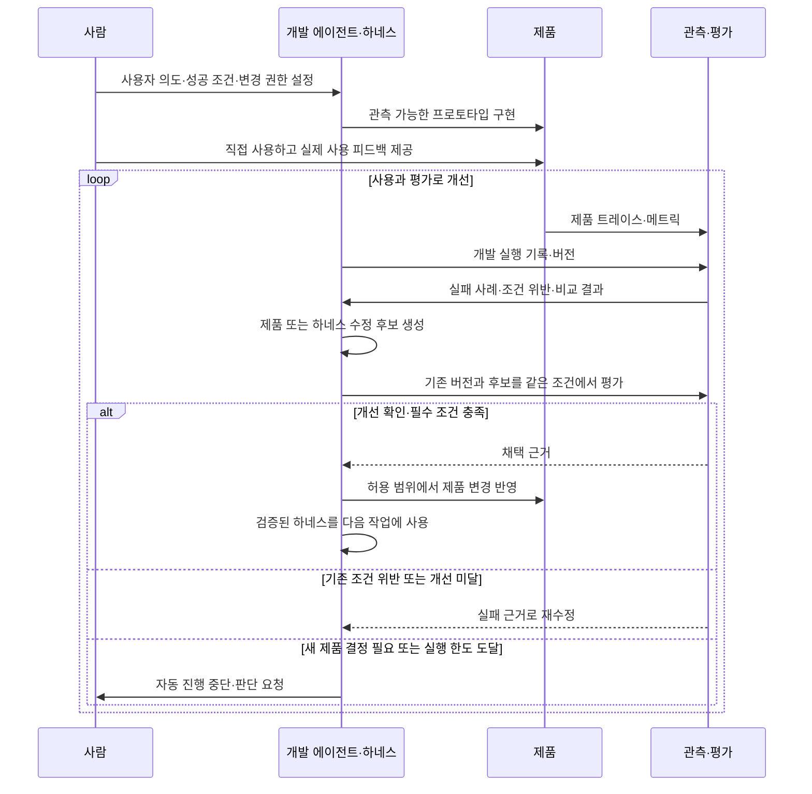
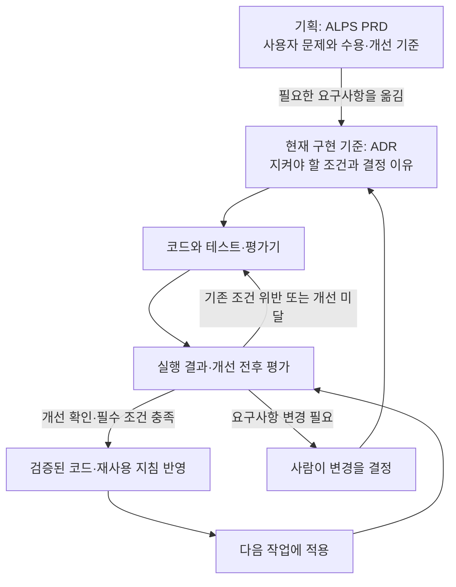

## TL;DR

- Software Factory는 휴먼 리뷰 병목을 제거하는 방향으로 간다.
- Eval과 observability가 자동 개선의 근거를 만든다.
- 실행 경험으로 하네스를 고치는 과정을 온라인 러닝으로 볼 수 있다.

## 시작하며

개발 에이전트가 코드를 고치고 테스트를 실행할 수 있어도, 수정안이 나올 때마다 사람이 결과를 읽고 다음 작업을 지시해야 한다면 개선 속도는 사람이 판단할 수 있는 속도에 묶인다. 실패를 찾는 일과 그 실패를 고칠 일을 정하는 과정까지 연결해야 사람이 자리를 비운 동안에도 개선을 이어갈 수 있다.

예전 글들에서 나는 에이전틱 엔지니어링의 장기적인 방향을 **HITL(human in the loop), 즉 실행 과정에 반복적으로 개입하는 사람을 제거하는 것**이라고 설명했다. 특히 코드를 만드는 속도가 빨라져도 모든 변경을 사람이 리뷰해야 한다면, 전체 처리량은 리뷰 속도에 묶일 수 있다고 썼다.[^10]

개발 에이전트 Droid를 만드는 회사 Factory의 Tereza Tížková는 「What It Actually Takes to Build a Software Factory」에서 사람의 다음 지시를 기다리지 않고 개발을 이어가는 시스템을 설명한다.[^1] 요구사항을 받아 구현하고, 결과를 검증하고, 운영 중 발견한 문제를 다음 수정으로 돌려보내는 일을 에이전트가 이어서 수행한다.

나는 Software Factory를 이 HITL 관점의 연장선으로 이해한다. 휴먼 리뷰라는 병목을 제거하기 위해, **실행 결과로 문제를 찾고, 수정안을 만들고, 더 나아졌는지 확인하는 자기 개선(self-improvement)**까지 자동화하는 시도다.

그래서 Eval, 즉 결과가 의도한 조건을 만족하고 이전보다 나아졌는지 평가하는 일과, 실제 실행을 관찰할 수 있게 하는 observability가 함께 중요해진다. 사람이 결과를 읽고 판단하던 자리를 넘겨받으려면, 에이전트가 무엇이 일어났는지 확인하고 원래 의도에 맞는지 평가할 수 있어야 한다.

## 1. 휴먼 리뷰를 루프 밖으로 옮기기

이 글에서 말하는 Software Factory는 AI 에이전트가 요구사항 정리, 구현, 검증, 배포와 운영 피드백을 연결하고, 그 결과로 제품과 개발 방식까지 개선하는 시스템이다. 소프트웨어의 개발부터 운영까지 이어지는 생명주기(SDLC)를 다룬다.

Factory의 공식 소개도 지속적인 학습과 자기 개선을 핵심 요건으로 제시한다. 에이전트 실행, 코드 리뷰와 장애 해결에서 얻은 정보를 다음 작업에 반영해 시스템 자체가 나아져야 한다는 설명이다.[^5]

StrongDM은 이 방향을 더 직접적으로 표현한다. 사람이 코드를 작성하거나 리뷰하지 않는 것을 원칙으로 두고, 명세와 사용자 시나리오로 에이전트를 실행해 결과를 검증하는 Software Factory를 공개했다. 구현 코드와 분리한 시나리오는 에이전트가 눈앞의 테스트만 통과하도록 코드를 맞추는 문제를 줄이기 위한 장치다.[^11]

예를 들어 사용자가 가입 과정에서 계속 실패한다는 피드백이 들어왔다고 하자. 관련 실행 기록을 찾고, 고칠 문제의 우선순위를 정하고, 코드를 수정한 뒤 실제 가입이 되는지 확인한다. 배포한 뒤에도 같은 실패가 줄었는지 살피고, 남은 문제를 다음 작업으로 돌려보낸다.

여기서 개선할 대상에는 **제품을 만드는 에이전트의 작업 방식도 포함된다**. 예를 들어 개발 에이전트가 가입 관련 테스트를 계속 빠뜨린다면, 코드 수정에 더해 테스트 실행 절차나 재사용하는 작업 지침을 고치는 후보를 만들 수 있다. 그 변경이 다른 작업에서도 누락을 줄이는지 평가하고, 효과가 확인된 지침을 다음 실행에서 쓰게 하는 것이다.

이런 작업 지침, 도구, 실행 환경과 검증·복구 절차를 묶어 이 글에서는 **하네스(harness)**라고 부르겠다. 예전에 EncBird의 하네스를 쌓아온 과정을 정리하면서, 반복된 실패를 `AGENTS.md`의 규칙이나 도구, 테스트에 남기는 방식을 설명했다.[^12] 이제는 사람이 실패를 읽고 하네스를 고치라고 지시하던 과정까지 자동화하고 싶은 것이다.

한 번의 실행 안에서 실패를 고치는 데서 끝나면 다음 실행이 같은 실수를 반복할 수 있다. 수정한 코드, 재현 테스트, 검증된 작업 지침처럼 다음 실행에 남는 것이 있어야 개선이 축적된다. 같은 모델을 쓰더라도 그 모델이 따르는 지침과 도구가 바뀌면 이후의 작업 방식이 달라질 수 있으므로, 모델 자체를 재학습하지 않고도 이런 자기 개선이 가능하다.[^6]

내가 지향하는 것은 사람이 매 단계에서 다음 명령을 입력하던 자리를 평가와 수정의 반복 과정으로 채우는 것이다. 사람은 목표와 허용할 변경 범위, 성공 조건을 정하고, 그 안에서 개선안을 만들고 비교하고 채택하는 판단은 가능한 한 자동화한다. 기준이 충돌하거나 새로운 제품 결정이 필요할 때는 사람이 참여한다.

이 과정이 돌아가려면 에이전트가 같은 환경을 다시 띄우고, 필요한 자료를 찾고, 테스트를 반복할 수 있어야 한다. 담당자 한 명의 노트북에서만 실행되거나 실패 원인을 확인할 기록이 없다면, 다음 단계로 넘어갈 때마다 사람이 끼어들게 된다.

Factory가 공개한 내부 시스템 Signals는 실행 기록에서 반복되는 문제를 찾아 작업을 만들고, Droid가 수정안을 구현하는 사례다. 해당 설명에서는 병합 전 사람의 승인이 남아 있다.[^7] 매번 사람이 문제를 찾아 일을 배정하던 부분부터 자동화하고 있다는 점과, 전체 과정의 무인화가 끝났다는 주장은 구분할 필요가 있다.

### 1.1. 소프트웨어 팩토리로 가는 과도기적 서비스들

최근에는 소프트웨어 개발뿐 아니라 일반 업무에서도 목표와 맥락을 유지하며 일을 이어가는 서비스가 나오고 있다.

- **OpenAI Dots**는 대화 사이에도 맡은 일을 계속하고, 필요한 작업을 배경 에이전트에 나누어 맡기는 상시 실행 에이전트다. 사용자의 선호와 결정을 기억해 후속 작업에 활용한다.[^17]
- **Anthropic Projects**는 2026년 9월 개편을 통해 목표를 여러 작업으로 나누고, 병렬 실행과 결과 검토·통합을 조율하는 기능을 제공한다. 작업들은 공유 기억을 통해 프로젝트의 맥락을 이어간다.[^18]
- **Meta Muse**는 브라우저와 외부 서비스 연동으로 예약·구매 같은 여러 단계의 업무를 수행하는 개인 에이전트다. 결제처럼 민감한 작업에는 사용자 승인을 남겨두고 있다.[^19]

나는 이들을 **Software Factory로 가는 과도기적 서비스**로 볼 수 있다고 생각한다. 개발에 특화된 정도는 다르지만, 사람이 매 단계에서 다음 행동을 지시하던 일을 목표 단위로 에이전트에 맡기려는 흐름이라는 점에서 그렇다.

실제 업무에서 드러난 실패와 사람의 개입을 평가 사례로 바꾸고, 그 근거로 하네스를 개선한다면 앞서 설명한 자기 개선으로 이어질 수 있다. 장기 실행과 기억만으로 이 과정이 완성되는 것은 아니며, 무엇을 성공으로 인정하고 어떤 변경을 다음 실행에 남길지 판단하는 과정까지 연결해야 한다.

## 2. Eval과 observability로 개발 루프 닫기

사람이 개발 에이전트의 결과를 매번 읽을 때는 명세에서 빠진 조건을 뒤늦게 발견해 보완할 수 있다. 자율적으로 맡기는 범위가 커지면, 그 판단의 일부를 평가 기준과 실행 가능한 검사로 옮겨야 한다.

평가는 실패한 사례와 어긴 조건을 다음 수정의 입력으로 돌려준다. 에이전트는 그 근거로 수정안을 만들고 다시 평가하며, 기존 버전보다 나아지고 필수 조건도 지킨 변경을 허용된 범위에서 채택한다. **Eval이 실패의 발견과 수정, 개선안의 채택을 연결한다.** 잘못 통과시키면 결함을 가진 결과 위에서 후속 작업이 계속되고, 정상 결과를 실패로 판단하면 불필요한 수정을 반복한다.

내가 **Software Factory로 개발하는 과정은 Eval 프로세스 그 자체와 일치한다**고 생각하는 이유도 여기에 있다. 사용자 의도를 기준으로 정하고, 실행하고, 결과를 관측하고, 의도와의 차이를 평가한 뒤 수정하고 다시 실행한다. 이 글에서 말하는 Eval 프로세스는 점수를 한 번 계산하는 일을 넘어, 그 평가로 다음 변경을 선택하는 반복 과정 전체를 가리킨다.

### 2.1. 프로토타입에서 트레이스와 평가 사례를 쌓기

이 반복을 시작하려면 먼저 사용해볼 수 있는 프로토타입이 필요하다. 처음부터 모든 실패를 예상하기는 어렵지만, 어떤 사용자 문제를 풀고 어떤 결과를 지켜야 하는지는 정해두어야 한다. 그 상태에서 직접 써보고 실제 사용자에게도 사용하게 하면서 실행 자료를 쌓는다.

이때 observability는 실행 자료를 통해 시스템 안에서 무슨 일이 일어났는지 알아볼 수 있는 능력이다. **트레이스(trace)**에는 요청 하나가 어떤 처리와 도구 호출을 거쳐 결과에 도달했는지 남기고, **메트릭(metric)**에는 실패율이나 응답 시간처럼 여러 실행을 비교할 수 있는 수치를 남긴다. 구체적인 오류나 중간 상태는 로그로 보완한다.

관측할 대상은 만들어진 제품과 그 제품을 만드는 개발 과정 모두다. 가입이 실패한 요청의 트레이스에서는 제품의 문제를 찾고, 그 코드를 수정한 개발 에이전트의 실행 기록에서는 테스트 누락이나 잘못된 도구 사용을 찾을 수 있다. 제품과 하네스의 버전도 함께 남겨야 어떤 변경 뒤에 동작이 달라졌는지 비교할 수 있다.

**Observability가 실제 동작을 드러내고, Eval이 그 동작을 사용자 의도와 비교한다.** 응답이 빨라졌다는 메트릭만으로 사용자가 원한 일을 끝냈다고 판단할 수는 없다. 기대한 결과와 실행 기록을 연결해야 그 차이가 수정할 문제로 바뀐다.

LangChain도 트레이스를 수집하고, 평가와 피드백을 붙이고, 실패를 재현 가능한 평가 사례로 바꾼 뒤, 수정 전후를 비교하는 개발 과정을 설명한다. 운영 중인 실행에도 자동 평가를 붙여 다음 개선에 쓸 자료를 얻는다.[^13]

내가 만들고 싶은 자동화도 여기까지 이어져야 한다. 기록을 수집해 대시보드에 보여주는 데서 끝나면, 사람이 다시 읽고 수정할 일을 골라야 한다. 에이전트가 관련 트레이스를 조회하고, 이미 정한 조건을 어긴 사례를 평가에 추가하고, 수정 후보를 실행해 비교하는 경로까지 연결해야 한다.





### 2.2. 실행 경험으로 하네스를 갱신하는 온라인 러닝

이렇게 새로 들어오는 실행 경험으로 다음 작업 방식을 갱신한다는 점에서, 나는 Software Factory를 **하네스 수준의 온라인 러닝(online learning)**으로도 볼 수 있다고 생각한다. 여기서 온라인은 인터넷 연결 여부가 아니라, 시스템이 사용되는 동안 들어오는 자료를 바탕으로 계속 적응한다는 의미다.

매 실행에서 제품 코드가 만들어지지만, 경험을 통해 누적해서 개선하는 대상은 **결정적·비결정적 소프트웨어를 만드는 하네스**다. 같은 입력과 상태에서 같은 규칙을 실행하는 일반적인 처리 코드도, 실행마다 응답이 달라질 수 있는 AI 기능도 그 하네스의 산출물이 될 수 있다. 학습한 내용은 모델 가중치를 바꾸는 대신 작업 지침, 도구, 테스트와 실행 절차에 남는다.

LangChain의 Better-Harness는 평가 결과와 트레이스를 근거로 하네스 변경을 제안하고 검증하는 과정을 구현했다. 수정에 쓰는 사례와 별도 검증 사례를 나누어 특정 사례에만 맞추는 문제도 확인한다. 다만 공개된 운영 방식에는 최종 사람 리뷰가 남아 있다.[^14]

ACE(Agentic Context Engineering) 연구는 모델 가중치를 갱신하지 않고, 실행에서 얻은 피드백을 지침과 전략이 담긴 컨텍스트에 축적하는 방식을 다룬다. 새로운 과제를 처리하면서 컨텍스트를 갱신하는 온라인 적응도 평가했다.[^15] 실행 경험이 이후 행동을 바꾸는 학습은 모델 내부를 다시 훈련하는 방식에만 한정되지 않는다.

이 자료들이 Software Factory 전체의 무인화를 입증하는 것은 아니다. 나는 하네스 개선과 컨텍스트 적응에서 확인된 방식을, 소프트웨어를 만드는 전체 개발 환경으로 확장해서 보고 있다. 사용 중에 평가 점수만 기록하는 것으로는 부족하고, 그 근거로 하네스가 바뀌어 이후 작업에 반영되어야 이 관점의 학습이 성립한다.

### 2.3. 평가할 결과를 구체적으로 정하기

하네스가 실행 경험으로 바뀌더라도, 변경을 채택할 근거는 원래 사용자 의도에 연결되어 있어야 한다. 이 기준이 모호하면 에이전트는 더 나은 소프트웨어를 만드는 대신 통과하기 쉬운 검사에 맞춰 움직일 수 있다.

Factory의 Missions는 여러 개발 작업을 나누어 자율적으로 진행하는 기능이다. 구현할 기능을 나누기 전에 Validation Contract를 작성하는데, 어떤 동작이 관찰되어야 완료로 인정할지 정한 검증 조건이다. 작업을 조율하는 에이전트가 이를 정리하고, 구현을 맡은 에이전트와 별도의 검증 에이전트가 결과를 확인한다. 검증에서 찾은 문제는 수정 작업으로 바뀌고, 수정 뒤 같은 완료 조건으로 다시 검증한다.[^2]

가입 기능이라면 “가입 API를 만들었다”보다 “사용자가 화면에서 가입하고 로그인할 수 있다”가 완료 판단에 가깝다. 중복 가입을 막아야 한다면 그 조건도 함께 확인해야 한다. 코드 검사와 실제 사용자 흐름 검증이 서로 다른 실패를 찾는 이유다.

Factory가 공개한 한 작업에서는 전체 실행 시간 16.5시간 중 6.14시간, 약 37.2%가 검증에 쓰였다.[^2] 한 사례의 비율을 모든 프로젝트의 기준으로 삼을 수는 없지만, 검증에 상당한 실행 시간을 배정한 구조라는 점은 볼 수 있다.

평가를 전부 언어 모델에게 맡길 필요는 없다. 저장한 값이나 권한처럼 코드로 확인할 수 있는 조건은 테스트로 검사하고, 문장의 의미나 답변의 적절성처럼 판단이 필요한 부분에 모델 평가를 쓴다. 실제 화면과 후속 처리까지 이어지는지는 사용자 흐름으로 확인한다.

내가 운영하는 잉크버드(EncBird)는 사용자가 영어로 자신의 경험을 말하면 AI가 대화를 이어가고 문장 교정을 제공하는 영어 연습 앱이다. 이 기능에서 원하는 결과는 필요한 영어 오류를 고치면서도 사용자가 말한 뜻은 유지하는 것이다.

예를 들어 사용자가 `I might visit Busan, but I haven't decided yet.`라고 했는데 앱이 `I visited Busan.`으로 교정했다고 하자. “부산에 갈 수도 있지만 아직 결정하지 않았다”는 계획이 “부산에 다녀왔다”는 과거 사실로 바뀌었다. 교정 결과를 화면에 전달했다는 검사는 통과해도 의미 보존에는 실패한 것이다.[^8]

이 실패를 고치는 개발 에이전트는 원문과 잘못된 교정문, “방문 가능성과 미결정 상태를 유지해야 한다”는 기대 조건을 평가 사례로 남긴다. 앱의 AI가 따르는 지시문인 프롬프트나 처리 코드를 수정한 뒤, 같은 입력을 기존 버전과 수정 버전에 넣어 결과를 비교하게 할 수 있다.

평가용 모델은 원문·기대 조건·교정문을 함께 받아 의미가 유지됐는지와 그 판단의 근거를 반환한다. 피드백이 실제로 전달됐는지는 코드로 검사한다.

수정에 쓰지 않은 별도 사례에서도 확인해야 특정 문장 하나에만 맞춘 변경을 걸러낼 수 있다. 모델 응답이 달라질 수 있는 부분은 한 번의 성공만으로 개선을 판단하지 않고, 같은 조건에서 여러 번 실행해 실패 비율을 비교한다.

피드백 전달 누락이나 의미 왜곡이 남으면 그 실패를 근거로 다시 수정한다. 이때 정상 문장의 불필요한 교정이 늘었는지도 함께 비교해야 한다. 사람이 매번 교정문을 읽고 다음 지시를 만드는 일을 이런 평가와 재수정 과정으로 옮기려는 것이다.

평가에 쓰는 모델도 틀릴 수 있다. 사람이 확인한 사례와 비교해 실제 실패를 놓치는지, 정상 결과를 불필요하게 막는지 살펴야 한다. Anthropic의 에이전트 평가 가이드도 반복 실행과 모델 평가를 사람 판단에 맞춰 점검하는 필요성을 설명한다.[^16]

구현한 에이전트와 검증한 에이전트를 나눠도 같은 잘못된 기준을 공유하면 오류가 남는다. 이런 평가 기준의 점검은 사람이 모든 변경을 읽고 승인하는 경로와 분리해서 설계할 수 있다.

운영에서 새 실패를 발견하면 재현할 사례를 남기고 다음 평가에 추가한다. 이미 합의한 조건을 어긴 것인지, 지금까지 정하지 않았던 제품 규칙이 필요한 것인지도 구분해야 한다. 후자라면 에이전트가 혼자 정답을 만들어 평가에 넣어서는 안 된다.

## 3. 목표 지표를 올리는 동안 무엇이 나빠질 수 있을까

자기 개선 과정에서는 어떤 변경을 남길지 판단할 때 지표를 반복해서 사용하게 된다. 지표를 정확히 계산한다고 해도 그 지표가 제품의 목적을 충분히 담고 있는지는 별개다. 잘못된 기준으로 변경을 채택하면 그 방향이 다음 개선의 출발점이 된다.

배포 횟수만 늘리라고 하면 의미 없는 변경을 잘게 나눌 수 있다. 테스트 통과율만 올리라고 하면 실패하는 테스트를 빼는 쪽으로 갈 수도 있다. 숫자는 좋아졌지만 사용자가 얻는 결과는 그대로이거나 더 나빠지는 경우다.

그래서 **텐션 메트릭(tension metric), 즉 목표 지표를 개선하는 동안 다른 품질이 나빠지는지 함께 확인할 지표**를 둔다. 앞의 영어 교정 기능이라면 실제 오류를 고친 비율과, 정상 문장을 불필요하게 바꾼 비율을 함께 보는 방식이다.

가상의 평가 문장 100개 중 오류 문장은 40개, 정상 문장은 60개이고, 오류 문장에는 각각 평가할 오류가 하나씩 있다고 하자. 기존 버전이 오류 30개를 고치고 정상 문장 3개를 불필요하게 바꿨다면 오류 교정률은 `30/40 = 75%`, 불필요한 교정률은 `3/60 = 5%`다.

수정 버전이 오류 36개를 고치면서 정상 문장 18개를 불필요하게 바꿨다면 두 값은 `36/40 = 90%`와 `18/60 = 30%`가 된다. 오류 교정률만 보고 이 변경을 채택하면, 에이전트는 정상 문장까지 더 많이 고치는 방향을 다음 개선의 출발점으로 삼게 된다. 이것이 텐션 메트릭을 개선 판단에 함께 넣어야 하는 이유다.[^8]

| 개선하려는 것 | 함께 볼 tension metrics | 확인하려는 문제 |
| --- | --- | --- |
| 변경을 전달하는 속도 | 변경 실패율, 운영 장애로 생긴 재배포 비율 | 검증을 생략해 배포 뒤의 수정만 늘어나는가 |
| 개발 과정의 비용 | 재작업 시간, 완료 조건을 충족하지 못한 작업 비율 | 비용을 줄이느라 일을 덜 끝내거나 품질을 낮추는가 |
| 잉크버드의 오류 교정률 | 정상 문장의 불필요한 교정률, 의미 왜곡률 | 모든 문장을 고쳐 교정 실적만 늘리는가 |

이 지표들이 반드시 반대로 움직여야 한다는 뜻은 아니다. 원하는 결과는 전달 속도가 빨라지면서 실패도 줄어드는 것이다. 소프트웨어 전달 성과를 연구하는 DORA도 변경을 얼마나 자주 빠르게 전달하는지와 그 변경이 장애나 재작업을 얼마나 만드는지를 함께 보며, 한 지표만 목표로 삼을 때 생기는 문제를 경고한다.[^3]

지표를 비교하는 조건도 유지해야 한다. 어려운 작업을 평가 대상에서 빼거나, 같은 일을 여러 작업으로 쪼개 분모를 바꾸면 개선 전후를 그대로 비교할 수 없다. 대상 작업, 집계 기준과 관찰 기간을 함께 남겨야 한다.

그리고 관찰할 지표와 반드시 지킬 조건은 다르다. 재작업 시간이 늘었다는 관찰만으로 모든 변경을 자동 탈락시킬 필요는 없다. 반면 사용자 권한을 어겼거나 합의한 완료 조건을 만족하지 못했다면, 속도가 빨라졌다는 이유로 통과시킬 수 없다.

여러 지표에 가중치를 줘 하나의 점수로 합치면 이런 위반이 가려질 수 있다. 나는 개선할 주지표와 지켜야 할 조건을 따로 보고, 어느 쪽의 변화 때문에 후보를 받아들이거나 제외했는지 남기는 편이 낫다고 생각한다.

## 4. ALPS에도 완료 조건과 개선 기준을 연결해두기

자기 개선을 맡기려면 처음 기능을 완성할 조건과, 이후 어떤 변화를 개선으로 받아들일지가 함께 필요하다. 이 기준을 구현이 끝난 뒤에 정하면 이미 나온 결과를 성공으로 설명하기 쉬워진다. 그래서 나는 기획 단계부터 사용자 문제와 필요한 동작, 그 결과를 확인할 근거를 적어두려 한다.

이때 사용하는 ALPS(Agentic Lean Product Spec)는 제품 요구사항 문서(PRD)를 작성하는 포맷이다. PRD는 누구의 어떤 문제를 해결하고 어떤 동작을 제공할지 정리하는 문서다. 내가 만드는 ALPS Writer Plugins에는 이 기획을 돕는 ALPS Writer와, 합의한 요구사항을 설계 결정과 구현으로 연결하는 ADR Writer가 있다.[^4]

0.9.6 업데이트에서는 처음 기능을 받아들일 조건과 이후 더 좋아졌는지 판단할 기준을 구분하도록 했다. 앞의 교정 기능에 적용한다면, 수용 조건은 “사용자의 뜻을 보존한 교정을 전달한다”이고 개선 지표는 “같은 평가 집합에서 실제 오류를 고친 비율”이 된다. 여기에 정상 문장을 불필요하게 고친 비율도 함께 연결한다.

상세한 기획에 쓰는 Full ALPS에서는 이 수용 조건을 어떤 상황에서 확인하고, 테스트·품질 평가·데모 중 어떤 근거로 판단할지 적는다. 개선 지표를 제안할 때는 그 지표만 최적화하면 어떤 문제가 생길지 보고, 의미 있는 텐션 메트릭도 함께 고려하도록 했다.

간소한 기획에 쓰는 Lite ALPS에도 같은 관점을 적용했다. 핵심 사용자 경험이 존재하는지만 쓰지 않고, 그 경험이 의도한 결과를 냈는지 알 수 있게 적는다. 예를 들어 사용자가 대화를 끝낼 수 있어야 한다면, 완료 메시지를 보여준 뒤 계속 질문하는 것은 완료가 아니다.

모든 기능에 지표를 하나씩 붙이도록 강제하지는 않았다. 숫자로 표현하기 어려운 조건은 관찰 가능한 실패 사례로 확인할 수 있다. 관찰용으로 제안한 지표를 곧바로 필수 통과 조건으로 바꾸거나, 근거 없는 목표치를 채워 넣지 않도록 했다.[^4]

기획에서 정한 기준은 구현 단계까지 유지되어야 한다. 내가 사용하는 방식에서는 기획을 넘길 때 구현에 필요한 의도와 요구사항을 아키텍처 결정 기록(ADR)으로 옮긴다. ADR은 어떤 결정을 왜 내렸고 구현이 무엇을 지켜야 하는지 남기는 문서다. 이관한 뒤에는 ADR이 현재 구현 기준을 맡고, PRD는 당시 기획을 남긴 기록이 된다.[^9]

여기서 계약은 “사용자의 뜻을 보존한다”처럼 구현 방법이 달라져도 지켜야 할 요구사항을 뜻한다. 프롬프트 문구나 처리 코드는 에이전트가 고칠 수 있지만, 교정률을 올리려고 의미 보존 조건을 없앨 수는 없다. 요구사항 자체를 바꾸려면 사람이 그 변경을 결정하고 ADR에 반영해야 하며, 예전 기획 문서를 고치는 것만으로 현재 구현 기준이 바뀌지는 않는다.





ADR Writer의 구현 지침에도 미리 정한 근거로 결과를 판단하고, 주지표 상승으로 필수 조건 위반을 상쇄하지 않도록 반영했다. 의도와 정확한 조건은 ADR에 남기고, 평가에 사용할 입력과 기대 결과, 검사를 실행하는 코드, 실제 실행 기록은 구현·검증 자료로 관리한다.[^4]

지금 업데이트한 것은 기획과 구현에서 에이전트가 따라야 할 판단 기준이다. 이 지침이 있다는 것과 운영 피드백부터 배포까지 전 과정이 자동으로 돌아간다는 것은 구분해야 한다. 나는 우선 맡긴 기능이 의도한 결과를 냈는지 확인하는 근거부터 연결하고 있다.

## 마치며

나는 Software Factory를 만들 때 **사람이 다시 지시하지 않아도, 실행에서 발견한 문제가 검증된 개선으로 이어지는가**를 보고 싶다. 그 개선이 다음 작업에도 남아 같은 실패와 사람의 개입을 줄여야, 반복할수록 더 나은 개발 시스템이 된다고 생각한다.

내가 Software Factory에서 기대하는 방향은 예전 HITL 글에서 말한 것과 같다. 휴먼 리뷰를 기다리던 자리를, 관측하고 평가하고 하네스를 고치는 반복 과정으로 옮기고 싶다. 그만큼 앞으로는 무엇을 만들지 정하는 일과 함께, 어떤 기록을 남기고 어떤 Eval과 tension metrics로 개선을 채택할지에 시간을 쓰게 될 것 같다.

---

[^1]: Tereza Tížková, [What It Actually Takes to Build a Software Factory](https://ai.engineer/talks/vGCJ7diEtrw-what-it-actually-takes-build-software-factory), AI Engineer. 개발 생명주기 전반의 자율 실행과 검증을 설명한다.
[^2]: Theo Luan, Factory, [How Missions Work](https://factory.com/news/missions-architecture). 구현 전에 작성하는 Validation Contract, 구현과 검증 역할의 분리, 한 작업에서 검증에 사용한 시간의 근거다.
[^3]: DORA, [DORA’s software delivery performance metrics](https://dora.dev/guides/dora-metrics/). 전달 성과와 불안정성을 함께 측정하고, 단일 지표 최적화와 서로 다른 맥락의 비교를 경계한다.
[^4]: [ALPS Writer Plugins](https://github.com/haandol/alps-writer-plugins)
[^5]: Matan Grinberg, Eno Reyes, [Factory 2.0: From coding agents to software factories](https://factory.com/news/software-factory). 지속적인 학습과 자기 개선을 Software Factory의 핵심 요건으로 제시한다.
[^6]: Factory, [Self-improving software architecture in practice](https://factory.com/articles/self-improving-software-architecture). 수정이 코드·테스트·도구·작업 지침에 남아 다음 실행에서 쓰이는 구조와, 수정에 쓰지 않은 사례의 검증을 설명한다.
[^7]: Factory, [Signals: Toward a Self-Improving Agent](https://factory.com/news/factory-signals). 반복 문제 발견부터 수정안 구현까지 연결한 내부 사례다. 공개 당시 병합 전 사람의 승인이 남아 있었다.
[^8]: [에이전트 애플리케이션 평가 플레이북](/2026/10/05/evaluating-new-agent-applications.html). 의미 보존 조건과 교정률 비교 예시를 가져왔다. 숫자는 설명용 가정이며 운영 측정값이 아니다. 평가 기록 수집과 판정 검증 절차는 해당 글에서 더 자세히 다룬다.
[^9]: [PRD·ADR·코드를 왜 나눠야 할까 — 추상화 계층 하나만 읽고 판단하기](/2026/07/25/alps-adr-abstraction-boundaries.html). 기획의 의도, 현재 요구사항, 교체 가능한 구현 방법을 나누는 이유와 적용 방식을 더 자세히 설명한다.
[^10]: [에이전틱 엔지니어링과 과도기적 기술들](/2026/05/11/direction-of-agentic-engineering.html), [현상을 해석하는 렌즈, 그리고 에이전틱 엔지니어링](/2026/06/12/lens-for-agentic-engineering.html). HITL 제거를 장기적인 방향으로 삼고, 반복 리뷰와 승인을 병목으로 설명한 글들이다.
[^11]: Justin McCarthy, StrongDM, [Software Factories And The Agentic Moment](https://factory.strongdm.ai/) (2026.02.06). 사람의 코드 작성·리뷰를 제외하는 원칙과 별도 시나리오를 통한 검증을 설명한다.
[^12]: [EncBird에 하네스를 한 겹씩 씌워온 과정 — 실전 하네스 엔지니어링](/2026/06/16/harness-engineering-in-practice.html). 실행 중 발견한 실패를 규칙·도구·검증에 남기는 과정을 정리했다.
[^13]: Sam Crowder, LangChain, [The agent improvement loop starts with a trace](https://www.langchain.com/blog/traces-start-agent-improvement-loop) (2026.03.31). 실행 기록 수집, 온라인 평가, 평가 사례 생성과 배포 전 검증을 연결한다.
[^14]: Vivek Trivedy, LangChain, [Better Harness: A Recipe for Harness Hill-Climbing with Evals](https://www.langchain.com/blog/better-harness-a-recipe-for-harness-hill-climbing-with-evals) (2026.04.08). 평가를 하네스 개선 신호로 사용하며, 별도 검증 집합과 사람 리뷰를 함께 둔다.
[^15]: Qizheng Zhang 외, [Agentic Context Engineering: Evolving Contexts for Self-Improving Language Models](https://arxiv.org/abs/2510.04618), ICLR 2026. 모델 가중치 대신 컨텍스트를 갱신하는 오프라인·온라인 적응 연구다.
[^16]: Anthropic, [Demystifying evals for AI agents](https://www.anthropic.com/engineering/demystifying-evals-for-ai-agents) (2026.01.09). 비결정적인 실행의 반복 평가와 모델 평가의 사람 판단 기준 점검을 설명한다.
[^17]: OpenAI, [Tasks and memory](https://learn.chatgpt.com/docs/dots/tasks-and-memory). Dots의 지속적인 작업, 배경 에이전트 위임과 기억을 설명한다.
[^18]: Anthropic, [Projects redesigned: from folder to conversation](https://claude.com/resources/articles/projects-redesigned) (2026.09.17). 작업 조율, 병렬 실행과 공유 기억을 갖춘 Projects 개편 소개다.
[^19]: Meta, [Muse Connector guidelines](https://muse.ai/platform/docs). 브라우저와 연결 도구를 통한 업무 완료, 후속 처리와 사용자 승인 조건을 설명한다.
