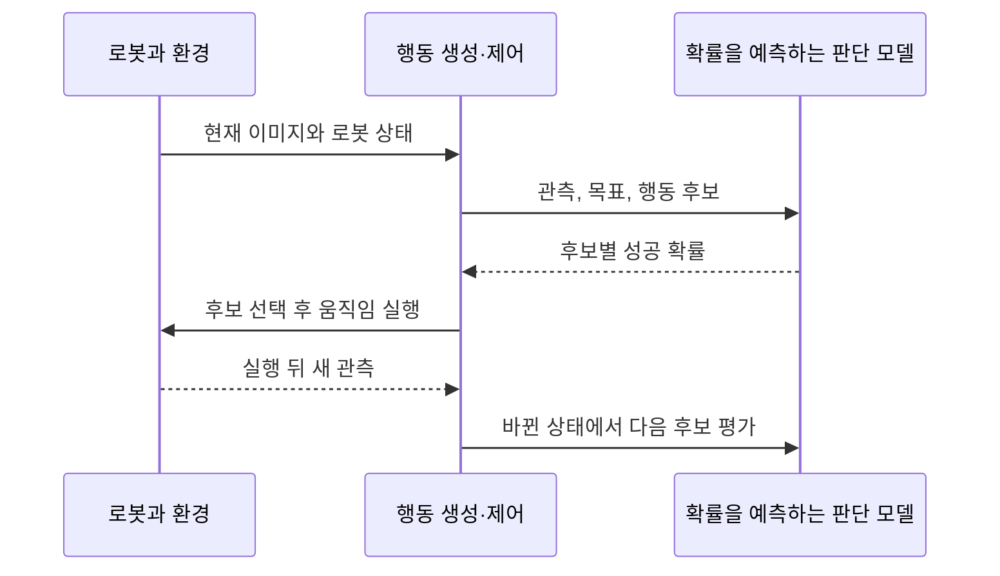

## TL;DR

- 결정 모델은 질문 표현을 바꿔가며 평가해야 한다.
- RLCD는 결정과 확률 보정을 학습 목표로 삼는다.
- Jev의 성능에서 RLCD만의 기여는 아직 분리하기 어렵다.

## 시작하며

Jev가 나오고 Kev, Jeff, Strands Decider, OpenAI Decisions처럼 분류나 점수 예측을 빠르게 붙여볼 수 있는 모델과 API들이 나왔다. 긴 답변을 생성하는 대신 정해진 선택지와 확률을 돌려주므로, 앱의 초기 버전에 AI 판단을 넣기 좋아 보였다.

그런데 일부 프로젝트가 공개한 벤치마크에서는 Jev와의 차이가 작아 보이는데, 내가 써본 과제에서는 Jev 쪽이 꽤 더 잘된다는 느낌을 받았다. 오픈모델이 상용모델을 이겼다는 발표를 보고 써봤다가, 조금만 어려운 일을 맡겨도 기대와 다르게 동작했던 경험과 비슷했다.

그 경험을 모든 오픈모델이나 후발 모델의 한계로 넓히려는 것은 아니다. 다만 **벤치마크 점수가 비슷하다는 것만으로 내가 쓰던 모델을 대체할 수 있다고 생각하기는 어려웠다.**

이 차이를 보면서 관심이 생긴 것이 Jev의 학습 방식인 RLCD다. Jev를 만든 TypeSafe는 사람이 선호하는 답변과 소프트웨어가 바로 사용할 판단에 서로 다른 학습 목표가 필요하다고 주장한다. 나는 이 문제의식에 동의하지만, 지금의 성능 차이를 곧바로 RLCD의 효과라고 설명할 수는 없다고 생각한다.

공개 자료를 기준으로 어디까지 확인할 수 있는지, 그리고 이 방향이 이미지와 텍스트를 함께 다루는 멀티모달 모델과 로봇의 판단으로도 이어질 수 있을지 정리해본다. 제품과 구현에 대한 설명은 2026년 10월 8일 기준이다.

## 1. 질문 하나를 뒤집으면 달라지는 벤치마크

결정 모델을 바꾸면 같은 질문을 이해하는 방식부터 달라질 수 있다. AI 평가 도구를 만드는 Arize가 공개한 비교에 이런 사례가 있다.[^1]

이 실험은 답변의 내용이 주어진 자료로 뒷받침되는지 판단하게 한다. 같은 테스트 사례 1,338개에 대해 “모든 주장이 근거를 갖고 있는가?”와 “근거 없는 주장이 포함되어 있는가?”를 각각 물었다. 질문의 긍정과 부정이 반대이므로 기대하는 답의 방향도 뒤집혀야 한다.

| 모델 | 모든 주장에 근거가 있는가? | 근거 없는 주장이 있는가? |
| --- | --- | --- |
| Jev 1.13 | 0.93 | 0.93 |
| OpenAI Decisions | 0.90 | 0.89 |
| Kev 9B | 0.85 | 0.54 |
| Strands Decider 2B | 0.75 | 0.26 |

표의 값은 정답률이 아니라 ROC AUC다. 여기서는 근거 있는 답변과 근거 없는 답변을 모델의 점수로 얼마나 잘 구별하는지 나타내며, 1에 가까울수록 좋고 0.5면 무작위 수준이다. 모델명에 붙은 B는 매개변수 수를 10억 단위로 표시한 것이다.

Jev와 OpenAI Decisions는 두 표현에서 비슷한 결과를 냈지만, Kev와 Strands Decider는 크게 달라졌다. 특히 이 실험에서는 OpenAI도 질문 반전에 잘 대응했으므로, 후발 모델들을 한꺼번에 성능이 떨어진다고 묶으면 이 차이를 놓치게 된다.

이 표는 Arize가 실행한 특정 모델·질문·데이터의 결과다. 내가 모델을 쓰며 느낀 차이의 원인을 입증하지는 않지만, **한 가지 표현으로 얻은 점수가 실제 앱에서 쓰게 될 질문까지 대표하지는 않는다**는 점은 잘 보여준다.

Jev도 예외 없이 잘되는 모델은 아니다. 공식 문서는 Jev 1.13이 정확한 계산, 여러 단계를 거치는 간접 추론, 무관한 정보가 많은 긴 문맥이나 선택지 순서에 취약할 수 있다고 설명한다.[^2] 대체 모델을 고를 때는 공개 순위와 함께, 내 질문의 표현과 선택지 순서를 바꿔도 판단이 유지되는지 보고 싶다.

## 2. RLCD는 무엇을 다르게 학습하려는가

### 2.1. 영상에서 말하는 Jev의 출발점

질문 표현에 따라 결과가 달라지는 현상을 보면, 모델이 무엇을 잘하도록 학습됐는지도 궁금해진다. TypeSafe의 창업자 Diogo Almeida는 InstructGPT 논문의 공저자이자 ChatGPT 개발에 참여한 연구자다.[^3][^4]

Jev 출시 전에 진행한 [그의 발표](https://www.youtube.com/watch?v=cJ0EOzey--o)를 세 가지로 요약하면 다음과 같다.

- **보조와 자동화는 성공 조건이 다르다.** 사람과 함께 일하는 AI와, 사람이 계속 지켜보지 않아도 일을 끝내는 AI를 구분한다. (4:29–5:11)
- **사람의 선호가 업무의 성공을 보장하지는 않는다.** 선호하는 답변을 보상하면 틀려도 그럴듯하게 말하는 쪽으로 유도될 수 있다고 주장한다. (5:57–8:22)
- **소프트웨어 자체가 더 많은 일을 하게 만들고 싶다.** 코드를 싸게 만드는 것에 더해, 소프트웨어 안에서 판단과 불확실성을 제공하는 모델을 목표로 삼는다. (10:49–16:19)

### 2.2. 사람이 좋아하는 답변을 학습한다는 것

그는 많은 자료의 패턴을 배우는 사전학습으로 얻은 능력 자체보다, 그 능력을 끌어내는 방식에 문제의식을 갖고 있다. 사람이 선호하는 답변을 보상하면, 불확실성을 드러내기보다 자신 있게 답하는 쪽으로 모델이 유도될 수 있다는 설명이다. 이것은 Almeida가 제시한 해석이며, 모든 모델의 분류 성능 저하를 설명하는 법칙은 아니다.[^4]

강화학습(RL, Reinforcement Learning)은 모델이 **정해진 보상을 더 많이 얻는 행동을 하도록 학습하는 방법**이다. 보상이 무엇을 평가하느냐에 따라 잘하게 되는 일도 달라진다.

예를 들어 국어 교과서를 잘 익힌 사람이 친구에게 “내 친구 철수야, 밥은 먹었니?”라고 말하면 틀린 말은 아니지만 어색하다. 이런 말투를 상황에 맞게 바꾸는 것은 사람의 피드백을 이용한 강화학습인 RLHF가 도울 수 있는 일이다.

하지만 자연스러운 대화 예시를 따라 배우는 지도 미세조정(SFT)으로도 같은 방향의 개선이 가능하다. InstructGPT 역시 시범 답변으로 학습하는 단계와 사람의 선호를 이용한 강화학습 단계를 구분한다.[^3] 자연스러운 말투가 RL 전체의 목적도 아니고, RL이 없으면 현실에 맞는 분류를 할 수 없는 것도 아니다.

수학 답이나 코드 실행 결과처럼 맞았는지 확인할 수 있는 결과를 보상하는 방식도 있다. 이를 RLVR, 검증 가능한 보상을 이용한 강화학습이라고 부른다. Jev는 결정과 함께 반환하는 확률이 얼마나 정확한지에도 학습 목표를 둔다.

### 2.3. 80%라는 숫자를 코드에서 사용할 수 있으려면

TypeSafe가 제시한 RLCD의 정식 이름은 Reinforcement Learning for Calibrated Decisions다. 정해진 형태의 결정과 함께 **실제 결과에 맞게 보정된 확률을 반환하는 것**을 목표로 한다.[^5]

예를 들어 고객 문의가 환불 요청일 확률을 예측한다고 하자. 모델이 약 80%라고 답한 문의를 충분히 모았을 때, 실제로도 약 80%가 환불 요청이면 그 구간의 확률이 잘 보정되어 있다고 할 수 있다. 이것이 calibration, 즉 확률 보정이다.

이때 80%는 그 문의 하나의 정답을 보장하지 않는다. 또 실제 문의의 절반이 환불 요청이라고 해서 모든 문의에 50%를 반환하면 전체 비율은 맞출 수 있지만, 어떤 문의를 환불 담당자에게 보내야 하는지 구별하는 데는 도움이 되지 않는다. 잘 맞히는 능력과 불확실성을 정확하게 표현하는 능력이 함께 필요하다.

확률을 믿고 쓸 수 있다면 코드에서 자동 처리할 범위를 정하기 쉬워진다. 예를 들어 확률이 높은 문의는 바로 분류하고, 애매한 문의는 추가 정보를 찾거나 더 큰 모델로 넘길 수 있다. 그 기준값은 실제 문의와 오분류 비용을 보고 정해야 한다.

Jev API를 쓸 때는 개별 선택지의 `probability`와 별도의 `confidence`도 구분해야 한다. 선택형 질문인 Choice와 점수형 질문인 Score의 `confidence`는 반환된 확률 분포를 요약한 값이므로, `confidence: 0.8`을 곧바로 정답률 80%로 읽어서는 안 된다.[^6]

내가 RLCD에서 흥미롭게 보는 부분은 이런 불확실성까지 소프트웨어가 사용할 출력으로 다룬다는 점이다. 매번 사람이 답변을 읽지 않고도 다음 처리를 정하려면, 맞는 답을 고르는 것만큼 틀릴 가능성을 표현하는 방식도 중요해진다.

### 2.4. 그 목표가 지금의 성능 차이를 설명하는가

다만 학습 목표를 이해한 것과 그 목표가 성능에 얼마나 기여했는지 아는 것은 별개다. 확인한 TypeSafe의 출시 글과 학습 설명에서는 RLCD만의 기여를 분리한 ablation, 즉 특정 요소만 제거하거나 바꿔 비교하는 절제실험을 찾지 못했다.[^5][^7]

그 효과를 확인하려면 같은 출발 모델과 데이터, 평가 조건을 두고 RLCD를 적용한 경우와 적용하지 않은 경우를 비교해야 한다. Jev와 다른 제품을 비교하면 모델 크기, 데이터, 구조, 다른 후속 학습까지 함께 달라진다. TypeSafe도 새 모델 구조와 병렬 출력 방식, RLCD를 함께 소개하고 있다.[^7]

공개 평가에서 무엇을 정답으로 삼았는지도 살펴볼 필요가 있다. TypeSafe가 코드 안의 업무 흐름을 평가하는 workflow 평가에서는 외부 대형 모델들의 평균 예측을 참조 확률로 사용한다. 그 참조값과 잘 맞는다는 결과가 현실의 결과를 직접 관측했다는 뜻은 아니며, 이 평가 설명으로 RLCD의 학습 데이터까지 알 수 있는 것도 아니다.[^7]

나는 결정과 확률을 학습 목표로 삼는 방향이 자동화에 잘 맞는다고 생각한다. 다만 **현재 느끼는 Jev의 우세가 RLCD에서 얼마나 왔는지는 공개된 제품 비교만으로 분리하기 어렵다.**

## 3. 비슷한 API 뒤에 있는 서로 다른 구현

제품 간 차이를 학습 방식으로 설명하려면, 비교하는 제품이 실제로 무엇을 학습했는지부터 봐야 한다. 정해진 선택지와 확률을 반환하는 API가 비슷하더라도 내부 구현까지 같은 것은 아니다.

OpenAI의 초기 Decisions API는 이 점에서 흥미롭다. API 담당자 Nikunj Handa는 DevDay 인터뷰에서 이 기능을 위해 새 모델을 훈련하지 않았고, 기존 Luna 가중치를 그대로 사용했다고 설명했다. 출력 형식을 제약하고 여러 질문을 병렬로 처리하며 추론 속도를 최적화한 초기 구현이라는 것이다. 이미지 이해 능력도 Luna에서 가져왔다고 밝혔다.[^8]

모델 내부의 표현을 출력으로 바꾸는 부분인 헤드를 교체했는지까지는 설명하지 않았다.

공식 문서에서도 Decisions API가 텍스트와 이미지를 입력받아 조건의 참·거짓 확률, 선택지, 점수를 반환하는 것을 확인할 수 있다.[^9] 다만 앞의 학습 설명은 출시 초기 버전에 대한 발언이다.

오픈 프로젝트들도 하나의 방식으로 묶기는 어렵다. 2026년 10월 8일에 확인한 공개 문서의 학습 범위는 다음과 같다.

| 프로젝트 | 공개된 학습 방식 |
| --- | --- |
| Kev | 0.8B·4B·9B는 기존 모델을 고정하고 작은 추가 가중치인 어댑터와 출력 헤드를 학습한다. 27B는 전체 가중치를 미세조정한다.[^10] |
| Jeff (`firelex/jeff`) | 기반 모델의 전체 가중치 미세조정과 후처리 확률 보정을 사용한다. 업무별 어댑터도 제공한다.[^11] |
| Strands Decider | 다음 단어를 예측하는 출력 헤드를 후보별 점수를 매기는 헤드로 바꾸고, 기반 모델에도 작은 추가 가중치를 학습하는 LoRA를 적용한다.[^12] |

Kev 안에서도 모델 크기에 따라 학습 범위가 다르다. 벤치마크에 “Jev와 근접”이라고 쓰여 있어도 어느 크기와 버전, 어떤 평가 조건에서 얻은 결과인지 함께 읽어야 한다.

오픈소스 Laya는 보정된 결정을 목표로 하는 자체 RLCD 접근을 공개했다. 정직하게 확률을 예측할수록 기대 보상이 높아지는 점수 규칙을 학습에 사용한다고 설명한다. Jev와 비슷한 목표를 추구하는 사례지만, Jev의 비공개 학습법을 재현했다는 뜻은 아니다.[^13]

Laya의 문서에는 배포된 기본 모델이 과신하는 경향이 있고, 사용자 데이터에서 확률을 추가로 보정해야 한다는 설명도 있다. 목표에 calibration이 들어간다고 해서 새로운 업무에서도 확률이 자동으로 맞아지는 것은 아니다.

나는 이런 구현들을 보면서 RLCD라는 이름의 유무만으로 모델을 고를 수는 없겠다고 생각했다. 무엇을 학습했는지와 함께, 내 데이터에서 얼마나 맞히고 어떤 경우에 과신하는지를 확인해야 한다.

## 4. 멀티모달 판단에서 로봇의 행동 선택으로

기존 멀티모달 모델의 가중치를 활용한 결정 API도 유용하다면, 이미지와 텍스트를 함께 보고 보정된 결정을 내리도록 학습했을 때는 어떤 차이가 날까. 개인적으로는 이 방향이 로봇의 행동 선택에도 연결될 수 있다고 생각한다.

VLA(Vision-Language-Action)는 시각과 언어 입력을 받아 행동을 출력하는 모델 계열이다. 특정 학습법의 이름이 아니므로, RLCD와 비슷한 목표를 적용하더라도 그 모델은 여전히 VLA일 수 있다.

좀 더 구체적으로는 행동 후보의 성공 가능성을 평가하는 부분을 생각해볼 수 있다. 예를 들어 로봇이 컵을 옮길 때 “지금 위치에서 집기”와 “시점을 바꾼 뒤 집기” 중 어느 쪽이 성공할 가능성이 높은지 판단하는 것이다.

이때 성공할 확률을 예측하는 것과 로봇팔이 실제로 움직일 경로를 만드는 것은 서로 다른 일이다. 판단 결과를 행동으로 바꾸고, 행동 뒤에 달라진 상황을 다시 관측하는 과정까지 연결해야 한다. 다음은 내가 생각하는 결합 방식이지, Jev가 공개한 로봇 구조는 아니다.





이 연결에서는 한 번의 분류 정확도 외에도 여러 동작을 이어서 작업을 끝내는지, 움직임이 끊기지 않는지, 예상과 다른 결과가 나왔을 때 다시 판단할 수 있는지 확인해야 한다. 이전에 피지컬 AI를 정리하면서도 관심을 뒀던, 관측과 실제 행동을 연결하는 문제다.[^14]

VLA에 강화학습을 적용하는 연구는 이미 있다. OpenVLA를 대상으로 한 연구는 지도 미세조정과 RL을 비교해, 물체 위치나 로봇의 시작 자세가 달라진 조건에서는 RL의 개선이 컸지만 시각 조건의 변화에서는 비슷한 성능을 보고했다.[^15] 이것이 RLCD의 효과를 검증한 것은 아니다.

그래서 지금 기대하는 변화는 **보정된 판단을 학습하는 방식이 VLA의 행동 선택과 성공 가능성 평가에 들어가는 것**이다. 실제 행동 결과를 모아 이 확률을 학습하고 검증할 수 있다면, 로봇이 다음 행동을 선택하는 방식에도 영향을 줄 수 있을 것 같다.

## 마치며

내가 써본 범위에서는 지금도 Jev를 더 신뢰하게 된다. 다만 그 경험을 설명할 때는 “RLCD를 해서 더 좋다”는 결론보다, 어떤 질문에서 차이가 나고 그때의 확률을 얼마나 믿을 수 있는지부터 확인하는 편이 낫다고 생각한다.

빠른 결정 모델이 많아질수록 앱에 붙여보는 비용은 줄어들 것이다. 그다음에는 정답률뿐 아니라 질문을 바꿨을 때의 일관성과 과신하는 실패를 봐야, 사람이 매번 읽지 않아도 맡길 수 있는 범위를 정할 수 있다.

개인적으로 더 보고 싶은 것은 같은 조건에서 RLCD의 효과를 분리한 실험과, 이미지·행동 결과까지 포함한 확률 보정이다. 그 결과가 나오면 지금 느끼는 차이를 더 잘 설명할 수도 있고, 로봇에 대한 기대도 더 구체적으로 바꿔볼 수 있을 것 같다.

---

[^1]: Arize, [Decision model benchmark](https://arize.com/blog/decision-model-benchmark/). 질문 반전 실험의 공개 결과 중 네 모델을 인용했다. 이 글을 위해 실험을 재실행한 것은 아니다.
[^2]: TypeSafe, [Jev 1.13 jaggedness](https://docs.typesafe.ai/model-jaggedness/jev-1.13). 2026년 10월 2일 검토된 공식 한계 문서.
[^3]: Long Ouyang 외, [Training language models to follow instructions with human feedback](https://arxiv.org/abs/2203.02155). InstructGPT의 지도 미세조정과 사람의 피드백을 이용한 강화학습을 설명한다.
[^4]: Diogo Almeida, [Jev CEO: I made ChatGPT, now I'm building what's next](https://www.youtube.com/watch?v=cJ0EOzey--o), AI Engineer. 요약과 발언 확인에는 [주최 측 전사](https://ai.engineer/talks/cJ0EOzey--o-jev-ceo-made-chatgpt-building-whats-next)의 4:29–16:19를 참고했다. Jev 출시 전 연구 방향을 설명한 발표다.
[^5]: TypeSafe, [AI primer](https://docs.typesafe.ai/introduction/machine-learning-primer). RLCD의 학습 목표와 확률 보정의 의미를 설명한다.
[^6]: TypeSafe, [Confidence](https://docs.typesafe.ai/confidence). 선택지의 확률과 분포에서 계산하는 confidence의 차이를 설명한다.
[^7]: TypeSafe, [Introducing System One Models & Jev](https://typesafe.ai/blog/introducing-system-one-models-and-jev), 2026년 9월 15일. 구조·출력 방식·RLCD와 workflow 평가의 참조값을 설명한다.
[^8]: Latent Space, [DevDay 2026 인터뷰](https://www.latent.space/p/devday-2026). Nikunj Handa의 27:36–28:43 발언. 초기 Decisions API의 Luna 가중치 재사용과 출력 제약·병렬 처리, 시각 기능에 관한 설명이다.
[^9]: OpenAI, [Decisions API 가이드](https://developers.openai.com/api/docs/guides/decisions).
[^10]: [jaredpalmer/kev](https://github.com/jaredpalmer/kev), Models 및 학습 설명.
[^11]: [firelex/jeff](https://github.com/firelex/jeff), Train your own. 이 글의 Jeff는 해당 저장소를 가리킨다.
[^12]: Strands Decider, [Architecture](https://github.com/strands-labs/strands-decider/blob/main/docs/architecture.md).
[^13]: [NandhaKishorM/laya](https://github.com/NandhaKishorM/laya), Fine-Tuning 및 Calibration.
[^14]: [간단히 설명한 피지컬 AI](/2026/01/02/physical-ai-demystifying.html). 로봇의 관측에서 행동을 만들고 다시 관측하는 과정에 대한 이전 정리다.
[^15]: [What Can RL Bring to VLA Generalization? An Empirical Study](https://rlvla.github.io/), NeurIPS 2025.
